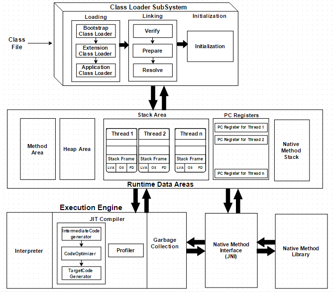

[toc]

---

# JVM（Java Virtual Machine）

## 1 JVM概述
### 1.1 JVM简介
- JDK、JRE、JVM三者关系：
    - JDK（Java Development Kit）：JRE + Development/debugging tools
    - JRE（Java Runtime Environment）：JVM + Package Classes + Runtime Libraries
    - JVM（Java Virtual Machine）：Class Loader System + Runtime Data Area + Execution Engine
- 虚拟机：虚拟的计算机，用来执行一系列虚拟的计算机指令
    - 系统虚拟机：对物理计算机的仿真，提供可运行完整操作系统的软件平台（如VMware）
    - 程序虚拟机：（如Java虚拟机）
- JVM：Java语言生成编译代码的运行平台，有自己的指令集和各种运行时内存区域；但只与特定的二进制文件格式class文件格式有关联
### 1.2 JVM规范
- 语言规范（The Java Language Specification）
- 虚拟机规范（The Java Virtual Machine Specification）
### 1.3 JVM整体结构

- **类加载子系统Class Loader SubSystem**：在运行时，首次引用类的时候加载、链接、并初始化类文件
    - 加载Loading：类通过该组件进行加载 <- 双亲委托机制
        1. 启动类加载器BootStrap Class Loader：【最高优先级】负责加载来自于Bootstrap类路径的类 <- `System.getProperty("sun.boot.class.path")`
            - 加载`$JAVA_HOME/jre/lib`目录下的rt.jar（runtime jar）
        2. 扩展类加载器Extension Class Loader：负责加载在ext文件夹内的类 <- `System.getProperty("java.ext.dirs")`
            - 加载`$JAVA_HOME/lib/ext`目录下的类文件
            - 是Bootstrap Class Loader的子类
        3. 系统类加载器Application Class Loader：负责加载应用程序级类路径CLASSPATH <- `System.getProperty("java.class.path")`
            - 加载`CLASSPATH`环境变量目录下的所有类文件和jar包
            - 是Extension Class Loader的子类
    - 链接Linking：
        1. 验证Verify：验证生成的字节码是否正确，即校验生成的.class文件是否正确
        2. 准备Prepare：给所有的静态变量分配内存地址和配置默认值（0或null）
        3. 解决Resolve：所有的符号存储器的符号引用都替换为来自Method Area的直接引用
    - 初始化Initialization：给所有的静态变量赋予初始值，并执行静态代码块
- **运行时数据区Runtime Data Areas**：
    - 方法区Method Area：用于存储被JVM加载的类信息、常量、静态变量
        - 每个JVM只有一个方法区，且是共享资源 -> 非线程安全
        - 运行时常量池Runtime Constant Pool
    - 堆区Heap Area：用于存储创建的对象及其对应的实例变量、数组
        - 每个JVM只有一个堆区，且是共享资源 -> 非线程安全
    - 栈区Stack Area：
        - 每个线程都会创建一个单独的运行时栈 -> 线程安全
        - 为每个调用的方法产生一个栈帧（Stack Frame）：用于存储局部变量表、操作数栈、动态链接、返回地址、帧数据区（如捕获的异常信息）等
    - 程序计数器PC Registers：用于保存当前执行指令的物理地址（唯一一块不会出现OutOfMemoryError的区域）
        - 每个线程都有一个单独的PC寄存器
    - 本地方法栈Native Method Stack：保存本地方法信息
        - 每个线程都有一个单独的本地方法堆栈
- **执行引擎Execution Engine**：运行.class文件，即读取字节码并逐个执行
    - 解释器Interpreter：解释字节码较快，但执行慢（未对代码优化的情况下，直接执行）；当一个方法被多次调用时，每次都需要重新解析
    - JIT编译器Just-In-Time Compiler：消除了解释器的缺点，即执行引擎在转换字节码时使用解释器的帮助，但当它发现重复的代码时，使用JIT编译器编译整个字节码并将其更改为本地代码（可直接用于重复的方法调用）；一次只编译执行一部分代码，并非一次性编译完全部代码
        - 中间代码生成器Intermediate Code Generator：生成中间代码
        - 代码优化器Code Optimizer：优化上面生成的中间代码
        - 目标代码生成器Target Code Generator：生成机器代码或本地代码
        - 分析器Profiler：一个特殊组件，负责查找该方法是否被多次调用
    - 垃圾收集器Garbage Collection：收集和删除不可达对象
        - 垃圾判断算法：引用计数法（存在相互引用使之无法通知回收的弊端）、可达性分析算法（根对象往下搜索引用链）
        - 垃圾回收算法：标记-清除算法（存在内存碎片的问题）、复制算法（整理复制至另一半，但存在可使用内存大大减少的问题）、标记-整理算法（对内存变动过于频繁，存在效率差的问题）、分代收集算法（根据对象存活周期分为新生代、老年代等，并根据不同存活周期的特点选择不同的算法）
- **本地方法接口Java Native Interface**：与本地方法库进行交互，并提供执行引擎所需的本地库
- **本地方法库Native Method Library**：执行引擎所需的本地库的集合

## 2 class字节码文件结构