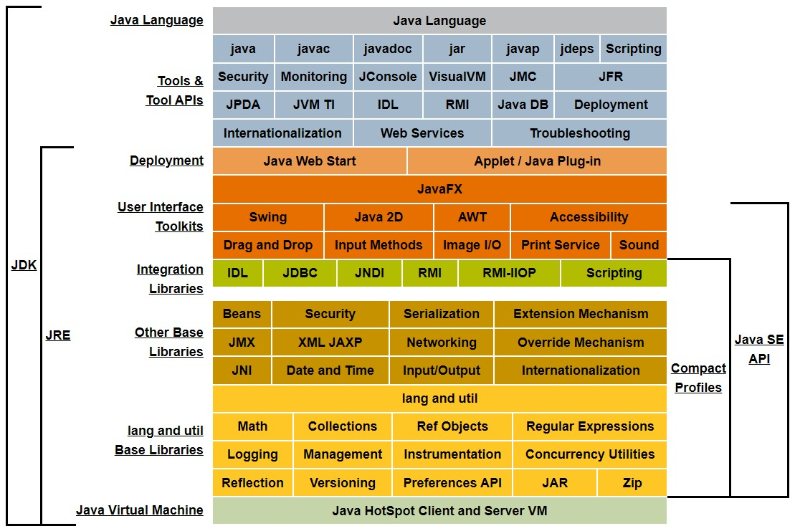

# JVM（Java Virtual Machine）

## 1. JVM概述
### 1.1. JVM简介
- JDK、JRE、JVM三者关系：
    - JDK（Java Development Kit）：JRE + Development/debugging tools
    - JRE（Java Runtime Environment）：JVM + Package Classes(Compact Profiles) + Runtime Libraries
    - JVM（Java Virtual Machine）：Class Loader System + Runtime Data Area + Execution Engine
- 嵌入式JDK（Embedded JDK）：EJDK配合compact profiles以裁剪生成合适的JRE
- 虚拟机：虚拟的计算机，用来执行一系列虚拟的计算机指令
    - 系统虚拟机：对物理计算机的仿真，提供可运行完整操作系统的软件平台（如VMware）
    - 程序虚拟机：（如Java虚拟机）
- JVM：Java语言生成编译代码的运行平台，有自己的指令集和各种运行时内存区域；但只与特定的二进制文件格式class文件格式有关联

### 1.2. JVM规范
- 语言规范（The Java Language Specification）
- 虚拟机规范（The Java Virtual Machine Specification）

### 1.3. JVM整体结构

- **<font color="red">类加载子系统Class Loader SubSystem</font>**：在运行时，首次引用类的时候加载、链接、并初始化类文件
    - **加载Loading**：类通过该组件进行加载 &larr; 双亲委托机制
        1. 启动类加载器BootStrap Class Loader：【最高优先级】负责加载来自于Bootstrap类路径的类 &larr; `System.getProperty("sun.boot.class.path")`
            - 加载 `$JAVA_HOME/jre/lib` 目录下的rt.jar（runtime jar）
        2. 扩展类加载器Extension Class Loader：负责加载在ext文件夹内的类 &larr; `System.getProperty("java.ext.dirs")`
            - 加载 `$JAVA_HOME/lib/ext` 目录下的类文件
            - 是Bootstrap Class Loader的子类
        3. 系统类加载器Application Class Loader：负责加载应用程序级类路径CLASSPATH &larr; `System.getProperty("java.class.path")`
            - 加载 `CLASSPATH` 环境变量目录下的所有类文件和jar包
            - 是Extension Class Loader的子类
    - **链接Linking**：
        1. 验证Verify：验证生成的字节码是否正确，即校验生成的.class文件是否正确
        2. 准备Prepare：给所有的静态变量分配内存地址和配置默认值（0或null）
        3. 解决Resolve：所有的符号存储器的符号引用都替换为来自Method Area的直接引用
    - **初始化Initialization**：给所有的静态变量赋予初始值，并执行静态代码块
- **<font color="red">运行时数据区Runtime Data Areas</font>**：
    - **方法区Method Area**：用于存储被JVM加载的类信息、常量、静态变量
        - 每个JVM只有一个方法区，且是共享资源 &rarr; 非线程安全
        - 运行时常量池Runtime Constant Pool
    - **堆区Heap Area**：用于存储创建的对象及其对应的实例变量、数组
        - 每个JVM只有一个堆区，且是共享资源 &rarr; 非线程安全
    - **栈区Stack Area**：
        - 每个线程都会创建一个单独的运行时栈 &rarr; 线程安全
        - 为每个调用的方法产生一个栈帧（Stack Frame）：用于存储局部变量表、操作数栈、动态链接、返回地址、帧数据区（如捕获的异常信息）等
    - **程序计数器PC Registers**：用于保存当前执行指令的物理地址（唯一一块不会出现OutOfMemoryError的区域）
        - 每个线程都有一个单独的PC寄存器
    - **本地方法栈Native Method Stack**：保存本地方法信息
        - 每个线程都有一个单独的本地方法堆栈
- **<font color="red">执行引擎Execution Engine</font>**：运行.class文件，即读取字节码并逐个执行
    - **解释器Interpreter**：解释字节码较快，但执行慢（未对代码优化的情况下，直接执行）；当一个方法被多次调用时，每次都需要重新解析
    - **JIT编译器Just-In-Time Compiler**：消除了解释器的缺点，即执行引擎在转换字节码时使用解释器的帮助，但当它发现重复的代码时，使用JIT编译器编译整个字节码并将其更改为本地代码（可直接用于重复的方法调用）；一次只编译执行一部分代码，并非一次性编译完全部代码
        - 中间代码生成器Intermediate Code Generator：生成中间代码
        - 代码优化器Code Optimizer：优化上面生成的中间代码
        - 目标代码生成器Target Code Generator：生成机器代码或本地代码
        - 分析器Profiler：一个特殊组件，负责查找该方法是否被多次调用
    - **垃圾收集器Garbage Collection**：收集和删除不可达对象
        - 垃圾判断算法：引用计数法（存在相互引用使之无法通知回收的弊端）、可达性分析算法（根对象往下搜索引用链）
        - 垃圾回收算法：标记-清除算法（存在内存碎片的问题）、复制算法（整理复制至另一半，但存在可使用内存大大减少的问题）、标记-整理算法（对内存变动过于频繁，存在效率差的问题）、分代收集算法（根据对象存活周期分为新生代、老年代等，并根据不同存活周期的特点选择不同的算法）
- **<font color="red">本地方法接口Java Native Interface</font>**：与本地方法库进行交互，并提供执行引擎所需的本地库
- **<font color="red">本地方法库Native Method Library</font>**：执行引擎所需的本地库的集合

---

## 2. class字节码文件结构
### 2.1. class文件的理解
- Java虚拟机不与任何程序语言相关，只与class文件相关，它并不关心来源语言是什么
- class文件包含了Java虚拟机指令集、符号表以及其他信息
- 每一个class文件对应唯一的一个类/抽象类/接口，但一个类/抽象类/接口不一定只能是class文件（如通过动态代理、类加载器等生成）
- class文件格式：由字节流组成，每个字节含8b；以大端在前的顺序存储

### 2.2. 数据结构
- 无符号数：用于描述数字、索引引用、数量值、UTF-8编码的字符串值；连续存放，没有使用填充或对齐等调整方式
    - 如：u1表示1个字节的无符号数，u2表示2个字节的无符号数
- 表：用于描述有层次关系的复合结构的数据，由多个无符号数或其他表作为数据项构成
    - 命名以“_info”结尾

### 2.3. 基本信息
1. 魔数magic（u4）：固定字节的内容，用于区分文件类型，如class文件中固定为 `CAFEBABE`
2. 版本号version（u2+u2）：
    1. 次版本号（Minor Version）：起始值为0
    2. 主版本号（Major Version）：起始值为45，每个JDK的大版本（如JDK1.6、JDK1.8）就加1
3. 常量池计数constant_pool_count（u2）：有效索引为1到n-1，0为保留索引
4. 常量池constant_pool（cp_info）：
    - 命令 `javap -v xxx.class`：反编译字节码文件
    - 初始化顺序：静态代码块 `<clinit>` &rarr; 实例代码块 `<init>` &rarr; 构造方法 `<init>`
    - 数据结构：
        ```cpp showLineNumbers
        cp_info {
            // 标志该项常量是哪一种常量结构，一般是固定值 &rarr; 根据常量结构计算常量所占用的字节数
            u1 tag;
            u1 info[];
        }
        ```
    - 存放的常量类别：
        1. 字面量Literal：基本数据类型以及string类型
            1. 字符串型字面量：
                1. 普通字符串：
                    - 数据结构：
                        ```cpp showLineNumbers
                        CONSTANT_String_info {
                            // 固定值为8
                            u1 tag;
                            // 必须是CONSTANT_Utf8_info常量，表示某个字符串常量的索引
                            u2 string_index;
                        }
                        ```
                    - 所有static final修饰的或使用到的字符串字面量
                2. UTF-8编码字符串：
                    - 数据结构：
                        ```cpp showLineNumbers
                        CONSTANT_Utf8_info {
                            // 固定值为1
                            u1 tag;
                            // bytes数组长度
                            u2 length;
                            // 字符串内容
                            u1 bytes[length];
                        }
                        ```
            2. 被final修饰的字面量（如整型、浮点型）：
                1. 整型：
                    - 数据结构：
                        ```cpp showLineNumbers
                        CONSTANT_Integer_info {
                            // 固定值为3
                            u1 tag;
                            // 16进制的整型值
                            u4 bytes;
                        }
                        ```
                    - 所有static final或final修饰的byte（-2^7到2^7-1）、char（0到2^16-1；转换成ASCII码）、short（-2^15到2^15-1）、boolean（true-1; false-0）、int类型的字面量
                    - 所有非final修饰且在short数值范围内的直接进入字节码指令内部；但超过short数值范围的进入常量池
                2. 浮点型：
                    - 数据结构：
                        ```cpp showLineNumbers
                        CONSTANT_Float_info {
                            // 固定值为4
                            u1 tag;
                            // 16进制的浮点值
                            u4 bytes;
                        }
                        ```
                    - 所有static final修饰的或使用到的浮点型字面量
                3. 长整型：
                    - 数据结构：
                        ```cpp showLineNumbers
                        CONSTANT_Long_info {
                            // 固定值为5
                            u1 tag;
                            // 16进制的高32区长整型值
                            u4 high_bytes;
                            // 16进制的低32区长整型值
                            u4 low_bytes;
                        }
                        ```
                    - 所有static final修饰的或使用到的长整型字面量
                4. 双精度浮点型：
                    - 数据结构：
                        ```cpp showLineNumbers
                        CONSTANT_Double_info {
                            // 固定值为6
                            u1 tag;
                            // 16进制的高32区双精度浮点型值
                            u4 high_bytes;
                            // 16进制的低32区双精度浮点型值
                            u4 low_bytes;
                        }
                        ```
                    - 所有static final修饰的或使用到的双精度浮点型字面量
        2. 符号引用Symbolic References：
            0. 字段与字段类型或方法与方法类型：
                0. 分析：
                    - 数据结构：
                        ```cpp showLineNumbers
                        CONSTANT_NameAndType_info {
                            // 固定值为12
                            u1 tag;
                            // 必须是CONSTANT_Utf8_info常量，表示字段与字段类型或方法与方法类型的名称
                            u2 name_index;
                            // 必须是CONSTANT_Utf8_info常量，表示字段与字段类型或方法与方法类型的描述符
                            u2 descriptor_index;
                        }
                        ```
                    - 构造方法的名称统一使用 `<init>`
                    - 和字段引用（Fieldref）、方法引用（Methodref）相对应
                1. 字段描述符field descriptor：字符-类型-含义，如object类型的实例，其描述符为 `Ljava/lang/Object;`；double类型的二维数组实例，其描述符为 `[[D`
                2. 方法描述符method descriptor：
                    - 包含0个或多个参数描述符和返回值描述符，如 `Object method(int i, double d, Thread t) { … }`，其描述符为 `(IDLjava/lang/Thread;)Ljava/lang/Object;`
                    - 实例方法还需额外传递参数this，但该传递由jvm的指令实现
            1. 类、接口的全限定名Fully Qualified Name：
                - 数据结构：
                    ```cpp showLineNumbers
                    CONSTANT_Class_info {
                        // 固定值为7
                        u1 tag;
                        // 必须是CONSTANT_Utf8_info常量，表示类或接口的全限定名
                        u2 name_index;
                    }
                    ```
                - 类、接口、枚举、注解、数组（在类中）的符号引用
                - 只有在类或接口中实际使用了该类（静态代码块、成员变量、方法、方法抛异常等实例化类，方法形参、声明类等并不算实际使用），才会在常量池中找到该项
                - CONSTANT_Class_info常量池项默认包含两个及以上：
                    - 类Class：默认包含自身类和直接父类（如无继承，默认为继承Object类）
                    - 接口Interface：默认包含自身和Object类（隐式引用Object类，而非其父类是Object类）
                    - 枚举Enum：默认包含自身类、两个自身数组和Enum类
                    - 注解Annotation：默认包含自身、Annotation类和Object类（同Interface，隐式引用Object类）
            2. 字段的名称和描述符：
                - 数据结构：
                    ```cpp showLineNumbers
                    CONSTANT_Fieldref_info {
                        // 固定值为9
                        u1 tag;
                        // 必须是CONSTANT_Class_info常量，表示当前字段所在类的类名
                        u2 class_index;
                        // 必须是CONSTANT_NameAndType_info常量，表示当前字段的名称和类型描述符
                        u2 name_and_type_index;
                    }
                    ```
                - 所有非static final的、引用其他类的（直接引用，不能通过getter方法）、在该类中使用的（被赋值或被引用）字段
            3. 方法的名称和描述符：
                1. 类中方法：
                    - 数据结构：
                        ```cpp showLineNumbers
                        CONSTANT_Methodref_info {
                            // 固定值为10
                            u1 tag;
                            // 必须是CONSTANT_Class_info常量，表示当前方法所在类的类名
                            u2 class_index;
                            // 必须是CONSTANT_NameAndType_info常量，表示当前类方法的名称和类型描述符
                            u2 name_and_type_index;
                        }
                        ```
                    - 所有类中被调用的方法
                    - 默认调用父类的无参构造方法 `<init>:()V`
                2. 接口中方法：
                    - 数据结构：
                        ```cpp showLineNumbers
                        CONSTANT_InterfaceMethodref_info {
                            // 固定值为11
                            u1 tag;
                            // 必须是CONSTANT_Class_info常量，表示当前方法所属接口的类名
                            u2 class_index;
                            // 必须是CONSTANT_NameAndType_info常量，表示当前接口方法的名称和类型描述符
                            u2 name_and_type_index;
                        }
                        ```
            4. 方法句柄和方法类型：
                1. 方法句柄Method Handle：虚拟机为实现动态调用InvokedDynamic指令增加的常量结构
                    - 数据结构：
                        ```cpp showLineNumbers
                        CONSTANT_MethodHandle_info {
                            // 固定值为15
                            u1 tag;
                            // 取值范围1-9，表示方法句柄的类型
                            u1 reference_kind;
                            // 必须是CONSTANT_Utf8_info常量，表示某个常量的索引
                            u2 reference_index;
                        }
                        ```
                2. 方法类型Method Type：虚拟机为实现动态调用InvokedDynamic指令增加的常量结构
                    - 数据结构：
                        ```cpp showLineNumbers
                        CONSTANT_MethodType_info {
                            // 固定值为16
                            u1 tag;
                            // 必须是CONSTANT_Utf8_info常量，表示某个常量的索引
                            u2 descriptor_index;
                        }
                        ```
            5. 动态调用点和动态常量Dynamically-Computed Call Site、Dynamically-Computed Constant：
                - 数据结构：
                    ```cpp showLineNumbers
                    CONSTANT_InvokeDynamic_info {
                        // 固定值为18
                        u1 tag;
                        // 指向class文件结构属性表中引导方法表的某个引导方法
                        u2 bootstrap_method_attr_index;
                        // 必须是CONSTANT_NameAndType_info常量，表示
                        u2 name_and_type_index;
                    }
                    ```
                - InvokedDynamic指令用到的引导方法bootstrap method以及引导方法所用到的动态调用名称、参数、返回类型
    - 字段与字面量在常量池出现的规则：
        - 字面量类型：
            - static final修饰：在该类和其他类中都以字面量的形式出现
            - 非static final修饰：
                - 在该类中以字面量和字段（Fieldref_info）的形式出现
                - 在其他类中以字段（Fieldref_info）的形式出现
        - 引用类型：在该类和其他类中都以字段（Fieldref_info）的形式出现
5. 类访问标志access_flags（u2）：用于表示某个类或者接口的访问权限属性
6. 本类索引this_class（u2）：必须是 `CONSTANT_Class_info` 常量，表示该class文件所定义的类或接口
7. 父类索引super_class（u2）：
    - 类：
        - 0：只能是Object类（它是唯一没有父类的类）
        - `CONSTANT_Class_info` 常量：表示该class文件所定义的类的直接父类
    - 接口：必须是代表Object类的 `CONSTANT_Class_info` 常量
8. 接口计数interfaces_count（u2）：表示类或接口的直接父接口
9. 接口数组interfaces[interfaces_count]（u2）：必须是 `CONSTANT_Class_info` 常量
10. 字段计数fields_count（u2）：表示类中定义的字段，包括静态和非静态的字段
11. 字段数组fields[fields_count]（field_info）：
    - 数据结构：
        ```cpp showLineNumbers
        field_info {
            // 表示字段访问标志
            u2 access_flags;
            // 必须是CONSTANT_Utf8_info常量，表示字段名称索引
            u2 name_index;
            // 必须是CONSTANT_Utf8_info常量，表示字段描述符索引
            u2 descriptor_index;
            // 表示字段属性总数
            u2 attributes_count;
            // 表示字段属性数组
            attribute_info attributes[attributes_count];
        }
        ```
    - 字段属性类型：
        1. ConstantValue：表示静态变量（static final修饰）的初始值，且必须是基本数据类型或String类型
            ```cpp showLineNumbers
            ConstantValue_attribute {
                // 必须是CONSTANT_Utf8_info常量，表示属性名索引，固定为ConstantValue
                u2 attribute_name_index;
                // 表示属性长度，固定为2
                u4 attribute_length;
                // 必须是常量池中的字面量，表示常量值索引
                u2 constantvalue_index;
            }
            ```
        2. Synthetic：类成员没有在源文件中出现，由编译器自动产生的，即动态常量
            ```cpp showLineNumbers
            Synthetic_attribute {
                // 必须是CONSTANT_Utf8_info常量，表示属性名索引，固定为Synthetic
                u2 attribute_name_index;
                // 表示属性长度，固定为2
                u4 attribute_length;
            }
            ```
        3. Signature：泛型签名
            ```cpp showLineNumbers
            Synthetic_attribute {
                // 必须是CONSTANT_Utf8_info常量，表示属性名索引，固定为Signature
                u2 attribute_name_index;
                // 表示属性长度，固定为2
                u4 attribute_length;
                // 必须是常量池中的字面量，表示签名索引
                u2 signature_index;
            }
            ```
        4. Deprecated：过时字段
            ```cpp showLineNumbers
            Deprecated_attribute {
                // 必须是CONSTANT_Utf8_info常量，表示属性名索引，固定为Deprecated
                u2 attribute_name_index;
                // 表示属性长度，固定为0
                u4 attribute_length;
            }
            ```
        5. RuntimeVisibleAnnotations：运行时可见注解（JVM能反射读取），保留策略为 `RetentionPolicy.RUNTIME`
            - 保留策略RetentionPolicy：`SOURCE`（保留到.java文件中） &rarr; `CLASS`（保留到.class文件中） &rarr; `RUNTIME`（保留到JVM中，可反射读取）
            ```cpp showLineNumbers
            RuntimeVisibleAnnotations_attribute {
                // 必须是CONSTANT_Utf8_info常量，表示属性名索引，固定为RuntimeVisibleAnnotations
                u2 attribute_name_index;
                // 表示属性长度，固定为6
                u4 attribute_length;
                // 表示注解数量
                u2 num_annotations;
                // 表示注解数组
                annotation annotations[num_annotations];
            }
            ```
        6. RuntimelnvisibleAnnotations：运行时不可见注解（JVM不能反射读取），保留策略为 `RetentionPolicy.CLASS`
            ```cpp showLineNumbers
            RuntimelnvisibleAnnotations_attribute {
                // 必须是CONSTANT_Utf8_info常量，表示属性名索引，固定为RuntimelnvisibleAnnotations
                u2 attribute_name_index;
                // 表示属性长度，固定为6
                u4 attribute_length;
                // 表示注解数量
                u2 num_annotations;
                // 表示注解数组
                annotation annotations[num_annotations];
            }
            ```
12. 方法计数methods_count（u2）：用于描述类和接口中声明的方法，包含类级别的变量以及实例变量
13. 方法数组methods[methods_count]（method_info）：
    - 数据结构：
        ```cpp showLineNumbers
        method_info {
            // 表示方法访问标志
            u2 access_flags;
            // 必须是CONSTANT_Utf8_info常量，表示方法名称索引
            u2 name_index;
            // 必须是CONSTANT_Utf8_info常量，表示方法描述索引
            u2 descriptor_index;
            // 表示方法属性总数
            u2 attributes_count;
            // 表示方法属性数组
            attribute_info attributes[attributes_count];
        }
        ```
    - 方法属性类型：
        1. Code：源代码对应的JVM指令操作码（字节码增强时主要操作的部分）
            ```cpp showLineNumbers
            Code {
                // 必须是CONSTANT_Utf8_info常量，表示属性名索引，固定为Code
                u2 attribute_name_index;
                // 表示属性长度，固定为64
                u4 attribute_length;
                // 表示操作数栈最大深度
                u2 max_stack;
                // 表示局部变量最大槽数
                u2 max_locals;
                // 表示字节码长度
                u4 code_length;
                u1 code[code_length];
                // 表示异常表长度
                u2 exception_table_length;
                // 表示异常表数组
                exception_info exception_table[exception_table_length];
                u2 attributes_count;
                attribute_info attributes[attributes_count];
            }
            ```
        2. LineNumberTable：行号表，将Code区的操作码和Java源码的行号对应，即Java源码走一行，需要走多少个JVM指令操作码
            ```cpp showLineNumbers
            LineNumberTable {
                // 必须是CONSTANT_Utf8_info常量，表示属性名索引，固定为LineNumberTable
                u2 attribute_name_index;
                // 表示属性长度，固定为10
                u4 attribute_length;
                // 表示行号表长度
                u2 line_number_table_length;
                // 表示行号表数组
                line_number_info line_number_table[line_number_table_length];
            }

            line_number_info {
                // 表示字节码行号
                u2 start_pc;
                // 表示Java源码行号
                u2 line_number;
            }
            ```
        3. LocalVariableTable：本地变量表，包含this（对非static方法，JVM隐式传入）和局部变量
            ```cpp showLineNumbers
            LocalVariableTable {
                // 必须是CONSTANT_Utf8_info常量，表示属性名索引，固定为LocalVariableTable
                u2 attribute_name_index;
                // 表示属性长度，固定为22
                u4 attribute_length;
                // 表示本地变量表长度
                u2 local_variable_table_length;
                // 表示本地变量表数组
                local_variable_info local_variable_table[local_variable_table_length];
            }

            local_variable_info {
                // 表示字节码行号
                u2 start_pc;
                // 表示Java源码行号
                u2 line_number;
                // 表示本地变量序号
                u2 local_variable_number;
                // 必须是CONSTANT_Utf8_info常量，表示本地变量名称索引
                u2 local_variable_name_index;
            }
            ```
14. 属性计数attributes_count（u2）：用于存放在该class文件中类或接口所定义的属性的基本信息
15. 属性数组attributes[attributes_count]（attribute_info）：
    - 数据结构：
        ```cpp showLineNumbers
        attribute_info {
            // 必须是CONSTANT_Utf8_info常量，表示属性名索引
            u2 attribute_name_index;
            // 表示属性信息表长度
            u4 attributes_length;
            // 表示属性信息表数组
            u1 info[attributes_length];
        }
        ```