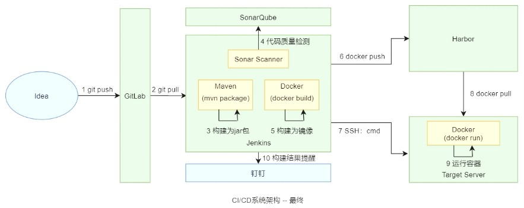

# 微服务结构

## 1 SpringBoot2
### 1.1 入门介绍
1. 目录结构：
    - `.mvn`：使用脚本操作maven相关命令
    - `src`：源代码
        - `main`：业务代码
            - `java`：代码
                - 其他业务代码
                - `Application`：项目入口
            - `resources`：资源
                - `static`：前端静态资源
                - `templates`：前端页面模板文件
                - `application.properties`：核心配置文件
        - `test`：测试代码
            - `java`
            - `resources`
    - `.gitignore`：上传git仓库时需要忽略的文件/文件夹
    - `.iml`：项目标识
    - `HELP.md`：帮助文档
    - `mvnw`：命令行
    - `mvnw.cmd`：命令行代码
    - `pom.xml`：maven配置文件
2. SpringBoot项目默认推荐使用的前端引擎是 **thymeleaf**
3. 拦截器：
    1. 定义一个拦截器，并实现 `HandlerInterceptor` 接口
    2. 创建一个**配置类**（或在配置文件中使用 `<mvc:interceptors>` 标签）
4. **servlet**：
    1. servlet类上加 `@WebServlet(urlPatterns="path")`
    2. Application启动类上加 `@ServletComponentScan(basePackages="servlet.packagename")`
5. **filter**：
    1. filter类上加 `@WebFilter(urlPatterns="path")`
6. 设置字符编码方式：
    1. 使用 `CharacterEncodingFilter` 过滤器
    2. 核心配置文件：`server.servlet.encoding.charset=UTF-8`
7. 打包部署：
    1. `jar`：
        1. `pom.xml` 中修改打包方式 `<packaging>jar</packaging>`
        2. 使用内嵌的tomcat运行，`java -jar file.jar` 进入，可通过 `ip:port/path` 访问
    2. `war`：
        1. `pom.xml` 中修改打包方式 `<packaging>war</packaging>`
        2. 必须部署在tomcat服务器的webapps目录下，可通过 `ip:port/war_packagename/path` 访问

### 1.2 集成
1. 集成 **MyBatis**：
    1. Mapper接口类上加 `@Mapper`：会关联 `.xml` 映射文件和接口的关系
    2. Application启动类上加 `@MapperScan(basePackages="mapper.packagename")`：扫描包下有 `@Mapper` 注解的类
    3. 访问数据库的方法上加 `@Transactional`：开启事务
    4. Application启动类上加 `@EnableTransactionManagement`：支持事务（SpringBoot2.x以后的版本已自动支持）
2. 集成 **SpringMVC**：
    1. 控制层类上加 `@RestController`：相当于控制层类上和方法上加 `@Controller`
    2. 控制层类上加 `@ResponseBody`：当前控制层类下所有方法的返回值均为JSON对象
    3. REST（Representational State Transfer）Ful架构：一种互联网软件架构设计的风格
3. 集成 **Redis**：可使用 `RedisTemplate` 对象来操作Redis中的数据
4. 集成 **logback日志**：
    1. 消息级别：`TRACE` &lt; `DEBUG` &lt; `INFO` &lt; `WARN` &lt; `ERROR` &lt; `FATAL`
5. 集成 **Thymeleaf模板**：
    1. 添加 `spring-boot-starter-thymeleaf` 依赖
    2. .html文件中必须包含 `<html xmlns:th="http://www.thymeleaf.org">`，用于识别thymeleaf标签
        1. `xmlns`：命名空间
        2. `th`：使用thymeleaf表达式的缩写
        3. `http://www.thymeleaf.org`：一个约束使用thymeleaf表达式的规则文件

### 1.3 JDK动态代理
1. 代理模式：为其他对象提供 **静态/动态代理** 以控制对这个对象的访问
    - 静态代理：手工实现，且所要代理的目标类已确定 &rarr; 当接口中的功能增加或修改时，会影响大量的厂家类与代理类
    - 动态代理：使用JDK的 **反射机制** 创建代理类对象 &rarr; 在不改变原来目标方法功能的前提下，在代理中增强自己的功能代码
        1. **JDK动态代理**：使用 `java.lang.reflect` 包来实现
        2. **cglib动态代理**：通过继承目标类，创建它的子类，并在子类中重写父类中同名的方法，以实现功能的修改
2. 实现步骤：
    ```java showLineNumbers
    // 1. 创建目标对象
    目标类接口target = new 目标类();
    // 2. 创建InvocationHandler对象
    InvocationHandler handler = new 动态代理类(target);
    // 3. 使用Proxy创建代理对象
    目标类接口proxy = (目标类接口) Proxy.newProxyInstance(target.getClass().getClassLoader(), target.getClass().getInterfaces(), handler);
    // 4. 通过代理，执行方法
    Object res = proxy.方法(参数);
    ```

---

## [2 SpringBoot3](./02-SpringBoot3.md)
1. `main` 方法分析：配置项、流式开发 `Builder()`
2. 将bean对象/组件加入到SpringBoot容器中：多种注解方式，如 `@Configuration`
3. 敏感配置信息加密：使用jasypt加解密
4. 默认采用 `HikariCP` 数据库连接池
5. **跨域资源共享CORS（Cross-Origin Resource Sharing）**：允许浏览器向跨源服务器发出XMLHttpRequest请求
6. 默认静态资源目录位置在 `classpath` 下
7. 核心配置文件：`.properties` 或 `.yml` 格式，可通过多种方式读取值，如 `@Value`
8. `@Async`：用于提交异步任务（框架自动配置线程池）
9. OAS（OpenAPI Specification）：通过定义一种用来描述API格式或API定义的语言，来规范RESTful服务开发过程
10. Swagger：遵循OpenAPI开发的工具框架，支持从设计和文档到测试部署的整个API生命周期的开发
    - 配置类上加 `@EnableSwagger2` 以开启Swagger；配置文件加 `swagger.enable=true`
    - API文档地址：http://localhost:8080/swagger-ui.html
11. WebSocket协议：由HTML5定义，基于TCP协议实现的一种网络协议，可以通过该服务器主动向客户端发送信息
    1. 特点：长连接（TCP） = 初始化连接 + 通讯的请求与响应；服务器和客户端全双工通信
    2. 适用场景：客户端和服务器进行频繁地双向通信时，可以避免服务器频繁创建HTTP连接

---

## 3 《动力恒合仓库》（略）

---

## 4 大型前后端分离项目《盈利宝》（略）

---

## [5 Redis7](./05-Redis7.md)
### 5.1 基础知识
1. 远程字典服务器Redis（Remote Dictionary Server），是一个基于内存运行并支持持久化的、高性能的 **NoSQL数据库**
2. 启动命令：
    - 服务端：`redis-server`
    - 客户端启动：`redis-cli`
3. 查看数据库中的key：`keys pattern`
4. 5种数据结构：
    1. 字符串类型string：`单key:单value`
    2. 列表类型list：`单key:多有序value`
    3. 集合类型set：`单key:多无序value`
    4. 哈希类型hash：`单key:对象(属性:值)`
    5. 有序集合类型zset（sorted set）：`单key:多有序value`

### 5.2 进阶知识
1. 使用配置文件：`redis-server redis.conf &`
2. 持久化策略：RDB（Redis DataBase）策略、AOF（Append Only File）策略
3. 事务：一组redis命令一起执行
    - `multi`：用来标记一个redis事务的开始
    - `exec`：用来执行事务队列中的所有命令
    - `discard`：清除事务队列中的所有命令，并结束整个事务
4. 消息的发布与订阅：客户端订阅频道 `subscribe channel`，消息的发布者往频道上发布消息 `publish channel message`，所有订阅此频道的客户端都能接受到消息
5. 主从复制：主写从读，读写分离；一台主机配置多台从机，一台从机又可以配置多台从机
6. 哨兵模式：主机宕机的情况下，从机自动上位
7. Jedis：允许在java中操作Redis

---

## 6 SpringSecurity
### 6.1 简介
1. 主要功能：认证authentication、授权authorization
    1. 基于角色Role的身份认证：`@PreAuthorize("hasAnyRole("role1", "role2", …)")`
    2. 基于JDBC的用户认证：重写 `UserDetails loadUserByUsername(String username)` 方法
2. 基于角色的访问控制RBAC（Role-Based Access Control）：用户有对应的角色，而角色拥有权限的集合

### 6.2 JWT（Json Web Token）
1. 数据格式：`Header.Payload.Signature`
    1. `Header`：头部
    2. `Payload`：载荷，即有效数据
    3. `Signature`：签名，作为认证信息
2. 交互流程：
    ```mermaid
    graph LR
    客户端 --请求authorization--> 服务器
    服务器 --返回token--> 客户端
    ```
    客户端持 `token` 来访问受认证保护的资源
3. 无状态登录：
    ```mermaid
    sequenceDiagram
    客户端 ->> 服务端: 1. 发送username和password
    服务端 ->> 服务端: 2. 进行认证
    服务端 ->> 服务端: 3. 将用户信息加密并编码成token
    服务端 -->> 客户端: 4. 返回token
    客户端 ->> 服务端: 5. 携带token请求
    服务端 ->> 服务端: 6. 对token解密，判断其中信息
    服务端 -->> 客户端: 7. 返回响应
    ```
    - 有状态：服务端记录每次会话的客户端信息，并根据用户身份处理请求
    - 无状态：服务端不保存任何客户端的请求者信息 &rarr; 客户端每次请求都必须携带自身信息

---

## 7 RabbitMQ（略）

---

## [8 MyBatisPlus](./08-MyBatisPlus.md)
### 8.1 简介
1. 增强MyBatis的功能，但不做改变
2. 可通过注解指定表名 `@TableName`、列名 `@TableField`、主键 `@TableId` 等
3. **ActiveRecord**：表映射到记录，记录映射到对象，字段映射到对象属性（较适用于动态语言）
4. 自定义sql，指定映射文件地址：`mybatis-plus.mapper-locations=classpath:xml/*Mapper.xml`
5. 查询：使用构造器 `Wrapper`
6. 分页：配置分页插件 `PaginationInterceptor`

---

## 9 SpringCloudAlibaba

---

## [10 RocketMQ](./10-RocketMQ.md)
### 10.1 简介
1. 消息队列MQ（Message Queue）：面向消息的中间件
2. 组成结构：
    - Producer：消息的发送者、生产者 &rarr; ProducerGroup：生产者组
    - Consumer：消息的接收者、消费者 &rarr; ConsumerGroup：消费者组（多个消费者组可同时消费同一个topic的消息）
    - NameServer：注册路由中心，管理Broker
    - Broker：暂存和传输消息的通道，含多个Topic
    - Topic：（虚拟结构）主题，分类消息，含多个Queue
    - Queue：（真实结构）队列，存放消息，含多个Message
3. Linux系统中的命令：
    ```bash showLineNumbers
    nohup sh mqnamesrv > log-path &
    nohup sh mqbroker > log-path &
    ```

### 10.2 应用
1. 消息分发规则：
    1. 消费者组间：每组分发一份消息
    2. 消费者组内：支持广播模式和负载均衡模式
        1. **负载均衡模式**：多个消费者 **交替消费** 同一个 `topic` 里的消息
        2. **广播模式**：每个消费者 **都消费一次** `topic` 里的消息
2. 生产者的消息发送方式：
    1. **同步**：适用于发送重要消息
    2. **异步**：适用于生产者端无法长时间等待broker响应的情况
    3. **单向**：适用于不关心发送结果的情况
    4. **延迟**：消息发送至mq后，间隔固定时间才会被监听消费
    5. **批量**：一次性发送一组消息 &rarr; 该组消息会被当作一个消息被消费
    6. **顺序**：按照消息的发送顺序来消费（FIFO），控制发送的顺序消息依次发送到同一个队列中，消费时也只能从这个队列中依次拉取，即保证了消息的顺序
    7. **事务（不提倡）**：可确保本地执行事务和发送消息作为原子单位执行
3. **幂等性**：多次操作产生的影响均和第一次操作产生的影响相同
4. 死信消息：消费重试的次数超过最大次数后，消息进入死信队列（Dead-Letter Queue），成为死信消息（Dead-Letter Message）
5. **<font color="red">消息堆积问题</font>**：单条队列的消息差值 `diffTotal` &ge; 10万的情况
6. **<font color="red">消息丢失问题</font>**

---

## [11 Docker](./11-Docker.md)
### 11.1 概述
1. **<font color="red">Docker</font>**：开源的应用容器引擎
2. 架构：
    1. 守护进程 `Daemon`
    2. 镜像 `Image`
    3. 容器 `Container`
    4. 仓库 `Repository`
    5. 标签 `Tag`
    6. 镜像中心 `Registry`

### 11.2 Docker引擎
1. **Docker引擎**：用来运行和管理容器的核心软件
2. 架构：
    1. 客户端 `Client`
    2. Docker守护进程 `Dockerd`
    3. Contain守护进程 `Containerd`
    4. `Runc`（Run Container）/OCI（开放容器倡议基金会）层
    5. `Shim`
3. 常用命令：
    1. `docker version`：查看Docker版本 &rarr; 验证是否安装成功
    2. `systemctl start docker`：启动Docker
    3. `docker run <image-name>`：运行镜像
        1. 查找本地镜像（若本地不存在，则从仓库拉取）
        2. 运行镜像
    4. `systemctl restart docker`：重启Docker
    5. `systemctl stop docker`：停止Docker
    6. `systemctl status docker`：查看Docker状态
    7. `systemctl enable docker`：开机自启动Docker

### 11.3 Docker镜像
1. **镜像**：轻量级、可执行的独立软件包，包含运行软件需要的所有内容（代码、库、环境变量、配置文件等）
2. 定位标识：`<repository>:<tag>`
    1. `<repository>`：
        1. `<software-name>`：官方的镜像名称
        2. `<username>/<software-name>`：：已验证发布者的镜像名称
        3. `<domain-name>/<username>/<software-name>`：第三方镜像中心（IP或域名）的镜像名称
    2. `<tag>`：默认为最新版本 `latest`
3. 常用命令：
    1. `docker pull`：将指定镜像从Dockerhub拉取到本地
    2. `docker images`：查看本地所有镜像资源信息
    3. `docker search`：从Dockerhub上查看镜像
    4. `docker rmi`（remove images）：删除本地镜像
    5. `docker save`：将一个或多个镜像导出为 `.tar` 文件
    6. `docker load`：将 `.tar` 文件导入并加载为一个或多个镜像
    7. `docker inspect`：查看镜像的相关属性
4. 分层：镜像中松耦合的只读镜像层，由Docker Daemon堆叠而成；对分层的修改以新分层的形式出现
5. 摘要Digest/内容散列Content Hash：只要内容发生了变更，摘要值一定会变更；主要用于区分相同 `<repository>:<tag>` 的不同镜像

### 11.4 Docker容器
1. 常用命令：
    1. `docker run`：创建并启动容器
        - `--name`：指定当前容器名称
        - `-it`：以 **交互模式（Interactive mode）** 来运行容器，并根据 `/bin/bash` 命令启动bash终端
            - bash终端的命令行前缀：`root@<docker-id>:</path>#`
        - `-p <宿主机端口>:<容器端口>`：指定端口映射
        - `-d`：以 **分离模式（Detached mode）** 来运行容器，即命令在后台运行
    2. `docker create`：创建容器
    3. 退出容器：
        1. 容器命令行中执行 `exit` 命令：退出并停止容器
        2. `ctrl + p + q`：退出但不停止容器
    4. `docker ps`：查看所有正在运行的容器
    5. `docker exec`：对正在运行的容器进行操作
        - `-it`：以交互模式（Interactive mode）来运行容器
            - `/bin/bash`：进入容器内部进行操作，`exit` 命令可退出（`exec` 命令新建进程 &rarr; 不影响容器运行）
            - `<command>`：要执行的命令，可在外部直接执行
    6. `docker attach`：对正在运行的容器进行操作
    7. `docker top`：查看正在运行的容器内正在运行的进程详情
    8. `docker logs`：查看容器中应用的运行日志，无论容器是否处于运行状态
        - `<contain-name>`：查看指定容器中应用的运行日志
        - `-n <number>` / `--tail=<number>`：显示指定行数的尾部日志
        - `-f`：查看运行容器中的动态日志
    9. `docker start`：启动容器
    10. `docker restart`：重启处于运行状态的容器
    11. `docker stop`：停止容器，若有其它进程正在访问，则在访问结束后再停止
    12. `docker kill`：强制停止容器
    13. `docker pause`：暂停容器对外提供的服务
    14. `docker unpause`：解除容器的暂停服务状态
    15. `docker rm`：删除容器，默认情况下删除停止状态的容器
        - `-f`：强制删除容器，无论容器是否处于停止状态
    16. `docker cp`：完成宿主机与容器之间的文件或目录的相互复制，无论容器是否处于运行状态
    17. `docker commit`：为容器的当前快照生成一个新镜像
    18. `docker export`：将容器导出为 `.tar` 文件
    19. `docker import`：将 `.tar` 文件导入并构建一个新的镜像
    20. `docker system` 命令集：
        1. `docker system df`：查看docker各部分的占用情况
        2. `docker system events`：查看指定日期范围之间发生的所有事件
        3. `docker system info`：查看当前docker的详情
        4. `docker system prune`：删除docker中的无用数据
            - 已经停止的容器
            - 没有连接任何容器的网络、悬虚镜像（dangling image）
            - 悬虚镜像的构建缓存（dangling build cache）

### 11.5 Dockerfile
1. `Dockerfile` 脚本文件：由一系列指令（由上到下依次执行；每条指令都会构建出一个镜像）构成的、用来构建Docker镜像
2. 常用指令：
    1. `FROM <image>[:<tag>]`：指定基础镜像，且 **必须是第一条** 指令
    2. `LABEL <key>=<value> <key>=<value> …`：以键值对的方式包含镜像的元数据信息，修改镜像的json文件
    3. `ENV <key> <value>`：指定环境变量
    4. `WORKDIR <path>`：容器的默认目录，即后续指令的工作目录
    5. `RUN`：`docker build` 命令执行过程中
    6. `CMD`：容器启动后，即 **执行完 `docker run` 命令后**
    7. `ENTRYPOINT`：容器启动过程中，即 `docker run` **命令执行过程中**
    8. `ADD <src> <dest>`：复制宿主机中的指定文件 `src` 到容器中的指定目录 `dest` 中
        - `<src>`：支持宿主机中的绝对路径、相对于 `docker build` 命令指定的路径下的相对路径、压缩文件（复制到容器后自动解压）、URL（相当于 `wget` 命令）
        - `<dest>`：仅支持绝对路径，路径末尾必须加上斜杠（否则会被当成一个文件）
    9. `VOLUME ["dir1", "dir2", …]`：在容器里创建可以挂载数据卷的 **挂载点**
3. build cache机制：发现即将新构建出的镜像（层）与本地已存在的某镜像（层）重复时，默认复用
    - 失效：从发生变化的指令层开始的镜像层的cache全部失效

### 11.6 数据持久化
1. 数据卷持久化：
    1. **数据卷**：宿主机中的特殊文件/目录
        1. 容器/挂载点的删除，不会级联删除数据卷
        2. 若数据卷/挂载点中本来就有内容，容器启动后会自动同步到另一端
    2. **挂载点**：容器中与数据卷相关联的文件/目录
2. Dockerfile持久化：`VOLUME` 指令

### 11.7 Docker网络
1. **Network Namespace**：Linux提供的用于实现网络虚拟化的功能，创建多个隔离的网络空间（独立的防火墙、网卡、路由表、邻居表、协议栈）
2. 网络类型：
    1. `bridge` 桥接网络：docker的默认网络模式，只能用于连接所在docker宿主机上的容器；具有独立的namespace、网络接口、IP
    2. `none` 没有网络：具有独立的namespace，没有独立的网络接口、IP；只有一个回环地址lo
    3. `host` 宿主机网络：没有独立的namespace、网络接口、IP，与宿主机共享
3. 常用命令：
    1. `docker network inspect bridge`：查看bridge网络的整体连接情况
    2. `ip a`：查看宿主机的网络接口
    3. `docker exec <container> ip a`：查看容器的网络接口
    4. `docker inspect <container>`：查看容器的详情（网关Gateway的ip地址 = docker0网桥的地址）
    5. `docker run … --network <network>`：指定连接的网络，默认连接到默认的bridge网络

### 11.8 Docker Compose
1. **Docker Compose**：Docker容器编排工具，通过一个 **声明式的配置文件** 描述整个应用，最终使用一条命令完成部署
2. `compose.yml` / `docker-compose.yml`：
    ```yml showLineNumbers
    version: <version>
    services:
        <service-name>:
            container_name: <service-real-name>
            build:
                context: <dockerfile-path>
                dockerfile: <dockerfile-name>
            image: <repository>:<tag>
            ports:
                - <host-port1>:<container-port1>
                - <container-port2>
                - …
            command:
                - "<command>"
            depends_on:
                - <depend-service-name>
            deploy:
                mode: replicated
                replicas: <container-number>
            networks: <network-name>
            volumes:
                - <host-path1>:<container-path1>
                - <volume-name>:<container-path2>
                - …
    networks:
        <network-name>:
            name: <network-real-name>
            driver: bridge
            attachable: false
    volumes:
        <volume-name>:
            …
    configs:
        …
    secrets:
        …
    ```
3. 常用命令：在命令后加上 `<service-name>`，即可对指定服务进行操作
    1. `docker-compose pull`：拉取compose中需要的所有镜像
    2. `docker-compose config`：检查 `docker-compose.yml` 文件是否正确
    3. `docker-compose up`：启动compose中的所有服务
    4. `docker-compose logs`：查看compose中所有服务的运行日志，不同服务的日志用不同颜色区分
    5. `docker-compose ps`：查看compose中的所有服务
    6. `docker-compose top`：查看compose中所有当前正在运行中的服务
    7. `docker-compose images`：查看compose中所有服务对应的镜像
    8. `docker-compose port`：查看指定服务的映射端口
    9. `docker-compose run`：在指定服务上执行命令
    10. `docker-compose exec`：进入指定服务的容器内
    11. `docker-compose pause`：暂停compose中的所有服务的容器
    12. `docker-compose unpause`：恢复compose中所有处于暂停状态的服务的容器
    13. `docker-compose stop`：停止compose中的所有服务
    14. `docker-compose restart`：重启compose中的所有服务
    15. `docker-compose start`：启动compose中的所有服务
    16. `docker-compose kill`：通过发送 `SIGKILL` 信号来停止指定服务的容器
    17. `docker-compose rm`：删除compose中所有处于停止状态的服务的容器
    18. `docker-compose down`：停止并删除compose中的所有服务容器、网络、镜像、数据卷

### 11.9 镜像中心
1. 发布镜像：
    1. 登录：`docker login --username=<username> --password=<password>`
    2. 对要发布的镜像进行命名（根据镜像仓库名称自动创建）：`docker tag <image-name> <username>/<respository-name>:<tag>`
    3. 推送镜像：`docker push <username>/<respository-name>:<tag>`
    4. 登出：`docker logout`
2. HTTPS：通过SSL/TLS为数据加密，即与传输层的SSL/TLS进行通信，再由SSL/TLS与TCP进行通信
    1. 数字证书（SSL/TLS证书）：由证书中心CA（Certificate Authority）颁发的一种身份证明，包含通讯方的公钥、证书有效期、域名以及CA的数字签名
        - SSL（Secure Sockets Layer）：安全套接字协议
        - TLS（Transport Layer Security）：传输层安全协议
    2. 根证书：用来解密数字证书的CA公钥
    3. 数字摘要：利用Hash函数的单向性，将任意长度的消息变成固定长度的短消息
    4. 数字签名：由发送方产生的别人无法伪造的一段数字串
3. 私有镜像中心：
    1. 类型：distribution、registry、harbor
    2. 操作：
        1. 搭建（使用HTTPS协议，需要先申请证书、再保存至服务器本地）
        2. docker客户端的推送、删除操作

### 11.10 Docker Swarm
1. **Docker Swarm**：Docker原生集群管理系统，会将多个Docker主机（物理）组织成一个Docker主机（虚拟），通过API与集群通信
    1. Swarm Node：采用Swarm模式运行的Docker Engine主机
        - 一个node对应一个主机，一个主机可对应多个node
        - 类型：Manager、Worker
    2. `service` 通过 `task` 的形式部署在swarm的各个node中，而 `task` 又通过运行着应用进程的 `container` 对外提供服务
        - 编排器 `orchestrator`：管理副本任务的创建和停止
        - 分配器 `allocator`：调度、监听副本任务
    3. 服务部署模式：
        1. `replicated` 副本模式：（默认部署模式）指定 `task` 数量，为 `available node` 分配一个或多个 `task`
        2. `global` 全局模式：不能指定 `task` 数量，默认为每个 `node` 分配一个 `task`
            - `docker service create --name <service-name> --mode global <image-name>`
2. 搭建集群：`docker swarm init` 初始化命令
    1. `docker swarm join --token <worker/manager-token> <leader-manager-ip>:<leader-manager-port>`：添加节点
    2. `docker swarm join-token worker/manager`：获取添加节点的 **token**
    3. `docker node ls`：查看当前swarm集群的节点状态信息，仅manager节点可用
3. 维护集群：
    1. 节点退出集群：`docker swarm leave`
    2. 自动锁定：`docker swarm update --autolock=true`
    3. 节点角色转换：
        1. `docker node promote/demote <node-id>`
        2. `docker node update --role manager/worker <node-id/hostname>`
    4. 节点标签：
        1. `docker node update --label-add <key>=<value>`：添加/修改标签
        2. `docker node update --label-rm <key>`：删除标签
    5. 删除 `worker` 节点：`docker node rm <node-id>`
4. 公钥基础设施PKI（Public Key Infrastructure）：保障节点的安全
    1. TLS：保障节点间授权和通信的安全
    2. CA数字证书轮转：`docker swarm ca`
5. 集群容灾：**热备** 容灾方式、采用 **Raft算法** 来进行leader选举
6. service操作：
    1. 创建service：
        1. `docker service create --name <service-name> --replicas <task-number> -p <host-port>:<container-port> <image-name>`：由manager执行
        2. `docker service ls`：查看当前swarm集群中正在运行的service信息
        3. `docker service inspect <service-id|service-name>`：查看指定service的详情
        4. `docker service ps <service-id|service-name>`：查看指定service的各个task分配的节点信息
        5. `docker node ps <node-name>`：查看指定节点中正在运行的task信息
        6. `docker service logs <service-id|service-name|task-id>`：查看service/task日志
    2. task伸缩：根据访问量，在不停止服务的前提下对服务的task进行扩容/缩容
        1. 变更指定服务的task数量：
            1. `docker service update --replicas <task-number> <service-name>`
            2. `docker service scale <service-name>=<task-number>`
        2. 暂停对节点分配task：`docker node update --availability pause <node-name>`
        3. 清空task：`docker node update --availability drain <node-name>`
    3. task容错：当task所在的容器出现问题时，编排器会自动新建同样的task，再由分配器分配到可用节点上
    4. 删除服务：`docker service rm <service-id|service-name>`
    5. 滚动更新
7. **overlay网络/重叠网络/覆盖网络**：构建在underlay网络上的逻辑虚拟网络，即在物理网络的基础上，通过节点间的单播隧道机制将主机两两相连
    1. `docker_gwbridge` 网络
    2. `ingress` 网络
    3. VXLAN隧道技术：重新封装不同协议的数据包后再发送

### 11.11 CI/CD与Jenkins
1. **CI（Continuous Integration）/CD（Continuous Delivery/Deployment）**：持续集成/持续交付/部署
2. **DevOps（Development & Operations）**：一种管理模式、执行规范与标准
3. 应用实现的系统结构图：

---

## [12 Kubernetes_k8s](./12-Kubernetes_k8s.md)
### 12.1 概述
1. **<font color="red">Kubernetes（k8s）</font>**：容器编排引擎，用于自动化、容器化应用程序的部署、规划、扩展和管理
2. 架构图：
    - `Master`：
        1. `kube-api-server`
        2. `etcd`
        3. `scheduler`
        4. `controller-manager`
    - `Node`：
        1. `kubelet`
        2. `kube-proxy`
        3. `pod`（Container Runtime）

### 12.2 部署
1. 搭建集群：
    1. 安装 `19.03.13` 版本的docker：`yum install docker-ce-19.03.13 -y`
    2. 安装kubeadm、kubelet、kubectl：`yum install kubelet-1.19.4 kubeadm-1.19.4 kubectl-1.19.4 -y`
    3. 创建 `Master` 节点：
        ```bash showLineNumbers
        kubeadm init \
        --apiserver-advertise-address=<master-ip> \
        --image-repository registry.aliyuncs.com/google_containers \
        --kubernetes-version v1.19.4 \
        --service-cidr=10.96.0.0/12 --pod-network-cidr=10.244.0.0/16
        ```
    4.  在集群中加入 `Worker Node` 节点：
        ```bash showLineNumbers
        kubeadm join <master-ip>:<master-port> \
        --token <token> \
        --discovery-token-ca-cert-hash <hash>
        ```
2. 部署容器化应用：如Nginx、Tomcat、Spring Boot应用、Kubernetes Dashbaord等
    1. 获取镜像
    2. 启动镜像
    3. 暴露服务

### 12.3 Ingress暴露应用
1. NodePort：让外部请求直接访问服务的最原始方式
2. LoadBalancer：外部请求通过负载均衡器 `LoadBlancer` 转发到服务中的Pod里，但需要向云平台申请负载均衡器
3. **Ingress**：外部请求访问k8s集群的必经之口，相当于集群网关可自定义路由规则来转发、管理、暴露服务（一组pod）
    1. 部署Ingress Nginx：
        ```bash showLineNumbers
        kubectl apply -f https://raw.githubusercontent.com/kubernetes/ingress-nginx/controller-v0.41.2/deploy/static/provider/baremetal/deploy.yaml
        ```
    2. 配置Ingress Nginx规则：
        - 应用：`kubectl apply -f ingress-nginx-rule.yaml`
        - 查看：`kubectl get ing(ress)`

---

## 13 微服务项目《动力商城》（略）

---

## 14 ActiveMQ（选学）（略）

---

## [15 高并发解决方案（选学）](./15-高并发解决方案（选学）.md)
### 15.1 概述
- 高并发：大量并发访问，即某个时间点有大量请求同时来访问系统
- 衡量指标：响应时间、吞吐量、QPS、并发用户数

### 15.2 解决方案
1. 硬件：单体应用垂直扩容方案
2. 缓存：HTTP（浏览器、Nginx、CDN）、应用（内存、磁盘）、多级缓存
3. 集群：单体应用水平扩容方案
4. 拆分：应用（分布式、微服务）、数据库（垂直/分库、水平/分表）
5. 静态化
6. 动静分离
7. 队列：异步处理、流量削峰、系统解耦
8. 池化：对象池、数据库连接池、Redis连接池、HttpClient连接池、线程池
9. JVM优化、Tomcat优化
10. Java程序优化
11. 数据库：服务器、架构、索引、SQL、数据搜索引擎
12. Nginx优化
13. Linux优化
14. 网络优化
15. 前端优化：js、css、html
16. 压力测试

---

## 16 Thymeleaf（选学）
### 16.1 简介
1. 用户看到的结果页面是模板引擎用 **数据** 替换 **模板中的特殊符号** 而得到的
    - 表达式：
        1. 变量表达式 `${}`
        2. 选择表达式 `*{}`
        3. 链接表达式 `@{}`
        4. 消息表达式 `#{}`
        5. 标准表达式
    - 属性：`th:property-name`
2. 工具类对象：`#execInfo`、`#uris`、`#dates`、`#numbers`、`#strings` 等
    - 使用：`${#strings.toUpperCase(str)}`
3. 内部对象：
    1. `#request`：`javax.servlet.http.HttpServletRequest`
    2. `#session`：`javax.servlet.http.HttpSession`
    3. `#servletContext`：`javax.servlet.ServletContext`

---

## 17 Java日志框架（选学）
### 17.1 简介
1. 日志文件：用于记录系统操作事件的文件集合；可处理历史数据、诊断问题的追踪以及理解系统的活动等重要作用
2. 日志框架的作用：
    - 控制日志输出的内容和格式
    - 控制日志输出的位置
    - 日志文件相关的优化，如异步操作、归档、压缩等
    - 日志系统的维护
3. 日志门面和日志框架：每一种日志框架都有自己对应的API（高耦合），使用日志门面技术后，无论底层的日志框架如何改变，都不会影响到程序的代码，提高日志框架的兼容性
    - 日志框架技术：用来方便有效地记录日志信息
    - 日志门面技术：抽取日志框架中共有的特征行为，形成接口；使用时可直接调用该接口方法，而日志框架在执行时仍然调用自身的方法
4. SpringBoot日志实现：默认使用 `SLF4j` 作为日志门面，`Logback` 作为日志实现
    - 输出级别：默认为 `INFO` 级别
    - 若要使用其他日志框架或日志门面，需要在 `spring-boot-starter-web` 中排除 `spring-boot-starter-logging` 部分

### 17.2 框架分类
1. **<font color="red">JUL（Java Util Logging）</font>**：java原生日志框架
    - 结构：
        - 记录器 `Logger`：访问日志系统的入口程序，可通过调用 `Logger对象` 的API来发布日志
        - 处理器 `Handler`：一个 `Logger` 关联一个/一组 `Handler`，由 `Handler` 负责记录日志，并具体实现日志的输出位置
        - 过滤器 `Filter`：自定义哪些信息需要被记录，哪些信息要忽略
        - 格式化组件 `Formatter`：负责对日志中的数据和信息进行转换和格式化，即决定输出日志最终的形式
        - 输出级别 `Level`：每条日志消息都有自己的级别，Logger会根据输出级别自动输出级别之上的日志
            - `ALL` &lt; `FINEST` &lt; `FINER` &lt; `FINE` &lt; `CONFIG` &lt; `INFO` &lt; `WARNING` &lt; `SEVERE` &lt; `OFF`
    - 父子关系：通过树状结构储存；对 **父** 做的设置，同样能作用于 **子**
2. **<font color="red">Logback</font>**：开源日志框架
    - 依赖：
        - `logback-core`：基础核心模块
        - `logback-classic`：（包含 `logback-core`）`Log4j` 的改良版，完整实现了 `SLF4j` 的API &rarr; 方便更换成其他日志框架
        - `logback-access`：与Servlet容器集成，可通过http来访问日志的功能
    - 组件：
        - 日志记录器 `Logger`：存放日志对象，可定义日志类型、级别
            - 日志级别：`TRACE` &lt; `DEBUG` &lt; `INFO` &lt; `WARN` &lt; `ERROR`
        - `Appender`：指定日志的输出位置（如控制台、文件、数据库等）
        - `Layout`：格式化日志的输出，将事件转换成字符串；被封装在 `encoder` 中
    - 过滤器：对日志进行更细粒度的打印
    - 异步日志：为日志操作单独分配一个线程 &rarr; 解决记录日志时会阻塞系统本身功能的执行的问题
    - 配置自定义的logger：
        ```xml showLineNumbers
        <!-- additivity="false"：不继承rootLogger -->
        <logger name="priv.zj" level="info" additivity="false">
            <appender-ref ref="consoleAppender"/>
        </logger>
        ```
3. **<font color="red">Log4j（Log for java）</font>**：Apache的开源项目
    - 日志记录器`Loggers`：控制日志是否输出以及输出级别
        - Logger的命名有继承机制，且所有的logger都直接或间接继承 **根logger**
        - 日志级别：`ALL` &lt; `TRACE` &lt; `DEBUG` &lt; `INFO` &lt; `WARN` &lt; `ERROR` &lt; `FATAL` &lt; `OFF`
    - 输出控制器 `Appenders`：指定日志的输出位置
        - `ConsoleAppender`：将日志输出到控制台
        - `FileAppender`：将日志输出到文件中
        - `DailyRollingFileAppender`：将日志输出到一个日志文件中，且支持按照**天数**输出文件
        - `RollingFileAppender`：将日志信息输出到一个日志文件中，且支持按照**文件大小**输出文件
        - `JDBCAppender`：以流的形式，把日志信息保存到数据库中
    - 日志格式化器 `Layout`：控制日志的输出格式
        - `SimpleLayout`：简单的格式化
        - `HTMLLayout`：格式化为HTML表格形式
        - `PatternLayout`：最强大的格式化组件，支持自定义格式
4. **<font color="red">Log4j2</font>**：是对 `Log4j` 的改进，以及融合了 `Logback`
    - 特征：
        - 性能提升：`Log4j2` 包含基于 `LMAX Disruptor` 库的下一代异步记录器
        - 自动重新加载配置
        - 高级过滤：支持基于Log事件中的上下文数据、标记、正则表达式和其他组件进行过滤
        - 插件架构：`Log4j2` 使用插件模式配置组件，即无需编写代码来创建和配置Appender、Layout、PatternConverter等
        - 无垃圾机制：稳态日志记录期间，在独立应用程序中是无垃圾，在Web应用程序中是低垃圾
    - 异步日志：
        - `AsyncAppender`：通过引用别的Appender来实现，即 `<AppenderRef ref="consoleAppender"/>`
            - 在多线程的环境下，阻塞队列容易受到锁征用的影响 &rarr; 应该考虑使用无锁的异步记录器，即 `AsyncLogger`
        - `AsyncLogger`：使得调用 `Logger.log` 返回更快
            - 全局异步：所有日志都异步的记录
            - 混合异步：在应用中混合使用同步日志和异步日志
    - 日志级别：`ALL` &lt; `TRACE` &lt; `DEBUG` &lt; `INFO` &lt; `WARN` &lt; `ERROR` &lt; `FATAL` &lt; `OFF`

### 17.3 门面分类
1. **<font color="red">JCL（Jakarta Commons Logging）</font>**：java原生日志门面
    - 本身不具有记录日志的功能，但会提供通用的接口
    - 优先使用导入的第三方日志框架（如 `Log4j`、`Logback` 等）；若没有导入，则默认使用 `JUL`
    - 结构：
        - `Jdk13LumberjackLogger`：旧版JUL
        - `Jdk14Logger`：目前使用的JUL
        - `Log4JLogger`：集成使用的Log4j
        - `SimpleLog`：JCL自带的实现类
2. **<font color="red">SLF4j（Simple Logging Facade For Java）</font>**：绑定、桥接日志框架
    
    - 桥接技术：某些日志框架依赖 `SLF4j` 之外的日志API &rarr; `SLF4j` 附带桥接模块
        - 重定向之前的日志框架的API调用，通过桥接转换到slf4j的实现
        - 桥接器解决的是项目中的日志重构问题
    - 默认使用的是 `slf4j-simple` 框架