# SpringCloudAlibaba

## 1. Spring Cloud Alibaba入门
### 1.1. 概述
1. **[Spring Cloud](https://spring.io/projects/spring-cloud)**：为开发人员提供了在 **分布式系统** 中快速构建一些常见模式的工具（例如配置管理、服务发现、断路器、智能路由、微代理、控制总线、一次性令牌、全局锁、领导选举、分布式会话、集群状态等开发成熟、经得起实际考验的服务框架），并通过Spring Boot风格再封装以屏蔽掉复杂的配置和实现原理 &rarr; 是基于Spring Boot的、微服务系统架构的一站式解决方案
2. **[Spring Cloud Alibaba](https://sca.aliyun.com/en-us/)**：提供了一个用于分布式应用开发的集成解决方案，它包含了开发分布式应用所需的所有组件，只需添加一些注解和少量配置，即可将Spring Cloud应用连接到阿里巴巴的分布式解决方案，并构建 **基于阿里巴巴中间件** 的分布式应用系统

| 中间件类别 | Spring Cloud | Spring Cloud Alibaba |
| --- | --- | --- |
| 分布式配置<br/>Distributed Configuration | [Spring Cloud Config](https://spring.io/projects/spring-cloud-config) | [Alibaba Nacos](https://github.com/alibaba/nacos/) |
| 服务注册与发现<br/>Service registration and discovery | - [Spring Cloud Netflix](https://spring.io/projects/spring-cloud-netflix)<br/>- [Spring Cloud Zookeeper](https://spring.io/projects/spring-cloud-zookeeper)<br/>- [Spring Cloud Consul](https://spring.io/projects/spring-cloud-consul) | [Alibaba Nacos](https://github.com/alibaba/nacos/) |
| 路由<br/>Routing | [Spring Cloud Gateway](https://spring.io/projects/spring-cloud-gateway) | [Spring Cloud Gateway](https://spring.io/projects/spring-cloud-gateway) |
| 服务对服务呼叫<br/>Service-to-service calls | [Spring Cloud OpenFeign](https://spring.io/projects/spring-cloud-openfeign) | - [Spring Cloud OpenFeign](https://spring.io/projects/spring-cloud-openfeign)<br/>- [Dubbo RPC](https://cn.dubbo.apache.org/en/) |
| 负载均衡<br/>Load balancing |  |  |
| 断路器（流量控制与服务降级）<br/>Circuit Breakers（Flow control and service degradation） |  | [Alibaba Sentinel](https://github.com/alibaba/Sentinel/) |
| 分布式消息传递<br/>Distributed messaging | - [Spring Cloud Bus](https://spring.io/projects/spring-cloud-bus)<br/>- [Spring Cloud Stream](https://spring.io/projects/spring-cloud-stream)<br/>（Apache Kafka、RabbitMQ） | - [Spring Cloud Bus](https://spring.io/projects/spring-cloud-bus)<br/>- [Spring Cloud Stream](https://spring.io/projects/spring-cloud-stream)<br/>（RocketMQ） |
| 短命微服务（任务）<br/>Short lived microservices (tasks) | [Spring Cloud Task](https://spring.io/projects/spring-cloud-task) |  |
| 消费者驱动和生产者驱动的合同测试<br/>Consumer-driven and producer-driven contract testing | [Spring Cloud Contract](https://spring.io/projects/spring-cloud-contract) |  |
| 分布式事务<br/>Distributed Transaction |  | [Seata](https://github.com/apache/incubator-seata) |

---

## 2. Nacos服务注册与发现
### 2.1. 概述
1. **<font color="red">服务注册</font>**：所有 **提供者** 将自己提供服务的名称及自己主机详情（IP、端口、版本等）写入到另一台主机（即 **服务注册中心**）中的一个列表（即 **服务注册表**）中
2. **<font color="red">服务发现</font>**：所有 **消费者** 需要调用微服务时，其会从注册中心首先将服务注册表下载到本地并缓存（Nacos宕机不影响已运行服务，但无法注册新服务），然后根据消费者本地设置好的负载均衡策略选择一个服务提供者进行调用
3. **[Nacos](https://nacos.io/)**：一个更易于构建云原生应用的动态服务发现、配置管理和服务管理平台
    - 云原生应用，简单来说就是跑在IaaS、PaaS上的SaaS
    - 云原生 = 微服务 + DevOps + CD + 容器化

### 2.2. 安装与配置、启动
1. 配置：默认端口号为 `8848`，上下文路径为 `/nacos`
2. 鉴权：
    ```properties showLineNumbers
    nacos.core.auth.enabled=true
    nacos.core.auth.plugin.nacos.token.secret.key=自定义密钥
    ```
3. 单机启动：
    ```bash showLineNumbers
    startup.cmd -m standalone
    ```
4. 登录的默认账密：`nacos` / `nacos`（放在内置数据库中）

### 2.3. 客户端程序
1. 提供者服务：
    1. 依赖：
        1. `spring-cloud-dependencies`
        2. `spring-cloud-alibaba-dependencies`
        3. `spring-cloud-starter-alibaba-nacos-discovery`
    2. 配置文件：
        ```yml showLineNumbers
        spring:
            application:
                name: 服务名称
            cloud:
                nacos:
                    discovery:
                        server-addr: localhost:8848
                        username: username
                        password: password
        ```
2. 消费者服务：
    1. 依赖：
        1. `spring-cloud-dependencies`
        2. `spring-cloud-alibaba-dependencies`
        3. `spring-cloud-starter-alibaba-nacos-discovery`
        4. `spring-cloud-starter-loadbalancer`
    2. 配置文件：
        ```yml showLineNumbers
        spring:
            application:
                name: 服务名称
            cloud:
                nacos:
                    discovery:
                        server-addr: localhost:8848
                        username: username
                        password: password
        ```
    3. 代码：访问提供者服务的方式改为访问注册到nacos上的服务名

### 2.4. 其他功能
1. `DiscoveryClient API`：可获取nacos信息
2. 实例：

    | 特性 | 临时实例（默认） | 持久实例 |
    | --- | --- | --- |
    | 配置 | `spring.cloud.nacos.discovery.ephemeral: true` | `spring.cloud.nacos.discovery.ephemeral: false` |
    | 存储位置 | Nacos内存 | Nacos内存 + 磁盘 |
    | 健康检测机制 | Client模式（Client **主动向 Server 上报** 其健康状态） | Server模式（Server **主动检测** Client的健康状态） |
    | 心跳间隔 | 5秒 | 20秒 |
    | 检测失败的处理 | 15秒内未收到心跳则标记为不健康，30秒内未收到心跳则清除 | 标记为不健康，但不会被清除 |

3. 将数据持久化到外置MySQL：
    1. 执行数据库初始化文件 `mysql-schema.sql`
    2. 修改 `conf/application.properties` 文件以支持数据源配置
4. 集群搭建：数据一致性采用的是AP模式，也支持CP模式
    1. 服务端：在 `cluster.conf` 中写入所有nacos服务器的 `ip:port`
    2. 客户端：在配置项中配置多个 `server-addr`（逗号分隔）
5. 服务隔离：服务 = `namespace` + `group` + `serviceName`
    - 不同的namespace（默认值为 `public`）中可以包含相同的group
    - 不同的group（默认值为 `DEFAULT_GROUP`）中可以包含相同的service
    - 客户端配置项中指定服务所在的`namespace` 和 `group`

---

## 3. Nacos Config服务配置中心
### 3.1. 概述
1. 配置中心：统一管理集群中每个节点的配置文件
    1. **Spring Cloud Config**：Config Client无法自动感知更新、存在羊群效应、系统架构复杂
        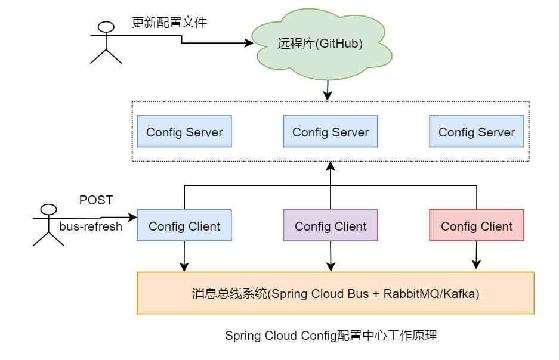
    2. **Apollo**：Config Client可以自动感知配置文件的更新，但支持的配置文件类型较少、系统架构复杂
        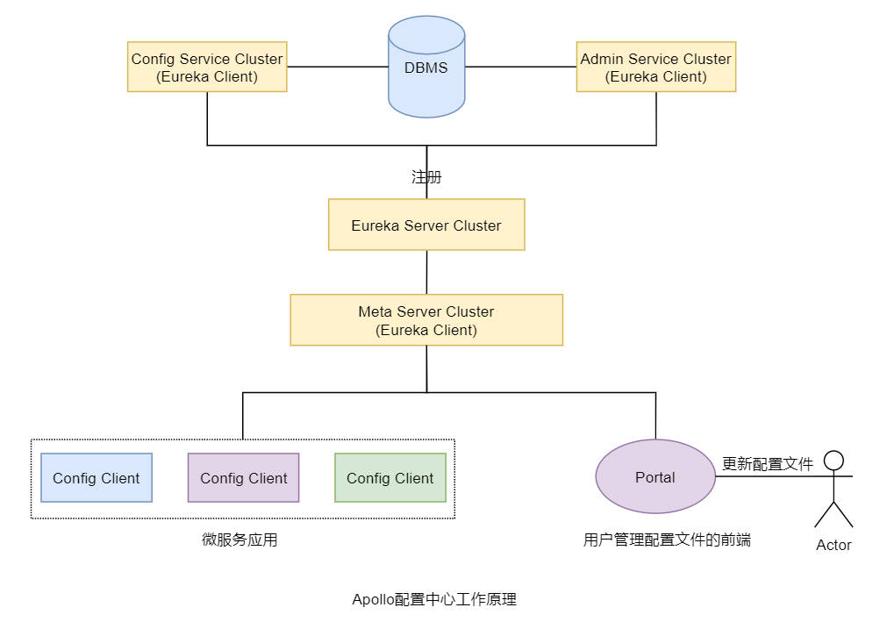
    3. **Nacos Config**：Config Client可以自动感知配置文件的更新、支持的配置文件类型多、系统架构简单
        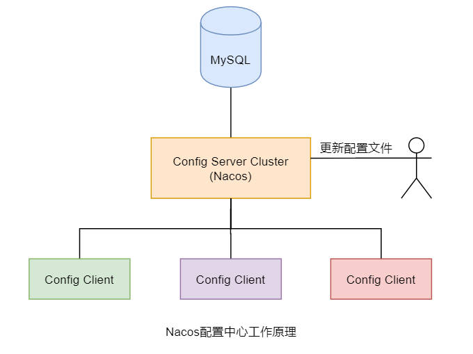
    4. **Zookeeper**：没有用第三方服务器存储配置数据，而是将配置数据存放在 `Znode` 中；Config Client可以自动感知配置文件的更新（`Watcher` 监听机制）
        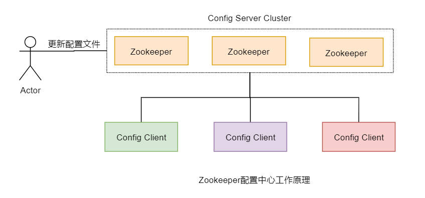
2. CAP模式：一致性C（Consistency）、可用性A（Availablitity）、分区容错性P（Partition tolerance）
    - Zookeeper：CP
    - Eureka：AP
    - Consul：AP
    - Nacos：AP（默认）、CP

### 3.2. 核心功能
1. 获取远程配置：
    1. 服务端：Data ID用于指定在nacos config中保存的配置文件的名称
    2. 客户端：
        1. 依赖：`spring-cloud-starter-alibaba-nacos-config`
        2. 配置：
            ```yml showLineNumbers
            spring:
                application:
                    name: 服务名称
                cloud:
                    nacos:
                        config:
                            server-addr: localhost:8848
                            file-extension: yml
                            username: username
                            password: password

                            # 共享配置：同一group下的不同service可共享
                            shared-configs:
                                - data-id: config.yml
                                  group: DEFAULT_GROUP

                            # 扩展配置：不同group下的不同service可共享
                            extension-configs:
                                - data-id: config.yml
                                  group: DEFAULT_GROUP
                
                # 当前服务配置
                config:
                    import:
                        - optional:nacos:${spring.application.name}.${spring.cloud.nacos.config.file-extension}
            ```
        3. 配置文件的加载顺序：
            - 优先级：共享配置 &lt; 扩展配置 &lt; 当前服务配置（优先级高会覆盖优先级低）
            - **当前服务配置** 所处位置的加载顺序：本地配置文件 &rarr; 远程配置文件 &rarr; 快照配置文件（只要加载到配置文件就停止）
2. 动态更新配置：
    1. 服务端：提供配置
    2. 客户端：类上加 `@RefreshScope` 注解，字段上加 `@Value` 注解以读取配置文件中的值
    3. 动态更新原理：**长轮询模型**
        - Client定时发起Pull请求
            - 数据无变更：Server保持连接一段时间
            - 数据有变更：立即Push响应
3. 多环境选择：
    1. 服务端：Data ID命名为 `xxx-{profile}.yml`
    2. 客户端：
        1. 配置：
            ```yml showLineNumbers
            spring:
                profiles:
                    active: dev
                config:
                    import:
                        - optional:nacos:${spring.application.name}-${spring.profiles.active}.${spring.cloud.nacos.config.file-extension}
            ```
4. 配置隔离：与 [服务隔离机制](#24-其他功能) 相同
    

---

## 4. OpenFeign与负载均衡
### 4.1. 概述
1. **OpenFeign**：通过使用 JAX-RS（Java Api eXtensions of RESTful web Services）或 SpringMVC 注解的修饰方式，生成接口的动态实现
2. 负载均衡功能：`Ribbon` &rarr; `Spring Cloud Loadbalancer`

### 4.2. OpenFeign
1. 基础实现：
    1. 消费者服务：
        1. 依赖：`spring-cloud-starter-openfeign`
        2. 代码：
            1. 声明HTTP接口：
                ```java showLineNumbers
                @FeignClient(value = "provider-service-name", path = "api-prefix")
                public interface ExampleService {
                    @GetMapping("api-path")
                    Response example(@RequestBody Request request);
                }
                ```
            2. 调用类：注入 `ExampleService` 即可调用
            3. 启动类上加 `@EnableFeignClients` 注解
2. 超时设置：局部设置的优先级高于全局设置
    ```yml showLineNumbers
    spring:
        cloud:
            openfeign:
                client:
                    config:
                        # 全局设置
                        default:
                            connect-timeout: 1
                            read-timeout: 1
                        # 局部设置
                        provider-depart: 
                            read-timeout: 2
    ```
3. Gzip压缩：设置请求与响应的压缩
    ```yml showLineNumbers
    spring:
        cloud:
            openfeign:
                client:
                    compression:
                        request:
                            enabled: true
                            mime-types: ["application/xml", "application/json"]
                            min-request-size: 1024
                        response:
                            enabled: true
    ```
4. 远程调用底层实现技术：
    - 支持技术：JDK的 `URLConnection`、`HttpClient`（默认启用）、`OkHttp`
    - 配置：`spring.cloud.openfeign.httpclient`、`spring.cloud.openfeign.okhttp`

### 4.3. 负载均衡
1. 默认策略：轮询算法（`Ribbon`）
2. 自定义策略：实现 `ReactorLoadBalancer` Bean和启动类上加 `@LoadBalancerClients(defaultConfiguration = {Example.class})` 注解

---

## 5. Spring Cloud Gateway微服务网关
### 5.1. 概述
1. **网关**：系统唯一对外的入口，介于客户端与服务器端之间，用于对请求进行鉴权、限流、路由、监控等功能
2. **Spring Cloud Gateway**：建立在Spring生态系统之上的API网关，旨在提供一种简单而有效的方法去路由到指定api
    - 技术栈：`Spring 6` + `Spring Boot 3` + `Project Reactor`（响应式编程）
    - 路由Route：路由ID + 目标地址URI + 断言集合 + 过滤器集合（断言为true，则请求经由过滤器被路由到目标地址URI）
    - 断言Predicate：匹配HTTP请求的条件
    - 过滤器Filter：对请求/响应进行加工处理
    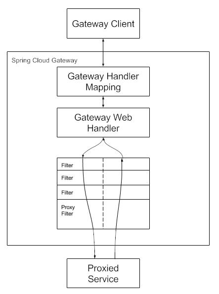
3. Reactor：一种完全基于Reactive Streams规范的、全新的库
    1. 响应式编程（Reactive Programming）：一种新的编程范式、编程思想
    2. Reactive Streams：响应式编程的规范，定义了响应式编程的相关接口
    3. RxJava2：响应式编程库，遵循Reactive Streams规范，且在RxJava基础之上开发的
    4. Reactor：响应式编程库，遵循Reactive Streams规范，又与RxJava没有关系
4. Zuul：Netflix的开源API网关，基于Servlet并使用同步阻塞IO，不支持长连接

### 5.2. 基础实现
1. 依赖：`spring-cloud-starter-gateway`
2. 配置：
    ```yml showLineNumbers
    spring:
        cloud:
            gateway:
                routes:
                    - id: xxx
                      uri: https://www.xxx.com
                      # 断言工厂
                      predicates:
                          - Path=/**
                      # 过滤工厂
                      filters:
                          - AddRequestHeader=X-Request-Color, blue
    ```
3. 代码：
    ```java showLineNumbers
    @Bean
    public RouteLocator routeLocator(RouteLocatorBuilder builder) {
        return builder.routes()
                    .route("xxx",
                                ps -> ps.uri("https://www.xxx.com")
                                            // 断言工厂
                                            .path("/**")
                                            // 过滤工厂
                                            .filters(fs -> fs.addRequestHeader("X-Request-Color", "blue")))
                    .build();
    }
    ```

### 5.3. 路由断言工厂
1. Spring Cloud Gateway通过路由断言工厂实现路由匹配功能
2. **内置** 路由断言工厂：

    | 断言工厂 | 规则 | 示例 |
    | --- | --- | --- |
    | `After` | 请求时间在指定时间之后 | `After=2023-01-01T00:00:00Z` |
    | `Before` | 请求时间在指定时间之前 | `Before=2023-12-31T23:59:59Z` |
    | `Between` | 请求时间在两个时间之间 | `Between=2023-01-01T00:00:00Z, 2023-12-31T23:59:59Z` |
    | `Cookie` | 携带指定Cookie键值对 | `Cookie=key, value` |
    | `Header` | 携带指定请求头键值对 | `Header=X-Request-Id, \d+` |
    | `Host` | 匹配指定Host请求头 | `Host=**.example.com` |
    | `Method` | 匹配HTTP请求方法 | `Method=GET, POST` |
    | `Path` | 匹配请求路径URI | `Path=/provider/**` |
    | `Query` | 携带指定请求参数 | `Query=color, gr.+` |
    | `RemoteAddr` | 客户端IP在指定范围 | `RemoteAddr=192.168.1.1/24` |
    | `Weight` | 权重路由（负载均衡） | `Weight=group1, 8` |
    | `XForwardedRemoteAddr` | X-Forwarded-For的IP在指定范围 | `XForwardedRemoteAddr=192.168.1.1/24` |
    - 多路由断言工厂之间是 **或** 的关系
    - **配置式（配置文件）** 的优先级高于API式（程序代码）
3. 自定义异常处理器：
    1. 自定义异常处理器：继承 `AbstractErrorWebExceptionHandler`，重写 `getRoutingFunction` 方法，并自定义返回的响应格式
        ```java showLineNumbers
        @Component
        public class CustomErrorWebExceptionHandler extends AbstractErrorWebExceptionHandler {
            @Override
            protected RouterFunction<ServerResponse> getRoutingFunction(final ErrorAttributes ea) {
                return RouterFunctions.route(RequestPredicates.all(), ServerResponse.body(BodyInserters.fromValue(getErrorAttributes(request, ErrorAttributeOptions.defaults()))));
            }
        }
        ```
    2. 更换异常信息：继承 `DefaultErrorAttributes`，重写 `getErrorAttributes` 方法
        ```java showLineNumbers
        @Component
        public class CustomErrorAttributes extends DefaultErrorAttributes {
            @Override
            public Map<String, Object> getErrorAttributes(ServerRequest request, ErrorAttributeOptions options) {
                Map<String, Object> map = new HashMap<>();
                map.put("message", "请求错误");
                return map;
            }
        }
        ```
4. **自定义** 路由断言工厂：
    1. 自定义路由断言工厂：继承 `AbstractRoutePredicateFactory`，定义泛型并重写 `shortcutFieldOrder` 和 `apply` 方法（类名规范：`功能前缀 + RoutePredicateFactory`）
        ```java showLineNumbers
        @Component
        public class AuthRoutePredicateFactory extends AbstractRoutePredicateFactory<Config> {
            @Data
            public static class Config {
                private String username;
                private String password;
            }

            @Override
            public List<String> shortcutFieldOrder() {
                return Arrays.asList("username", "password");
            }

            @Override
            public Predicate<ServerWebExchange> apply(Config config) {
                return exchange -> {
                    HttpHeaders headers = exchange.getRequest().getHeaders();

                    List<String> passwords = headers.get(config.getUsername());
                    return passwords.contains(config.getPassword());
                };
            }
        }
        ```
    2. 设置配置文件：格式为 `- 功能前缀=参数`
        ```yml showLineNumbers
        spring:
            cloud:
                gateway:
                    routes:
                        - id: xxx
                          uri: https://www.xxx.com
                          predicates:
                                - Auth=zhangsan, 123456
        ```

### 5.4. 过滤工厂
1. 过滤工厂 `GatewayFilterFactory` 允许在特定路由中以某种方式修改请求/响应
2. **内置** 过滤工厂：

    | 过滤工厂 | 规则 | 示例 |
    | --- | --- | --- |
    | `AddRequestHeader` | 添加请求头 | `AddRequestHeader=X-Request-Color, blue` |
    | `AddRequestHeadersIfNotPresent` | 请求头不存在时添加 | `AddRequestHeadersIfNotPresent=X-Request-Color:blue, City:beijing` |
    | `AddRequestParameter` | 添加请求参数 | `AddRequestParameter=key, value` |
    | `AddResponseHeader` | 添加响应头 | `AddResponseHeader=key, value` |
    | `CircuitBreaker` | 服务熔断与降级<br/>依赖：`spring-cloud-starter-circuitbreaker-reactor-resilience4j` | `name: CircuitBreaker`<br/>`args.fallbackUri: forward:/fallback` |
    | `PrefixPath` | 添加路径前缀 | `PrefixPath=/provider` |
    | `StripPrefix` | 去除指定个数的前缀 | `StripPrefix=2` |
    | `RewritePath` | 路径重写 | `RewritePath=/regex/match, /target/path` |
    | `RequestRateLimiter` | 令牌桶限流<br/>依赖：`spring-boot-starter-data-redis-reactive` | 1. 自定义限流键解析器 `KeyResolver`<br/>2. 配置文件：`args.redis-rate-limiter.*: times` |
    - 设置全局默认过滤工厂（应用在所有路由上）：`spring.cloud.gateway.default-filters: - filters…`
    - **局部Filter** 的优先级高于全局默认Filter
    - **API式（程序代码）** 的优先级高于配置式（配置文件）
3. **自定义** 过滤工厂：
    1. 自定义过滤工厂：继承 `AbstractNameValueGatewayFilterFactory`（格式默认为 `key, value`），重写 `apply` 方法（类名规范：`功能前缀 + GatewayFilterFactory`）
        ```java showLineNumbers
        @Component
        public class AddHeaderGatewayFilterFactory extends AbstractNameValueGatewayFilterFactory {
            @Override
            public GatewayFilter apply(NameValueConfig config) {
                return (exchange, chain) -> {
                    ServerHttpRequest changedRequest = exchange.getRequest()
                                                                                .mutate()
                                                                                .header(config.getName(), config.getValue())
                                                                                .build();
                    return chain.filter(exchange.mutate().request(changedRequest).build());
                };
            }
        }
        ```
    2. 设置配置文件：格式为 `- 功能前缀=参数`
        ```yml showLineNumbers
        spring:
            cloud:
                gateway:
                    routes:
                        - id: xxx
                          uri: https://www.xxx.com
                          filters:
                                - AddHeader=key, value
        ```
    3. 工作原理：按照filter的优先级顺序执行；优先级相同，则按注册顺序执行
        ```mermaid
        flowchart TB
        客户端请求 --> Filter1
        subgraph Filter1
            direction TB
            pre1[pre处理] --> Filter2
            subgraph Filter2
                direction TB
                pre2[pre处理] --> 目标服务器
                subgraph 目标服务器
                    handle[处理请求，返回响应]
                end
                目标服务器 --> post2[post处理]
            end
            Filter2 --> post1[post处理]
        end
        Filter1 --> 返回响应
        ```
4. 全局过滤器Global Filter：
    1. 负载均衡：设置配置文件
        ```yml showLineNumbers
        spring:
            cloud:
                gateway:
                    # 允许gateway到注册中心定位服务
                    discovery:
                        locator:
                            enabled: true
                    # 找不到指定服务时，报404状态码
                    loadbalancer:
                        use404: true
                    routes:
                        - id: xxx
                          uri: lb://microservice
                          predicates:
                              - Path=/**
        ```
    2. 全局过滤器：实现 `GlobalFilter`，重写 `filter` 方法
        ```java showLineNumbers
        @Component
        public class URLValidateFilter implements GlobalFilter {
            @Override
            public Mono<Void> filter(ServerWebExchange exchange, GatewayFilterChain chain) {
                // doSomething
                if (somethingFalse) {
                    return exchange.getResponse().setComplete();
                }
                return chain.filter(exchange);
            }
        }
        ```

### 5.5. 跨域配置
1. 同源请求：两个请求的访问协议、域名与端口号三者都相同
2. **跨域资源共享CORS（Cross Origin Resource Sharing）**：一种允许当前域的资源被其他域的脚本请求访问的机制
    1. 配置：
        ```yml showLineNumbers
        spring:
            cloud:
                gateway:
                    # 全局
                    globalcors:
                        cors-configurations:
                            '[/**]':
                                allowedOrigins: "*"
                                allowedMethods:
                                    - GET
                                    - POST
                    routes:
                        - id: xxx
                          uri: http://www.baidu.com
                          # 局部
                          metadata:
                              cors:
                                  allowedOrigins: "*"
                                  allowedMethods:
                                      - GET
                                      - POST
        ```

---

## 6. Sentinel流量防卫兵
### 6.1. 概述
1. **[Sentinel](https://sentinelguard.io/zh-cn/)**：是面向分布式、多语言异构化服务架构的流量治理组件，主要以 **流量** 为切入点，从流量路由、流量控制、流量整形、熔断降级、系统自适应过载保护、热点流量防护等多个维度来帮助开发者保障微服务的稳定性
2. Sentinel控制台：轻量级开源GUI控制台，可以提供对Sentinel主机（Sentinel应用）的发现及健康管理、动态配置服务流控、熔断、路由规则的配置与管理
    - 启动命令：
        ```bash showLineNumbers
        java -Dserver.port=8888
        -Dsentinel.dashboard.auth.username=sentinel
        -Dsentinel.dashboard.auth.password=sentinel
        -jar sentinel-dashboard.jar
        ```

### 6.2. 服务降级
1. **服务降级**：当用户的请求由于各种原因被拒后，系统返回一个事先设定好的、用户可以接受的，但又令用户并不满意的结果
2. Sentinel式方法级实现：
    1. 依赖：`spring-cloud-starter-alibaba-sentinel`
    2. 代码：入参类型、返回值必须与原方法相同
        ```java showLineNumbers
        @SentinelResource(fallback = "getHandleFallback")
        public void getHandle(int id) {
            // handle
        }

        public void getHandleFallback(int id, Throwable e) {
            // handle
        }
        ```
3. Sentinel式类级实现：
    1. 依赖：`spring-cloud-starter-alibaba-sentinel`
    2. 代码：入参类型、返回值必须与原方法相同，且必须是静态方法
        ```java showLineNumbers
        public class Example {
            @SentinelResource(fallback = "getHandleFallback", fallbackClass = ExampleFallback.class)
            public void getHandle(int id) {
                // handle
            }
        }

        public class ExampleFallback {
            public static void getHandleFallback(int id, Throwable e) {
                // handle
            }
        }
        ```
4. Feign式类级实现：
    1. 依赖：`spring-cloud-starter-alibaba-sentinel`
    2. 配置：
        ```yml showLineNumbers
        spring:
            cloud:
                openfeign:
                    # 避免Feign和Sentinel依赖间的冲突
                    lazy-attributes-resolution: true
        feign:
            sentinel:
                # 开启Feign对Sentinel的支持
                enabled: true
        ```
    3. 代码：降级类必须实现Feign接口，接口路径与原类相同，且前缀为 `/fallback`
        ```java showLineNumbers
        @FeignClient(value = "example-name", fallback = ExampleFallback.class)
        public interface Example {
            public void getHandle(int id);
        }

        @Component
        @RequestMapping("/fallback/example")
        public class ExampleFallback implements Example {
            @Override
            public void getHandle(int id) {
                // handle
            }
        }
        ```

### 6.3. 服务熔断
1. **服务雪崩**：大量用户请求某一服务出现异常，导致每个阻塞的请求都会占用一个线程。而当并发访问量非常大时，这些阻塞请求会迅速用完所有线程，从而导致对于其它正常服务的访问请求无法获取系统资源而被拒绝，发生系统崩溃
2. **服务熔断**：为了防止服务雪崩的发生，在发现了对某些资源请求的响应缓慢或调用异常较多时，直接将对这些资源的请求掐断一段时间。而在这段时间内的请求将不再等待超时，而是 **直接返回事先设定好的降级结果**
3. 动态设置熔断规则：
    1. 配置：
        ```yml showLineNumbers
        spring:
            cloud:
                sentinel:
                    transport:
                        dashboard: ip:port
                        # API端口
                        port: 8719
                    eager: true
        ```
    2. 资源名称：
        1. 默认：URI/方法的全限定签名
        2. 指定：`@SentinelResource(value = "name")`
    3. 设置规则：控制台动态配置的优先级高于API配置
        1. 在控制台面板上动态设置
        2. 在代码中用API设置：
            ```java showLineNumbers
            @SpringBootApplication
            public class ExampleApplication {
                public static void main(String[] args) {
                    SpringApplication.run(ExampleApplication.class, args);

                    // 初始化降级规则
                    DegradeRule rule = new DegradeRule();
                    rule.setResource("资源名");
                    rule.setGrade(降级策略);
                    rule.setCount(最大RT);
                    rule.setSlowRatioThreshold(比例阈值);
                    rule.setTimeWindow(熔断时长);
                    rule.setStatIntervalMs(统计时长);
                    rule.setMinRequestAmount(最小请求数);
                    DegradeRuleManager.loadRules(Arrays.of(rule));
                }
            }
            ```
4. 自定义异常处理器：当采用URI作为默认Sentinel资源名称，且发生打破规则阈值的异常情况时，Sentinel会抛出 `BlockExcetion`，能被 `BlockedExceptionHandler` 处理，其中可自定义返回的响应格式

### 6.4. 服务流控
1. **服务流控**/**服务限流**：用流控规则控制访问流量
    1. Sentinel的实现原理：监控应用流量的QPS或并发线程数等指标，当达到指定的阈值时对新请求进行控制，以避免被瞬时的流量高峰冲垮
    2. 动态流控：流控规则直接通过Sentinel Dashboard定义，可以随时修改而不需要重启应用
2. 设置规则：控制台动态配置的优先级高于API配置；指定流控处理器 `@SentinelResource(blockHandler = "blockHandlerMethod")`
    1. 在控制台面板上动态设置
    2. 在代码中用API设置：
        ```java showLineNumbers
        @SpringBootApplication
        public class ExampleApplication {
            public static void main(String[] args) {
                SpringApplication.run(ExampleApplication.class, args);

                // 初始化流控规则
                FlowRule rule = new FlowRule();
                rule.setResource("资源名");
                rule.setLimitApp(针对来源);
                rule.setGrade(降级策略/阈值类型);
                rule.setCount(单机阈值);
                FlowRuleManager.loadRules(Arrays.of(rule));
            }
        }
        ```
3. 加载指定资源的流控规则：`Sphu.entry("资源名")`
4. 规则字段：
    1. 针对来源：针对请求来源名称进行流控；重写请求解析器 `RequestOriginParser`
        1. 在控制台面板上动态设置
        2. 在代码中用API设置：`rule.setLimitApp(针对来源);`
    2. 阈值类型：
        1. QPS
        2. 并发线程数：对消费者端的配置 &rarr; 避免由于慢调用而将消费者端的线程耗尽的情况发生
            1. 线程隔离方案：
                1. 线程池隔离：系统为不同的提供者资源设置不同的线程池来隔离业务自身之间的资源争抢；隔离性较好，但需要创建的线程池及线程数量太多，系统消耗较大，对低延时的调用有较大影响
                2. 信号量隔离：系统为不同的提供者资源设置不同的计数器，每增加一个该资源的调用请求，计数器就变化一次。当达到该计数器阈值时，新请求将被限流；不存在线程上下文切换的问题，但对提供者的调用无法实现异步，执行效率低，且不方便控制依赖资源的执行超时
            2. Sentinel线程隔离方案：Sentinel不负责创建和管理线程池，仅仅是简单统计当前资源请求占用的线程数目，如果对该资源的请求占用的线程数量超出阈值，则立即拒绝新请求
    3. 流控模式：
        1. 直接：当对当前资源的请求达到阈值时，直接限流当前资源
        2. 关联：当对关联资源的请求达到阈值时，限流当前资源
        3. 链路：若当前资源有多种访问路径时，可以对某一路径的访问进行限流
            - 入口资源：完整URI
    4. 流控效果：
        1. 快速失败：（默认）直接拒绝，QPS超过设置的阈值后，新请求将被直接拒绝或降级
        2. Warm Up：预热/冷启动，QPS逐渐升高，达到阈值后执行快速失败
        3. 排队等待：匀速排队，削峰填谷，将超过阈值后的新请求缓存起来，慢慢处理

### 6.5. 其他规则及持久化
1. **授权规则**：通过黑白名单来对请求来源名称进行甄别的鉴权规则
    1. 在控制台面板上动态设置
    2. 在代码中用API设置：
        ```java showLineNumbers
        @SpringBootApplication
        public class ExampleApplication {
            public static void main(String[] args) {
                SpringApplication.run(ExampleApplication.class, args);

                // 初始化授权规则
                AuthorityRule rule = new AuthorityRule();
                rule.setResource("资源名");
                rule.setLimitApp(流控应用);
                rule.setStrategy(授权类型);
                AuthorityRuleManager.loadRules(Arrays.of(rule));
            }
        }
        ```
2. **热点规则**：用于实现热点参数限流的规则；热点参数限流是在流控规则中指定对某方法参数的QPS进行限流；参数例外项是对热点参数中的某个或某些特殊值单独设置QPS阈值
    1. 在控制台面板上动态设置
    2. 在代码中用API设置：
        ```java showLineNumbers
        @SpringBootApplication
        public class ExampleApplication {
            public static void main(String[] args) {
                SpringApplication.run(ExampleApplication.class, args);

                // 初始化热点规则
                ParamFlowRule rule = new ParamFlowRule();
                rule.setResource("资源名");
                rule.setGrade(限流模式);
                rule.setParamIdx(参数索引);
                rule.setCount(单机阈值);
                rule.setDurationInSec(统计窗口时长);

                // 初始化参数例外项
                ParamFlowItem item = new ParamFlowItem();
                item.setClassType(String.class.getName());
                item.setObject(参数值)
                item.setCount(限流阈值)
                rule.setParamFlowItemList(Arrays.of(item));

                ParamFlowRuleManager.loadRules(Arrays.of(rule));
            }
        }
        ```
3. **系统规则**：用于实现系统自适应限流，即对应用级别的入口流量进行整体控制，结合应用的Load、CPU使用率、平均RT、入口QPS和入口并发线程数等几个维度的监控指标，通过自适应的流控策略，让系统的入口流量与负载达到一个平衡
    1. 规则模式/阈值类型：
        1. `LOAD`：（仅对Linux/Unix-like系统生效）当系统load超过阈值且系统当前的并发线程数超过估算的系统容量（`maxQps * minRt` 或 `CPU cores * 2.5`）时，会触发系统保护（BBR阶段）
        2. `RT`
        3. 线程数
        4. 入口QPS
        5. CPU使用率
4. 网关流控：通过 `Sentinel API Gateway Adapter Common` 公共适配器实现
    1. 限流维度：
        1. Route：根据网关路由中指定的路由id进行路由
            1. 在控制台面板上动态设置：
                1. 参数属性：
                    1. Client IP：网关集群节点服务器的IP
                    2. Remote Host：客户端IP
                    3. Header
                    4. URL参数
                    5. Cookie
                2. 匹配模式：
                    1. 精确：属性值与设置的匹配串完全相同时才应用规则
                    2. 子串：属性值包含设置的匹配串时才应用规则
                    3. 正则：属性值符合设置的匹配串的正则表达式时才应用规则
            2. 在代码中用API设置：
                ```java showLineNumbers
                @SpringBootApplication
                public class ExampleApplication {
                    public static void main(String[] args) {
                        SpringApplication.run(ExampleApplication.class, args);

                        // 初始化网关流控规则
                        GatewayFlowRule rule = new GatewayFlowRule();
                        rule.setResourceMode(API类型);
                        rule.setResource("资源名");
                        rule.setGrade(阈值类型);
                        rule.setCount(QPS阈值);
                        rule.setIntervalSec(间隔);
                        rule.setControlBehavior(流控方式);
                        rule.setBurst(宽限次数);

                        GatewayParamFlowItem item = new GatewayParamFlowItem();
                        item.setParseStrategy(参数属性);
                        item.setMatchStrategy(匹配模式);
                        item.setPattern("匹配串");
                        rule.setParamItem(item);

                        GatewayRuleManager.loadRules(Arrays.of(rule));
                    }
                }
                ```
        2. API：使用Sentinel提供的API自定义分组进行限流
            1. 在控制台面板上动态设置
            2. 在代码中用API设置：
                ```java showLineNumbers
                @SpringBootApplication
                public class ExampleApplication {
                    public static void main(String[] args) {
                        SpringApplication.run(ExampleApplication.class, args);

                        // 新增API分组
                        ApiDefinition api = new ApiDefinition("资源名");
                        api.setPredicateItems(new HashSet<>() {{
                            add(new ApiPathPredicateItem().setPattern("匹配串").setMatchStrategy(匹配模式));
                        }});
                        GatewayApiDefinitionManager.loadApiDefinitions(Arrays.of(api));
                        
                        // 初始化对应的流控规则
                    }
                }
                ```
    2. 限流阻断异常结果：API方式的优先级高于配置方式
        1. API方式：`GatewayCallbackManager.setBlockHandler(new RedirectBlockRequestHandler("url"));`
        2. 配置方式：
            ```yml showLineNumbers
            spring:
                cloud:
                    sentinel:
                        scg:
                            fallback:
                                mode: redirect
                                redirect: url
            ```
5. 规则持久化：由于应用重启就会丢失存在Sentinel Dashboard主机内存中的规则，需要通过 `DataSource` 扩展实现动态规则持久化
    1. `DataSource` 扩展：
        1. 拉模式：客户端主动向规则管理中心（如RDBMS、文件、VCS）定期轮询拉取规则
            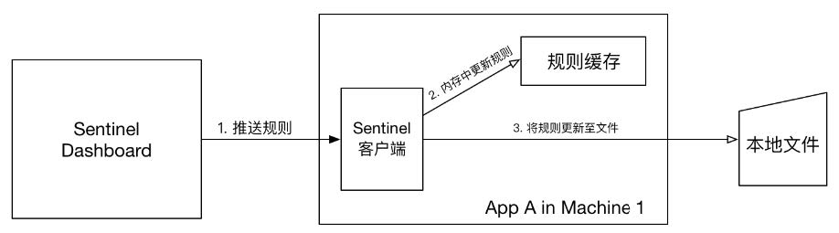
            1. 定义 `FileDataSourceInit` 类并实现 `InitFunc` 接口，初始化好规则
            2. 定义 `SPI` 接口文件 `META-INF/services/InitFunc接口的全限定名`，文件内容为该接口的实现类的全限定性类名（即 `FileDataSourceInit` 类的全限定名）
        2. 推模式：规则中心（如Nacos、Zookeeper、Redis、Apollo、etct）统一推送，客户端通过注册监听器的方式时刻监听变化
            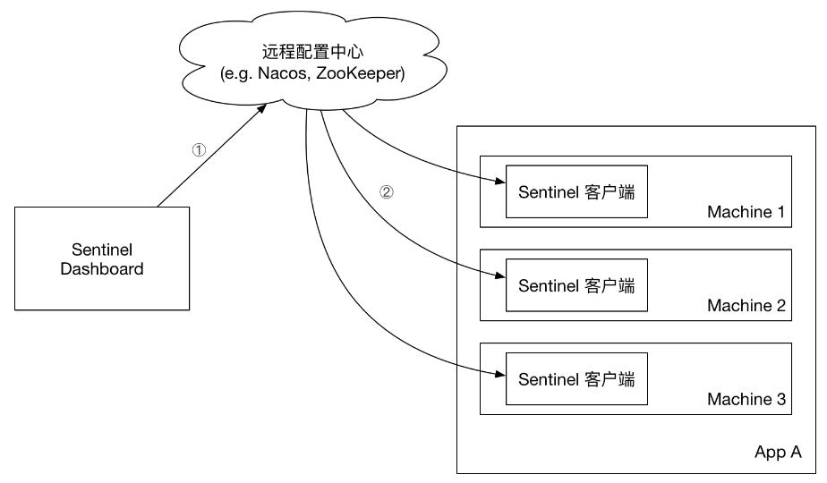
            1. 通过nacos的配置中心实现，将规则放在配置文件中
    2. 改造Sentinel控制台：修改源码实现与Nacos双向同步，即规则的增删改查均实时同步至Nacos配置中心，微服务应用也能实时拉取最新规则

### 6.6. 集群流控
1. 集群流控：从集群维度来统计、分配集群中QPS，以达到最大限度地降低由于流控而拒绝的请求数量
2. 构成：
    1. 集群流控客户端 `Token Client`：用于向所属的 `Token Server` 通信以请求token
    2. 集群流控服务端 `Token Server`：处理来自 `Token Client` 的token请求，根据配置的集群规则判断是否应该发放 Token（或者说是否允许通过）
        1. 独立模式：作为独立的进程启动，独立部署。隔离性好，但需要额外的部署操作
            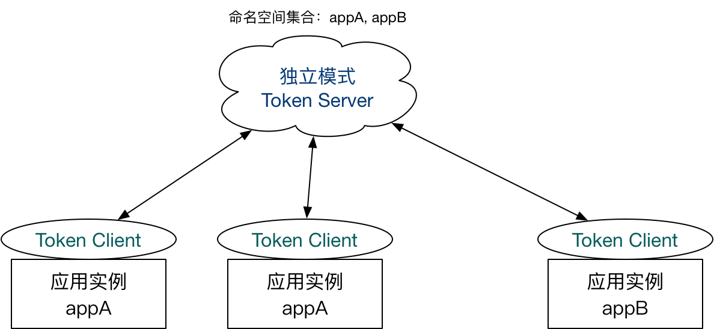
            1. 定义 `Token Server`：
                ```java showLineNumbers
                @SpringBootApplication
                public class ExampleApplication {
                    public static void main(String[] args) {
                        SpringApplication.run(ExampleApplication.class, args);

                        // 初始化服务端
                        ClusterServerConfigManager.loadGlobalTransportConfig(new ServerTransportConfig().setPort(8080));
                        ClusterServerConfigManager.loadServerNamespaceSet(Collections.singleton("appName"));

                        // 启动服务端
                        ClusterTokenServer tokenServer = new SentinelDefaultTokenServer();
                        tokenServer.start();
                    }
                }
                ```
            2. 定义 `Token Client`：
                ```java showLineNumbers
                @SpringBootApplication
                public class ExampleApplication {
                    public static void main(String[] args) {
                        SpringApplication.run(ExampleApplication.class, args);
                        
                        // 初始化客户端
                        // 1. 指定当前应用为客户端
                        ClusterStateManager.applyState(ClusterStateManager.CLUSTER_CLIENT);

                        // 2. 为客户端分配服务端
                        ClusterClientAssignConfig assignConfig = new ClusterClientAssignConfig();
                        assignConfig.setServerHost("127.0.0.1");
                        assignConfig.setServerPort(8080);
                        ClusterClientConfigManager.applyNewAssignConfig(assignConfig);
                    }
                }
                ```
            3. 在Sentinel控制台中为客户端指定服务端，并设定流控规则
        2. 嵌入模式：某个 `Token Client` 被指定为 `Token Server`，同时可以随时通过提交一个HTTP请求进行转变身份。无需单独部署，灵活性比较好；但隔离性不好，且 `Token Server` 的性能也会由于访问量的增加而受影响
            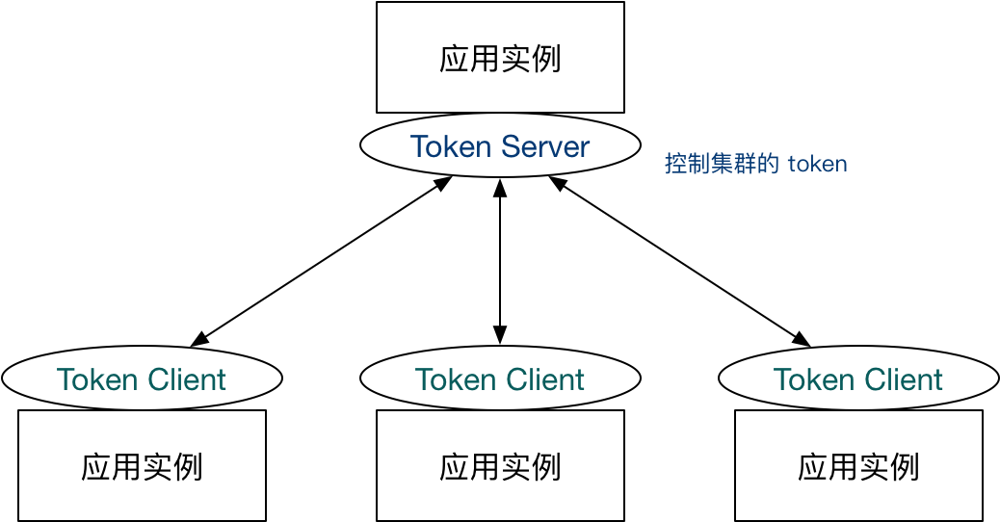
            1. 基于独立模式，停掉独立的 `Token Server` 服务
            2. 在Sentinel控制台中选择其中一个客户端作为服务端，并为其他客户端指定服务端，设定流控规则

---

## 7. 分布式事务解决方案Seata
### 7.1. 概述
1. 分布式事务：一次操作由若干分支操作组成，这些分支操作分属不同应用，并分布在不同服务器上。分布式事务需要保证这些分支操作要么全部成功，要么全部失败
2. **[Seata](http://seata.io/zh-cn/)**：开源的分布式事务解决方案，致力于在微服务架构下提供高性能和简单易用的分布式事务服务
    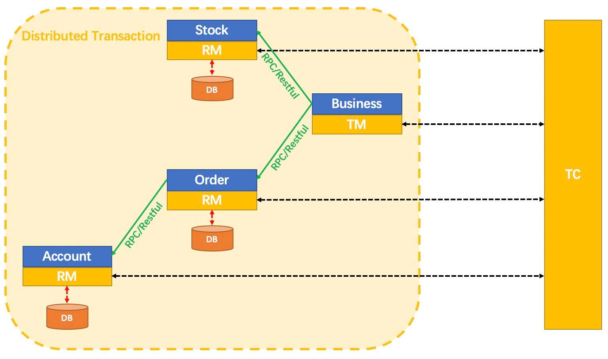
    1. 事务协调者TC（Transaction Coordinator）：维护全局和分支事务的状态，驱动全局事务提交或回滚
    2. 事务管理器TM（Transaction Manager）：定义全局事务的范围，即开始、提交或回滚
    3. 资源管理器RM（Resource Manager）：管理分支事务处理的资源，与TC交谈以注册分支事务和报告分支事务的状态，并驱动分支事务提交或回滚

### 7.2. Seata Server
1. 存储模式：
    1. file模式：存储在本地文件中，一般用于Seata Server的单机测试
        1. 修改配置文件：在 `seata/conf/application.yml` 文件中修改 `seata.store.mode=file`
        2. 查看数据文件：在 `seata/bin/sessionStore` 目录下的 `root.data` 文件
    2. db模式：存储在数据库中，一般用于生产环境下的Seata Server集群部署
        1. 运行建表脚本：执行 `seata/script/server/db/mysql.sql` 文件
        2. 修改配置文件：在 `seata/conf/application.yml` 文件中主要修改Seata的配置中心、注册中心以及回滚日志信息
            ```yml showLineNumbers
            seata:
                config:
                    type: nacos
                    nacos:
                        ...
                registry:
                    type: nacos
                    nacos:
                        ...
                store:
                    mode: db
                    ...
            ```
        3. 修改nacos配置文件：在 `seata/script/config-center/config.txt` 文件中修改存储模式，并删除其他存储模式的相关配置
            ```properties showLineNumbers
            store.mode=db
            ```
    3. redis模式：存储在redis中，一般用于生产环境下的Seata Server集群部署，性能略高于db模式
        1. 修改配置文件：在 `seata/conf/application.yml` 文件中主要修改Seata的配置中心、注册中心以及回滚日志信息
            ```yml showLineNumbers
            seata:
                config:
                    type: nacos
                    nacos:
                        ...
                registry:
                    type: nacos
                    nacos:
                        ...
                store:
                    mode: redis
                    ...
            ```
        2. 修改nacos配置文件：在 `seata/script/config-center/config.txt` 文件中修改存储模式，并删除其他存储模式的相关配置
            ```properties showLineNumbers
            store.mode=redis
            ```
2. 搭建集群：
    1. 只支持db或redis的存储模式
    2. 复制多个节点，并修改Tomcat端口号
    3. 启动服务：`seata-server.bat -m 存储模式 -n 节点序号`

### 7.3. 分布式事务模式
1. **XA（uniX transAction）**：基于XA协议，作为资源管理器与事务管理器的接口标准
    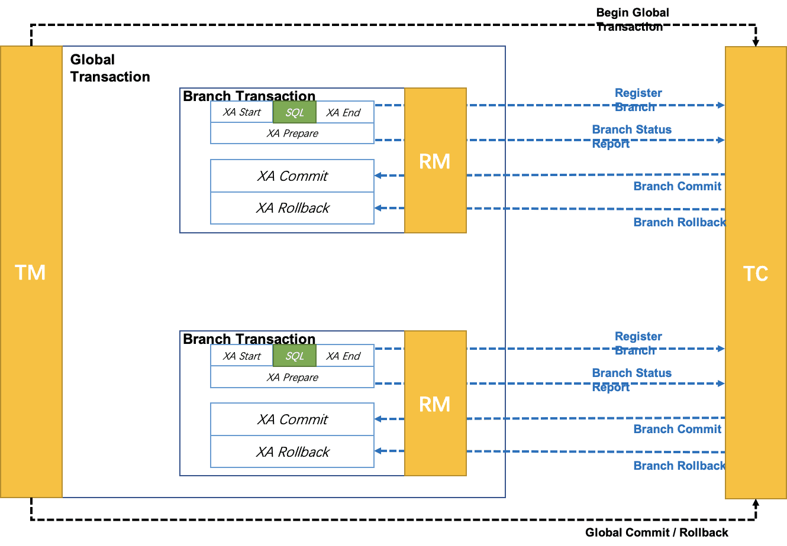
    1. 存在的问题：
        1. 回滚日志无法自动清理，需要手工清理
        2. 多线程下对同一个RM中的数据进行修改，存在ABA问题
2. **AT（Automatic Transaction）**：（2PC）默认模式，是由XA模式演变而来的，通过全局锁对XA模式中的问题（ABA问题）进行了改进，并实现了回滚日志的自动清理
    1. 存在的问题：
        1. 不支持NoSQL
        2. 全局commit/rollback阶段及回滚日志的清除过程，完全自动化，而无法实现定制化过程
    2. Seata Client：
        1. 添加 `undo_log` 表：用于保存需要回滚的业务数据
        2. 搭建工程应用：
            1. 添加依赖：`com.alibaba.cloud.spring-cloud-starter-alibaba-seata`
            2. 修改配置文件：指定服务注册到Seata Server的同一个组
            3. 添加 `@GlobalTransactional` 注解：作为TM角色的工程需要开启分布式事务
    3. 工作原理：
        1. 一阶段：业务数据和回滚日志记录在同一个本地事务中提交，释放本地锁和连接资源
            1. 解析SQL
            2. 查询要写入到 `undo_log` 表的 `rollback_info` 字段中前镜像 `beforeImage` 的值
            3. 执行业务SQL
            4. 查询要写入到 `undo_log` 表的 `rollback_info` 字段中后镜像 `afterImage` 的值
            5. 插入回滚日志：把前后镜像数据以及业务SQL等相关信息组成一条回滚日志记录，插入到 `undo_log` 表中
            6. 提交前向TC注册分支，并申请全局锁
            7. 本地事务提交：申请到全局锁后，在本地数据库中将业务数据的更新和前面步骤中生成的 `undo_log` 数据一并提交
            8. 将本地事务提交的结果上报给TC
        2. 二阶段：
            1. 提交：当各分支接收到TC发送的提交命令时
                1. 将提交命令放入异步任务的队列中，并马上返回提交成功的结果给TC
                2. 异步任务将异步和批量删除 `undo_log` 数据
            2. 回滚：当各分支接收到TC发送的回滚命令时
                1. 开启本地事务
                2. 根据 `XID` 和 `Branch ID` 查找到对应的 `undo_log` 数据
                3. 数据校验：比较后镜像数据与当前业务数据（如果不一致，需要运维手动处理）
                4. 根据前镜像数据以及业务SQL等相关信息生成并执行回滚的语句
                5. 提交本地事务，并把本地事务的执行结果（即分支事务的回滚结果）上报给TC
    4. 隔离性：
        1. 写隔离：
            1. 前提条件：
                1. 一阶段本地事务写操作前，需要先获取到本地锁
                2. 一阶段本地事务提交前，需要先获取到全局锁
                3. 获取全局锁的次数限制在一定范围内（超出范围将放弃尝试，回滚本地事务并释放本地锁）
            2. 二阶段提交时：只有tx1二阶段全局提交并释放全局锁后，tx2才能拿到全局锁并提交本地事务
                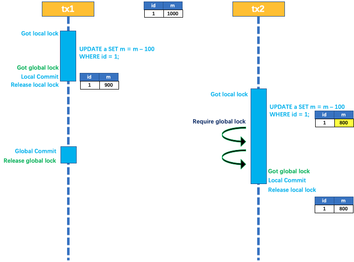
            3. 二阶段回滚时：tx1需要回滚等待本地锁，tx2需要提交等待全局锁，陷入死锁。直到tx2等待全局锁超时，回滚后释放本地锁，使得tx1拿到本地锁完成回滚才释放全局锁
                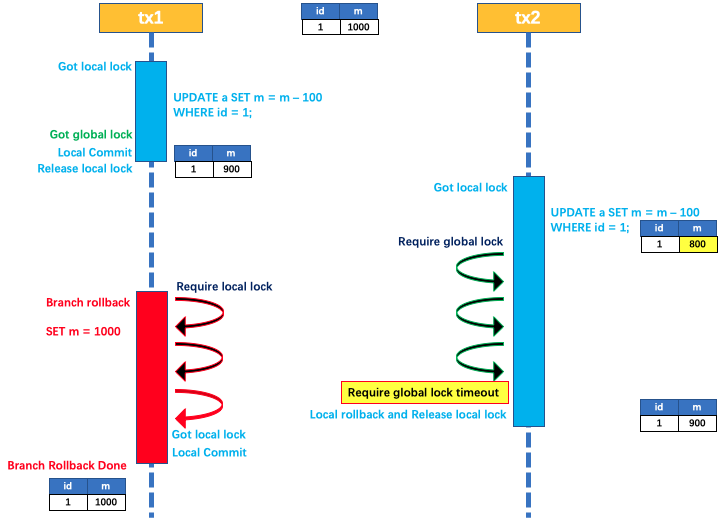
        2. 读隔离：
            1. 前提条件：
                1. 普通读操作的执行需要获取到该记录的本地读锁
                2. `for update` 读操作的执行需要获取到该记录的本地读锁与全局读锁
                3. 读锁是共享锁，一条记录上可同时添加多把读锁
                4. 一条记录上若上了写锁，则不能再上读锁；同理，若上了读锁，则不能再上写锁
            2. 全局的事务隔离级别：默认为读未提交（Read Uncommitted）。如果本地数据库的事务隔离级别在全局之上，就需要在 `select` 语句后添加 `for update` &rarr; 对读操作实现有效的隔离
            3. 原理：基于性能考虑，Seata仅对 `for update` 的 `select` 语句进行读隔离，即会申请全局读锁。如果其它事务持有全局写锁，则立即回滚本地执行并释放本地锁，然后再重试执行
                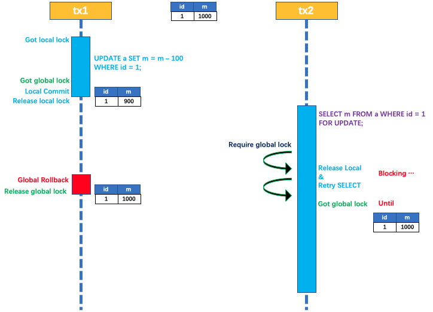
3. **TCC（Try Confirm/Cancel）**：（2PC）支持将自定义的分支事务纳入到全局事务管理中，即可实现定制化的日志清理与回滚过程
    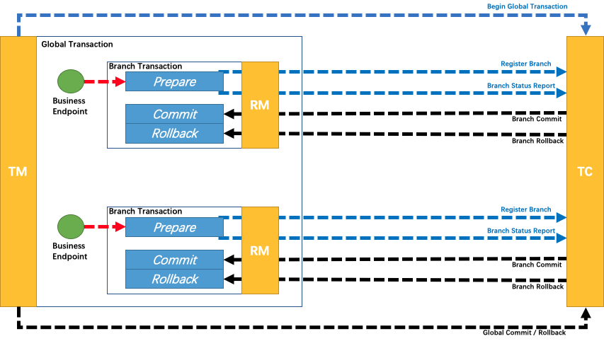
    1. Seata Client：
        1. 搭建工程应用：
            1. 添加依赖：`com.alibaba.cloud.spring-cloud-starter-alibaba-seata`
            2. 修改配置文件：指定服务注册到Seata Server的同一个组
            3. 需要开启分布式事务的各分支都需要包含以下代码：
                ```java showLineNumbers
                @LocalTCC
                public interface ExampleService {
                    @TwoPhaseBusinessAction(name = "tccBeanName", commitMethod = "tccCommit", rollbackMethod = "tccRollback")
                    void method(@BusinessActionContextParameter("parameter") Type parameter);
                    
                    // 手动提交方法
                    Boolean tccCommit(BusinessActionContext context);
                    
                    // 手动回滚方法
                    Boolean tccRollback(BusinessActionContext context);
                }
                ```
4. **SAGA**：长事务的解决方案。每个子流程（事务）都提交真正的执行结果，只有当前子流程执行成功后才能执行下一个子流程。若整个流程中所有子流程全部执行成功，则整个业务流程成功；只要有一个子流程执行失败，则可采用补偿方式
    
    1. 补偿方式：
        - 向后恢复：对于其前面所有成功的子流程，其执行结果全部 **撤销**
        - 向前恢复：**重试** 失败的子流程直到其成功
    2. 当子流程提交了执行结果后，可根据业务场景为业务逻辑加锁或为资源加锁 &rarr; 保证不发生脏读
    3. 与2PC模式的区别：
        1. Saga模式的所有分支事务是串行执行；2PC模式是并行执行
        2. Saga 模式没有TC，通过子流程间的消息传递来完成全局事务管理的；2PC则具有TC，其是通过TC完成全局事务管理的

---

## 8. 调用链跟踪SkyWalking
### 8.1. 概述
1. **[SkyWalking](https://skywalking.apache.org/)**：开源的 **应用性能管理系统APM（Application Performance Management）** 和 **可观测性分析平台OAP（Observability Analysis Platform）**
2. 工作原理：通过在被监测应用中插入 **探针Agent**，以无侵入方式自动收集所需指标，并自动推送到 **可观测性分析平台OAP**。OAP会将收集到的数据存储到指定的 **存储介质Storage**。**可视化查询平台UI系统** 通过调用OAP提供的接口，可以实现对相应数据的查询
    - **Trace**：从客户端所发起的请求抵达被跟踪系统的边界开始，到被跟踪系统向客户返回响应为止，是一次请求的完整调用链路
    - **Segment**：Trace的一个片段，由多个Span组成
    - **Span**：一次服务调用的记录单元，会记录调用的服务以及调用耗时

### 8.2. 组件部署
1. Elastic Search：
    1. 修改系统变量：
        1. 虚拟内存空间大小 `vm.max_map_count`：262144（256K）
        2. 每个进程可打开的文件数的最大数量 `nofile`：65536
        3. 每个用户可创建的进程数的最大数量 `nproc`：4096
    2. 修改配置文件 `elasticsearch.yml`
    3. 用非root用户启动：`./bin/elasticsearch`
2. SkyWalking：包含OAP Server与UI Server两部分
    1. 修改配置文件 `application.yml`：配置storage为ES
    2. 启动命令：OAP、UI、整体三类脚本
3. Agent：
    1. 修改配置文件 `agent.config`：
        1. `agent.service_name`：当前agent名称
        2. `collector.backend_service`：当前agent连接的SkyWalking收集器地址
    2. VM options：`-javaagent:path/to/skywalking-agent.jar`

### 8.3. 核心功能
1. 告警：用户可提前设置好告警规则，一旦调用过程中触发告警规则，则会执行Webhooks，并在UI系统中显示
    1. 设置告警规则与Webhooks：`alarm-settings.yml`
    2. 代码：提供Webhooks对应的接口
2. Tracing API：用于在代码中对调用进行跟踪、处理
    1. 跟踪上下文 `TraceContext`：获取traceId，跨服务传递数据
        1. 依赖：`apm-toolkit-trace`
        2. 代码：
            ```java showLineNumbers
            // 写入TraceContext
            TraceContext.putCorrelation("key", "value");

            // 读取TraceContext
            TraceContext.getCorrelation("key");
            ```
    2. `@Trace`：将本地方法纳入跟踪范围
        - 注解不能用于静态方法

---

## 9. 消息系统整合Spring Cloud Stream
### 9.1. 概述
1. **Spring Cloud Stream**：用来为微服务应用构建消息驱动能力的框架，可以有效简化开发人员对消息中间件的使用复杂度，降低代码与消息中间件之间的耦合度，屏蔽消息中间件之间的差异性
2. 应用程序模型：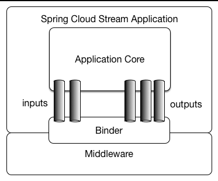
    - 目的地绑定器Destination Binder：负责提供与外部消息系统集成的组件
    - 固定器Binding：介于外部消息系统与应用程序间的桥梁
    - 输入/输出管道Input/Output Bindings：消费者/生产者通过Input/Output Bindings从MQ读取/写入数据
    - 消息Message：生产者和消费者使用的规范数据结构，用于与 Binders 通信（从而通过外部消息系统与其他应用程序通信）

### 9.2. RocketMQ
1. 部署：修改启动脚本 `runserver.sh`、`runbroker.sh`的初始内存（默认过大）
2. 启动：启动顺序为NameServer &rarr; Broker
3. 测试发送/接收消息：
    1. 定义环境变量：`NAMESRV_ADDR` 指定NameServer地址
    2. 发送消息：`sh bin/tools.sh Producer`；消息topic为 `TopicTest`
    3. 接收消息：`sh bin/tools.sh Consumer`
4. 关闭服务：`sh mqshutdown broker/namesrv`
5. 基础实现：
    1. 生产者：
        1. 依赖：`spring-cloud-starter-stream-rocketmq`
        2. 配置：
            ```yml showLineNumbers
            spring:
                cloud:
                    stream:
                        rocketmq:
                            binder:
                                name-server: ip:port
                        bindings:
                            # 指定output管道名称
                            producer-out-0:
                                # 指定写入到output管道的消息主题及类型
                                destination: example_topic
                                content-type: application/json
            ```
        3. 代码：
            ```java showLineNumbers
            @Autowired
            private StreamBridge bridge;

            public void sendMsg() {
                bridge.send("producer-out-0", MessageBuilder.createMessage("Hello, RocketMQ!"), null);
            }
            ```
    2. 消费者：
        1. 依赖：`spring-cloud-starter-stream-rocketmq`
        2. 配置：
            ```yml showLineNumbers
            spring:
                cloud:
                    stream:
                        rocketmq:
                            binder:
                                name-server: ip:port
                        bindings:
                            # 指定input管道名称
                            consumer-in-0:
                                # 指定在input管道订阅的消息主题及类型
                                destination: example_topic
                                content-type: application/json
                        # 定义消费者名称
                        function:
                            definition: consumer
            ```
        3. 代码：
            ```java showLineNumbers
            @Bean
            public Consumer<Message<String>> consumer() {
                return msg -> {
                    // 接收到消息并处理
                };
            }
            ```

---

## 10. Dubbo Spring Cloud
### 10.1. 概述
1. Dubbo 3.0+不再与Spring Cloud Alibaba集成
2. 定位变迁：
    1. 初期：微服务框架（与Spring Cloud竞争）&rarr; 停止维护
    2. 中期：RPC通信框架（与Spring Cloud Alibaba集成，解决通信效率低下的问题）
    3. 当前：微服务框架（与Spring Cloud平起平坐）
        - Spring Cloud：适用于 **小规模** 的微服务应用
        - Dubbo：适用于 **超大规模** 的微服务应用