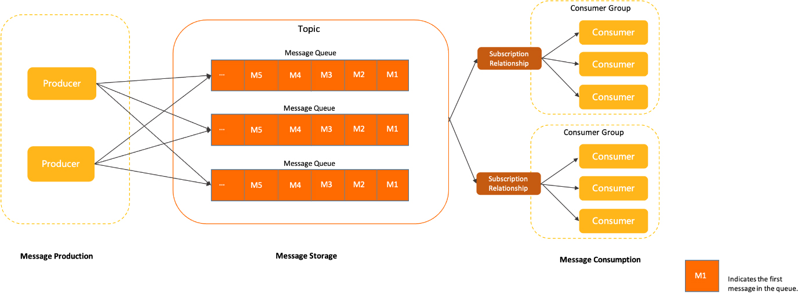
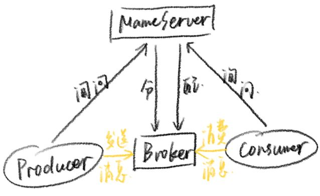

# RocketMQ

## 1. 简介
### 1.1. 消息队列MQ（Message Queue）
- MQ：面向消息的中间件
    - 组成：队列存储消息，生产者Producer生产消息，消费者Consumer消费消息
    - 特性：异步、削峰限流、解耦合
    - 类型：（吞吐量：单位时间内接收和处理消息的速度）
        | MQ类型 | 性能 | 功能 | 吞吐量 |
        | :--: | :--: | :--: | :--: |
        | **ActiveMQ** | 一般 | 单一 | 低 |
        | **RabbitMQ** | 好 | 丰富 | 一般 |
        | **RocketMQ** | 好 | 最丰富 | 高 |
        | **kafka**| 高（一般用于大数据领域） | 单一 | 最大 |
- 中间件：
    - 缓存中间件：redis、memcache
    - 数据库中间件：mycat、canal
    - 消息中间件：mq

### 1.2. RocketMQ结构
1. 组成结构：
    - Producer：消息的发送者、生产者 &rarr; ProducerGroup：生产者组
    - Consumer：消息的接收者、消费者 &rarr; ConsumerGroup：消费者组（多个消费者组可同时消费同一个topic的消息）
    - NameServer：注册路由中心，管理Broker
    - Broker：暂存和传输消息的通道，含多个Topic
    - Topic：（虚拟结构）主题，分类消息，含多个Queue
    - Queue：（真实结构）队列，存放消息，含多个Message
2. 流程：
    

### 1.3. 安装步骤与命令（Linux）
1. 解压文件
2. 配置系统环境变量：在 `/etc/profile` 文件末尾添加 `export NAMESRV_ADDR=ip:9876`（默认端口）
3. 配置RocketMQ相关参数：`runserver.sh`、`runbroker.sh`、`broker.conf`（配置nameserver和broker的ip地址）
4. 运行并输出日志：
    ```bash showLineNumbers
    nohup sh mqnamesrv > log-path &
    nohup sh mqbroker -c ../conf/broker.conf > log-path &
    # 启动可视化界面，地址为服务器IP:9875
    nohup java -jar rocketmq-dashboard-1.0.0.jar --server.port=9875 --rocketmq.config.namesrvAddr=127.0.0.1:9876 > log-path &
    ```

---

## 2. 应用
### 2.1. 快速入门
1. 见 `priv.zj.rocketmq.test.ProducerMain` 和 `priv.zj.rocketmq.test.ConsumerMain`
2. 同一消费者组内的消费者的订阅关系必须保持一致
3. 消息分发规则：`brokerOffset` &gt; `consumerOffset` 时开始分发，直至两者相等
    1. 消费者组间：每组分发一份消息
    2. 消费者组内：支持 **广播模式** 和 **负载均衡模式**（队列数量 &gt; 组内消费者数量）
4. 消费者的消费模式：
    1. 推 `push`：服务端主动推送消息给客户端，适用于 **上游消息生产量小或均速** 的情况
        - 优点：及时性好
        - 缺点：若客户端未做流控，一旦服务端推送大量的消息到客户端时，会导致客户端消息堆积甚至崩溃
    2. 拉 `pull`：客户端主动到服务端拉取消息，适用于 **消息生产量极大** 的情况
        - 优点：客户端可依据自身消费能力进行消费
        - 缺点：若客户端拉取频繁，容易导致服务端和客户端的压力；若客户端拉取间隔长，容易造成消费不及时
5. 生产者的消息发送方式：
    1. 同步：适用于发送重要消息
        ```mermaid
        graph LR
        生产者 --同步消息--> mq主机 --> mq从机
        mq从机 --> mq主机 --返回确认--> 生产者
        ```
        - mq服务器接收到消息后会即可返回确认
        - 在mq集群中，要等到所有从机都复制了消息才会返回确认 &rarr; 性能不高
    2. 异步：适用于生产者端无法长时间等待broker响应的情况
    3. 单向：适用于不关心发送结果的情况
        - 吞吐量很大，但存在消息丢失的风险
    4. 延迟：消息发送至mq后，间隔固定时间才会被监听消费
        - 延迟时间间隔：`1s 5s 10s 30s 1m 2m 3m 4m 5m 6m 7m 8m 9m 10m 20m 30m 1h 2h`
    5. 批量：一次性发送一组消息 &rarr; 该组消息会被当作一个消息被消费
    6. 顺序：按照消息的发送顺序来消费（FIFO），控制发送的顺序消息依次发送到同一个队列中，消费时也只能从这个队列中依次拉取，即保证了消息的顺序
        - 分区有序：多个队列参与发送和消费
        - 全局有序：单个队列参与发送和消费
    7. 事务（不提倡）：可确保本地执行事务和发送消息作为原子单位执行
6. 消息过滤：通过 `tag` 或 `key` 进行区分
    1. `tag`：消息分类是通过 `tag` 还是 `topic` 区分？
        - 消息类型是否一致
        - 业务是否相关联
        - 消息优先级是否一致
        - 消息量级是否相当
    2. `key`：用作唯一标识或业务标识 &rarr; 去重
7. 消息重复消费问题：
    1. 消息为什么会重复：
        1. 生产者重复发送：第一次发送时，broker未返回确认信息，导致二次发送 &rarr; 生产者和broker之间为可靠的tcp连接，该情况小概率发生
        2. 消费者重复消费：扩容前只有一个消费者 `A`，消费某消息后尚未返回确认信息，导致该消息仍在队列中；扩容后有两个消费者 `A` 和 `B`，由于负载均衡模式会重新分配队列，`B` 恰好分配到含有该消息的队列，此时 `B` 也会消费该消息
    2. 解决方案：生产者给消息携带唯一标记 `key`，消费者控制消费消息的幂等性（将 `key` 持久化，并带唯一索引）
8. **幂等性**：多次操作产生的影响均和第一次操作产生的影响相同
9. 重试机制：
    1. 生产者重试：消息发送失败后开始重试，默认重试次数
    为3次，重试时间间隔即为请求超时时间
    2. 消费者重试：返回 `RECONSUME_LATER` 后，开始重试，默认重试次数为16次，重试时间间隔为 `10s 30s 1m 2m 3m 4m 5m 6m 7m 8m 9m 10m 20m 30m 1h 2h`
10. 死信消息：消费重试的次数超过最大次数后，消息进入 **死信队列Dead-Letter Queue**，成为死信消息Dead-Letter Message；产生死信消息的消费者组对应的死信Topic为 `%DLQ%ConsumerGroupName`

### 2.2. 集成SpringBoot
1. 消费模式：
    1. 负载均衡模式：多个消费者 **交替消费** 同一个 `topic` 里的消息
        - 队列会被消费者均摊 &rarr; 队列数量 &ge; 消费者数量
        - mq服务器会记录、处理消费位点
    2. 广播模式：每个消费者 **都消费一次** `topic` 里的消息
        - mq服务器不会记录、处理消费位点，也不会重新消费
2. 消息堆积问题：单条队列的消息差值 `diffTotal` &ge; 10万的情况
    1. 生产者发送消息速度太快 &larr; 业务限流
        1. 增加消费者数量，或设置最大的消费线程数量 `consumeThreadMax`（IO密集型设置为 `2n`；CPU密集型设置为 `n + 1`）
        2. 动态扩容队列数量
    2. 消费者消费消息出现问题
3. 消息丢失问题：
    1. 生产者同步发送消息，并记录相关数据在数据库；消费者消费后，修改数据库中的状态；附加定时任务去查询未被消费的数据并重新发送
    2. 将mq的刷盘机制设置为 **同步刷盘**
    3. 使用集群模式，将消息持久化在不同硬盘上
    4. 开启mq的消息追踪机制：
        1. `broker.conf` 文件中开启消息追踪：`traceTopicEnable=true`
        2. 生产者集成的springboot项目配置文件中开启消息轨迹：`enable-msg-trace: true`
        3. 消费者开启消息轨迹：`@RocketMQMessageListener(enableMsgTrace = true)`
4. 安全控制：
    1. `broker.conf` 文件中开启acl的控制：`aclEnable=true`
    2. `plain_acl.yml` 文件中配置账号密码：`accessKey` 和 `secretKey`
    3. 修改控制面板的配置文件：`rocketmq.config.accessKey/secretKey`

### 2.3. 秒杀（见代码 `priv.zj.rocketmq.seckill` 包）
1. 秒杀/大促/抢购等类似问题，本质上是短时间内处理大量请求，即 **高并发** 问题
    - 并发：多个任务在同一个时间段内执行
    - 并行：多个任务在多核CPU上于同一时刻执行
2. 系统性能指标：
    1. QPS（Queries Per Second）：每秒处理请求的数量
    2. TPS（Transactions Per Second）：每秒处理事务的数量
3. 实现目标：尽可能减少接口的处理时间
    1. 异步处理
    2. 减少IO（统一读写）
    3. 尽早return
    4. 加锁粒度尽可能小
    5. 事务控制粒度尽可能小