# Docker

## 1 概述
1. **<font color="red">Docker</font>**：开源的应用容器引擎，可将应用及其运行环境打包到轻量级、可移植的镜像中，发布到任何流行的Linux、Windows机器上
2. Docker的用途：
    1. 提供统一的运行环境：确保在任何宿主机上都输出相同的结果
    2. 便捷的应用迁移：无需担心运行环境的变化导致应用无法正常运行
    3. 超快的启动时间：由于直接运行在宿主机系统中，无需启动操作系统
    4. 更轻松的维护和扩展：存在高质量的官方镜像，既可以直接使用，又可以作为基础镜像进一步定制
3. 容器与虚拟机的区别：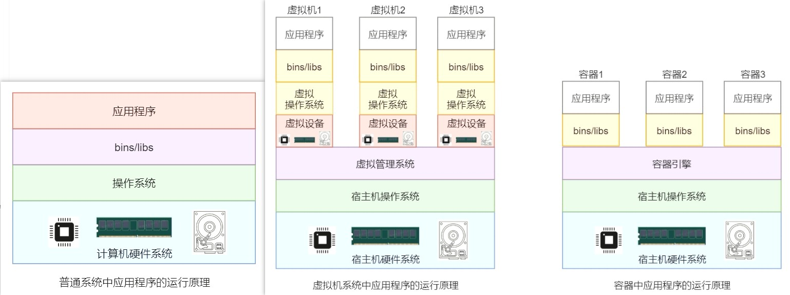
    1. 宿主机系统：应用程序是一个对计算机硬件资源调度使用的指令序列
    2. 虚拟机系统：若两个相同的应用运行在两台虚拟机上时，需要两套相同的资源 &rarr; 造成资源浪费
    3. 容器：共享宿主机的操作系统和硬件，且对系统资源的使用统一由Docker引擎进行管理
4. Windows系统：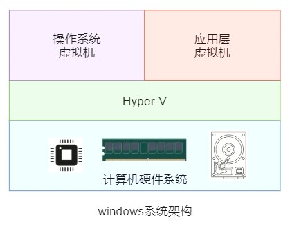
    1. `Hypervisor` /虚拟机监视器VMM（Virtual Machine Monitor）：一种运行在基础物理服务器和操作系统之间的中间软件层，允许多个操作系统和应用共享硬件
        1. `Hyper-V`：Windows系统的 `Hypervisor`
        2. `KVM` 和 `Xen`：Linux系统的 `Hypervisor`
    2. 启动过程：
        ```mermaid
        graph TB
        开启物理机的同时启动Hyper-V服务 --> Hyper-V获取到主机中的全部物理资源的控制权 --> 操作系统虚拟机开始启动 --> 应用层虚拟机开始启动 --> Hyper-V根据虚拟机的配置对物理资源虚拟化 --> Hyper-V将对应的虚拟化资源打包分配给虚拟机 --> 操作系统虚拟机与应用层虚拟机启动完毕 --> Windows系统启动完毕
        ```
    3. VMware使用15.5.5及以上的版本，Windows使用10及以上的版本，否则会出现VMware和Hyper-V不兼容的问题（VMware作为应用，无法直接访问CPU硬件虚拟化功能）
5. Docker的系统架构：
    1. 守护进程 `Daemon`：监听Docker的API请求并管理Docker对象（镜像、容器、网络、数据卷等）
    2. 镜像 `Image`：用于创建Docker容器的 **模板**
    3. 容器 `Container`：包含一个或多个应用程序，且与其它容器之间相互隔离
    4. 仓库 `Repository`：保存一组具有相同名称的镜像，且该名称与仓库名称相同
    5. 标签 `Tag`：镜像的一种标识，通过 `<repository>:<tag>` 来定位
    6. 镜像中心 `Registry`：存放着由官方、机构或个人创建的Docker仓库

---

## 2 Docker引擎
### 2.1 版本发展历程
1. 发展历程：
    1. 首发版本：
        1. 由LXC（Linux Container）和Docker Daemon组成
        2. 存在的问题：
            1. 依赖于LXC
            2. 版本更新难，可扩展性查
            3. 运行慢，存在性能问题
            4. Docker Daemon运行出现问题，直接影响容器的运行
    2. 0.9版本：用自研的Libcontainer工具替换LXC
    3. 1.1版本：遵循OCI规范，将容器运行时代码独立出来
2. 版本：
    1. 大版本：
        1. Moby
        2. 社区版Docker-CE（Community Edition）
        3. 企业版Docker-EE（Enterprise Edition）
    2. 小版本：
        1. Edge月版：一个月发布一次，维护期为一个月
        2. Stable季版：一个季度发布一次，维护期为四个月

### 2.2 概述
1. **<font color="red">Docker引擎</font>**：用来运行和管理容器的核心软件
2. 架构：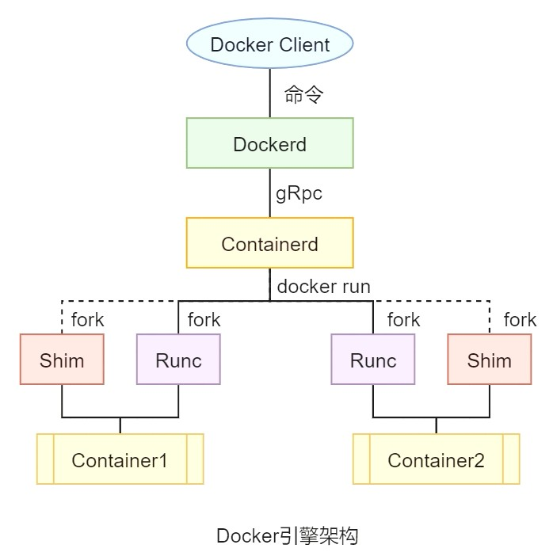
    1. 客户端 `Client`：用户向Docker提交命令请求
    2. Docker守护进程 `Dockerd`：镜像构建、镜像管理、REST API、核心网络、编排等，通过gRPC与 `Containerd` 通信
    3. Contain守护进程 `Containerd`：管理容器的生命周期，fork出 `Runc` 进程（创建容器）和 `Shim` 进程（容器的父进程）
    4. `Runc`（Run Container）/OCI（开放容器倡议基金会）层：fork并启动容器子进程，容器子进程启动完毕后 `Runc` 进程自动退出
    5. `Shim`：作为容器进程的新父进程，实现Daemonless Container（无Docker Daemon和Container Daemon容器），使得Runc和Dockerd解耦
        1. 保持所有STDIN和STDOUT流的开启状态（当Docker Daemon重启时，容器不会因为Pipe的关闭而终止）
        2. 将容器的退出状态反馈给Docker Daemon

### 2.3 安装
1. 官方文档：[Install Docker Engine on CentOS - Installation methods](https://docs.docker.com/engine/install/centos/#installation-methods)
    - Docker仓库的国内镜像源：`https://mirrors.aliyun.com/docker-ce/linux/centos/docker-ce.repo`
2. 常用命令：
    1. `docker version`：查看Docker版本 &rarr; 验证是否安装成功
    2. `systemctl start docker`：启动Docker
    3. `docker run <image-name>`：运行镜像
        1. 查找本地镜像（若本地不存在，则从仓库拉取）
        2. 运行镜像
    4. `systemctl restart docker`：重启Docker
    5. `systemctl stop docker`：停止Docker
    6. `systemctl status docker`：查看Docker状态
    7. `systemctl enable docker`：开机自启动Docker
3. 配置国内镜像中心：
    ```bash showLineNumbers
    # 创建Docker文件夹
    sudo mkdir -p /etc/docker

    # 在daemon.json中加上阿里云镜像中心的地址
    sudo tee /etc/docker/daemon.json <<-'EOF'
    {
    "registry-mirrors": ["https://fj48qfx2.mirror.aliyuncs.com"]
    }
    EOF

    # 重新加载服务文件
    sudo systemctl daemon-reload

    # 重启Docker
    sudo systemctl restart docker
    ```

### 2.4 卸载
1. 官方文档：[Install Docker Engine on CentOS - Uninstall Docker Engine](https://docs.docker.com/engine/install/centos/#uninstall-docker-engine)
2. 手动删除自定义的配置文件

---

## 3 Docker镜像
### 3.1 概述
1. **<font color="red">镜像</font>**：轻量级、可执行的独立软件包，包含运行软件需要的所有内容（代码、库、环境变量、配置文件等）
2. 镜像仓库的分类：
    1. `Docker Official Image`：Docker官方镜像仓库
    2. `Verified Publisher`：已验证发布者的镜像仓库
    3. `Sponsored OSS`：由Docker公司赞助开发的镜像仓库
    4. 无认证标识
3. 镜像定位标识：`<repository>:<tag>`
    1. `<repository>`：
        1. `<software-name>`：官方的镜像名称
        2. `<username>/<software-name>`：：已验证发布者的镜像名称
        3. `<domain-name>/<username>/<software-name>`：第三方镜像中心（IP或域名）的镜像名称
    2. `<tag>`：默认为最新版本 `latest`

### 3.2 命令
1. `docker pull`：将指定镜像从Dockerhub拉取到本地
    - `-q`：简化拉取过程中的日志输出
    - `docker pull <repository>@<digest>`：通过镜像的 `digest`（镜像内容的Hash值）拉取到本地
2. `docker images`：查看本地所有镜像资源信息
    - `--no-trunc`：显示完整的镜像ID
    - `--digests`：显示digest信息
    - `-q`：仅显示镜像ID
    - `-f`：过滤不符合指定条件的镜像
3. `docker search`：从Dockerhub上查看镜像
    - `AUTOMATED`：**自动化镜像**，让Dockerhub连接一个包含 `Dockerfile` 文件的源码托管平台，会自动构建镜像
        1. `Dockerfile` 文件：专门构建镜像的文件
        2. 受信构建（Trusted Build）：根据 `Dockerfile` 文件内容自动构建镜像
    - `--filter`：过滤查询结果
    - `--limit`：指定显示的结果数量
4. `docker rmi`（remove images）：删除本地镜像
    - 空格分隔：一次删除多个镜像
    - `-f`：强制删除镜像（默认情况下，运行了容器的镜像不能被删除）
    - `$(docker images -q)`：引用命令获取镜像ID，通过镜像ID删除镜像
5. `docker save`：将一个或多个镜像导出为 `.tar` 文件
6. `docker load`：将 `.tar` 文件导入并加载为一个或多个镜像
7. `docker inspect`：查看镜像的相关属性

### 3.3 镜像分层
1. 分层：镜像中松耦合的只读镜像层，由Docker Daemon堆叠而成
    1. 分层 **只读**，对分层的修改以新分层的形式出现
    2. 在不同镜像间实现 **资源共享**，即不同镜像对相同下层镜像的复用

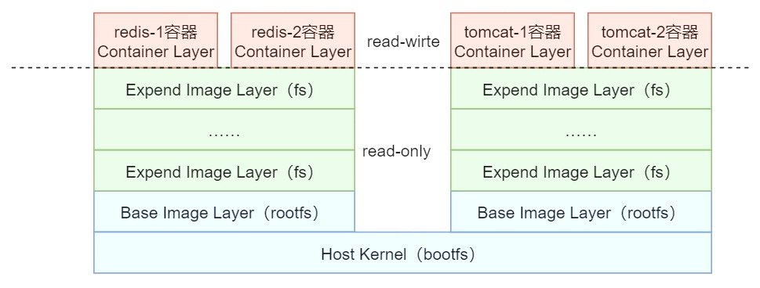

2. **镜像层**：
    1. 镜像文件系统FS：对镜像占有的磁盘空间进行管理的文件系统，包含数据内容
        1. 基础镜像层：其文件系统为根文件系统 `rootfs`（建立在引导文件系统 `bootfs` 之上）
        2. 扩展镜像层：对基础镜像层的扩展；在 `Dockerfile` 文件中的每一条指令都会生成一个扩展镜像层
    2. 镜像json文件：描述镜像的相关属性的集合
3. **容器层**/联合文件系统Union File System：可读写，对文件的任何修改都 **只存在于容器层**

### 3.4 镜像摘要
1. 摘要Digest：即内容散列Content Hash，只要内容发生了变更，摘要值一定会变更
2. 算法：SHA256，长度为256位的二进制字符串 = 长度为64位的16进制字符串
3. 主要作用：区分相同 `<repository>:<tag>` 的不同镜像（版本相同，但内容不同）
4. 分发散列值Distribution Hash：
    - 发送方：由于push或pull镜像时，网络会对镜像进行压缩，压缩后Docker立即计算分发散列值
    - 接收方：接收后立即计算分发散列值

### 3.5 多架构镜像
1. 多架构镜像Multi-architecture Image：相同 `<repository>:<tag>` 的镜像适用于不同操作系统/系统架构
2. 原理：通过 `docker pull` 命令拉取到的是与当前操作系统/系统架构相匹配的镜像
    - 镜像的多架构信息保存在 `Manifest` 文件中
    - 完整坐标定位 `<os/arch>:<repository>:<tag>`

---

## 4 Docker容器
### 4.1 概述
1. 启动流程：
    ```mermaid
    graph TB
    start[docker run] --> 在本地查找指定镜像 --> local_if{是否找到该镜像？}
    local_if --找到--> create[创建并启动镜像的容器]
    local_if --没找到--> remote[到Docker Hub查找该镜像] --> remote_if{是否找到该镜像？}
    remote_if --找到--> 下载该镜像到本地 --> create
    remote_if --没找到--> error[报错：找不到指定镜像]
    ```
2. 容器运行，本质是为了启动并运行容器中的应用 &rarr; 应用运行完毕后，容器会自动终止
    - 使应用处于与用户交互的状态或等待状态 &rarr; 避免容器终止

### 4.2 命令
1. `docker run`：创建并启动容器
    - `--name`：指定当前容器名称
    - `-it`：以 **交互模式（Interactive mode）** 来运行容器，并根据 `/bin/bash` 命令启动bash终端
        - bash终端的命令行前缀：`root@<docker-id>:</path>#`
    - `-p <宿主机端口>:<容器端口>`：指定端口映射
    - `-d`：以 **分离模式（Detached mode）** 来运行容器，即命令在后台运行
2. `docker create`：创建容器
    - 用法与 `docker run` 类似，但没有 `-d` 选项
3. 退出容器：
    1. 容器命令行中执行 `exit` 命令：退出并停止容器
    2. `ctrl + p + q`：退出但不停止容器
4. `docker ps`：查看所有正在运行的容器
    - `-a`：查看所有容器，无论容器是否处于运行状态
    - `-q`：查看所有正在运行的容器ID
    - `-l`：查看最后创建的容器，无论容器是否处于运行状态
    - `-n <number>`：查看最后创建的指定个数的容器，无论容器是否处于运行状态
5. `docker exec`：对正在运行的容器进行操作
    - `-it`：以交互模式（Interactive mode）来运行容器
        - `/bin/bash`：进入容器内部进行操作，`exit` 命令可退出（`exec` 命令新建进程 &rarr; 不影响容器运行）
        - `<command>`：要执行的命令，可在外部直接执行
6. `docker attach`：对正在运行的容器进行操作
    - 交互模式：`exit` 命令退出容器（`attach` 命令不会新建进程 &rarr; 影响容器运行，使容器停止运行）
    - 分离模式：`ctrl + c` 退出并停止容器
7. `docker top`：查看正在运行的容器内正在运行的进程详情
8. `docker logs`：查看容器中应用的运行日志，无论容器是否处于运行状态
    - `<contain-name>`：查看指定容器中应用的运行日志
    - `-n <number>` / `--tail=<number>`：显示指定行数的尾部日志
    - `--since=`：从指定时间开始显示日志
        - `"<yyyy-MM-dd>"`：**绝对** 时间（指定日期）
        - `<number>h/m/s`：**相对** 时间（指定小时/分钟/秒钟）
    - `--until=`：显示到指定时间之前的日志
        - `"<yyyy-MM-dd>"`：**绝对** 时间（指定日期）
        - `<number>h/m/s`：**相对** 时间（指定小时/分钟/秒钟）
    - `-t`：查看日志的时间戳
    - `-f`：查看运行容器中的动态日志
9. `docker start`：启动容器
10. `docker restart`：重启处于运行状态的容器
11. `docker stop`：停止容器，若有其它进程正在访问，则在访问结束后再停止
12. `docker kill`：强制停止容器
13. `docker pause`：暂停容器对外提供的服务
14. `docker unpause`：解除容器的暂停服务状态
15. `docker rm`：删除容器，默认情况下删除停止状态的容器
    - `-f`：强制删除容器，无论容器是否处于停止状态
16. `docker cp`：完成宿主机与容器之间的文件或目录的相互复制，无论容器是否处于运行状态
    - `<source> <destination>`
        - `<宿主机的文件或目录路径>`
        - `<contain-name>:<容器的文件或目录路径>`
    - 不支持容器间的相互复制
17. `docker commit`：为容器的当前快照生成一个新镜像
    - `-a`：提交者
    - `-m`：提交信息

    |  | `docker export` + `docker import` | `docker commit` |
    | :--: | :--: | :--: |
    | 相同点 | 将一个容器变成一个镜像 | 将一个容器变成一个镜像 |
    | 不同点 | 新镜像仅包含原容器生成的一层分层 | 新镜像包含原镜像中的所有分层 |
18. `docker export`：将容器导出为 `.tar` 文件
    | 对比字段 | `docker export` | `docker save` |
    | :--: | :--: | :--: |
    | 作用对象 | 容器 | 镜像 |
    | 导出数量 | 一次只能对一个容器导出 | 一次可以对多个镜像导出 |
    | 原镜像的信息 | 会丢弃原镜像的部分记录（历史记录和元数据信息） | 保存了原镜像的完整记录 |
19. `docker import`：将 `.tar` 文件导入并构建一个新的镜像
    | 对比字段 | `docker import` | `docker load` |
    | :--: | :--: | :--: |
    | 作用对象 | 容器 | 镜像 |
    | 恢复的镜像 | 只包含当前镜像层 | 与原镜像的分层保持相同 |
    | 恢复的镜像 | 新构建的镜像，与原镜像的imageID不同 | 与原镜像的imageID保持相同 |
    | 定位 | 可以指定 `<repository>:<tag>` | 与原镜像的 `<repository>:<tag>` 保持相同 |
20. `docker system` 命令集：
    1. `docker system df`：查看docker各部分的占用情况
        - `-v`：获取更详细的占用情况
    2. `docker system events`：查看指定日期范围之间发生的所有事件
        - `--since`
        - `--until`
    3. `docker system info`：查看当前docker的详情
        - docker client的详情
        - docker server的详情：镜像情况、容器情况、docker所在系统的软硬件情况
    4. `docker system prune`：删除docker中的无用数据
        - 已经停止的容器
        - 没有连接任何容器的网络、悬虚镜像（dangling image）
        - 悬虚镜像的构建缓存（dangling build cache）

---

## 5 Dockerfile
### 5.1 概述
1. `Dockerfile`：由一系列指令构成的、用来构建Docker镜像的脚本文件
    - 由上到下依次执行指令
    - 每条指令都会构建出一个镜像
2. 指令：
    - 大小写不敏感（惯例是全大写）
    - 指令后面至少会携带一个参数
    - 注释符号：`#`

### 5.2 指令
1. `FROM <image>[:<tag>]`：指定基础镜像，且 **必须是第一条** 指令
2. `MAINTAINER <name>`：（已过时，用 `LABEL` 指令代替）填写维护者姓名和邮箱
3. `LABEL <key>=<value> <key>=<value> …`：以键值对的方式包含镜像的元数据信息，修改镜像的json文件
4. `ENV`：指定环境变量
    - `ENV <key> <value>`
    - `ENV <key>=<value> <key>=<value> …`
5. `WORKDIR <path>`：容器的默认目录，即后续指令的工作目录
    1. 设置多个 `WORKDIR` 指令时，若有用到相对路径，则会基于之前已经指定过的路径
6. `RUN`：`docker build` 命令执行过程中
    - `RUN ["executable", "param1", "param2", …]`：用指定的应用程序 `executable` 运行，并使用 `param1`、`param2` 等作为运行参数
    - `RUN <command>`：执行shell命令
7. `CMD`：容器启动后，即 **执行完 `docker run` 命令后**
    - `CMD ["executable", "param1", "param2", …]`：用指定的应用程序 `executable` 运行，并使用 `param1`、`param2` 等作为运行参数
        - 命令 **会被** `docker run` 命令后的 `<command>` **代替**
    - `CMD <command> <param1> <param2> …`：执行shell命令
        - 命令 **会被** `docker run` 命令后的 `<command>` **代替**
    - `CMD ["param1", "param2", …]`：提供给 `ENTRYPOINT` 指令的参数
        - 搭配 `ENTRYPOINT` 指令使用
8. `ENTRYPOINT`：容器启动过程中，即 `docker run` **命令执行过程中**
    - `ENTRYPOINT ["executable", "param1", "param2", …]`：用指定的应用程序 `executable` 运行，并使用 `param1`、`param2` 等作为运行参数
        - 命令 **不会被** `docker run` 命令后的 `<command>` **代替** &rarr; `docker run` 命令后的内容作为参数 `<ARG>` 使用
    - `ENTRYPOINT <command> <param1> <param2> …`：执行shell命令
        - **不支持** 将 `docker run` 命令后的内容作为参数 `<ARG>` 使用
9. `EXPOSE <port> [<port> …]`：指定容器准备对外暴露的端口号
    - 实际暴露的端口仍由 `-p` 指定
10. `ARG <varname>[=<default value>]`：定义单个用于镜像构建运行时的变量
    - 若要定义多个，则需要声明多个 `ARG` 指令
11. `ADD`：复制宿主机中的指定文件 `src` 到容器中的指定目录 `dest` 中
    1. 语法：
        - `ADD <src> <dest>`
        - `ADD ["<src>", "<dest>"]`
    2. `<src>`：支持宿主机中的绝对路径、相对于 `docker build` 命令指定的路径下的相对路径、压缩文件（复制到容器后自动解压）、URL（相当于 `wget` 命令）
    3. `<dest>`：仅支持绝对路径，路径末尾必须加上斜杠（否则会被当成一个文件）
12. `COPY`：功能和 `ADD` 指令相同
    1. `<src>` 不支持URL
    2. 若 `<src>` 是压缩文件，则复制到容器后不会自动解压
13. `ONBUILD [INSTRUCTION]`：指定当前镜像的子镜像进行构建时要执行的指令
14. `VOLUME ["dir1", "dir2", …]`：在容器里创建可以挂载数据卷的 **挂载点**

### 5.3 实际应用
1. scratch镜像：空镜像，所有镜像的 **Base Image**
    1. Docker的保留字，不能作为镜像名称
    2. 只能在Dockerfile中被继承
2. 悬虚镜像：既没有 `<repository>` 又没有 `<tag>` 的镜像
    - `docker rmi <imageId>`：删除指定镜像ID的镜像
    - `docker image prune`：删除本地所有的悬虚镜像
    - `docker system prune`：删除docker中的无用数据

### 5.4 build cache
1. 镜像构建过程：下层镜像作为上层镜像的 **父镜像/输入** &rarr; **镜像文件系统或json文件发生变更，就会生成一个新的镜像层**
    1. `FROM centos:7`：只设定一个基础镜像，不会做任何操作
    2. `LABEL auth="bjpowernode"`：修改镜像json文件 &rarr; 生成一个新的镜像层
    3. `COPY helloworld.log /var/log`：修改镜像文件系统 &rarr; 生成一个新的镜像层
    4. `RUN yum -y install vim`：安装新工具 &rarr; 修改镜像文件系统 &rarr; 生成一个新的镜像层
    5. `CMD /bin/bash`：启动后需要执行命令 &rarr; 修改镜像json文件 &rarr; 生成一个新的镜像层
2. build cache机制：发现即将新构建出的镜像（层）与本地已存在的某镜像（层）重复时，默认 **复用**
3. build cache失效：从 **发生变化的指令层** 开始的镜像层的cache全部失效
    1. Dockerfile文件中的指令发生变化
    2. `ADD` 或 `COPY` 指令操作的文件内容发生变化
    3. `RUN` 指令的外部依赖发生变化
    4. build时指定 `--no-cache`：当前构建时均不使用cache
4. 清理dangling build cache：`docker system prune`

---

## 6 数据持久化
### 6.1 定制镜像持久化
1. 对镜像进行操作后，执行 `docker commit` 命令，以当前运行的容器为 **范本** 生成镜像

### 6.2 数据卷持久化
1. docker提供的实时数据同步方式：
    1. 数据卷
    2. Bind mounts（绑定挂载）
    3. tmpfs（临时文件系统）
2. **<font color="red">数据卷</font>**：宿主机中的特殊文件/目录
    1. 容器/挂载点的删除，不会级联删除数据卷
    2. 若数据卷/挂载点中本来就有内容，容器启动后会自动同步到另一端
    3. 可直接修改数据卷/挂载点中的内容
    4. 数据卷可以在容器之间共享和重用
3. **<font color="red">挂载点</font>**：容器中与数据卷相关联的文件/目录
4. 命令：指定目录不存在时，会自动创建
    1. `docker run -it -v /<宿主机绝对路径目录>:/<容器内绝对路径目录> image`：创建读写 `rw` 数据卷
        - 容器 **读写** 挂载点
        - 宿主机 **读写** 数据卷
    2. `docker run -it -v /<宿主机绝对路径目录>:/<容器内绝对路径目录>:ro image`：创建只读 `ro` 数据卷
        - 容器 **只读** 挂载点
        - 宿主机 **读写** 数据卷
5. 数据卷共享：需要一个容器作为 **数据卷容器**，其它需要共享数据卷的容器在启动时指定 `--volumes-from [数据卷容器]` 即可

### 6.3 Dockerfile持久化
1. 通过Dockerfile中的 `VOLUME` 指令来指定挂载点
    - 宿主机中的数据卷由Docker Daemon自动分配名称与目录（docker目录下的 `/volumes/<name>/_data`）
    - 仍支持在容器启动时指定数据卷

---

## 7 Docker网络
### 7.1 概述
1. **<font color="red">Network Namespace</font>**：Linux提供的用于实现网络虚拟化的功能，创建多个隔离的网络空间（独立的防火墙、网卡、路由表、邻居表、协议栈）
    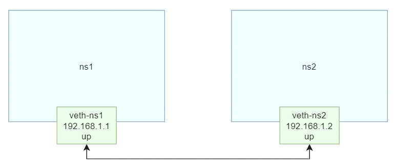
    1. `ip nets add <namespace>`：创建网络空间（默认有一个回环网络适配器lo）
    2. `ip link add <vethname1> type veth peer name <vethname2>`：**虚拟设备接口技术veth pair**，创建一对相互连通的网络接口（具备MAC地址、DOWN状态、不具备IP）
    3. `ip link set <vethname1> netns <namespace1>`：将网络接口分配给网络空间
    4. `ip netns exec <namespace1> ip addr add <ip> dev <vethname1>`：给网络接口分配IP
    5. `ip netns exec <namespace1> ip link set dev <vethname1> up`：启动网络接口
2. Docker网络架构：
    1. **<font color="red">容器网络模型CNM（Container Network Model）</font>**：一种网络连接的设计规范
        1. **沙盒Sandbox**：独立的网络栈，包含以太网接口、端口号、路由表、DNS配置等，如Linux Network Namespace
        2. **终端Endpoint**：虚拟网络接口，用于将沙盒连接到网络上；一个终端只能接入一个网络
        3. **网络Network**：需要交互的终端集合
    2. **<font color="red">Libnetwork</font>**：CNM的开源实现，并额外实现了本地服务发现、容器负载均衡、网络控制层与管理层等功能
    3. **<font color="red">网络驱动Driver</font>**：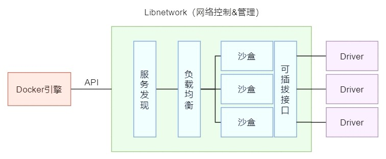
        - `docker network ls`：查看当前主机所连接的网络及网络类型

### 7.2 网络类型
1. `bridge` 桥接网络：docker的默认网络模式，只能用于连接所在docker宿主机上的容器；具有独立的namespace、网络接口、IP
    1. **docker0网桥**：默认的虚拟网桥
        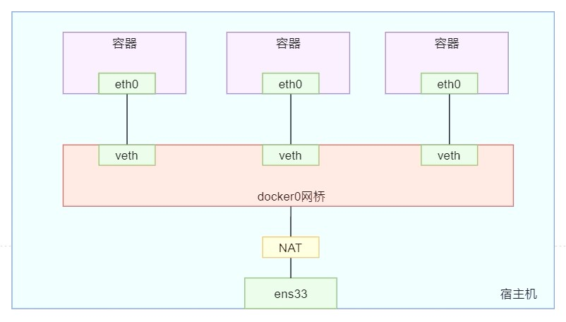
        - 容器和网桥间通过 **veth pair技术** 实现连接
        - 网桥和外网间通过 **网络地址转换NAT技术** 实现连接
    2. 命令：
        1. `docker network inspect bridge`：查看bridge网络的整体连接情况
        2. `ip a`：查看宿主机的网络接口
        3. `docker exec <container> ip a`：查看容器的网络接口
        4. `brctl show`：查看宿主机的所有网桥及其连接情况
            - 需要安装 `bridge-utils`
        5. `docker inspect <container>`：查看容器的详情（网关Gateway的ip地址 = docker0网桥的地址）
        6. `docker network create`：创建指定名称与类型的网络
            - `-d`：指定创建网络时使用的驱动，即网络类型
        7. `docker run … --network <network>`：指定连接的网络，默认连接到默认的bridge网络
        8. `docker network connect <network> <container>`：将容器连接到指定网络上
        9. `docker exec <container1> ping <container2/ip>`：建议使用容器名称 &larr; ip可能会变化，容器名固定不变
            - 在默认的bridge网络上，不支持 `ping <container2>`
        10. `docker run … --link <container>`：创建一个定向连接到指定容器的新容器 &rarr; 新容器只能ping通指定容器
        11. `docker run … --network container:<container>`：指定新容器与已存在的容器共享网络空间（必须是bridge网络模式）
            - 共享网络空间 &rarr; 新容器没有自身的网络设置
2. `none` 没有网络：具有独立的namespace，没有独立的网络接口、IP；只有一个回环地址lo
    1. `docker run … --network none`：指定新容器没有网络功能
3. `host` 宿主机网络：没有独立的namespace、网络接口、IP，与宿主机共享
    1. `docker run … --network host`：指定新容器为host网络
    2. 端口映射 `-p <host-port>:<container-port>` 不起作用

---

## 8 常用服务器安装
### 8.1 MySQL安装
1. 单机安装命令：`docker run --name <mysql-container-name> -e MYSQL_ROOT_PASSWORD=<password> -d mysql:<tag>`
    1. 字符编码问题：`/etc/mysql/conf.d` 目录下新建 `<name>.cnf` 文件
        ```properties showLineNumbers
        [client]
        default_character_set=utf8
        [mysql]
        default_character_set=utf8
        [mysqld]
        character_set_server=utf8
        ```
    2. 数据安全问题：指定数据卷
2. 集群搭建：与普通集群搭建步骤一致

### 8.2 Redis安装
1. 单机安装命令：`docker run --name <redis-container-name> -d redis:<tag> redis-server`
    - 修改 `redis.conf`：
        1. 注释 `bind 127.0.0.1 -::1`：解除IP绑定
        2. `protected-mode no`：关闭保护模式（只允许本机访问）
        3. `darmonize no`：关闭守护模式（docker以分离模式运行，若redis再以此模式运行，将无法启动）
        4. `dir /data`：指定RDB或AOF的持久化目录，并指定该目录为数据卷
2. 主从集群搭建：与普通集群搭建步骤一致，启动从机容器时需指定 `--slaveof <master-ip> <master-port>`
    - 只支持冷处理的容灾方案
3. 高可用集群搭建：在主从集群的基础上，再搭建哨兵sentinel集群
    - 修改 `sentinel.conf`：
        1. `sentinel monitor <master-name> <master-ip> <master-port> <quorum>`：指定要监视的主机以及quorum
            - `<quorum>`：认定主机master故障的最少哨兵人数
        2. `sentinel announce-ip/port <host-ip/port>`：指定当前哨兵对外宣布的IP（即宿主机IP）和端口号（容器对外暴露的端口号）
4. 分布式搭建：请求数据写入时，分布式系统会采用虚拟槽分区算法将数据写入到相应节点中
    - 与集群的区别：集群节点中保存 **相同** 的数据，分布式节点中保存 **不同** 的数据
    - 修改 `redis.conf`：
        1. `cluster-enabled yes`：开启分布式系统功能
        2. `cluster-config-file <file-name>`：指定使用的配置文件
    - 启动后执行 `redis-cli --cluster create --cluster-replicas <slave-num> <ip1> <ip2> …`
        - `redis-cli cluster nodes`：查看系统中各节点的关系以及连接情况

---

## 9 Docker Compose
### 9.1 概述
1. Docker Compose：Docker容器编排工具，通过一个 **声明式的配置文件** 描述整个应用，最终使用一条命令完成部署
2. `compose.yml` / `docker-compose.yml`：6大模块
    1. `version`：（已过时）版本号
    2. `services`：定义和创建应用中时用到的 **服务**
        ```yml showLineNumbers
        services:
            <service-name>:
                container_name: <service-real-name>
                build:
                    context: <dockerfile-path>
                    dockerfile: <dockerfile-name>
                image: <repository>:<tag>
                ports:
                    - <host-port1>:<container-port1>
                    - <container-port2>
                    - …
                command:
                    - "<command>"
                depends_on:
                    - <depend-service-name>
                deploy:
                    mode: replicated
                    replicas: <container-number>
                networks: <network-name>
                volumes:
                    - <host-path1>:<container-path1>
                    - <volume-name>:<container-path2>
                    - …
        ```
        1. `<service-name>`：服务标识/名称
        2. `container_name`：容器的真正名称，缺省生成为 `<compose_dir>-<service-name>`
        3. `build`：指定创建当前服务镜像的Dockerfile路径
            1. `context`：指定绝对/相对路径
            2. `dockerfile`：指定文件名
        4. `image`：指定当前服务所需要使用的镜像（若设置了build属性，则image属性会设定构建出的镜像的名称与tag）
        5. `ports`：映射端口列表（若只设置了容器端口，则暴露到宿主机的端口号会被随机分配）
        6. `command`：启动容器后立即运行的命令（会覆盖dockerfile中的 `CMD` 指令）
        7. `depends_on`：启动所依赖的应用列表
        8. `deploy`：指定当前服务的部署设置
            1. `mode`：部署模式
            2. `replicas`：指定服务启动的容器数量（指定该属性后，不能再设定 `container_name` 属性）
        9. `networks`：指定当前服务所要连接的网络
        10. `volumes`：指定当前服务用到的数据卷，支持路径和数据卷标识两种形式
    3. `networks`：定义和创建应用中时用到的 **网络**
        ```yml showLineNumbers
        networks:
            <network-name>:
                name: <network-real-name>
                driver: bridge
                attachable: false
        ```
        1. `<network-name>`：网络标识/名称
        2. `name`：网络的真正名称，缺省生成为 `<compose_dir>_<network-name>`
        3. `driver`：网络驱动，缺省为 `bridge`
        4. `attachable`：是否允许其它独立容器连接到此网络，缺省为 `false`
    4. `volumes`：定义和创建应用中时用到的 **数据卷**
        ```yml showLineNumbers
        volumes:
            <volume-name>:
                …
        ```
        1. `<volume-name>`：数据卷标识/名称（系统会自动分配在docker容器中的具体位置）
    5. `configs`
    6. `secrets`

### 9.2 命令
:::tip
在命令后加上 `<service-name>`，即可对指定服务进行操作
:::
1. `docker-compose pull`：拉取compose中需要的所有镜像
2. `docker-compose config`：检查 `docker-compose.yml` 文件是否正确
    - `-q`：存在问题时才输出
3. `docker-compose up`：启动compose中的所有服务
    - `-d`：后台启动
4. `docker-compose logs`：查看compose中所有服务的运行日志，不同服务的日志用不同颜色区分
5. `docker-compose ps`：查看compose中的所有服务
6. `docker-compose top`：查看compose中所有当前正在运行中的服务
7. `docker-compose images`：查看compose中所有服务对应的镜像
8. `docker-compose port`：查看指定服务的映射端口
9. `docker-compose run`：在指定服务上执行命令
10. `docker-compose exec`：进入指定服务的容器内
11. `docker-compose pause`：暂停compose中的所有服务的容器
12. `docker-compose unpause`：恢复compose中所有处于暂停状态的服务的容器
13. `docker-compose stop`：停止compose中的所有服务
14. `docker-compose restart`：重启compose中的所有服务
15. `docker-compose start`：启动compose中的所有服务
16. `docker-compose kill`：通过发送 `SIGKILL` 信号来停止指定服务的容器
17. `docker-compose rm`：删除compose中所有处于停止状态的服务的容器
18. `docker-compose down`：停止并删除compose中的所有服务容器、网络、镜像、数据卷

---

## 10 Docker管理监控平台
### 10.1 概述
1. Docker UI：基于Docker API的开源可视化管理工具，支持容器管理、镜像管理、批量操作，不支持多集群管理
    - 部署命令：`docker run -d uifd/ui-for-docker`
2. Portainer：免费的可视化管理工具，基于容器化的安装方式，支持构建、管理和维护Docker环境
    - 部署命令：`docker run -d portainer/portainer-ce`
3. shipyard：建立在docker集群管理工具Citadel之上的可视化管理工具，支持镜像管理、容器管理、主机管理
    - 版本：
        - core：统一管理多个docker host上的containers，支持跨host
        - extension：新增了应用路由、负载均衡、集中化日志、部署等
    - 部署：执行自动部署脚本，按照脚本运行结果中给出的访问地址和账密进行操作
4. CIG监控系统：包含CAdvisor（收集监控数据）、InfluxDB（存储数据）、Grafana（展示数据）三个应用
    1. CAdvisor：用来分析运行中的Docker容器的资源占用以及性能特性的工具，监控容器的内容、CPU、网络、磁盘IO等，并有web页面展示监控数据
    2. InfluxDB：基于GO语言的、开源的高性能、时序型数据库，支持海量时序数据的高性能读写、高效存储、实时分析等
    3. Grafana：基于GO语言的、开源的时序数据监控分析可视化平台

---

## 11 镜像中心
### 11.1 概述
1. 发布镜像到Docker Hub：
    1. Docker Hub端操作：
        1. 注册账号
        2. 手动创建镜像仓库（可跳过）
    2. 服务器端操作：
        1. 登录：`docker login --username=<username> --password=<password>`
        2. 对要发布的镜像进行命名（根据镜像仓库名称自动创建）：`docker tag <image-name> <username>/<respository-name>:<tag>`
        3. 推送镜像至Docker Hub：`docker push <username>/<respository-name>:<tag>`
        4. 登出：`docker logout`
2. 发布镜像到阿里云：
    1. 阿里云端操作：
        1. 注册账号
        2. 手动创建 **命名空间**（对镜像仓库分类）
        3. 手动创建镜像仓库（可跳过）
    2. 服务器端操作：同上
3. 网络传输协议：
    - HTTP协议：默认使用 **80** 端口
        - 明文传输：直接与传输层的TCP进行通信
    - HTTPS协议：默认使用 **443** 端口
4. 通信加密的不同方式及其原理：
    1. **数字签名** 加密：
        - 存在的问题：`1` 和 `3` 过程中信息可能会被窃取或篡改
            ```mermaid
            sequenceDiagram
            autonumber
            A->>B: 发送请求
            B->>B: 按照请求操作
            B-->>A: 返回响应
            A->>A: 按照响应调整
            ```
        - 解决方案：
            ```mermaid
            sequenceDiagram
            autonumber
            alt 建立通信关系
                A->>B: 申请建立通信关系
                B->>B: 生成公私钥
                B-->>A: 发送公钥
                A->>A: 保存公钥
            end
            autonumber 1
            alt 通信
                A->>A: 用公钥加密请求
                A->>B: 发送 加密后的 请求
                B->>B: 用私钥解密请求
                B->>B: 按照请求操作
                B->>B: 用私钥加密响应，形成数字签名
                B-->>A: 返回 携带数字签名的 响应
                A->>+A: 用公钥解密数字签名
                A->>-A: 将结果与响应明文对比，查看响应是否被篡改
            end
            ```
    2. **数字证书** 加密：
        - 存在的问题：
            ```mermaid
            sequenceDiagram
            participant A
            participant 劫持者
            participant B
            A-xB: 发送请求，被劫持
            劫持者->>+劫持者: 生成公私钥、地址
            劫持者->>-B: 将A的公钥和地址换成自己的
            劫持者->>B: 伪装成A，发送自己的请求
            B-->>劫持者: 认为是A，返回响应
            ```
        - 解决方案：
            ```mermaid
            sequenceDiagram
            participant A
            participant B
            participant 证书中心CA
            autonumber
            alt 构建通信基础 = 获取数字证书
                B->>B: 生成公私钥
                B->>证书中心CA: 发送个人信息和公钥
                证书中心CA->>证书中心CA: 用CA私钥对B的个人信息和公钥进行加密，形成数字证书
                证书中心CA-->>B: 发送数字证书和CA公钥
                B->>B: 保存数字证书和CA公钥
            end
            autonumber 1
            alt 建立通信关系
                A->>B: 申请建立通信关系
                B-->>A: 发送数字证书和CA公钥
                A->>A: 用CA公钥解密数字证书
                A->>A: 保存B的个人信息和公钥、CA公钥
            end
            autonumber 1
            alt 握手
                A->>B: 申请建立通信连接
                B-->>A: 发送数字证书
                A->>A: 用本地保存的CA公钥解密数字证书
                A->>A: 将结果与本地保存的信息对比，验证通信对方的身份
            else 通信
                A->>A: 用公钥加密请求
                A->>B: 发送 加密后的 请求
                B->>B: 用私钥解密请求
                B->>B: 按照请求操作
                B->>B: 用私钥加密响应，形成数字签名
                B-->>A: 返回 携带数字签名的 响应
                A->>+A: 用本地保存的CA公钥解密数字证书
                A->>-A: 将结果与本地保存的信息对比，认证通信对方
                A->>+A: 用公钥解密数字签名
                A->>-A: 将结果与响应明文对比，查看响应是否被篡改
            end
            ```
5. `htpasswd` 命令：通过该命令来实现 **Registry私有镜像中心** 的用户认证
    1. 安装 `httpd-tools` 工具包：`yum install -y httpd-tools`
    2. 创建认证文件：`htpasswd -c htpasswd.user`
    3. 添加用户：`htpasswd -Bb <filename> <username> <password>`
    4. 删除用户：`htpasswd -D <filename> <username>`
6. 容器的 **退出状态码**：用来反馈容器中的应用的退出方式，使用 `docker ps -a` 或 `docker inspect` 命令来查看
    - **0**：应用正常退出，如使用 `docker stop` 命令，或关闭docker引擎
    - [1, 128]范围：<mark>容器内部运行错误或应用运行出错</mark>引发的容器无法启动的非正常退出状态
        - **1**：应用程序内部错误；Dockerfile中的无效引用
        - **125**：Dockerfile中定义的 `command` 由于引用了未定义的变量、或者是执行了没有权限的命令而没有运行成功
        - **126**：Dockerfile中定义的 `command` 由于缺少依赖而没有运行成功
        - **127**：Dockerfile中定义的 `command` 由于引用了不存在的文件或目录而没有运行成功
        - **128**：自己开发的容器内触发了退出命令并给出了退出状态码，但状态码不在0-255范围内
    - [129, 255]范围：<mark>容器接收到终止信号</mark>的非正常退出状态
        - **130**：来自操作系统的终止信号，如 `ctrl + c`
        - **137**：来自dockerd的强制终止信号，如 `docker kill`
        - **143**：来自dockerd的优雅终止信号，如 `docker stop`
            - 若当前没有用户访问，则容器立即退出 &rarr; 143
            - 若当前有用户访问，则等待10秒后再kill容器 &rarr; 137
7. 容器的重启策略：在创建容器时指定 `--restart <policy>`
    - `no`：（默认）不重启
    - `on-failure[:n]`：在容器非正常退出时重启
        - `n`：重启次数
    - `always`：只要容器退出就重启
    - `unless-stopped`：除了通过 `docker stop` 或 `docker kill` 命令退出，其他情况只要容器退出就重启

### 11.2 HTTPS
1. 通过SSL/TLS为数据加密：与传输层的SSL/TLS进行通信，再由SSL/TLS与TCP进行通信
    - SSL（Secure Sockets Layer）：安全套接字协议
    - TLS（Transport Layer Security）：传输层安全协议
2. 身份验证：**非对称加密** 验证方式（加密和解密的密钥不同，包含因子分解、离散对数、椭圆曲线三种算法）
    - 一对密钥：一个用于加密，一个用于解密
        - 公钥：可公开的密钥，发放给其他人
        - 私钥：非公开的密钥，只有加密者自己保存
    - 用途：
        - 信息加解密：公钥加密、私钥解密
        - 数字签名与认证：私钥加密、公钥解密
3. 传输加密：**对称加密** 验证方式（加密和解密的密钥相同）
4. 原理图：
    ```mermaid
    sequenceDiagram
    participant 客户端
    participant 服务端
    participant 证书中心CA
    alt 身份验证
        autonumber
        alt 构建通信基础 = 获取数字证书
            服务端->>服务端: 生成公私钥
            服务端->>证书中心CA: 发送服务端信息和公钥
            证书中心CA->>证书中心CA: 用CA私钥对服务端的信息和公钥进行加密，形成数字证书
            证书中心CA-->>服务端: 发送数字证书和CA公钥
            服务端->>服务端: 保存数字证书和CA公钥
        end
    end
    alt 传输加密
        autonumber 1
        alt 建立通信关系
            客户端->>服务端: 申请建立通信关系
            服务端-->>客户端: 发送数字证书和CA公钥
            客户端->>客户端: 用CA公钥解密数字证书
            客户端->>客户端: 保存服务端的信息和公钥、CA公钥
            客户端->>客户端: 生成一个随机数作为密钥，并用服务端的公钥加密密钥
            客户端->>服务端: 发送 加密后的 密钥
            服务端->>服务端: 用私钥解密密钥并保存
        end
        autonumber 1
        alt 握手
            客户端->>服务端: 申请建立通信连接
            服务端-->>客户端: 发送数字证书
            客户端->>客户端: 用本地保存的CA公钥解密数字证书
            客户端->>客户端: 将结果与本地保存的信息对比，验证通信对方的身份
        else 通信
            客户端->>客户端: 用密钥加密请求
            客户端->>服务端: 发送 加密后的 请求
            服务端->>服务端: 用密钥解密请求
            服务端->>服务端: 按照请求操作
            服务端->>服务端: 用密钥加密响应，形成密文
            服务端-->>客户端: 返回 携带密文的 响应
            客户端->>+客户端: 用密钥解密密文
            客户端->>-客户端: 将结果与响应明文对比，查看响应是否被篡改
        end
    end
    ```
5. 重要概念：
    1. 数字证书（SSL/TLS证书）：由证书中心CA（Certificate Authority）颁发的一种身份证明，包含通讯方的公钥、证书有效期、域名以及CA的数字签名
        - 可自己生成，但需要在通讯客户端安装数字证书，并添加信任状态才可通讯
    2. 根证书：用来解密数字证书的CA公钥
    3. 数字摘要：利用Hash函数的单向性，将任意长度的消息变成固定长度的短消息
        - 不同明文的摘要一定不同，相同明文的摘要一定相同
        - 无法通过摘要计算出原始明文
    4. 数字签名：由发送方产生的别人无法伪造的一段数字串，通常使用非对称密钥和数字摘要技术

### 11.3 distribution私有镜像中心
1. 搭建私有镜像中心：
    1. 安装 `docker-distribution`：`yum install -y docker-distribution`
    2. 查看安装的文件：`rpm -ql docker-distribution`
        - `/etc/docker-distribution/registry/config.yml`：核心配置文件
        - `/usr/bin/registry`：`registry` 命令
        - `/usr/lib/systemd/system/docker-distribution.service`：表示 `docker-distribution` 是服务
        - `/usr/share/doc/*`：所有文档
        - `/var/lib/registry`：镜像的保存目录
    3. 启动私有镜像中心：`systemctl start docker-distribution`
2. docker客户端的 **推送** 操作：
    1. 修改 `daemon.json` 文件（&larr; docker客户端采用HTTPS发送请求，而私有镜像中心默认不支持HTTPS协议）：添加 `"insecure-registries": [<ip>:<port>]`
    2. 登录私有镜像中心：`docker login <ip>:<port>`
    3. 对镜像重命名，并推送至私有镜像中心
    4. 查看镜像中心：
        1. 查看仓库列表：`curl -XGET http://<ip>:<port>/v2/_catalog`
        2. 查看指定仓库的tag列表：`curl -XGET http://<ip>:<port>/v2/<repository>/tags/list`
    5. 登出私有镜像中心：`docker logout <ip>:<port>`
3. docker客户端的 **删除** 操作：
    1. 修改配置文件 `config.yml`：添加 `storage.delete.enabled=true`
    2. 获取镜像digest：
        1. 下载镜像到本地，再通过命令获取
        2. 通过HTTP请求访问镜像中心获取：
            ```bash showLineNumbers
            curl --header "Accept:application/vnd.docker.distribution.manifest.v2+json"
            -I -XGET http://<ip>:<port>/v2/<repository>/manifests/<tag>
            ```
        3. 删除镜像：`curl -I -XDELETE http://<ip>:<port>/v2/<repository>/manifests/<image-digest>`
        4. 清理已被删除的镜像剩下的垃圾数据：`registry garbage-collect /etc/docker-distribution/registry/config.yml`

### 11.4 registry私有镜像中心
#### 11.4.1 HTTP
1. 搭建私有镜像中心：
    1. 拉取镜像：`docker pull registry`
    2. 使用 `htpasswd` 命令创建用户名与密码
    3. 启动私有镜像中心：
        ```bash showLineNumbers
        docker run --name <image-name> \
        --restart always \
        -V /var/lib/registry:/var/lib/registry \
        -V /usr/local/auth:/auth \
        -e "REGISTRY_AUTH=htpasswd" \
        -e "REGISTRY_AUTH_HTPASSWD_REALM=Registry Realm" \
        -e "REGISTRY_AUTH_HTPASSWD_PATH=/auth/htpasswd.user" \
        -dp 5000:5000 registry
        ```
2. docker客户端的推送、删除操作：同 [distribution私有镜像中心](#113-distribution私有镜像中心)
    1. 登录时需要输入用户名和密码
    2. 发送HTTP请求：
        1. 浏览器访问：出现登录弹窗，输入用户名和密码即可
        2. curl请求：添加 `-u <username>:<password>`

#### 11.4.2 HTTPS
1. OpenSSL生成证书：
    1. 安装OpenSSL：`yum install -y openssl-devel`
    2. 创建证书目录
    3. 创建证书中心的CA：
        1. 创建CA的 **私钥**：`openssl genrsa -out <key-file> <rsa-bit>`
        2. 创建CA的 **证书**：
            ```bash showLineNumbers
            openssl req -x509 -new -nodes -sha512 -days <day> \
            -subj "/C=CN/ST=Beijing/L=Beijing/O=CA/OU=CAUnit/CN=cacn.com" \
            -key <key-file> \
            -out <crt-file>
            ```
            - `-x509`：生成一个自签名的X.509证书
            - `-new`：生成一个新的证书请求
            - `-nodes`：在生成私钥时不加密
            - `-sha512`：使用 `SHA-512` 加密算法
            - `-days`：指定证书的有效期
            - `-subj`：指定证书的主题，包含国家Country（C）、省份State（ST）、城市Locality（L）、组织Organization（O）、组织单位Organizational Unit（OU）、通用名称Common Name（CN）
    4. 创建申请者证书：
        1. 生成申请者证书的 **私钥**
        2. 生成请求文件（即证书中的申请者信息）：`openssl req -new -sha512 -key <key-file> -out <csr-file>`
        3. 生成 `v3.ext` 文件：
            ```bash showLineNumbers
            cat > v3.ext <<-EOF
            authorityKeyIdentifier=keyid, issuer
            basicConstraints=CA:FALSE
            keyUsage=digitalSignature, nonRepudiation, keyEncipherment, dataEncipherment
            extendedKeyUsage=serverAuth
            subjectAltName=IP: 192.168.192.111
            
            [alt_names]
            DNS.1=xxx.com
            DNS.2=xxx.cn
            EOF
            ```
        4. 生成申请者 **证书**：
            ```bash showLineNumbers
            openssl x509 -req -sha512 -days <day> \
            -extfile v3.ext \
            -CA <ca-crt-file> -CAkey <ca-key-file> -CAcreateserial \
            -in <csr-file> \
            -out <cert-file>
            ```
        5. 重命名申请者证书：`openssl x509 -inform PEM -in <old-cert-file> -out <new-cert-file>`
            - docker将 `.crt` 文件识别成CA证书
            - docker将 `.cert` 文件识别成申请者证书
    5. 配置主机：
        1. 复制申请者证书和私钥：提前创建 `/etc/docker/certs.d/<domain-name>` 目录
        2. 复制CA证书
    6. 重启docker
2. 搭建私有镜像中心：
    1. 拉取镜像：`docker pull registry`
    2. 使用 `htpasswd` 命令创建用户名与密码
    3. 启动私有镜像中心：
        ```bash showLineNumbers
        docker run --name <image-name> \
        --restart always \
        -v /etc/docker/certs.d/xxx.com:/cert \
        -V /var/lib/registry:/var/lib/registry \
        -V /usr/local/auth:/auth \
        -e "REGISTRY_HTTP_TLS_CERTIFICATE=/cert/xxx.com.cert" \
        -e "REGISTRY_HTTP_TLS_KEY=/cert/xxx.com.key" \
        -e "REGISTRY_AUTH=htpasswd" \
        -e "REGISTRY_AUTH_HTPASSWD_REALM=Registry Realm" \
        -e "REGISTRY_AUTH_HTPASSWD_PATH=/auth/htpasswd.user" \
        -dp 5000:5000 registry
        ```
2. docker客户端的推送、删除操作：同 [registry私有镜像中心的HTTP请求](#1141-http)

### 11.5 harbor私有镜像中心
#### 11.5.1 概述
1. Harbor：Registry Server开源项目，在Docker Registry的基础之上进行了二次封装
    1. 硬件要求：2核、4G内存、40G磁盘空间
    2. 软件要求：Docker CE引擎、Docker Compose、OpenSSL
2. 架构模块：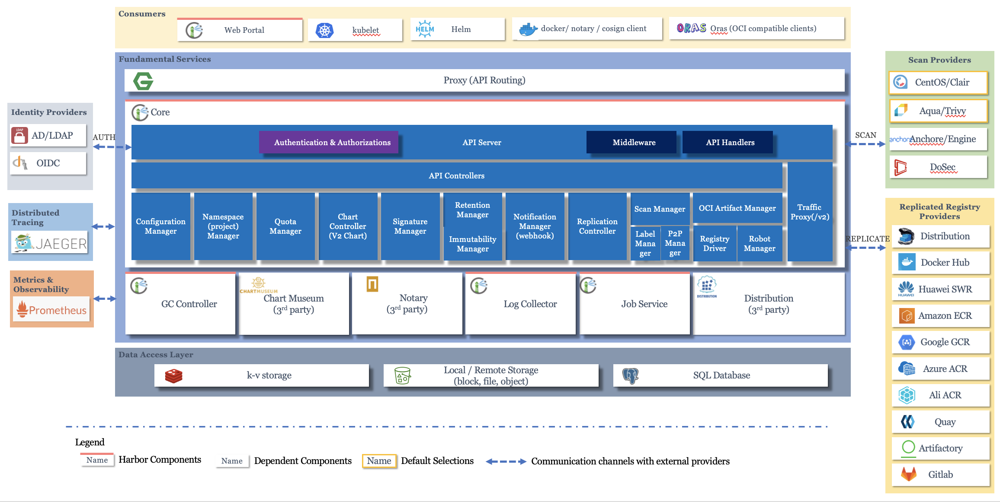
    1. Proxy：反向代理服务器（采用Nginx），接收并将不同的请求转发至Core或Registry模块
    2. Core：核心模块
        1. Notification Manager：通过webhook实现的消息管理，会将registry中的镜像变化通知到web页面
        2. API Server：接收来自Proxy模块的请求，并强制对请求进行权限控制
            1. AUTH模块：通过token service实现用户认证，需要请求先从本模块获取到不同身份的有效token
    3. GC Collector：垃圾回收管理
    4. Chart Museum：Helm的仓库
    5. Notary：数据权限控制器
    6. Log Collector：日志汇总
    7. Job Service：镜像复制（在Harbor集群中，将本地镜像同步到远程实例上）
    8. Distribution：镜像中心
    9. k-v storage：为Job Service模块提供缓存服务（采用Redis）
    10. Local/Remote Storage：将数据存放在内存块、文件或持久化对象中
    11. SQL Database：存放工程元数据、用户数据、角色数据、同步策略以及镜像元数据等（采用PostgreSQL）
3. `docker login` 命令执行流程：
    ```mermaid
    sequenceDiagram
    actor user as 用户
    participant docker as Docker客户端
    participant proxy as Harbor<br/>Proxy模块
    participant core as Harbor<br/>Core模块/registry容器
    participant token as Harbor<br/>Core模块的token service

    user->>docker: 输入 docker login 命令
    docker->>proxy: 发送登录请求
    proxy->>core: 转发请求
    core-->>docker: 返回包含401状态码的响应<br/>携带着token service的url和Harbor公钥
    docker-->>user: 出现用户名和密码的交互输入框
    user->>docker: 输入用户名和密码
    docker->>proxy: 用Harbor公钥对用户名和密码加密<br/>并向指定url（token service）发送请求
    proxy->>token: 转发请求
    token->>token: 用Harbor私钥对用户名和密码解密<br/>完成用户认证
    token-->>docker: 返回包含认证成功状态码的响应<br/>携带着用Harbor私钥数字签名后的token
    docker->>docker: 用Harbor公钥对token进行签名验证
    alt 验证通过
        docker-->>user: 返回登录结果
    end
    alt 登录成功
        docker->>docker: 用Harbor公钥对用户名和密码加密后，保存到隐藏文件中
    end
    ```
4. `docker push` 命令执行流程：
    ```mermaid
    sequenceDiagram
    actor user as 用户
    participant docker as Docker客户端
    participant proxy as Harbor<br/>Proxy模块
    participant core as Harbor<br/>Core模块/registry容器
    participant token as Harbor<br/>Core模块的token service

    user->>docker: 输入 docker push 命令
    docker->>proxy: 发送push请求
    proxy->>core: 转发请求
    core-->>docker: 返回包含401状态码的响应<br/>携带着token service的url和Harbor公钥
    docker->>proxy: 携带着从隐藏文件中读取到的用户名和密码、push操作数据<br/>并向指定url（token service）发送请求
    proxy->>token: 转发请求
    token->>token: 用Harbor私钥对用户名和密码解密<br/>确认用户的角色和权限
    alt 用户具备对操作仓库的push权限
        token-->>docker: 返回响应<br/>携带着包含push操作数据和数字签名的token
    end
    docker->>proxy: 携带着token再次发送请求
    proxy->>core: 转发请求
    core->>core: 用Harbor公钥对token进行签名验证
    alt 验证通过
        core-->>docker: 开始传输镜像数据
    end
    ```

#### 11.5.2 HTTP
1. 搭建：
    1. 下载并解压
    2. 修改 `harbor.yml` 配置文件：复制并重命名 `harbor.yml.tmpl` 文件
        1. `hostname: <ip>`
        2. 注释与 `https` 相关的所有配置
        3. `harbor_admin_password: <password>`：记住或修改密码
        4. `http.port: 80`：默认端口为80
    3. 运行 `./prepare` 命令：拉取prepare镜像并生成配置文件
    4. 运行 `./install.sh` 命令：自动完成安装，并启动由docker-compose编排管理的容器（后续均用 `docker-compose` 命令来启停容器）
2. docker客户端的推送、删除操作：同 [registry私有镜像中心的HTTP请求](#1141-http)

#### 11.5.3 HTTPS
1. 阿里云申请SSL证书：申请成功后，可根据服务器的类型进行下载证书压缩包（包含 `.pem` 证书文件和 `.key` 私钥文件）
2. 搭建：同 [harbor私有镜像中心的搭建过程](#1152-http)
    1. 修改 `harbor.yml` 配置文件：修改 `https` 的相关配置
        1. `https.certificate: <pem-file>`
        2. `https.private_key: <key-file>`
3. docker客户端的推送、删除操作：同 [registry私有镜像中心的HTTP请求](#1141-http)

---

## 12 Docker Swarm
### 12.1 概述
1. Docker Swarm：Docker原生集群管理系统，会将多个Docker主机（物理）组织成一个Docker主机（虚拟），通过API与集群通信
2. 节点架构：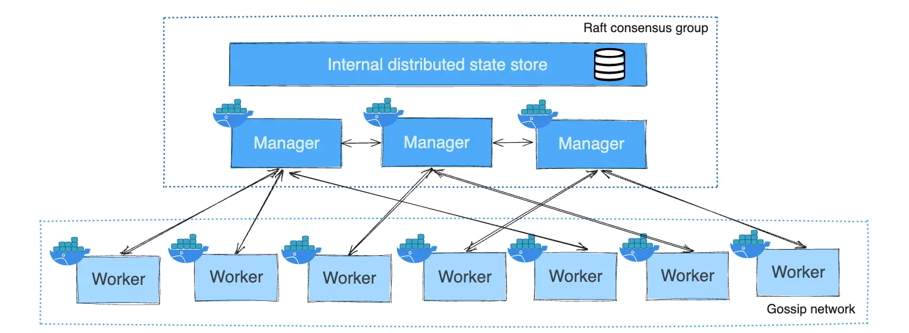
    1. Swarm Node：采用Swarm模式运行的Docker Engine主机
        - 一个node对应一个主机，一个主机可对应 **多个node**
        - 类型：
            1. Manager：维护集群状态、调试service、处理集群管理任务，通过Raft算法维护一致性
            2. Worker：对外提供服务
        - 角色转换：
            1. 节点降级：Manager &rarr; Worker
            2. 节点升级：Worker &rarr; Manager
3. 服务架构：`service` 通过 `task` 的形式部署在swarm的各个node中，而 `task` 又通过运行着应用进程的 `container` 对外提供服务  
    
    
    - 编排器 `orchestrator`：管理副本任务的创建和停止
        1. 创建 `task`：分配 `taskID`，并通过分配器来分配虚拟IP，再将其注册到内置DNS中
        2. 停止 `task`：在内置DNS中注销
    - 分配器 `allocator`：调度、监听副本任务；若容器处于不可用或终止状态，则由编排器先删后增，保持副本任务数量
        1. 调度：在集群的节点中找到 `available node`，并将 `task` 分配给 `node`，同时会给 `task` 分配一个容器
        2. 监听：监测容器的运行状态
        3. 对请求负载均衡
4. 服务部署模式：
    1. `replicated` 副本模式：（默认部署模式）指定 `task` 数量，为 `available node` 分配 **一个或多个** `task`
    2. `global` 全局模式：不能指定 `task` 数量，默认为每个 `node` 分配 **一个** `task`
5. Raft算法：[动画演示](https://thesecretlivesofdata.com/raft/)

### 12.2 操作Swarm集群
1. 搭建集群：
    1. `Swarm: inactive/active`：用 `docker info` 命令查看docker的swarm激活状态
    2. `docker swarm init`：初始化swarm集群，会提供添加worker/manager节点的命令
        1. `docker swarm join --token <worker/manager-token> <leader-manager-ip>:<leader-manager-port>`：添加节点
        2. `docker swarm join-token worker/manager`：获取添加节点的 **token**
        3. `docker node ls`：查看当前swarm集群的节点状态信息，仅manager节点可用
2. 维护集群：
    1. 节点退出集群：
        1. `worker` 节点：`docker swarm leave`
            - 节点的状态 `STATUS` 会变为 `Down`
            - 重新加入集群后，会新增一个新的 `worker` 节点，而原节点仍存在
            - 删除Down状态的 `worker` 节点：`docker node rm <node-id>`
        2. `manager` 节点：`docker swarm leave --force`
            - 退出集群会导致swarm集群的一致性受到损坏
    2. 自动锁定：
        1. `docker swarm update --autolock=true`：开启集群的自动锁定功能 &rarr; 启用TLS加密 `manager` 间的通信，避免维护 `manager` 数据一致性的Raft日志有被攻击的风险
        2. `docker swarm unlock-key`：查看解锁密钥（密钥均维护在节点的docker缓存中；一旦节点的docker重启，则密钥会丢失）
        3. `docker swarm unlock` 并输入解锁密钥：解锁swarm，重启的node才能重新加入swarm集群
3. 维护节点：
    1. 角色转换：
        1. `worker` 升级为 `manager`：
            1. `docker node promote <node-id>`
            2. `docker node update --role manager <node-id/hostname>`
        2. `manager` 降级为 `worker`：
            1. `docker node demote <node-id>`
            2. `docker node update --role worker <node-id/hostname>`
    2. 节点标签：
        1. `docker node update --label-add <key>=<value>`：添加/修改标签
        2. `docker node update --label-rm <key>`：删除标签
    3. 删除节点：
        1. 若为 `manager` 节点，则需先降级为 `worker` 节点
        2. 关闭节点的docker &rarr; 节点变为 `Down`状态
        3. 执行 `docker node rm <node-id>` 命令删除节点
    4. 删除节点和退出集群的区别：
        1. `docker node rm -f`：使节点强制退群
        2. `docker swarm leave`：使docker主机关闭swarm模式
4. 公钥基础设施PKI（Public Key Infrastructure）：保障节点的安全
    1. TLS：保障节点间授权和通信的安全
        1. 节点加入swarm集群：
            ```mermaid
            sequenceDiagram
            participant node as 要加入集群的worker/manager节点
            participant manager
            autonumber
            manager-->>node: 生成包含CA根证书的digest和随机密钥的token
            node->>node: 解析token获得CA根证书的digest和随机密钥
            node->>node: 生成节点ID
            node->>node: 使用随机密钥加密节点ID
            node->>manager: 发送请求<br/>包含：节点ID（明文+密文）、节点角色、CA根证书的digest
            manager->>manager: 根据CA根证书的digest验证用户合法性
            manager->>manager: 使用本地的节点角色对应的密钥对节点ID密文解密
            manager->>manager: 对比解密结果和节点ID明文，判断信息是否安全
            alt 信息安全
                manager->>manager: 将节点加入集群
                manager-->>node: 发送加入成功的通知
                node->>node: 接收并解析通知，修改节点信息
            end
            ```
        2. 节点通信：
            ```mermaid
            sequenceDiagram
            participant nodeA
            participant nodeB
            autonumber
            nodeA->>nodeB: 发送 建立连接 请求<br/>携带节点ID
            nodeB->>nodeB: 保存节点地址和ID
            nodeB-->>nodeA: 返回 CA根证书的digest 响应
            nodeA->>nodeA: 对比本地和响应的digest，判断通信对方的合法性
            alt 合法的通信对方
                nodeA->>nodeA: 使用随机密钥加密数据
                nodeA->>nodeB: 发送请求<br/>包含：数据（明文+密文）
                nodeB->>nodeB: 使用随机密钥解密数据密文
                nodeB->>nodeB: 对比解密结果和数据明文，判断信息是否安全
                alt 信息安全
                    nodeB->>nodeB: 处理数据
                end
            end
            ```
    2. CA数字证书轮转：
        1. `docker swarm ca --cert-expiry <duration>`：指定轮换周期，默认90天
        2. `docker swarm ca --external-ca <ca-file>`：指定外部CA数字证书
        3. `docker swarm ca --rotate`：
            1. docker生成一个过渡性的 **交叉签名（cross-signed）根证书**，即新根证书由旧根证书签署生成
            2. docker通知所有节点更新根证书
            3. 在所有节点均更新完根证书后，manager会通知所有节点仅信任新根证书（不再信任旧根证书和交叉签名根证书）
            4. 所有节点用新根证书签发自己节点的数字证书
5. 集群容灾：
    - 采用 **热备** 容灾方式：即manager集群中只有一个 `leader` 节点，其它manager处于热备状态；若 `leader` 宕机，则manager集群中自动发起leader选举
    - 采用 **Raft算法** 来进行leader选举：所有可用的manager节点均具有选举权和被选举权，获得过半选票的manager节点成为新的 `leader`（推荐部署奇数个manager）

### 12.3 service
1. service只能依附于swarm集群
2. 创建service：
    1. `docker service create --name <service-name> --replicas <task-number> -p <host-port>:<container-port> <image-name>`：由manager执行
    2. `docker service ls`：查看当前swarm集群中正在运行的service信息
    3. `docker service inspect <service-id|service-name>`：查看指定service的详情
    4. `docker service ps <service-id|service-name>`：查看指定service的各个task分配的节点信息
    5. `docker node ps <node-name>`：查看指定节点中正在运行的task信息
    6. `docker service logs <service-id|service-name|task-id>`：查看service/task日志
3. 负载均衡：service中包含多个task时，会通过 **轮询** 策略（可通过Nginx、HAProxy等变更）的负载均衡方式转发给各个task处理
4. 操作：
    1. task伸缩：根据访问量，在不停止服务的前提下对服务的task进行扩容/缩容
        1. 变更指定服务的task数量：
            1. `docker service update --replicas <task-number> <service-name>`
            2. `docker service scale <service-name>=<task-number>`
        2. 暂停对节点分配task：
            1. `docker node update --availability pause <node-name>`：修改节点的可用性 &rarr; 节点中的task数量保持不变
            2. 扩容task数量
        3. 清空task：
            1. `docker node update --availability drain <node-name>`：修改节点的可用性 &rarr; 清空节点中的task
            2. 不影响服务的task总数，被清空的task将被分配器分配到其他可用节点上
    2. task容错：当task所在的容器出现问题时，编排器会自动新建同样的task，再由分配器分配到可用节点上
    3. 删除服务：`docker service rm <service-id|service-name>`
        - 删除所有关联的task
        - 删除task相关的容器
    4. 滚动更新：更新和回滚操作均会新建task，更新时task会分配回原节点、回滚时task会被重新分配
        ```bash showLineNumbers
        docker service create \
        ...
        --update-parallelism <parallelism-update-task-number> \
        --update-delay <update-delay-time> \
        --update-max-failure-ratio <max-failure-ratio> \
        --update-failure-action <update-failure-action> \
        --rollback-parallelism <parallelism-rollback-task-number> \
        --rollback-delay <rollback-delay-time> \
        --rollback-max-failure-ratio <max-failure-ratio> \
        --rollback-failure-action <rollback-failure-action> \
        ```
        1. 升级镜像：`docker service update --image <image-name> <service-name>`
        2. 每次更新 `<parallelism-update-task-number>` 个task，更新间隔为 `<update-delay-time>`，更新失败时执行 `<update-failure-action>`
        3. 更新回滚：
            1. 按照设定的回滚策略自动回滚
            2. 手动回滚：`docker service update --rollback <service-name>`
        4. 每次回滚 `<parallelism-rollback-task-number>` 个task，回滚间隔为 `<rollback-delay-time>`
5. 全局部署模式：
    1. 创建服务：`docker service create --name <service-name> --mode global <image-name>`
    2. task伸缩：改变service所依附的swarm集群中的节点数量 &rarr; 节点中的task数量会自动扩容/缩容

### 12.4 overlay网络
1. overlay网络/重叠网络/覆盖网络：构建在underlay网络上的逻辑虚拟网络，即在物理网络的基础上，通过节点间的单播隧道机制将主机两两相连
2. swarm集群的overlay网络模型：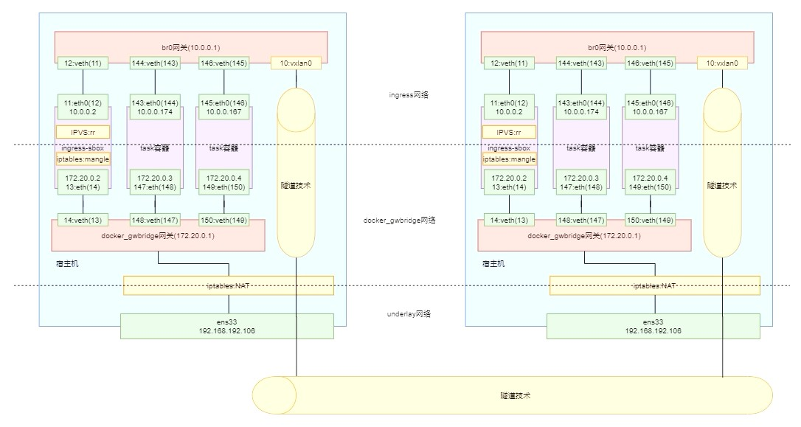
    1. 结构：
        1. `docker_gwbridge` 网络：
            1. 网关：位于宿主机上，且同名
            2. task容器
            3. `ingress-sbox` 容器：由overlay网络虚拟出来的容器，无法通过 `docker ps` 命令查看
                - `nsenter --net=/var/run/docker/netns/ingress_sbox ip a`：进入网络命名空间，查看 `ingress-sbox` 容器的接口情况
        2. `ingress` 网络：
            1. `br0` 网关：位于宿主机上
                - `nsenter --net=/var/run/docker/netns/<br0-network-name> ip a`：进入网络命名空间，查看容器的接口情况
                - 与 `docker_gwbridge` 网关的接口情况相比，多出了 `vxlan0` 接口
            2. task容器：和 `docker_gwbridge` 网络中的容器相同
            3. `ingress-sbox` 容器：和 `docker_gwbridge` 网络中的容器相同
    2. 运行流程：
        1. 请求先到达 **docker_gwbridge网关**（宿主机的NAT）
            - `ip route`：查看宿主机的静态路由信息
            - `iptables -nvL -t nat`：查看宿主机中的网络地址转发表（**NAT**：根据规则进行地址映射、端口映射 &rarr; 完成地址转换）中的转发规则
        2. 跳转至 **ingress-sbox容器**（具有当前service下的所有容器IP），通过轮询策略的负载均衡方式选择一个容器IP作为目标地址
            - `nsenter --net=/var/run/docker/netns/ingress_sbox iptables -nvL -t mangle`：查看 `ingress-sbox` 容器的mangle表（根据规则修改数据包的标志位）
            - `nsenter --net=/var/run/docker/netns/ingress_sbox ipvsadm`：查看 `ingress-sbox` 容器的负载均衡规则
                - `FWM <symbol> rr`：防火墙标识（Fire Wall Mark），并采取轮询策略（Round Robin）
        3. 跳转至 **br0网关**，判断目标地址的所在主机
            1. 若目标地址为本地容器IP，则直接将请求转发给目标容器处理即可
            2. 若目标地址为远程容器IP，则将请求经由 **vxlan接口** 、通过vxlan隧道技术转发至目标主机的 **br0网关**
                - `tcpdump -i <interface> port <host-port>`：监听指定接口
3. VXLAN隧道技术：重新封装不同协议的数据包后再发送
    - 隧道：被封装的数据包在公共互联网上传递时经过的逻辑路径
    - 被封装的数据包包含路由信息，通过隧道到达终点后，会对数据解包并转发到最终目的地

---

## 13 CI/CD与Jenkins
### 13.1 概述
1. CI/CD：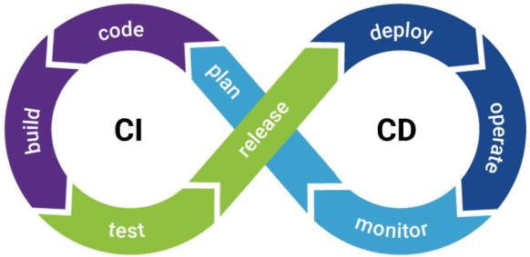
    1. **CI（Continuous Integration）**：持续集成，即持续不断地将更新的代码经构建、测试后集成到项目主线
    2. **CD（Continuous Delivery/Deployment）**：持续交付/部署，即持续不断地将新版本交付到类生产环境/部署至生产环境
2. **DevOps（Development & Operations）**：一种管理模式、执行规范与标准，主要用于促进开发、测试与运维部门间的沟通、协作与整合
    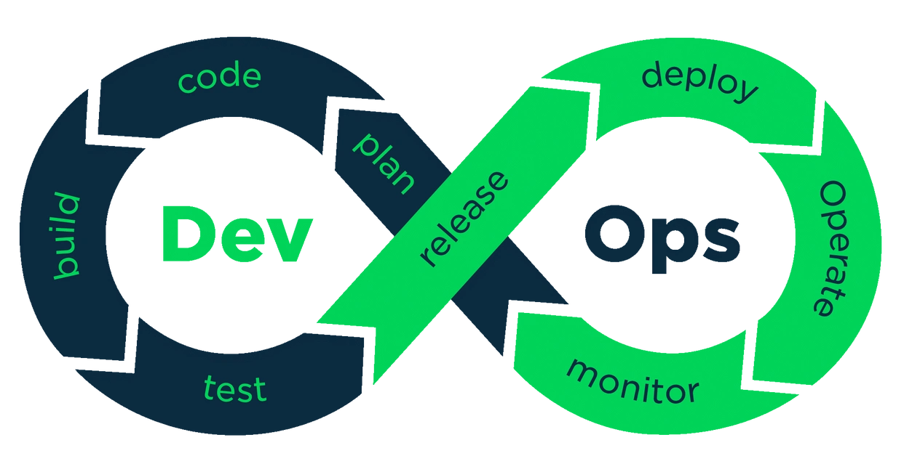
3. CI/CD与DevOps的关系：CI/CD是目标，DevOps是手段

### 13.2 应用实现
1. 系统结构图：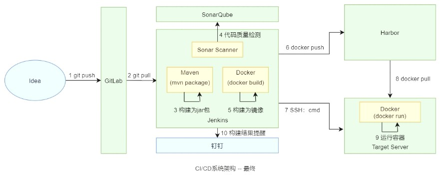
2. 工具：
    1. Git：开源的分布式版本控制系统
    2. GitLab：开源的源码托管工具
    3. SonarQube：开源的代码扫描与分析平台
    4. Harbor：开源的镜像仓库
    5. Jenkins：开源的持续集成工具
3. 集成：
    1. SonarScanner：SonarQube的代码扫描工具，用于Jenkins集成SonarQube
    2. 配置 `SSH Server`：用于Jenkins集成目标服务器
    3. 修改服务器的 `daemon.json` 文件：支持镜像中心与客户端的HTTP通信
    4. Jenkins容器化：&rarr; 能在Jenkins中构建镜像
        1. DinD（Docker-in-Docker）：容器内安装Docker引擎
        2. DooD（Docker-outside-of-Docker）：与宿主机共享Docker引擎 &larr; 修改 `docker.sock` 文件的读写权限，并映射到宿主机上
    5. 钉钉：配置webhook地址，用于Jenkins集成钉钉机器人
4. 任务：
    1. 自由风格的软件项目：结合Jenkins功能的基础版任务
        1. CI操作步骤：
            1. 开发者提交代码到远程的GitLab仓库时，触发Jenkins任务
            2. 从GitLab仓库拉取代码
            3. 调用mvn命令打jar包
            4. 调用SonarScanner进行代码质量检测
            5. 构建镜像，推送到Harbor镜像中心
            6. 执行目标服务器的部署脚本，启动容器
            7. 通知钉钉
        2. CD操作：根据tag构建对应的项目
    2. 流水线：组织多个节点的进阶版任务
        1. 维护脚本的方式：
            1. 本地方式：在Jenkins中维护脚本
            2. SCM（Source Code Management）方式：
                1. 在项目根目录下追加 `Jenkinsfile` 文件
                2. Jenkins中配置SCM方式的流水线脚本
        2. 流水线语法：脚本语法特殊，可通过Jenkins提供的工具自动生成脚本语句