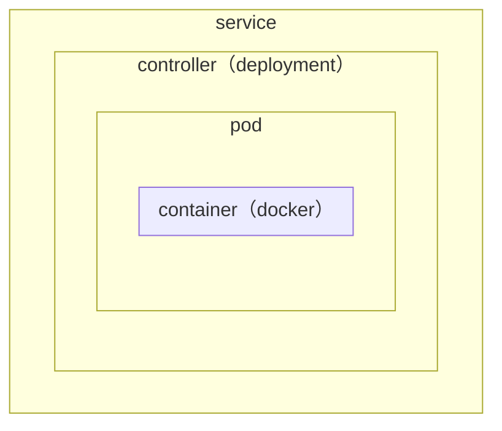

# Kubernetes（k8s）

## 1. 概述
1. **<font color="red">Kubernetes（k8s）</font>**：容器编排引擎，用于自动化、容器化应用程序的部署、规划、扩展和管理
2. 架构图：
    - `Master`：集群控制节点
        - 组件：
            1. `kube-api-server`：集群接收请求的统一入口，管理所有对象资源的增删改查和监听操作，将信息存储到etcd数据库中
            2. `etcd`：分布式键值存储系统，用来保存集群状态的数据；有自动发现服务的机制，会按照节点数搭建
            3. `scheduler`：调度资源，会根据调度算法为新创建的pod选择node节点
            4. `controller-manager`：处理集群中常规的后台任务，管理资源的控制器
        - 作用：对集群进行调度管理，接受集群外用户去集群操作请求
    - `Node`：集群工作节点 `Worker Nodes`
        - 组件：
            1. `kubelet`：`Master` 在 `Node` 上的代理，管理当前 `Node` 的运行容器的生命周期；会把每个pod转换成一组容器
            2. `kube-proxy`：用来实现pod的网络代理，维护网络规则和负载均衡
            3. `pod`（Container Runtime）：一般一个pod中 **只包含一个** 容器（一般是docker）
        - 作用：运行用户业务应用容器

:::tip[核心概念]

1. `service`：防止pod失联，定义pod组的访问策略
2. `controller`：
    - `deployment`：**无状态** 应用部署（如nginx、apache），不会影响用户使用
    - `statefulset`：**有状态** 应用部署，会影响用户使用
    - `replicaset`：pod副本数
    - `daemonset`：监督node运行的是同一个pod，且pod在统一的命名空间
    - `job`：一次性任务
    - `cronjob`：定时任务
3. `pod`：最小部署单元，是一组容器的集合（共享网络命名空间）
4. 其它：
    1. `storage`：数据存储，如`volumes`、`persistent volumes`
    2. `pollcies` 策略：`resource quotas`
    3. `label`：标签，用于关联对象、查询和筛选
    4. `namespaces`：命名空间
    5. `annotations`：注释
:::

3. 搭建k8s集群的方式：
    1. [minikube](https://kubernetes.io/docs/tutorials/hello-minikube/)：在本地运行一个单节点的k8s集群
    2. [kind](https://kind.sigs.k8s.io/)：在本地运行k8s集群，但需要安装和配置Docker
    3. [kubeadm](https://kubernetes.io/docs/reference/setup-tools/kubeadm/)：k8s集群部署工具
    4. 下载发行版的二进制包，手动部署安装每个组件以组成k8s集群
    5. 通过yum安装每个组件以组成k8s集群
    6. 第三方工具
    7. 花钱购买：如阿里云的公有云平台等

---

## 2. 部署
### 2.1. Kubeadm部署集群
1. 准备环境：
    1. 关闭防火墙：
        ```bash showLineNumbers
        systemctl stop firewalld
        systemctl disable firewalld
        ```
    2. 关闭selinux：
        ```bash showLineNumbers
        # 永久
        sed -i 's/enforcing/disabled/' /etc/selinux/config
        # 临时
        setenforce 0
        ```
    3. 关闭swap：&rarr; k8s禁止虚拟内存以提高性能
        ```bash showLineNumbers
        # 永久
        sed -ri 's/.*swap.*/#&/' /etc/fstab
        # 临时
        swapoff -a
        ```
    4. 设置网桥参数：
        ```bash showLineNumbers
        cat > /etc/sysctl.d/k8s.conf << EOF
        net.bridge.bridge-nf-call-ip6tables = 1
        net.bridge.bridge-nf-call-iptables = 1
        EOF
        sysctl --system
        ```
    5. 时间同步：
        ```bash showLineNumbers
        yum install ntpdate -y
        ntpdate time.windows.com
        ```
2. 安装相关组件：
    1. 组件：
        - kubelet：运行在集群的所有节点上，负责启动pod和容器
        - kubeadm：初始化集群的工具
        - kubectl：命令行工具
    2. 安装命令：
        1. Docker：
            1. 安装 `19.03.13` 版本的docker：`yum install docker-ce-19.03.13 -y`
            2. 启动docker：`systemctl enable docker.service`
        2. kubeadm、kubelet、kubectl：
            1. 添加k8s的阿里云YUM源：
                ```bash showLineNumbers
                cat > /etc/yum.repos.d/kubernetes.repo << EOF
                [kubernetes]
                name=Kubernetes
                baseurl=https://mirrors.aliyun.com/kubernetes/yum/repos/kubernetes-el7-x86_64
                enabled=1
                gpgcheck=0
                repo_gpgcheck=0
                gpgkey=https://mirrors.aliyun.com/kubernetes/yum/doc/yum-key.gpg https://mirrors.aliyun.com/kubernetes/yum/doc/rpm-package-key.gpg
                EOF
                ```
            2. 安装kubeadm、kubelet、kubectl：`yum install kubelet-1.19.4 kubeadm-1.19.4 kubectl-1.19.4 -y`
            3. 启动kubelet：`systemctl enable kubelet.service`
        3. 网络插件：
            1. 下载 `kube-flannel.yml` 文件：`wget https://raw.githubusercontent.com/coreos/flannel/master/Documentation/kube-flannel.yml`
3. 搭建集群：
    1. `Master` 节点：
        1. 创建节点：
            ```bash showLineNumbers
            kubeadm init \
            --apiserver-advertise-address=<master-ip> \
            --image-repository registry.aliyuncs.com/google_containers \
            --kubernetes-version v1.19.4 \
            --service-cidr=10.96.0.0/12 --pod-network-cidr=10.244.0.0/16
            ```
        2. 执行官方建议命令：
            ```bash showLineNumbers
            mkdir -p $HOME/.kube
            sudo cp -i /etc/kubernetes/admin.conf $HOME/.kube/config
            sudo chown $(id -u):$(id -g) $HOME/.kube/config
            ```
        3. 查看集群中的节点：`kubectl get nodes`
        4. 应用 `kube-flannel.yml` 文件得到运行时容器：`kubectl apply -f kube-flannel.yml`
    2. 将 `Worker Node` 节点加入到集群中：
        ```bash showLineNumbers
        kubeadm join <master-ip>:<master-port> \
        --token <token> \
        --discovery-token-ca-cert-hash <hash>
        ```

### 2.2. 部署容器化应用
1. 容器化应用：放在docker里部署的应用程序
2. 部署步骤：
    1. 获取镜像：`Dockerfile` 文件制作镜像，或从仓库拉取镜像
    2. 启动镜像 &rarr; 得到在pod里的容器，并通过控制器管理pod
        - 创建 `deployment`：
            - `kubectl create deployment <deployment-name> --image=<image-name>`
            - `kubectl apply -f <yaml-file>`
                - `kubectl create deployment <deployment-name> --image=<image-name> --dry-run -o yaml > <yaml-file>`：可通过该命令获取已有 `deployment` 的 `.yaml` 文件
        - 查看信息：
            ```bash showLineNumbers
            kubectl get node(s)
            kubectl get service(s)
            kubectl get deployment (deploy)
            kubectl get pod(s)
            kubectl describe pods <pod-name>
            kubectl logs <service/deployment/pod-name>
            ```
        - 删除 `deployment` 及其相关服务：
            ```bash showLineNumbers
            kubectl delete service <service-name>
            kubectl delete deployment <deployment-name>
            kubectl delete pod <pod-name>
            ```
    3. 暴露服务 &rarr; 外界可以访问
        - `kubectl expose deployment <deployment-name> --port=<port> --type=NodePort`
3. [Kubernetes Dashbaord](https://github.com/kubernetes/dashboard)：管理k8s集群（包含集群本身以及其中运行着的应用程序）的仪表盘
    1. 下载、创建 `deployment` 并暴露服务：
        ```bash showLineNumbers
        kubectl apply -f https://raw.githubusercontent.com/kubernetes/dashboard/v2.0.4/aio/deploy/recommended.yaml
        ```
    2. 访问仪表盘时需要输入token：
        ```bash showLineNumbers
        kubectl create serviceaccount dashboard-admin -n kube-system
        kubectl create clusterrolebinding dashboard-admin --clusterrole=cluster-admin --serviceaccount=kube-system:dashboard-admin
        kubectl describe secrets -n kube-system $(kubectl -n kube-system get secret | awk '/dashboard-admin/{print $1}')
        ```

---

## 3. Ingress暴露应用
1. NodePort：让外部请求直接访问服务的最原始方式，但一个端口只能供一个服务使用，且发生变化的IP需要人工处理 &rarr; 不推荐在生产环境中使用这种方式
    - NodePort在所有的节点上开放指定的端口，发送到这个端口的所有请求都会直接转发到服务中的pod里
    - `nodePort`：未指定端口时，会随机选择30000–32767之间的端口

:::tip[服务端口说明]
```yml showLineNumbers
ports:  
  - port: 80
    targetPort: 80
    nodePort: 30008
    protocol: TCP
```
1. `port`：k8s集群中的各个服务之间访问的端口
2. `targetPort`：容器的端口
3. `nodePort`：节点对外暴露的端口
:::

2. LoadBalancer：外部请求通过负载均衡器 `LoadBlancer` 转发到服务中的Pod里，但需要向云平台申请负载均衡器 &rarr; 不推荐在生产环境中使用这种方式
3. **[Ingress](https://github.com/kubernetes/ingress-nginx)**：外部请求访问k8s集群的必经之口，相当于集群网关可自定义路由规则来转发、管理、暴露服务（一组pod）
    1. 部署Ingress Nginx：用Nginx作为反向代理和负载均衡器的Ingress
        - 下载、创建 `deployment` 并暴露服务：
            ```bash showLineNumbers
            kubectl apply -f https://raw.githubusercontent.com/kubernetes/ingress-nginx/controller-v0.41.2/deploy/static/provider/baremetal/deploy.yaml
            ```
            1. 镜像地址修改为国内地址
            2. 修改镜像地址的父级上添加配置项 `spec.hostNetwork: true`
        - 查看Ingress的状态：
            - `kubectl get service -n ingress-nginx`
            - `kubectl get deploy -n ingress-nginx`
            - `kubectl get pods -n ingress-nginx`
    2. 配置Ingress Nginx规则：
        - 应用：`kubectl apply -f ingress-nginx-rule.yaml`
        - 查看：`kubectl get ing(ress)`