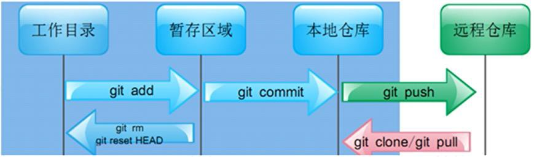
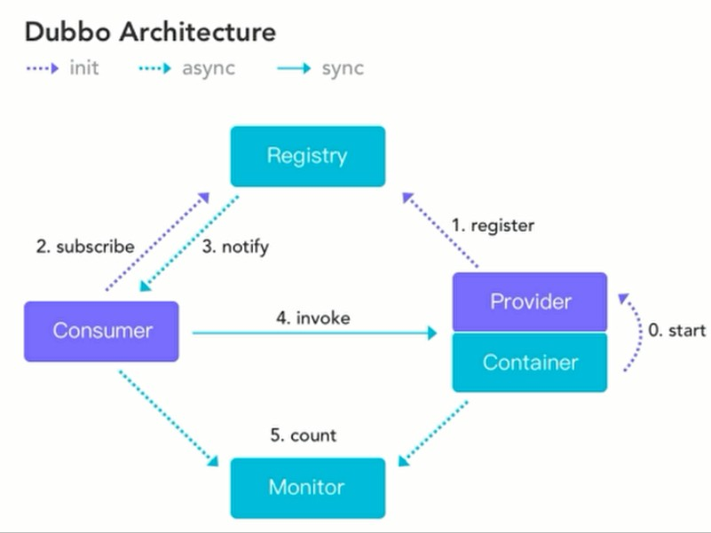

# 互联网生态

## 1 Linux
### 1.1 简介
1. 开源、免费的OS，注重安全性、稳定性、高并发处理能力，但没有优异的可视化界面
2. 版本：Ubuntu（乌班图）、RedHat（红帽）、CentOS
3. 目录结构：
    1. `/usr/bin`：存放系统的可执行文件，使得其可在任何目录下执行
    2. `/usr/local/bin`：存放本地用户的可执行文件，使得其可在任何目录下执行
    3. `/etc`：存放配置文件
    4. `/home`：用户的根目录
    5. `/opt`：存放额外安装的软件

### 1.2 常用工具和指令
1. 文本编辑器：vi、vim（vi的增强版本）
2. 用户`useradd`、用户组`groupadd`、权限`chmod`管理指令
3. 常用指令：
    1. 查看当前所在目录：`pwd`
    2. 查看指定目录下所有的子目录和文件列表：`ls [option] [dir]`
    3. 切换目录：`cd dir`
    4. 查看文件内容：`cat [option] file`，一次性显示文件内容
    5. 查看文件的头10行：`head [option] file`
    6. 查看文件的后10行：`tail [option] file`
    7. 普通搜索：`find [range] [standard] keyword`
    8. 压缩/解压`.gz`压缩包：`gzip\gunzip file`
    9. 压缩/解压`.zip`压缩包：`zip\unzip package.zip file/dir_list`
    10. 压缩/解压`.tar.gz`压缩包：`tar -zcvf\-zxvf xxx.tar.gz file/dir_list`
    11. 查看系统运行的进程：`ps [option]`
    12. 终止进程：`kill id PID`
    13. 管理系统中的服务：`systemctl [start|stop|restart|reload|status|enable] serve`
    14. 安装rpm包：`rpm -ivh xxx.rpm`
    15. 安装rpm包：`yum install keyword`

---

## 2 Git
1. 开源的分布式版本控制管理工具，高效处理版本管理
    
2. `git init`：生成.git目录（即本地库的生成）
    - 工作目录：任何目录均可，但要包含.git目录
    - 暂存区域：.git目录下（可撤销操作）
    - 本地仓库：.git目录下

---

## 3 SVN（略）

---

## 4 Maven进阶
1. 项目对象模型POM（Project Object Module）：该文件可以被子工程继承
2. maven多模块管理：
    - 父工程：`<packaging>`设置为pom
    - 子工程：作为一个 `<module>` 添加到父工程里
3. 父工程添加的依赖，所有子模块都会无条件地继承 &rarr; 使用 `<dependencyManagement>` 来加强管理子工程/子模块的所有依赖

---

## 5 Dubbo
### 5.1 RPC基础知识
1. 应用架构的发展演变：
    ```mermaid
    graph TD
    monolithic_architecture[单一架构（开发、部署简单，但扩展、维护不易）] --> 
    vertical_application_architecture[垂直应用架构（将大应用拆分为小应用）] --> 
    microservices_architecture[分布式架构（若干个独立系统的集合）]
    ```
2. 远程过程调用RPC（Remote Procedure Call）：即调用接口，如Dubbo、gRPC、Thrift、HSF

### 5.2 概述
1. 基本结构：
    - **容器Container**：和Spring容器无缝连接
    - **服务提供者Provider**：暴露服务的服务提供者
    - **服务消费者Consumer**：调用远程服务的服务消费者
    - **注册中心Registry**：将服务提供者地址列表返回给Consumer，如Multicast、Redis、Simple、**Zookeeper**（推荐使用）
    - **监控中心Monitor**：Provider和Consumer会在内存中累计调用次数和调用时间，定时发送统计数据到Monitor；是图形化的服务管理页面，可直接下载使用
2. 过程：
    ```mermaid
    graph TD
    start[0.start：系统初始化时，将Provider加载到Container中] --> 
    register[1.register：Provider将自己对外的服务注册到Registry] --> 
    subscribe[2.subscribe：Consumer向Registry订阅自己所需的服务] --> 
    notify[3.notify：Registry将Consumer订阅服务的地址返回给Consumer] --> 
    invoke[4.invoke：Consumer可以通过这些地址去调用Provider的服务] --> 
    count[5.count：监控Provider和Consumer的各种行为状态，过程出错时亦会报错]
    ```

---

## 6 SpringSession

---

## 7 MySQL集群

---

## 8 Nginx

---

## 9 FastDFS

---

## 10 MySQL优化

---

## 11 MySQL索引优化

---

## 12 MyCAT2

---

## 13 短信验证
1. 程序（整理短信内容） --> 短信平台 --> 运营商
2. 短信内容模板：由国家工信部制定
    1. 短信签名：`【xxx】`
    2. 短信正文：`您的短信验证码为123456`

---

## 14 MQ解决重复消费问题