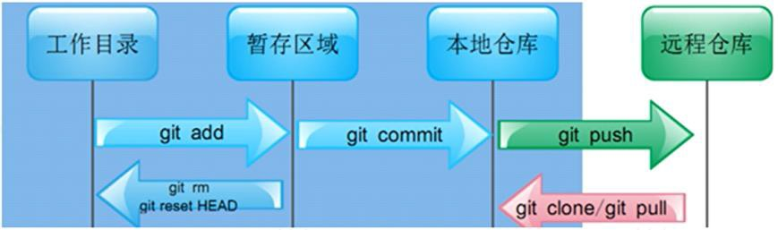
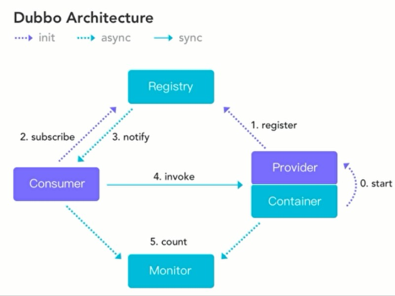

# 互联网生态

## [1 Linux](./01-Linux.md)
### 1.1 简介
1. 开源、免费的OS，注重安全性、稳定性、高并发处理能力，但没有优异的可视化界面
2. 版本：Ubuntu（乌班图）、RedHat（红帽）、CentOS
3. 目录结构：
    1. `/usr/bin`：存放系统的可执行文件，使得其可在任何目录下执行
    2. `/usr/local/bin`：存放本地用户的可执行文件，使得其可在任何目录下执行
    3. `/etc`：存放配置文件
    4. `/home`：用户的根目录
    5. `/opt`：存放额外安装的软件

### 1.2 常用工具和指令
1. 文本编辑器：vi、vim（vi的增强版本）
2. 用户 `useradd`、用户组 `groupadd`、权限 `chmod` 管理指令
3. 常用指令：
    ```bash showLineNumbers
    # 查看当前所在目录
    pwd

    # 查看指定目录下所有的子目录和文件列表
    ls [option] [dir]

    # 切换目录
    cd dir

    # 查看文件所有内容
    cat [option] file

    # 查看文件的头10行
    head [option] file

    # 查看文件的后10行
    tail [option] file

    # 普通搜索
    find [range] [standard] keyword

    # 压缩/解压.gz压缩包
    gzip/gunzip file

    # 压缩/解压.zip压缩包
    zip/unzip package.zip file/dir_list

    # 压缩/解压.tar.gz压缩包
    tar -zcvf/-zxvf xxx.tar.gz -C file/dir_list

    # 查看系统运行的进程
    ps [option]

    # 终止进程
    kill id PID

    # 管理系统中的服务
    systemctl [start|stop|restart|reload|status|enable] serve

    # 安装rpm包
    rpm -ivh xxx.rpm

    # 安装rpm包
    yum install keyword
    ```

---

## 2 Git
### 2.1 概述
1. 开源的分布式版本控制管理工具，高效处理版本管理
    
2. `git init`：生成.git目录（即本地库的生成）
    - 工作目录：任何目录均可，但要包含.git目录
    - 暂存区域：.git目录下（可撤销操作）
    - 本地仓库：.git目录下

---

## 3 SVN（略）

---

## 4 Maven进阶
### 4.1 概述
1. 项目对象模型POM（Project Object Module）：该文件可以被子工程继承
2. maven多模块管理：
    - 父工程：`<packaging>` 设置为pom
    - 子工程：作为一个 `<module>` 添加到父工程里
3. 父工程添加的依赖，所有子模块都会无条件地继承 &rarr; 使用 `<dependencyManagement>` 来加强管理子工程/子模块的所有依赖

---

## 5 Dubbo
### 5.1 RPC基础知识
1. 应用架构的发展演变：
    ```mermaid
    graph TB
    monolithic_architecture[单一架构（开发、部署简单，但扩展、维护不易）] --> 
    vertical_application_architecture[垂直应用架构（将大应用拆分为小应用）] --> 
    microservices_architecture[分布式架构（若干个独立系统的集合）]
    ```
2. 远程过程调用RPC（Remote Procedure Call）：即调用接口，如Dubbo、gRPC、Thrift、HSF

### 5.2 概述
1. 基本结构：
    - **容器Container**：和Spring容器无缝连接
    - **服务提供者Provider**：暴露服务的服务提供者
    - **服务消费者Consumer**：调用远程服务的服务消费者
    - **注册中心Registry**：将服务提供者地址列表返回给Consumer，如Multicast、Redis、Simple、**Zookeeper**（推荐使用）
    - **监控中心Monitor**：Provider和Consumer会在内存中累计调用次数和调用时间，定时发送统计数据到Monitor；是图形化的服务管理页面，可直接下载使用
2. 过程：
    ```mermaid
    graph TB
    start[0.start：系统初始化时，将Provider加载到Container中] --> 
    register[1.register：Provider将自己对外的服务注册到Registry] --> 
    subscribe[2.subscribe：Consumer向Registry订阅自己所需的服务] --> 
    notify[3.notify：Registry将Consumer订阅服务的地址返回给Consumer] --> 
    invoke[4.invoke：Consumer可以通过这些地址去调用Provider的服务] --> 
    count[5.count：监控Provider和Consumer的各种行为状态，过程出错时亦会报错]
    ```

---

## [6 SpringSession](./06-SpringSession.md)
### 6.1 概述
1. 会话 `Session`：记录用户状态，从而使服务端能识别用户
2. `Cookie`：用来存储相关客户端信息（如 `sessionId`），HTTP请求时会发送对应的 `Cookie` 信息到服务端
3. 集群模式下，tomcat服务器之间无法共享session &rarr; 采用 `Spring Session`

### 6.2 应用
1. 同域名下相同项目（即集群环境）
2. 同域名下不同项目：配置 `Cookie` 的存放路径
3. 同根域名不同二级子域名下的项目：配置 `Cookie` 的存放域名
4. 不同根域名下的项目（即单点登录）
5. 集成SpringBoot

---

## [7 MySQL集群](./07-MySQL集群.md)
### 7.1 概述
1. 主从复制：服务器分为主服务器和从服务器，主服务器负责读和写，从服务器只负责读
    1. 一主多从
    2. 双主双从
2. MySQL多实例：一台服务器上同时启动多个数据库（实例），不需要安装多个数据库
3. 多数据源实现方式：
    1. JDBC
    2. Hibernate（SSH）
    3. Mybatis（SSM）

---

## [8 Nginx](./08-Nginx.md)
### 8.1 简介
1. Nginx（engine x）：一个代理服务器，高性能、低消耗、并发处理能力强
    1. **反向代理**（Reverse Proxy）：代理对象是服务端
    2. **正向代理**（Reverse Proxy）：代理对象是客户端
2. 常用命令：
    ```bash showLineNumbers
    # 启动
    ./nginx

    # 关闭
    kill -QUIT master-pid

    # 重启
    ./nginx -s reload
    ```
3. 核心配置文件 `nginx.conf`：
    1. 基本配置
    2. events配置
    3. http配置

### 8.2 应用
1. 静态网站部署
2. 负载均衡：将请求均匀分摊到集群中的多个服务器节点上执行
    - 策略：轮询（默认）、权重 `weight`、ip绑定 `ip_hash`、最少连接 `least_conn`
3. 静态代理：将所有静态资源的访问由访问tomcat改为访问nginx
4. 动静分离：负载均衡和静态代理结合，即动态资源由web服务器完成，静态资源由nginx服务器完成
5. 虚拟主机：把一台物理服务器划分成多个虚拟的服务器

---

## [9 FastDFS](./09-FastDFS.md)
### 9.1 概述
1. FastDFS：开源的轻量级分布式文件系统，具备文件存储、文件同步、文件访问（文件上传、文件下载、文件删除）等功能，具有冗余备份、线性扩容等机制
    1. 客户端
    2. 服务端：
        1. **跟踪器tracker**：用于调度，在内存中记录集群中存储节点storage的状态信息
        2. **存储节点storage**：用于存储文件
2. 相关命令：
    1. `fdfs_trackerd <config_file> [start | stop | restart]`
    2. `fdfs_storaged <config_file> [start | stop | restart]`
3. 通过Nginx扩展模块，达到HTTP访问FastDFS服务器上的文件的效果

### 9.2 应用
1. 在java中的应用
2. 搭建FastDFS分布式文件系统集群

---

## [10 MySQL优化](./10-MySQL优化.md)
### 10.1 概述
1. 查询语句关键词：`FROM` &rarr; `WHERE` &rarr; `GROUP BY` &rarr; `HAVING` &rarr; `SELECT` &rarr; `ORDER BY` &rarr; `LIMIT`
2. 索引：一组排好顺序的数据，主要使用 `B-TREE` 索引算法
    1. 聚簇索引和非聚簇索引
    2. 主键索引和唯一性索引
    3. 单个索引和复合索引
3. `EXPLAIN` 执行计划：`id`、`select_type`、`type`、`possible_keys`、`key`、`key_len`、`ref`、`rows`、`Extra`

---

## [11 MySQL索引优化](./11-MySQL索引优化.md)
### 11.1 概述
1. 索引，是排好序的、可以快速查找数据的数据结构
    - `INNODB` 存储引擎：`B+ Tree` 索引
    - `MYISAM` 存储引擎：`B Tree` 索引
    - `MEMORY` 存储引擎：`Hash` 索引
2. 分类：
    1. 主键索引
    2. 唯一索引
    3. 单值索引
    4. 复合索引
3. [`EXPLAIN` 执行计划](./10-MySQL优化.md#3-explain-执行计划)
4. 查询优化：排序优化、关联查询优化、分组优化
5. 慢查询日志：用来记录在MySQL中响应时间超过阈值的SQL语句

---

## [12 MyCAT2](./12-MyCAT2.md)
### 12.1 概述
1. MyCAT：一个分布式数据库中间插件，核心功能是 **分表分库**
2. 重要的配置文件：
    1. 用户（user）：`mycat/conf/user/{username}.user.json`
    2. 数据源（datasource）：`mycat/conf/datasources/{dataSource}.datasource.json`
    3. 逻辑库与逻辑表（logicaltable）：`mycat/conf/schemas/{database}.schema.json`
    4. 序列号（sequence）：`mycat/conf/sequences/{database}_{table}.sequence.json`
    5. 服务器（server）
3. 集群（Cluster）：在付出较低成本的情况下，获得在性能、可靠性、灵活性方面的相对较高的收益，其核心技术是 **任务调度**
4. 切分维度：
    - 垂直切分：基于表或字段划分，表结构不同 &rarr; 分库
    - 水平切分：基于数据划分，表结构相同，数据不同 &rarr; 分表
5. 分片算法：
    1. 取模哈希 `MOD_HASH`
    2. 范围哈希 `RANGE_HASH`
    3. 字符串哈希 `UNI_HASH`
    4. 日期哈希 `YYYYDD`

---

## 13 短信验证
### 13.1 概述
1. 程序（整理短信内容） --> 短信平台 --> 运营商
2. 短信内容模板：由国家工信部制定
    1. 短信签名：`【xxx】`
    2. 短信正文：`您的短信验证码为123456`

---

## [14 MQ解决重复消费问题](./14-MQ解决重复消费问题.md)
### 14.1 概述
1. 幂等性：任意多次执行所产生的影响均与一次执行产生的影响相同
    1. 接口调用重试
    2. 消息重复消费
2. 解决方案：关键是 **唯一标识** 与 **<font color="red">去重</font>**