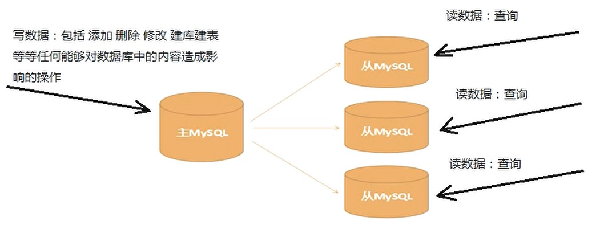
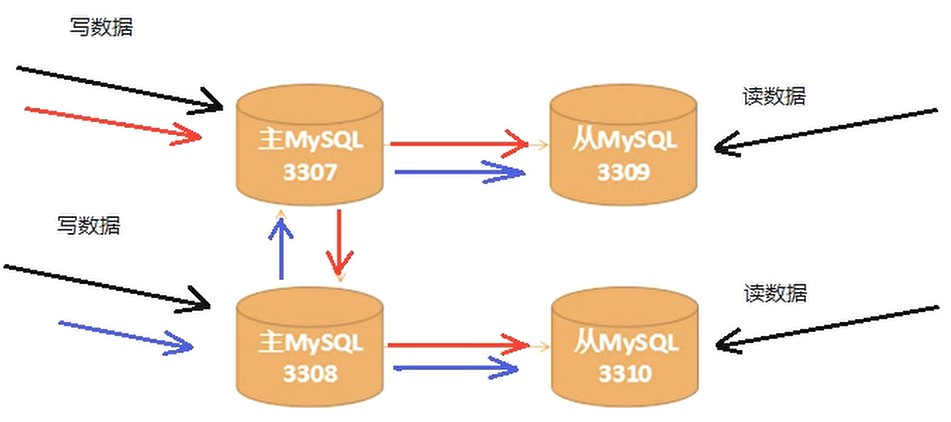
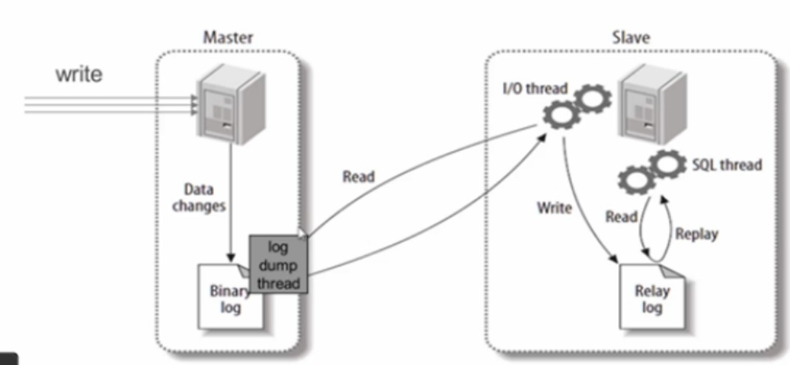

# MySQL集群

## 1 主从复制
### 1.1 概述
1. **主从复制（master-slave）**：服务器分为主服务器和从服务器，主服务器负责 **读** 和 **写**，从服务器只负责 **读**
    - 可以实现对数据库的备份和读写分离
    - 避免服务的不可用，保障数据的安全可靠性
2. 架构：
    1. 一主多从：
    2. 双主双从：
        - 从机依赖于主机，一旦主机宕机，从机也无法使用
3. 流程：
    ```mermaid
    graph TB
    detect[Slave 探测 Master 的二进制日志文件] --> if{日志文件是否更新} --偏移量相同--> detect
    if --偏移量不同--> 
    slave_request[Slave 启动I/O线程，向 Master 请求偏移量差值间的所有数据] --> 
    master_response[Master 启动dump线程，推送数据到 Slave] --> 
    slave_update[Slave 接收到数据后，更新偏移量与中继日志文件，再挂起I/O线程] --> 
    slave_replay[Slave 启动SQL线程，根据中继日志在数据库中回放，完成后挂起SQL线程] --等待下一次被唤醒--> if
    ```
    - 主库和从库都需要记录自身的偏移量，以便于同步数据
    - 日志文件中记录的是主库所执行的sql语句

### 1.2 MySQL多实例
1. 多实例：一台服务器上同时启动多个数据库（实例），不需要安装多个数据库
2. 实现方式：为各个数据库实例配置独立的配置文件
    1. 初始化数据库：需要指定存放数据的目录
        ```bash showLineNumbers
        ./mysqld --initialize-insecure --datadir=
        ```
    2. 创建配置文件：`*.cnf`
    3. 启动服务：需要指定配置文件
        ```bash showLineNumbers
        ./mysqld_safe --defaults-file= &
        ```
3. 配置 **一主多从**：
    1. 设置配置文件 `*.cnf`：
        ```properties showLineNumbers
        # （仅主服务器需要该配置项）启用主服务器的二进制日志
        log-bin=mysql-bin
        server-id=3308
        ```
    2. 主服务器客户端：
        ```sql showLineNumbers
        # 创建复制数据的账号并授权
        grant replication slave on *.* to 'copy_username'@'%' identified by 'password';

        # 查看主服务器的状态，Position初始值为154
        show master status;

        # 重置主服务器的状态
        reset master;
        ```
    3. 从服务器客户端：
        ```sql showLineNumbers
        # 查看从服务器的状态
        reset slave status;

        # 重置从服务器的状态
        reset slave;

        # 设置从服务器的master服务器
        change master to master_host='',master_port=,master_user='copy_username',master_password='password',master_log_file='mysql-bin.000001',master_log_pos=154;

        # 开始执行复制命令
        start slave;

        # 检查从服务器复制功能的状态
        show slave status \G;
        ```
        - `Slave_IO_Running` 和 `Slave_SQL_Running` 均为 `YES` &rarr; 主从关系正常
4. 配置 **双主双从**：
    1. 设置配置文件 `*.cnf`：
        ```properties showLineNumbers
        # （仅主服务器需要该配置项）启用主服务器的二进制日志
        log-bin=mysql-bin
        server-id=3308

        # 主键自增步长
        auto_increment_increment=2
        # 主键自增起始值
        auto_increment_offset=1
        # 主服务器之间同步数据时会更新二进制日志，以便于从服务器更新数据
        log-slave-updates
        # 每提交1次事务，数据库就会把binlog缓存刷进日志文件中
        sync_binlog=1
        ```
        - n台主服务器，则设置 `auto_increment_increment=n` &rarr; 防止主服务器之间在复制数据时出现重复的自增主键值
        - `sync_binlog=0`：当事务提交之后，数据库不做fsync之类的磁盘同步指令刷新binlog_cache中的信息到磁盘，而是让Filesystem自行决定什么时候来做同步，或者cache满了之后才同步到磁盘
    2. 主/从服务器客户端命令同 **一主多从**
    3. 主键为自增类型时，主键会取当下同步到的所有数据中的最大值，与当前表的自增起始值和步长一同决定最新主键值（不一定会按照起始值开始递增 &rarr; 避免影响已有索引）

---

## 2 多数据源
### 2.1 JDBC
1. 编写多个 `getConnection`，分别连接不同的数据库即可

### 2.2 Hibernate（SSH）

### 2.3 Mybatis（SSM）
1. Spring + Mybatis：
    1. 配置多数据源（静态）：需要准备多套Mapper来隔离读写操作（存在重复代码），需要手动切换主从服务器来进行读写操作，无法自动负载均衡和故障转移
        ```xml showLineNumbers
        <!-- 配置数据源 -->
        <bean id="dataSourceId" class="com.alibaba.druid.pool.DruidDataSource">
            <property name="url" value="jdbc:mysql://ip:port/database"/>
            <property name="driverClassName" value="com.mysql.jdbc.Driver"/>
            <property name="username" value="username"/>
            <property name="password" value="password"/>
        </bean>

        <!-- 配置连接工厂 -->
        <bean id="sqlSessionFactoryBeanName" class="org.mybatis.spring.SqlSessionFactoryBean">
            <property name="dataSource" ref="dataSourceId"/>
        </bean>

        <!-- 配置mapper的包扫描 -->
        <bean class="org.mybatis.spring.mapper.MapperScannerConfigurer">
            <property name="sqlSessionFactoryBeanName" value="sqlSessionFactoryBeanName"/>
            <property name="basePackage" value="custom.mapper.mapperPackageName"/>
        </bean>
        ```
    2. 配置多数据源（动态）：需要自定义动态数据源的类，需要手动设置数据源值来进行读写操作，无法自动负载均衡和故障转移
        ```xml showLineNumbers
        <!-- 配置数据源 -->
        <bean id="dataSourceId" class="com.alibaba.druid.pool.DruidDataSource">
            <property name="url" value="jdbc:mysql://ip:port/database"/>
            <property name="driverClassName" value="com.mysql.jdbc.Driver"/>
            <property name="username" value="username"/>
            <property name="password" value="password"/>
        </bean>

        <!-- 配置动态数据源 -->
        <bean id="dynamicDataSourceId" class="custom.dynamic.DynamicDataSource">
            <property name="targetDataSources">
                <map>
                    <entry key="dataSourceKey" value-ref="dataSourceId"/>
                </map>
            </property>
        </bean>

        <!-- 配置连接工厂 -->
        <bean id="sqlSessionFactoryBeanName" class="org.mybatis.spring.SqlSessionFactoryBean">
            <property name="dataSource" ref="dynamicDataSourceId"/>
        </bean>

        <!-- 配置mapper的包扫描 -->
        <bean class="org.mybatis.spring.mapper.MapperScannerConfigurer">
            <property name="sqlSessionFactoryBeanName" value="sqlSessionFactoryBeanName"/>
            <property name="basePackage" value="custom.mapper.mapperPackageName"/>
        </bean>
        ```
2. SpringBoot + Mybatis：
    1. 配置多数据源（静态）：仍存在上述问题
        ```properties showLineNumbers
        spring.datasource.masterUrl=jdbc:mysql://ip:port/database
        spring.datasource.masterDriver=com.mysql.cj.jdbc.Driver
        spring.datasource.masterUsername=username
        spring.datasource.masterPassword=password
        ```
        ```java showLineNumbers
        @Configuration
        @MapperScan(basePackages="custom.mapper.mapperPackageName", sqlSessionTemplateRef = "sqlSessionTemplateName")
        public class CustomDataSource {
            // 自定义属性的映射类
            @Autowired
            private DataSourceConfigInfo dataSourceConfigInfo;

            /** 配置数据源：
                <bean id="dataSourceId" class="com.alibaba.druid.pool.DruidDataSource">
                    <property name="url" value="jdbc:mysql://ip:port/database"/>
                    <property name="driverClassName" value="com.mysql.jdbc.Driver"/>
                    <property name="username" value="username"/>
                    <property name="password" value="password"/>
                </bean>
            */
            @Bean
            public DruidDataSource dataSourceId(){
                DruidDataSource druidDataSource = new DruidDataSource();
                druidDataSource.setUrl(dataSourceConfigInfo.getMasterUrl());
                druidDataSource.setDriverClassName(dataSourceConfigInfo.getMasterDriver());
                druidDataSource.setUsername(dataSourceConfigInfo.getMasterUsername());
                druidDataSource.setPassword(dataSourceConfigInfo.getMasterPassword());
                return druidDataSource;
            }

            /** 配置连接工厂：
                <bean id="sqlSessionFactoryBeanName" class="org.mybatis.spring.SqlSessionFactoryBean">
                    <property name="dataSource" ref="dataSourceId"/>
                </bean>
            */
            @Bean
            public SqlSessionFactoryBean sqlSessionFactoryBeanName(){
                SqlSessionFactoryBean sqlSessionFactoryBean = new SqlSessionFactoryBean();
                sqlSessionFactoryBean.setDataSource(dataSourceId());
                return sqlSessionFactoryBean;
            }

            /** 配置mapper的包扫描：
                <bean class="org.mybatis.spring.mapper.MapperScannerConfigurer">
                    <property name="sqlSessionFactoryBeanName" value="sqlSessionFactoryBeanName"/>
                    <property name="basePackage" value="custom.mapper.mapperPackageName"/>
                </bean>

                注：在SpringBoot中，需要 SqlSessionTemplate + @MapperScan 配合实现
            */
            @Bean
            public SqlSessionTemplate sqlSessionTemplateName() throws Exception{
                SqlSessionTemplate sqlSessionTemplate = new SqlSessionTemplate(sqlSessionFactoryBeanName().getObject());
                return sqlSessionTemplate;
            }
        }
        ```
    2. 配置多数据源（动态）：仍存在上述问题
        ```properties showLineNumbers
        spring.datasource.masterUrl=jdbc:mysql://ip:port/database
        spring.datasource.masterDriver=com.mysql.cj.jdbc.Driver
        spring.datasource.masterUsername=username
        spring.datasource.masterPassword=password
        ```
        ```java showLineNumbers
        @Configuration
        @MapperScan(basePackages="custom.mapper.mapperPackageName", sqlSessionTemplateRef = "sqlSessionTemplateName")
        public class CustomDataSource {
            // 自定义属性的映射类
            @Autowired
            private DataSourceConfigInfo dataSourceConfigInfo;

            /** 配置数据源：
                <bean id="dataSourceId" class="com.alibaba.druid.pool.DruidDataSource">
                    <property name="url" value="jdbc:mysql://ip:port/database"/>
                    <property name="driverClassName" value="com.mysql.jdbc.Driver"/>
                    <property name="username" value="username"/>
                    <property name="password" value="password"/>
                </bean>
            */
            @Bean
            public DruidDataSource dataSourceId(){
                DruidDataSource druidDataSource = new DruidDataSource();
                druidDataSource.setUrl(dataSourceConfigInfo.getMasterUrl());
                druidDataSource.setDriverClassName(dataSourceConfigInfo.getMasterDriver());
                druidDataSource.setUsername(dataSourceConfigInfo.getMasterUsername());
                druidDataSource.setPassword(dataSourceConfigInfo.getMasterPassword());
                return druidDataSource;
            }

            /** 配置动态数据源：
                <bean id="dynamicDataSourceId" class="custom.dynamic.DynamicDataSource">
                    <property name="targetDataSources">
                        <map>
                            <entry key="dataSourceKey" value-ref="dataSourceId"/>
                        </map>
                    </property>
                </bean>
            */
            @Bean
            public DynamicDataSource dynamicDataSourceId(){
                DynamicDataSource dynamicDataSource = new DynamicDataSource();
                Map<Object, Object> targetDataSources = new ConcurrentHashMap<Object, Object>();
                targetDataSources.put(DynamicDataSource.DATASOURCE_KEY, dataSourceId());
                dynamicDataSource.setTargetDataSources(targetDataSources);
                return dynamicDataSource;
            }

            /** 配置连接工厂：
                <bean id="sqlSessionFactoryBeanName" class="org.mybatis.spring.SqlSessionFactoryBean">
                    <property name="dataSource" ref="dynamicDataSourceId"/>
                </bean>
            */
            @Bean
            public SqlSessionFactoryBean sqlSessionFactoryBeanName(){
                SqlSessionFactoryBean sqlSessionFactoryBean = new SqlSessionFactoryBean();
                sqlSessionFactoryBean.setDataSource(dynamicDataSourceId());
                return sqlSessionFactoryBean;
            }

            /** 配置mapper的包扫描：
                <bean class="org.mybatis.spring.mapper.MapperScannerConfigurer">
                    <property name="sqlSessionFactoryBeanName" value="sqlSessionFactoryBeanName"/>
                    <property name="basePackage" value="custom.mapper.mapperPackageName"/>
                </bean>

                注：在SpringBoot中，需要 SqlSessionTemplate + @MapperScan 配合实现
            */
            @Bean
            public SqlSessionTemplate sqlSessionTemplateName() throws Exception{
                SqlSessionTemplate sqlSessionTemplate = new SqlSessionTemplate(sqlSessionFactoryBeanName().getObject());
                return sqlSessionTemplate;
            }
        }
        ```