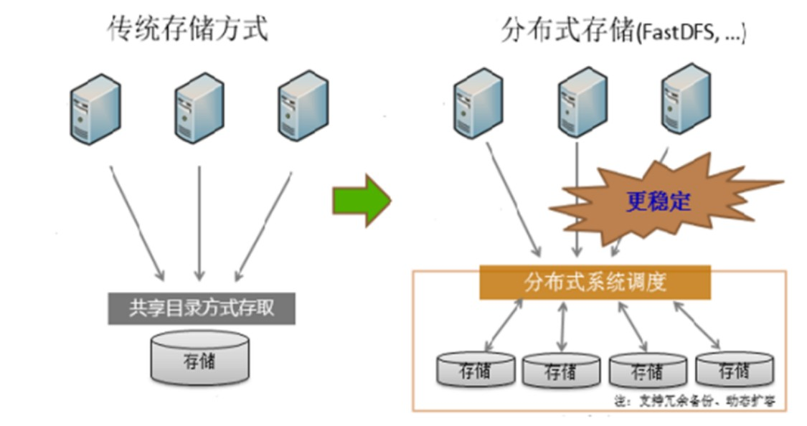
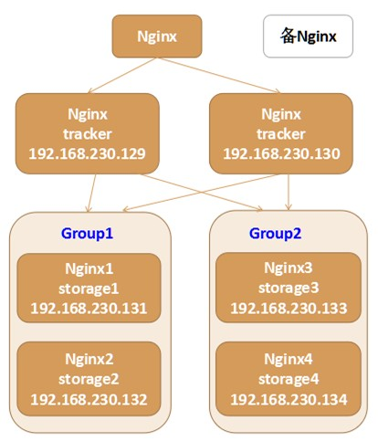

# FastDFS

## 1 简介
### 1.1 相关概念
1. 分布式文件系统（Distributed File System）：一个软件/软件服务器，用来存储文件资源和管理文件
    - 常见的有：FastDFS、GFS、HDFS、Lustre、Ceph、GridFS、mogileFS、TFS等
2. 传统和分布式文件系统的区别：
    1. 传统方式的缺点：
        1. 若文件服务器宕机，服务不可用，所有文件均不可上传和下载
        2. 若文件服务器磁盘损坏，会丢失所有的文件
        3. 单台文件服务器的磁盘空间非常有限，容易达到磁盘上限
    2. 分布式的优点：
        1. 某一节点出现故障时，还有其他节点来读取和写入文件
        2. 提供数据备份，避免磁盘损坏导致的文件丢失
        3. 提供库容机制，可无限增加文件存放的空间上限
3. FastDFS：开源的轻量级分布式文件系统
    - 功能：文件存储、文件同步、文件访问（文件上传、文件下载、文件删除）等，具有冗余备份、线性扩容等机制
    - 整体架构：
        1. 客户端：即程序，FastDFS提供了对应的API来访问
        2. 服务端：
            1. **<font color="red">跟踪器tracker</font>**：用于 **调度**，在 **内存** 中记录集群中存储节点storage的状态信息，性能高
            2. **<font color="red">存储节点storage</font>**：用于 **存储** 文件，文件本身以及属性（meta data）都保存在服务器磁盘上

### 1.2 安装、启动及相关命令
1. 依赖库：
    ```bash showLineNumbers
    # 检查相关库是否安装
    yum list installed | grep gcc
    yum list installed | grep libevent
    yum list installed | grep libevent-devel

    # 安装依赖库
    yum install gcc libevent libevent-devel -y
    ```
2. 安装：
    ```bash showLineNumbers
    # libfastcommon：FastDFS文件系统运行需要的公共C语言函数库
    # 编译
    ./libfastcommon-1.0.36/make.sh
    # 安装
    ./libfastcommon-1.0.36/make.sh install

    # fastdfs文件系统
    # 编译
    ./fastdfs-5.11/make.sh
    # 安装
    ./fastdfs-5.11/make.sh install
    ```
3. 配置文件：
    1. `tracker.conf`：
        ```properties showLineNumbers
        # tracker存储数据的目录
        base_path=/opt/fastdfs-5.11/tracker/logs
        ```
    2. `storage.conf`：
        ```properties showLineNumbers
        # storage存储数据目录
        base_path=/opt/fastdfs/storage
        # 真正存放文件的目录
        store_path0=/opt/fastdfs-5.11/storage/files
        # 注册当前存储节点的tracker地址
        tracker_server=ip:port
        ```
4. 命令：
    1. 操作跟踪器：`fdfs_trackerd <config_file> [start | stop | restart]`
    2. 操作存储节点：`fdfs_storaged <config_file> [start | stop | restart]`
    3. 测试：`fdfs_test <config_file> <operation>`
        1. 上传：`fdfs_test <config_file> upload <local_filename> [FILE | BUFF | CALLBACK]`
            - `remote_filename=M00/00/00/filename`：路径等同于 `store_path/00/00`
            - 后缀`-m`：对应文件的属性文件
        2. 下载：`fdfs_test <config_file> download <group_name> <remote_filename>`
        3. 删除：`fdfs_test <config_file> delete <group_name> <remote_filename>`

### 1.3 HTTP访问
1. Nginx扩展模块：通过Nginx访问已经上传到FastDFS服务器上的文件
2. 访问过程：
    ```mermaid
    graph TB
    浏览器 --发送请求（文件路径）--> nginx[nginx代理服务器（执行扩展模块解析文件路径）] --询问组名--> tracker[跟踪服务器]
    tracker --组所在的IP和端口--> nginx --请求文件--> storage[存储服务器]
    storage --返回文件流--> nginx
    ```

---

## 2 实践
### 2.1 在java中的应用
1. 由于maven仓库中未录入，需要自行本地打包安装
2. 上传文件：
    ```java showLineNumbers
    public static void upload() {
        ClientGlobal.init("fastdfs.conf");
        TrackerClient trackerClient = new TrackerClient();
        try (TrackerServer trackerServer = trackerClient.getConnection();
             StorageServer storageServer = trackerClient.getStoreStorage(trackerServer);) {
            StorageClient storageClient = new StorageClient(trackerServer, storageServer);

            String[] result = storageClient.upload_file("absoluteFilePath", "fileExtensionName", "fileAttributes");
            // 返回结果：1. 文件所在的组名；2. 文件在远程上的路径
            for (String str : result) {
                System.out.println(str);
            }
        } catch (IOException e) {
            e.printStackTrace();
        }
    }
    ```
3. 下载文件：
    ```java showLineNumbers
    public static void download() {
        ClientGlobal.init("fastdfs.conf");
        TrackerClient trackerClient = new TrackerClient();
        try (TrackerServer trackerServer = trackerClient.getConnection();
             StorageServer storageServer = trackerClient.getStoreStorage(trackerServer);) {
            StorageClient storageClient = new StorageClient(trackerServer, storageServer);
            int result = storageClient.download_file("groupName", "remoteFileName", "localFileName");
            // 0：下载成功；其他值：下载失败
            System.out.println(result);
        } catch (IOException e) {
            e.printStackTrace();
        }
    }
    ```
4. 删除文件：
    ```java showLineNumbers
    public static void delete() {
        ClientGlobal.init("fastdfs.conf");
        TrackerClient trackerClient = new TrackerClient();
        try (TrackerServer trackerServer = trackerClient.getConnection();
             StorageServer storageServer = trackerClient.getStoreStorage(trackerServer);) {
            StorageClient storageClient = new StorageClient(trackerServer, storageServer);
            int result = storageClient.delete_file("groupName", "remoteFileName");
            // 0：删除成功；其他值：删除失败
            System.out.println(result);
        } catch (IOException e) {
            e.printStackTrace();
        }
    }
    ```

### 2.2 在web项目中的应用（略）

### 2.3 搭建FastDFS分布式文件系统集群
1. 架构图：至少需要部署6个服务器节点  
    
2. 搭建步骤：
    1. 安装6个Linux，准备好工具库，安装好FastDFS和nginx
    2. 部署2个 `tracker` 服务器
    3. 修改4个 `storage` 服务器中的 `storage.conf` 文件
    4. 配置 `tracker` 和 `storage` 服务器的nginx
    5. 修改4个 `storage` 服务器中的 `mod_fasfdfs.conf` 文件
    6. 部署前端用户访问入口服务器，测试