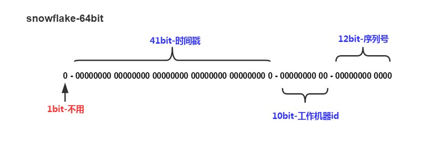

# MyCAT2

## 1. 简介
### 1.1. 相关概念
1. MyCAT：一个分布式数据库中间插件，核心功能是 **分表分库**，即将一张大表水平分割成N张小表
    - 支持MySQL、SQL Server、Oracle、DB2、PostgreSQL等主流数据库，也支持MongoDB这种新型NoSQL方式的存储
    - 仍是传统的数据库表，支持标准的SQL语句对数据进行操作
    - 与数据库的区别：**数据库** 是对底层存储文件的抽象，而 **<font color="red">MyCAT</font>是对数据库的抽象**
2. 解决问题的具体方式：
    1. 容量大 &larr; 分库分表
    2. 查询速度快 &larr; 并行查询（查询速度固定为 `log(n)`）
    3. 读写分离
3. 原理：
    ```mermaid
    graph TB
    拦截请求的SQL语句 --> analysis[对SQL语句做分析（分片、路由、读写分离、缓存分析等）] --> 将SQL语句发送到数据库 --> 返回结果
    ```

### 1.2. 相关名词
1. 分库分表：按照一定规则把数据库中的表拆分为多个带有数据库实例、物理库、物理表访问路径的分表
2. **逻辑库**：数据库代理中的数据库，包含多个逻辑表
3. 逻辑表：数据库代理中的表，用来映射代理连接的数据库中的物理表
4. **物理库**：数据库代理连接的数据库中的库
5. 物理表：数据库代理连接的数据库中的表
6. 拆分键/分片键：描述拆分逻辑表的数据规则的字段
7. 分区键：使用等值查询时，能直接映射一个分区的拆分键
8. 物理分表：已经进行数据拆分的、在数据库上面的物理表
9. 物理分库：包含多个物理分表的库
10. 分片表/水平分片表：按照一定规则把数据拆分成多个分区的表
11. 全局表/广播表：每个数据库实例中都冗余全量数据的逻辑表
12. 集群：多个数据节点组成的逻辑节点（在MyCAT2中，提供自动故障恢复、转移，即实现高可用、负载均衡的组件）
13. 数据源：数据库代理中连接后端数据库的客户端
14. 库schema：用于配置表逻辑、视图等

### 1.3. 安装
1. 安装命令：
    ```bash showLineNumbers
    # 安装JDK
    yum -y install java-1.8.0-openjdk.x86_64

    # 下载安装包
    wget http://dl.mycat.org.cn/2.0/install-template/mycat2-install-template-1.21.zip
    wget http://dl.mycat.org.cn/2.0/1.21-release/mycat2-1.21-release-jar-with-dependencies.jar

    # 解压、修改权限等后续操作
    ```
2. 启动前配置 `mycat/conf/datasources/prototypeDs.datasource.json` 中的数据库信息
3. 相关命令：
    ```bash showLineNumbers
    cd /data/mycat/bin
    # 启动
    ./mycat start
    # 停止
    ./mycat stop
    # 前台运行
    ./mycat console
    # 添加到系统自动启动
    ./mycat install
    # 取消随系统自动启动
    ./mycat remove
    # 重启
    ./mycat restart
    # 暂停
    ./mycat pause
    # 查看启动状态
    ./mycat status
    ```

### 1.4. 配置文件
1. 用户（user）：`mycat/conf/user/{username}.user.json`
    ```json showLineNumbers
    {
        "dialect":"mysql",
        // 白名单
        "ip":null,
        "transactionType":"proxy",
        "username":"root",
        "password":"123456",
        // 初始化的事务隔离级别，1-READ_UNCOMMITTED，2-READ_COMMITTED，3-REPEATED_READ，4-SERIALIZABLE
        "isolation":3
    }
    ```
2. 数据源（datasource）：`mycat/conf/datasources/{dataSource}.datasource.json`
    ```json showLineNumbers
    {
        "dbType": "mysql",
        "idleTimeout": 60000,
        "initSqls": [],
        "initSqlsGetConnection": true,
        "instanceType": "READ_WRITE",
        "maxCon": 1000,
        "maxConnectTimeout": 3000,
        "maxRetryCount": 5,
        "minCon": 1,
        // 数据源名称
        "name": "prototype",
        // 数据源负载均衡的使用权重
        "weight": 0,
        // 单位为毫秒
        "queryTimeout":30,
        "type": "JDBC",
        "url": "jdbc:mysql://ip:port/database?useUnicode=true&serverTimezone=UTC",
        "user": "root",
        "password": "123456",
    }
    ```
3. 逻辑库与逻辑表（logicaltable）：`mycat/conf/schemas/{database}.schema.json`
4. 序列号（sequence）：`mycat/conf/sequences/{database}_{table}.sequence.json`
5. 服务器（server）
6. **注释配置**：
    ```sql showLineNumbers
    -- 重置配置
    /*+ mycat:resetConfig{} */

    -- 创建用户
    /*+ mycat:createUser{"username":"", …} */
    -- 删除用户
    /*+ mycat:dropUser{"username":""} */
    -- 显示用户
    /*+ mycat:showUsers */

    -- 创建数据源
    /*+ mycat:createDataSource{"dbType":"mysql", …} */
    -- 删除数据源
    /*+ mycat:dropDataSource{"dbType":"mysql", …} */
    -- 显示数据源
    /*+ mycat:showDataSources{} */

    -- 创建集群
    /*! mycat:createCluster{"clusterType":"MASTER_SLAVE", …} */
    -- 删除集群
    /*! mycat:dropCluster{"name":""} */
    -- 显示集群
    /*+ mycat:showClusters{} */
    ```

---

## 2. 实践
### 2.1. 一主一从
1. MyCAT只支持路由、分发，但不能同步数据 &rarr; 用MySQL的读写分离和主从复制来实现数据同步
2. 实现步骤：
    1. 搭建MySQL的一主一从架构
    2. 配置MyCAT：
        1. 添加读写类型（主服务器）和读类型（从服务器）的数据源：`"instanceType":"READ_WRITE/READ"`
        2. 创建集群：`"masters":["masterDataSourceName"], "replicas":["slaveDataSourceName"]`
        3. 创建逻辑库：`CREATE DATABASE databaseName DEFAULT CHARACTER SET utf8mb4 COLLATE utf8mb4_general_ci;`
        4. 通过注释生成物理库和物理表：`/*+ mycat:repairPhysicalTable{} */;`

### 2.2. 双主双从
1. 集群（Cluster）：在付出较低成本的情况下，获得在性能、可靠性、灵活性方面的相对较高的收益，其核心技术是 **任务调度**
    - 优点：高可伸缩性、高可用性
    - 缺点：出故障时切换需要一定时间
2. 实现步骤类似 `2.1 一主一从` 的实现步骤

### 2.3. 分库分表
1. 切分维度：
    - 垂直切分：基于表或字段划分，表结构不同 &rarr; 分库
    - 水平切分：基于数据划分，表结构相同，数据不同 &rarr; 分表
2. 配置全局表：`BROADCAST` 即全局表的标记
    ```sql showLineNumbers
    CREATE TABLE `table` (
        `id` bigint NOT NULL AUTO_INCREMENT,
        `name` varchar(100),
        PRIMARY KEY (`id`)
    ) ENGINE=InnoDB DEFAULT CHARSET=utf8mb4 BROADCAST;
    ```
3. 配置分片表：
    ```sql showLineNumbers
    CREATE TABLE `table` (
        `id` bigint NOT NULL AUTO_INCREMENT,
        `name` varchar(100),
        PRIMARY KEY (`id`)
    ) ENGINE=InnoDB DEFAULT CHARSET=utf8mb4
    dbpartition BY MOD_HASH(id) dbpartitions 2
    tbpartition By MOD_HASH(id) tbpartitions 1;
    ```
    - `dbpartition BY mod_hash(field_id)`：指定数据库的分片算法和分片字段
    - `tbpartition BY mod_hash(field_id)`：指定表的分片算法和分片字段
    - `dbpartitions n`：数据库的分片数量
    - `tbpartitions n`：表的分片数量
4. ER表：MyCAT2在涉及到多表JOIN时，会自动识别ER关系进行JOIN的下推
    - 查看表之间的ER关系：`/*+ mycat:showErGroup{}*/`
5. 分片算法：
    1. 取模哈希 `MOD_HASH`：支持数值、字符串类型
        ```sql showLineNumbers
        create table (…)
        dbpartition by MOD_HASH(field) dbpartitions dbnum
        tbpartition by MOD_HASH(field) tbpartitions tbnum;
        ```
        - 分库键和分表键是同键时：分表下标 = 分片值 % (分库数量 &times; 分表数量)，分库下标 = 分表下标 &divide; 分表数量
        - 分库键和分表键是不同键时：分表下标 = 分片值 % 分表数量，分库下标 = 分片值 % 分库数量
    2. 范围哈希 `RANGE_HASH`：支持数值、字符串类型
        ```sql showLineNumbers
        create table (…)
        dbpartition by RANGE_HASH(field1, field2, startIndex) dbpartitions dbnum
        tbpartition by RANGE_HASH(field1, field2, startIndex) tbpartitions tbnum;
        ```
        - 计算时候优先选择第一个字段 `field1`，找不到选择第二个字段 `field2`
        - 两个字段的数据类型要求一致
        - 数值类型时，按分片数取余
        - 字符串类型时，第三个参数 `startIndex` 才生效
    3. 字符串哈希 `UNI_HASH`：支持数值、字符串类型
        ```sql showLineNumbers
        create table (…)
        dbpartition by UNI_HASH(field) dbpartitions dbnum
        tbpartition by UNI_HASH(field) tbpartitions tbnum;
        ```
        - 分库键和分表键是同键时：分表下标 = (分片值 % 分库数量) &times; 分表数量 + (分片值 &divide; 分库数量) % 分表数量，分库下标 = 分片值 % 分库数量
        - 分库键和分表键是不同键时：分表下标 = 分片值 % 分表数量，分库下标 = 分片值 % 分库数量
    4. 日期哈希 `YYYYDD`：支持DATE、DATETIME类型
        ```sql showLineNumbers
        create table (…)
        dbpartition by YYYYDD(field) dbpartitions dbnum
        tbpartition by YYYYDD(field) tbpartitions tbnum;
        ```

### 2.4. 其他
1. 全局ID：MyCAT2中，默认使用 **<font color="red">雪花算法</font>** 生成全局ID
    
    - 符号位 `1bit`：0表示正数（ID不可能为负数）
    - 时间戳 `41bit`：最大约69年（$2^{41}$）
    - 工作机器ID `10bit`：由 **n** 位 `datacenterId` 和 **(10-n)** 位 `workerId` 组成
    - 序列号 `12bit`：毫秒内的计数顺序号，最大为4096个（$2^{12}$）
2. MyCAT2工具：[assistant-1.22-release-jar-with-dependencies-2022-5-26.jar](http://dl.mycat.org.cn/2.0/ui/)