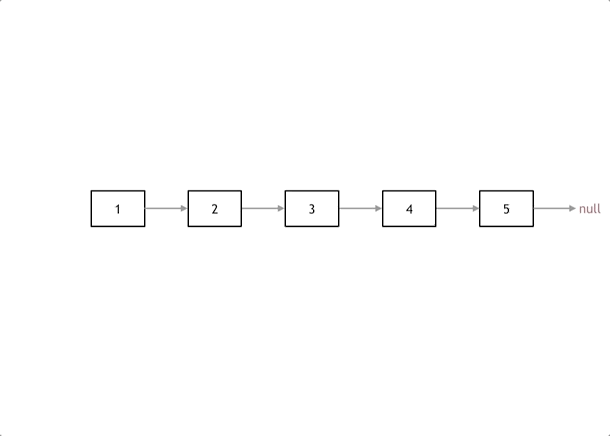

# 2. 链表

## 1 链表理论基础
1. 通过指针串在一起的线性结构，`节点node = 数据域data + 指针域next`，头节点为head
2. 类型：
    1. **<font color="red">单链表</font>**：指针只能指向下一个节点
        
    2. **<font color="red">双链表</font>**：指针可以指向前一个节点，也能指向后一个节点（既可向前查询，又可向后查询）
        
    3. **<font color="red">循环链表</font>**：链表首尾相连（可解决**约瑟夫环**问题）
        
3. 存储方式：散乱分布，只由指针链接（如何分配取决于内存管理）
4. 定义：
    ```cpp showLineNumbers
    struct ListNode { // 单链表
        int value;
        ListNode *next;
        ListNode(int x) : value(x), next(nullptr) {} // 构造函数
    };
    ```
5. 操作：
    1. **删除节点**：将前一个节点的next指针指向后一个节点（c++中需要手动释放删除节点的内存；java中有自己的内存回收机制，因此不需要手动）
        
    2. **添加节点**：修改节点指针域
        

---

## 2 移除链表元素

> 【[LC203](https://leetcode.cn/problems/remove-linked-list-elements/description/)】给你一个链表的头节点 head 和一个整数 val，请你删除链表中所有满足 Node.val == val 的节点，并返回新的头节点。

1. 删除头节点要分情况讨论：
    1. 直接在原来的链表上操作：需要区分头节点和非头节点的处理方式
    ```cpp showLineNumbers
    class Solution {
    public:
        ListNode* removeElements(ListNode* head, int val) {
            // 1. 删除头节点
            // 这里不是if，而是while，因为要删除满足条件的所有头节点
            while (head != nullptr && head->val == val) {
                // 删除多余节点，手动释放内存
                ListNode* tmp = head;
                head = head->next;
                delete tmp;
            }

            // 2. 删除非头节点
            ListNode* cur = head;
            while (cur != nullptr && cur->next != nullptr) {
                if (cur->next->val == val) {
                    ListNode* tmp = cur->next;
                    cur->next = (cur->next)->next;
                    delete tmp;
                } else {
                    cur = cur->next;
                }
            }
            return head;
        }
    };
    ```
    2. 设置一个 **<font color="red">虚拟头节点</font>** 进行删除操作：统一处理
    ```cpp showLineNumbers
    class Solution {
    public:
        ListNode* removeElements(ListNode* head, int val) {
            // 设置虚拟头节点
            ListNode* dummyHead = new ListNode(0);
            dummyHead->next = head;

            ListNode* cur = dummyHead;
            while (cur != nullptr && cur->next != nullptr) {
                if (cur->next->val == val) {
                    ListNode* tmp = cur->next;
                    cur->next = (cur->next)->next;
                    delete tmp;
                } else {
                    cur = cur->next;
                }
            }
            // 返回的是虚拟头节点指向的节点
            return dummyHead->next;
        }
    };
    ```

:::tip
删除节点后，最好释放内存，否则容易内存溢出！
:::

---

## 3 设计链表

> 【[LC707](https://leetcode.cn/problems/design-linked-list/description/)】你可以选择使用单链表或者双链表，设计并实现自己的链表。单链表中的节点应该具备两个属性：val 和 next 。val 是当前节点的值，next 是指向下一个节点的指针/引用。如果是双向链表，则还需要属性 prev 以指示链表中的上一个节点。假设链表中的所有节点下标从 0 开始。实现 MyLinkedList 类：
> - MyLinkedList() 初始化 MyLinkedList 对象。
> - int get(int index) 获取链表中下标为 index 的节点的值。如果下标无效，则返回 -1 。
> - void addAtHead(int val) 将一个值为 val 的节点插入到链表中第一个元素之前。在插入完成后，新节点会成为链表的第一个节点。
> - void addAtTail(int val) 将一个值为 val 的节点追加到链表中作为链表的最后一个元素。
> - void addAtIndex(int index, int val) 将一个值为 val 的节点插入到链表中下标为 index 的节点之前。如果 index 等于链表的长度，那么该节点会被追加到链表的末尾。如果 index 比长度更大，该节点将 不会插入 到链表中。
> - void deleteAtIndex(int index) 如果下标有效，则删除链表中下标为 index 的节点。

1. 声明定义：需要声明私有变量
```cpp showLineNumbers
class MyLinkedList {
public:
    // 定义链表节点结构体
    struct LinkedNode {
        int val;
        LinkedNode* next;
        LinkedNode(int val) : val(val), next(nullptr) {}
    };

    // 初始化链表
    MyLinkedList() {
        // 定义虚拟头节点（不是真正的头节点）
        _dummyHead = new LinkedNode(0);
        _size = 0;
    }

private:
    int _size;
    LinkedNode* _dummyHead;
};
```

---

## 4 翻转链表

> 【[LC206](https://leetcode.cn/problems/reverse-linked-list/description/)】给你单链表的头节点 head ，请你反转链表，并返回反转后的链表。

1. 改变链表节点的next指针指向，将链表翻转，而不用重新定义一个新的链表，浪费内存空间
    
```cpp showLineNumbers
class Solution {
public:
    ListNode* reverseList(ListNode* head) {
        ListNode* cur = head;
        ListNode* prev = nullptr;
        while (cur) {
            // 用于保存下一个节点
            ListNode* tmp = cur->next;
            // 翻转
            cur->next = prev;
            // 更新指针
            prev = cur;
            cur = tmp;
        }
        return prev;
    }
};
```

---

## 5 两两交换链表中的节点

> 【[LC24](https://leetcode.cn/problems/swap-nodes-in-pairs/description/)】给你一个链表，两两交换其中相邻的节点，并返回交换后链表的头节点。你必须在不修改节点内部的值的情况下完成本题（即，只能进行节点交换）。


:::tip
使用虚拟头节点，方便操作，否则还要单独处理头节点
:::

```cpp showLineNumbers
class Solution {
public:
    ListNode* swapPairs(ListNode* head) {
        ListNode* dummyHead = new ListNode(0);
        dummyHead->next = head;
        ListNode* pointer = dummyHead;
        // 避免奇数个节点
        while (pointer->next != nullptr && pointer->next->next != nullptr) {
            // 声明定义
            ListNode* cur = pointer->next;
            ListNode* prev = cur->next;
            ListNode* next = prev->next;

            // 对链表的指针赋值
            pointer->next = prev;
            pointer->next->next = cur;
            pointer->next->next->next = next;

            // 移动指针，准备下一轮交换
            // 注：使用虚拟头节点时，需要将指针定位在下一轮需要交换的节点的前一个节点
            pointer = pointer->next->next;
        }
        ListNode* resultHead = dummyHead->next;
        // 释放虚拟头节点的内存空间
        delete dummyHead;
        return resultHead;
    }
};
```

---

## 6 删除链表的倒数第N个节点

> 【[LC19](https://leetcode.cn/problems/remove-nth-node-from-end-of-list/description/)】给你一个链表，删除链表的倒数第 n 个节点，并且返回链表的头节点。

1. 自想解法：遍历链表；使用双指针，但是不知道怎么实现
2. **双指针** 的经典应用：让fast指针移动 **<font color="red">n+1</font>** 个节点，再让fast指针和slow指针同时移动，直到fast指针指向链表末尾。此时，删除slow指针指向的节点即可。
    1. 移动n个节点：当fast指针移动到链表末尾时，slow指针也会移动到倒数第n个节点的位置 &rarr; 确保双指针之间的间隔
    2. 移动1个节点：由于删除节点的操作是需要定位在上一个节点上，改变上一个节点的指针指向，即可删除要删除的节点 &rarr; 确保slow指针最终能移动到要删除的节点的上一个节点上
    

:::tip
使用虚拟头节点，方便操作，否则还要单独处理头节点
:::

---

## 7 链表相交

> 【[LC160](https://leetcode.cn/problems/intersection-of-two-linked-lists/description/)】给你两个单链表的头节点 headA 和 headB ，请你找出并返回两个单链表相交的起始节点。如果两个链表不存在相交节点，返回 null 。  
> 图示两个链表在节点 c1 开始相交：（图略）  
> 题目数据 保证 整个链式结构中不存在环。  
> 注意，函数返回结果后，链表必须 保持其原始结构 。

:::tip[破题关键]
链表只存在相交开始节点，后续节点均一致 &rarr; 对齐链表末尾
:::

```cpp showLineNumbers
class Solution {
public:
    ListNode* getIntersectionNode(ListNode* headA, ListNode* headB) {
        // 1.1. 计算链表A的长度
        ListNode* curA = headA;
        int lenA = 0;
        while (curA) {
            lenA++;
            curA = curA->next;
        }

        // 1.2. 计算链表B的长度
        ListNode* curB = headB;
        int lenB = 0;
        while (curB) {
            lenB++;
            curB = curB->next;
        }

        // 1.3. 保持链表A为较长的链表，避免后续做判断
        curA = headA;
        curB = headB;
        if (lenB > lenA) {
            swap(curB, curA);
            swap(lenB, lenA);
        }
        // 2. 将两链表的末尾对齐
        int gap = lenA - lenB;
        while (gap--) {
            curA = curA->next;
        }

        // 3. 比较节点
        while (curA && curB) {
            if (curA == curB) {
                return curA;
            } else {
                curA = curA->next;
                curB = curB->next;
            }
        }
        return nullptr;
    }
};
```

---

## 8 环形链表II

> 【[LC142](https://leetcode.cn/problems/linked-list-cycle-ii/description/)】给定一个链表的头节点  head ，返回链表开始入环的第一个节点。 如果链表无环，则返回 null。
> 如果链表中有某个节点，可以通过连续跟踪 next 指针再次到达，则链表中存在环。 为了表示给定链表中的环，评测系统内部使用整数 pos 来表示链表尾连接到链表中的位置（索引从 0 开始）。如果 pos 是 -1，则在该链表中没有环。注意：pos 不作为参数进行传递，仅仅是为了标识链表的实际情况。
> 不允许修改 链表。

1. 自想解法：遍历链表；使用双指针，但是不知道怎么实现
2. **双指针**：从头节点出发，fast指针每次移动2个节点，slow指针每次移动1个节点
    1. 判断链表是否有环：fast指针和slow指针相遇，且一定是在环中相遇 &rarr; 这个链表 **有环**
        
    2. 如何找到环的入口：
        1. 相遇时slow指针走过的节点数为 `x + y`，fast指针走过的节点数为 `x + y + n(y + z)` 且 `fast指针走过的节点数 = slow指针走过的节点数 * 2` &rarr; 当n=1时，可化解为 `x = z`；当n>1时，fast指针在环形中转n圈后才遇到slow指针
            - x：从头节点到环形入口节点的节点数
            - y：环形入口节点到fast指针与slow指针相遇节点的节点数
            - z：从相遇节点再到环形入口节点的节点数
            
        2. 由以上最终公式可得，从头节点出发一个指针，从相遇节点出发一个指针，这两个指针每次只走一个节点，那么当这两个指针相遇的时候就是环形入口的节点
            
```cpp showLineNumbers
class Solution {
public:
    ListNode* detectCycle(ListNode* head) {
        ListNode* fast = head;
        ListNode* slow = head;
        // 1. 判断是否有环
        while (fast && fast->next) {
            fast = fast->next->next;
            slow = slow->next;
            // 1.1. 有环
            if (fast == slow) {
                // 2. 找到环的入口
                ListNode* start = head;
                while (start != fast) {
                    start = start->next;
                    fast = fast->next;
                }
                return start;
            }
        }
        // 1.2. 无环
        return nullptr;
    }
};
```

---

## 9 总结篇
1. [理论基础](#1-链表理论基础)
2. 经典题目：虚拟头节点、链表的基本操作、反转链表、删除倒数第N个节点、链表相交、环形链表
3. 