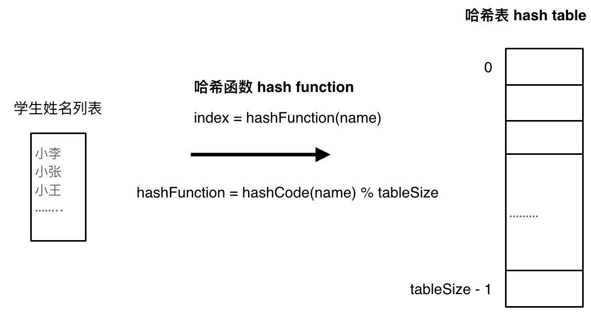

# 3. 哈希表

## 1 哈希表理论基础
1. 通过关键码的值直接访问，通常用来快速判断一个元素是否出现在集合里
2. 哈希函数（Hash Function）：将目标值转换成Hash值（即索引下标）
    
3. 哈希碰撞（Hash Collisions）：两个元素映射到了同一索引下标
    1. 拉链法：将发生碰撞的元素存储在链表中 &rarr; 需要选择适当的哈希表大小 &rarr; 既不会因为数组空值而浪费大量内存，也不会因为链表太长而在查找上浪费太多时间
    2. 线性探测法：将发生碰撞的元素存储在下一个空位中 &rarr; 哈希表大小 &gt; 数据规模
4. 哈希结构：
    1. 数组
    2. set（集合）：

    | 集合 | 底层实现 | key是否有序 | 数值是否可以重复 | 能否更改数值 | 查询效率 | 增删效率 |
    |:--|:--|:--|:--|:--|:--|:--|
    | std::unordered_set | 哈希表 | 无序 | 否 | 否 | O(1) | O(1) |
    | std::set | 红黑树 | 有序 | 否 | 否 | O(logn) | O(logn) |
    | std::multiset | 红黑树 | 有序 | 是 | 否 | O(logn) | O(logn) |

    3. map（映射）：`key-value` 的数据结构，只对key限制，通过key来访问value

    | 集合 | 底层实现 | key是否有序 | 数值是否可以重复 | 能否更改数值 | 查询效率 | 增删效率 |
    |:--|:--|:--|:--|:--|:--|:--|
    | std::unordered_map | 哈希表 | 无序 | 否 | 否 | O(1) | O(1) |
    | std::map | 红黑树 | 有序 | 否 | 否 | O(logn) | O(logn) |
    | std::multimap | 红黑树 | 有序 | 是 | 否 | O(logn) | O(logn) |

## 2 有效的字母异位词

> [【LC242】](https://leetcode.cn/problems/valid-anagram/description/)给定两个字符串 s 和 t ，编写一个函数来判断 t 是否是 s 的 字母异位词。  
> （解释1：字母异位词是通过重新排列不同单词或短语的字母而形成的单词或短语，并使用所有原字母一次。）

1. 只看是否使用了原字母，不看字母排序 &rarr; 使用数组计数即可
2. 相关题目：[LC383](https://leetcode.cn/problems/ransom-note/description/)、[LC49](https://leetcode.cn/problems/group-anagrams/description/)、[LC438](https://leetcode.cn/problems/find-all-anagrams-in-a-string/description/)

> 补充：[【LC49】](https://leetcode.cn/problems/group-anagrams/description/)给你一个字符串数组，请你将 字母异位词 组合在一起。可以按任意顺序返回结果列表。

1. 自想解法：两层for循环，外层遍历字符串数组，内层遍历结果数组 &rarr; 超出时间限制
2. 若为字母异位词，则经过排序后的key是相同的，因此可以用 `unordered_map` 对原字符串数组进行分组，再将分组后的结果填充到结果数组中
```cpp showLineNumbers
class Solution {
public:
    vector<vector<string>> groupAnagrams(vector<string>& strs) {
        unordered_map<string, vector<string>> map;
        for (string s : strs) {
            string key = s;
            sort(key.begin(), key.end());
            map[key].emplace_back(s);
        }

        vector<vector<string>> result;
        for (auto& pair : map) {
            result.emplace_back(pair.second);
        }
        return result;
    }
};
```

---

## 3 两个数组的交集

> 【LC206】

1. 

---

## 4 快乐数

> [【LC202】](https://leetcode.cn/problems/happy-number/description/)编写一个算法来判断一个数 n 是不是快乐数。「快乐数」 定义为：
> - 对于一个正整数，每一次将该数替换为它每个位置上的数字的平方和。
> - 然后重复这个过程直到这个数变为 1，也可能是 无限循环 但始终变不到 1。
> - 如果这个过程 结果为 1，那么这个数就是快乐数。
> 如果 n 是 快乐数 就返回 true ；不是，则返回 false 。

1. 破题关键：题目中提到无限循环 &rarr; 求和过程中，结果会重复出现
```cpp
class Solution {
public:
    bool isHappy(int n) {
        unordered_set<int> set;
        while (1) {
            // 对操作数求和
            int sum = 0;
            while (n) {
                sum += (n % 10) * (n % 10);
                n /= 10;
            }

            if (sum != 1) {
                auto it = set.find(sum);
                if (it != set.end()) {
                    // 出现重复元素，即死循环
                    return false;
                }
                set.insert(sum);
                n = sum;
            } else {
                return true;
            }
        }
    }
};
```

---

## 5 两数之和

> 【LC206】

1. 

---

## 6 四数相加II

> 【LC206】

1. 

---

## 7 赎金信

> [【LC383】](https://leetcode.cn/problems/ransom-note/description/)给你两个字符串：ransomNote 和 magazine ，判断 ransomNote 能不能由 magazine 里面的字符构成。如果可以，返回 true ；否则返回 false 。magazine 中的每个字符只能在 ransomNote 中使用一次。

1. 思路同 `2 有效的字母异位词`

---

## 8 三数之和

> 【LC206】

1. 

---

## 9 四数之和

> 【LC206】

1. 

---

## 10 总结篇
1. 