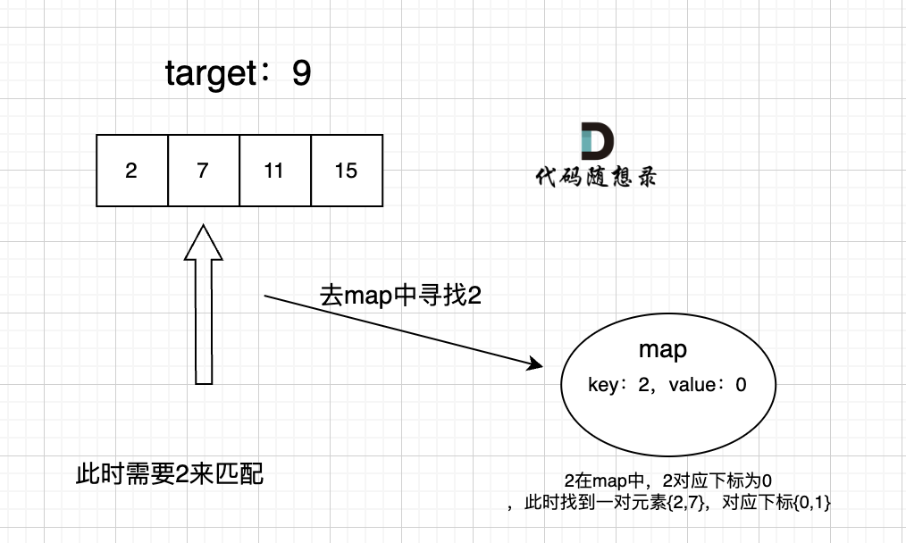

# 3. 哈希表

## 1 哈希表理论基础
1. 通过关键码的值直接访问，通常用来快速判断一个元素是否出现在集合里
2. **<font color="red">哈希函数（Hash Function）</font>**：将目标值转换成Hash值（即索引下标）
    
3. **<font color="red">哈希碰撞（Hash Collisions）</font>**：两个元素映射到了同一索引下标
    1. 拉链法：将发生碰撞的元素存储在链表中 &rarr; 需要选择适当的哈希表大小 &rarr; 既不会因为数组空值而浪费大量内存，也不会因为链表太长而在查找上浪费太多时间
    2. 线性探测法：将发生碰撞的元素存储在下一个空位中 &rarr; 哈希表大小 &gt; 数据规模
4. **<mark>哈希结构</mark>**：
    1. **数组**：局限于数组大小受限制，而且如果元素很少、哈希值太大时会造成内存空间的浪费
    2. **set（集合）**：局限于只能放一个key的元素

    | 集合 | 底层实现 | key是否有序 | 数值是否可以重复 | 能否更改数值 | 查询效率 | 增删效率 |
    |:--|:--|:--|:--|:--|:--|:--|
    | `std::unordered_set` | 哈希表 | 无序 | 否 | 否 | $O(1)$ | $O(1)$ |
    | `std::set` | 红黑树 | 有序 | 否 | 否 | $O(logn)$ | $O(logn)$ |
    | `std::multiset` | 红黑树 | 有序 | 是 | 否 | $O(logn)$ | $O(logn)$ |

    3. **map（映射）**：`key-value` 的数据结构，只对key限制，通过key来访问value

    | 集合 | 底层实现 | key是否有序 | 数值是否可以重复 | 能否更改数值 | 查询效率 | 增删效率 |
    |:--|:--|:--|:--|:--|:--|:--|
    | `std::unordered_map` | 哈希表 | 无序 | 否 | 否 | $O(1)$ | $O(1)$ |
    | `std::map` | 红黑树 | 有序 | 否 | 否 | $O(logn)$ | $O(logn)$ |
    | `std::multimap` | 红黑树 | 有序 | 是 | 否 | $O(logn)$ | $O(logn)$ |

## 2 有效的字母异位词

> [【LC242】](https://leetcode.cn/problems/valid-anagram/description/)给定两个字符串 s 和 t ，编写一个函数来判断 t 是否是 s 的 字母异位词。  
> （解释1：字母异位词是通过重新排列不同单词或短语的字母而形成的单词或短语，并使用所有原字母一次。）

1. 只看是否使用了原字母，不看字母排序 &rarr; 使用数组计数即可
2. 相关题目：[LC383](https://leetcode.cn/problems/ransom-note/description/)、[LC49](https://leetcode.cn/problems/group-anagrams/description/)、[LC438](https://leetcode.cn/problems/find-all-anagrams-in-a-string/description/)

> 补充：[【LC49】](https://leetcode.cn/problems/group-anagrams/description/)给你一个字符串数组，请你将 字母异位词 组合在一起。可以按任意顺序返回结果列表。

1. 自想解法：两层for循环，外层遍历字符串数组，内层遍历结果数组 &rarr; 超出时间限制
2. 若为字母异位词，则经过排序后的key是相同的，因此可以用 `unordered_map` 对原字符串数组进行分组，再将分组后的结果填充到结果数组中
```cpp showLineNumbers
class Solution {
public:
    vector<vector<string>> groupAnagrams(vector<string>& strs) {
        unordered_map<string, vector<string>> map;
        for (string s : strs) {
            string key = s;
            sort(key.begin(), key.end());
            map[key].emplace_back(s);
        }

        vector<vector<string>> result;
        for (auto& pair : map) {
            result.emplace_back(pair.second);
        }
        return result;
    }
};
```

---

## 3 两个数组的交集

> [【LC349】](https://leetcode.cn/problems/intersection-of-two-arrays/description/)给定两个数组 nums1 和 nums2 ，返回 它们的 交集 。输出结果中的每个元素一定是 唯一 的。我们可以 不考虑输出结果的顺序 。

1. 输出结果中的每个元素一定是唯一的 &rarr; 输出的结果需要去重
2. 哈希问题不能都用set，数据量大时容易超时 &larr; 使用set时，不仅占用空间大，而且速度比数组慢
3. 相关题目：[LC350](https://leetcode.cn/problems/intersection-of-two-arrays-ii/description/)

---

## 4 快乐数

> [【LC202】](https://leetcode.cn/problems/happy-number/description/)编写一个算法来判断一个数 n 是不是快乐数。「快乐数」 定义为：
> - 对于一个正整数，每一次将该数替换为它每个位置上的数字的平方和。
> - 然后重复这个过程直到这个数变为 1，也可能是 无限循环 但始终变不到 1。
> - 如果这个过程 结果为 1，那么这个数就是快乐数。  
> 如果 n 是 快乐数 就返回 true ；不是，则返回 false 。

1. 破题关键：题目中提到无限循环 &rarr; 求和过程中，结果会重复出现
```cpp showLineNumbers
class Solution {
public:
    bool isHappy(int n) {
        unordered_set<int> set;
        while (1) {
            // 对操作数求和
            int sum = 0;
            while (n) {
                sum += (n % 10) * (n % 10);
                n /= 10;
            }

            if (sum != 1) {
                auto it = set.find(sum);
                if (it != set.end()) {
                    // 出现重复元素，即死循环
                    return false;
                }
                set.insert(sum);
                n = sum;
            } else {
                return true;
            }
        }
    }
};
```

---

## 5 两数之和

> [【LC1】](https://leetcode.cn/problems/two-sum/description/)给定一个整数数组 nums 和一个整数目标值 target，请你在该数组中找出 和为目标值 target  的那 两个 整数，并返回它们的数组下标。你可以假设每种输入只会对应一个答案，并且你不能使用两次相同的元素。你可以按任意顺序返回答案。

1. 自想解法：固定为2个整数，遍历循环计算所有组合的和，放在哈希表中，再查找目标值即可；但是可能存在的问题是，所有组合应该会超时，有没有更好的方案
2. 在本题中，不仅要知道元素有没有遍历过，还要知道这个元素对应的下标 &rarr; 使用map的 `key-value` 结构来存放元素
3. map用来存放访问过的元素（key）及其下标（value），遍历数组时去map查询是否有和目前遍历元素匹配的数值
    
```cpp showLineNumbers
class Solution {
public:
    vector<int> twoSum(vector<int>& nums, int target) {
        unordered_map<int, int> map;
        for (int i = 0; i < nums.size(); i++) {
            auto it = map.find(target - nums[i]);
            if (it != map.end()) {
                // 若迭代器不是map的最后一对键值对之后时，即找到匹配值，则直接返回
                return {i, it->second};
            } else {
                // 若是，则将当前遍历的元素及其下标加入map
                map[nums[i]] = i;
            }
        }
        return {};
    }
};
```

---

## 6 四数相加II

> [【LC454】](https://leetcode.cn/problems/4sum-ii/description/)给你四个整数数组 nums1、nums2、nums3 和 nums4 ，数组长度都是 n ，请你计算有多少个元组 (i, j, k, l) 能满足：
> - 0 &le; i, j, k, l < n
> - nums1[i] + nums2[j] + nums3[k] + nums4[l] == 0

1. 自想解法：多层遍历
2. 解题步骤：
    1. 遍历nums1和nums2数组，统计元素之和以及出现的次数
    2. 遍历nums3和nums4数组，在记录nums1和nums2数组结果的map中查找是否存在相反值

---

## 7 赎金信

> [【LC383】](https://leetcode.cn/problems/ransom-note/description/)给你两个字符串：ransomNote 和 magazine ，判断 ransomNote 能不能由 magazine 里面的字符构成。如果可以，返回 true ；否则返回 false 。magazine 中的每个字符只能在 ransomNote 中使用一次。

1. 思路同 [2 有效的字母异位词](#2-有效的字母异位词)

---

## 8 三数之和

> [【LC15】](https://leetcode.cn/problems/3sum/description/)给你一个整数数组 nums ，判断是否存在三元组 [nums[i], nums[j], nums[k]] 满足 i != j、i != k 且 j != k ，同时还满足 nums[i] + nums[j] + nums[k] == 0 。请你返回所有和为 0 且不重复的三元组。  
> 注意：答案中不可以包含重复的三元组。

1. 自想解法：多层遍历
2. 解法：
    1. 哈希法：两层for循环确定两个数值，再用哈希法来确定第三个数 `0 - (a + b)` 是否在数组里出现过（思路同 [6 四数相加II](#6-四数相加ii)）；但不可以包含重复的三元组，若筛选出符合条件的三元组后再去重，容易超时
    2. **双指针法**：遍历有序数组，左指针left定义在i+1上，右指针right定义在数组结尾位置上，则 `a = nums[i]`、`b = nums[left]`、`c = nums[right]`
        - `nums[i] + nums[left] + nums[right] > 0`：向左移动右指针right
        - `nums[i] + nums[left] + nums[right] < 0`：向右移动左指针left
        
    ```cpp showLineNumbers
    class Solution {
    public:
        vector<vector<int>> threeSum(vector<int>& nums) {
            vector<vector<int>> result;
            sort(nums.begin(), nums.end());
            for (int i = 0; i < nums.size(); i++) {
                // 若排序后的 nums[i] > 0，则不存在和为0的三元组
                if (nums[i] > 0) {
                    return result;
                }
                // 对 nums[i] 去重（三元组内可以存在重复的元素，而不能存在重复的三元组）
                if (i > 0 && nums[i] == nums[i - 1]) {
                    continue;
                }

                int left = i + 1;
                int right = nums.size() - 1;
                while (left < right) {
                    if (nums[i] + nums[left] + nums[right] > 0) {
                        right--;
                    } else if (nums[i] + nums[left] + nums[right] < 0) {
                        left++;
                    } else {
                        result.emplace_back(vector<int>{nums[i], nums[left], nums[right]});

                        // 对 nums[right] 去重
                        while (left < right && nums[right] == nums[right - 1]) right--;
                        // 对 nums[left] 去重
                        while (left < right && nums[left] == nums[left + 1]) left++;

                        // 找到满足条件的三元组后，双指针同时收缩
                        right--;
                        left++;
                    }
                }
            }
            return result;
        }
    };
    ```

---

## 9 四数之和

> [【LC18】](https://leetcode.cn/problems/4sum/description/)给你一个由 n 个整数组成的数组 nums ，和一个目标值 target 。请你找出并返回满足下述全部条件且不重复的四元组 [nums[a], nums[b], nums[c], nums[d]] （若两个四元组元素一一对应，则认为两个四元组重复）：
> - 0 &le; a, b, c, d < n
> - a、b、c 和 d 互不相同
> - nums[a] + nums[b] + nums[c] + nums[d] == target  
> 你可以按 任意顺序 返回答案 。

1. 自想解法：[8 三数之和](#8-三数之和) 的解法基础之上，再加一层for循环
2. 细节：
    1. **剪枝优化**：若当前遍历元素 `> target` 但 `< 0` 时，加上其他负数后是有可能等于target的
    ```cpp showLineNumbers
    // 
    if (nums[j] > target && nums[j] >= 0) {
        break;
    }
    ```
    :::info[剪枝]
    一种在搜索算法中优化性能的技术，通过减少不必要的计算来提高效率
    :::
    2. 考虑四数之和溢出的情况，设置和的类型为 `long` 或 `long long`

---

## 10 总结篇
1. [理论基础](#1-哈希表理论基础)
2. 经典题目：根据不同的场景，使用不同的数据结构
    1. 数组作为哈希表：有效的字母异位词、赎金信
    2. set作为哈希表：两个数组的交集、快乐数
    3. map作为哈希表：两数之和、四数相加II