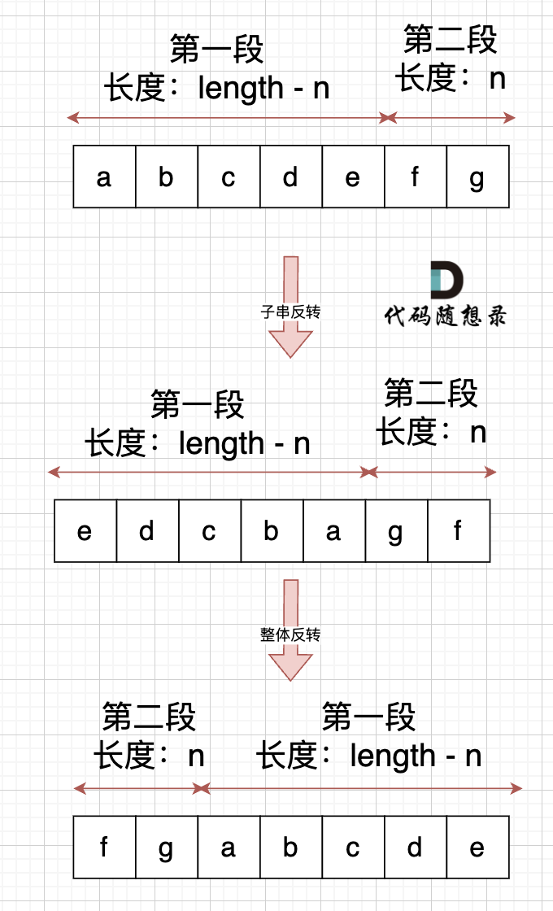
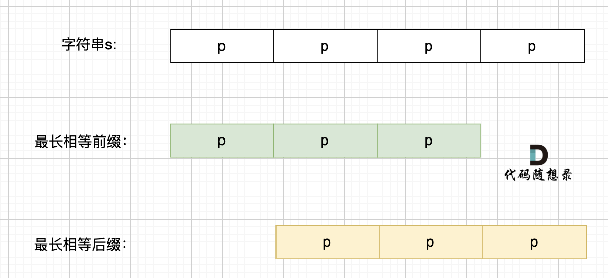

# 4. 字符串

## 1 反转字符串

> 【[LC344](https://leetcode.cn/problems/reverse-string/description/)】编写一个函数，其作用是将输入的字符串反转过来。输入字符串以字符数组 s 的形式给出。不要给另外的数组分配额外的空间，你必须原地修改输入数组、使用 O(1) 的额外空间解决这一问题。

1. 采用双指针解法，交换指针所指元素，并向中间移动指针

:::danger[要不要使用库函数？]
- 如果题目关键的部分直接用库函数就可以解决，建议 **不要使用库函数**
- 如果库函数仅仅是解题过程中的一小部分，并且你已经很清楚这个库函数的内部实现原理的话，可以考虑 **使用库函数**
:::

---

## 2 反转字符串II

> 【[LC541](https://leetcode.cn/problems/reverse-string-ii/description/)】给定一个字符串 s 和一个整数 k，从字符串开头算起，每计数至 2k 个字符，就反转这 2k 字符中的前 k 个字符。
> - 如果剩余字符少于 k 个，则将剩余字符全部反转。
> - 如果剩余字符小于 2k 但大于或等于 k 个，则反转前 k 个字符，其余字符保持原样。

1. 自想解法：i为反转区间右区间，每次移动 `2 * k`；但逻辑不严谨，部分情况未考虑到
2. 思路相同，但i设置为反转区间左区间，不用考虑右区间溢出数组长度的问题，简化逻辑
```cpp showLineNumbers
class Solution {
public:
    string reverseStr(string s, int k) {
        for (int i = 0; i < s.size(); i += 2 * k) {
            // 考虑剩余字符少于k个的情况
            int end = (i + k) < s.size() ? (i + k) : s.size();
            reverse(s.begin() + i, s.begin() + end);
        }
        return s;
    }
};
```

---

## 3 替换数字

> [【KC54】](https://kamacoder.com/problempage.php?pid=1064)给定一个字符串 s，它包含小写字母和数字字符，请编写一个函数，将字符串中的字母字符保持不变，而将每个数字字符替换为number。 例如，对于输入字符串 "a1b2c3"，函数应该将其转换为 "anumberbnumbercnumber"。

1. 自想解法：遍历字符串，找到为数字的字符时，替换为 `number`，然后下标+5
2. 数组填充类问题的通解：&rarr; 既不用申请新的数组空间，又避免了从前向后填充元素时，要将元素后移的问题
    1. 给数组扩容到填充后的大小
    2. 从后向前进行操作

    <details>
    <summary>双指针移动过程图解</summary>
    <div>
    
    </div>
    </details>

    ```cpp showLineNumbers
    #include <iostream>
    using namespace std;
    int main() {
        string s;
        while (cin >> s) {

            int oldIndex = s.size() - 1;
            // 1. 给数组扩容到填充后的大小
            int count = 0;
            for (int i = 0; i < s.size(); i++) {
                if (s[i] >= '0' && s[i] <= '9') {
                    count++;
                }
            }
            s.resize(s.size() + count * 5);

            // 2. 从后往前将数字替换为number
            int newIndex = s.size() - 1;
            while (oldIndex >= 0) {
                if (s[oldIndex] >= '0' && s[oldIndex] <= '9') {
                    s[newIndex--] = 'r';
                    s[newIndex--] = 'e';
                    s[newIndex--] = 'b';
                    s[newIndex--] = 'm';
                    s[newIndex--] = 'u';
                    s[newIndex--] = 'n';
                } else {
                    s[newIndex--] = s[oldIndex];
                }
                oldIndex--;
            }

            cout << s << endl;       
        }
    }
    ```

---

## 4 翻转字符串里的单词

> 【[LC151](https://leetcode.cn/problems/reverse-words-in-a-string/description/)】给你一个字符串 s ，请你反转字符串中 单词 的顺序。单词 是由非空格字符组成的字符串。s 中使用至少一个空格将字符串中的 单词 分隔开。返回 单词 顺序颠倒且 单词 之间用单个空格连接的结果字符串。  
> 注意：输入字符串 s 中可能会存在前导空格、尾随空格或者单词间的多个空格。返回的结果字符串中，单词间应当仅用单个空格分隔，且不包含任何额外的空格。

1. 自想解法：用库函数split分割单词，然后将单词数组倒序相连
2. 要求：空间复杂度为 $O(1)$
    ```cpp showLineNumbers
    class Solution {
    public:
        string reverseWords(string s) {
            // 1. 移除多余空格
            removeSpaces(s);

            // 2. 将整个字符串翻转
            reverse(s.begin(), s.end());

            // 3. 将字符串中的每个单词翻转
            int begin = 0;
            for (int end = 0; end <= s.size(); end++) {
                if (end == s.size() || s[end] == ' ') {
                    reverse(s.begin() + begin, s.begin() + end);
                    begin = end + 1;
                }
            }

            return s;
        }

    private:
        void removeSpaces(string& s) {
            // 采用双指针法去除多余空格
            int slow = 0;
            for (int fast = 0; fast < s.size(); fast++) {
                // 删除字符串中的所有空格
                if (s[fast] != ' ') {
                    // 在每个单词开头加上空格
                    if (slow != 0) {
                        s[slow++] = ' ';
                    }
                    // 补全单词
                    while (fast < s.size() && ' ' != s[fast]) {
                        s[slow++] = s[fast++];
                    }
                }
            }
            // 重新设置字符串长度
            s.resize(slow);
        }
    };
    ```

---

## 5 右旋转字符串

> [【KC55】](https://kamacoder.com/problempage.php?pid=1065)字符串的右旋转操作是把字符串尾部的若干个字符转移到字符串的前面。给定一个字符串 s 和一个正整数 k，请编写一个函数，将字符串中的后面 k 个字符移到字符串的前面，实现字符串的右旋转操作。   
> 例如，对于输入字符串 "abcdefg" 和整数 2，函数应该将其转换为 "fgabcde"。

1. 根据k将字符串分成两个子串分别反转，最后再将整个字符串进行反转
    

---

## 6 实现strStr()

> 【[LC28](https://leetcode.cn/problems/find-the-index-of-the-first-occurrence-in-a-string/description/)】给你两个字符串 haystack 和 needle ，请你在 haystack 字符串中找出 needle 字符串的第一个匹配项的下标（下标从 0 开始）。如果 needle 不是 haystack 的一部分，则返回 -1 。

1. 自想解法：遍历 `haystack` 字符串，按 `needle` 字符串的长度去匹配是否存在 `needle` 字符串
```cpp showLineNumbers
class Solution {
public:
    int strStr(string haystack, string needle) {
        for (int i = 0; i < haystack.size(); i++) {
            if (i + needle.size() > haystack.size()) {
                return -1;
            }
            if (haystack.substr(i, needle.size()) == needle) {
                return i;
            }
        }
        return -1;
    }
};
```
2. **<font color="red">KMP</font>**：当出现字符串不匹配时，可以 **记录之前已匹配的那部分文本** &rarr; 避免从头去做匹配

:::warning[时间复杂度？]
$O(m+n)$：n为文本串长度，m为模式串长度
    - $O(m)$：单独生成next数组
    - $O(n)$：根据前缀表不断调整匹配的位置
:::

3. **<font color="red">前缀表（prefix table）</font>**：用来记录当模式串与主串不匹配时，模式串应该回退到哪个位置开始重新匹配
    - 记录下标i及i之前的字符串中 **相同前后缀的长度**
        - **前缀**：不包含最后一个字符的所有 <mark>以第一个字符开头</mark> 的连续子串
        - **后缀**：不包含第一个字符的所有 <mark>以最后一个字符结尾</mark> 的连续子串

        <details>
        <summary>计算过程</summary>
        <div>
        
        1. 以下标0为结尾的子串 `a`：长度为0
            - 前缀子串：不存在
            - 后缀子串：不存在
        2. 以下标1为结尾的子串 `aa`：长度为1
            - 前缀子串：<mark>`a`</mark>
            - 后缀子串：<mark>`a`</mark>
        3. 以下标2为结尾的子串 `aab`：长度为0
            - 前缀子串：`a`、`aa`
            - 后缀子串：`b`、`ab`
        4. 以下标3为结尾的子串 `aaba`：长度为1
            - 前缀子串：<mark>`a`</mark>、`aa`、`aab`
            - 后缀子串：<mark>`a`</mark>、`ba`、`aba`
        5. 以下标4为结尾的子串 `aabaa`：长度为2
            - 前缀子串：`a`、<mark>`aa`</mark>、`aab`、`aaba`
            - 后缀子串：`a`、<mark>`aa`</mark>、`baa`、`abaa`
        6. 以下标5为结尾的子串 `aabaaf`：长度为0
            - 前缀子串：`a`、`aa`、`aab`、`aaba`、`aabaa`
            - 后缀子串：`f`、`af`、`aaf`、`baaf`、`abaaf`
        </div>
        </details>

    - 若匹配失败的位置是后缀子串的后面，那么从与其相同的前缀子串的后面重新匹配即可
        - 从匹配失败的位置开始，找往前一位字符所记录的长度length &rarr; 将下标移动到length的位置，继续匹配
        
4. **<font color="red">next数组</font>**：根据具体实现选择数组形式 &rarr; 前缀表或者是前缀表减一（右移一位，初始位置为-1）
5. 代码具体实现：
    1. 构造next数组：
        ```cpp showLineNumbers
        void getNext(int* next, const string& s) {
            // 1. 初始化
            int prefixEnd = -1;
            next[0] = prefixEnd;
            // prefixEnd初始化为-1，则suffixEnd初始化为1
            for (int suffixEnd = 1; suffixEnd < s.size(); suffixEnd++) {
                // 2. 前后缀不相同
                while (prefixEnd >= 0 && s[suffixEnd] != s[prefixEnd + 1]) {
                    // 回退至 prefixEnd+1 前一个元素（即prefixEnd）在next数组里的值（即next[prefixEnd]）
                    prefixEnd = next[prefixEnd];
                }
                // 3. 前后缀相同
                if (s[suffixEnd] == s[prefixEnd + 1]) {
                    prefixEnd++;
                }
                // 记录相同前后缀的长度（同时后移prefixEnd和suffixEnd指针）
                next[suffixEnd] = prefixEnd;
            }
        }
        ```
    2. 使用next数组来做匹配：
        ```cpp showLineNumbers
        // next数组初始化为-1
        int ti = -1;
        for (int si = 0; si < s.size(); si++) {
            // 字符不匹配时，指针回退
            while (ti >= 0 && s[si] != t[ti + 1]) {
                ti = next[ti];
            }
            // 字符匹配时，指针后移
            if (s[si] == t[ti + 1]) {
                ti++;
            }
            // 文本串s里匹配到整个模式串t
            if (ti == (t.size() - 1)) {
                // 做相关操作
            }
        }
        ```

---

## 7 重复的子字符串

> 【[LC459](https://leetcode.cn/problems/repeated-substring-pattern/description/)】给定一个非空的字符串 s ，检查是否可以通过由它的一个子串重复多次构成。

1. 自想解法：遍历字符串；使用KMP，但是不知道怎么实现
2. 解法：
    1. <mark>移动匹配</mark>：将字符串s重复拼接成 `s + s` 后，去除首尾字符能凑成字符串s &harr; 字符串s是由重复子串组成
        <details>
        <summary>推导过程</summary>
        <div>

        1. **充分性**：s是由重复子串组成 &rarr; 将s重复拼接成 `s + s` 后，去除首尾字符能凑成s
            - 前面和后面都有相同的子串，用 `s + s` 这样组成的字符串中，后面的子串做前串，前面的子串做后串，就一定还能组成一个s
                
            - 在判断 `s + s` 拼接的字符串里是否出现一个s的的时候，要去除 `s + s` 的首尾字符 &rarr; 避免在 `s + s` 中搜索出原来的s，搜索目标是中间拼接出来的s
        2. **必要性**：将s重复拼接成 `s + s` 后，去除首尾字符能凑成s &rarr; s是由重复子串组成
            
            - 根据拼接结果和上下字符串的相等关系，以及变换s的组成方式 &rarr; 字符串是由其中的几个字符重复组成的
        
        </div>
        </details>

        ```cpp showLineNumbers
        class Solution {
        public:
            bool repeatedSubstringPattern(string s) {
                // 1. 重复拼接s
                string t = s + s;
                // 2. 去除首尾字符
                t.erase(t.begin());
                t.erase(t.end() - 1);

                // 3. 查找t中是否存在s
                return t.find(s) != std::string::npos;
            }
        };
        ```

        :::warning[时间复杂度？]
        判断字符串 `s + s` 中是否出现过s，可能直接用 `contains`、`find` 之类的库函数，但这类库函数的时间复杂度为 $O(m+n)$
        :::
    2. <mark>KMP</mark>：最长相等前后缀不包含的子串是字符串s的最小重复子串 &harr; s是由重复子串组成
        <details>
        <summary>推导过程</summary>
        <div>

        1. **充分性**：s是由重复子串组成 &rarr; 最长相等前后缀不包含的子串是字符串s的最小重复子串
            
            - 最长相等前后缀更长一些，重复子串就会变短，与定义的条件相冲突
        2. **必要性**：最长相等前后缀不包含的子串是字符串s的最小重复子串 &rarr; s是由重复子串组成
            :::tip[最长相等前后缀不包含的子串什么时候才是字符串s的最小重复子串？]
            1. 最长相等前后缀不包含的子串的长度 &gt; 字符串s的长度的一半 &rarr; 最长相等前后缀不包含的子串 **不是** 字符串s的重复子串
            2. 字符串s的长度 能整除 最长相等前后缀不包含的子串的长度 &rarr; 最长相等前后缀不包含的子串 **就是** 字符串s的重复子串
                
            3. 字符串s的长度 不能整除 最长相等前后缀不包含的子串的长度 &rarr; 最长相等前后缀不包含的子串 **不是** 字符串s的重复子串
            :::
        
        </div>
        </details>

        ```cpp showLineNumbers
        class Solution {
        public:
            bool repeatedSubstringPattern(string s) {
                int len = s.size();
                if (len <= 0) {
                    return false;
                }

                // 获取next数组
                int next[len];
                getNext(next, s);

                // 字符串中存在最长的相同前后缀 且 字符串长度能整除最长相等前后缀不包含的子串的长度
                return next[len - 1] != -1 && len % (len - next[len - 1] - 1) == 0;
            }
        ```

---

## 8 总结篇
1. 理论基础：字符串是若干字符组成的有限序列，或者说是一个字符数组
    1. c：用结束符 `'\0'` 来判断字符串是否结束
    2. c++：用string类的 `size` 接口来判断字符串是否结束
2. 经典题目：双指针法、翻转系列、KMP（匹配和重复子串问题）