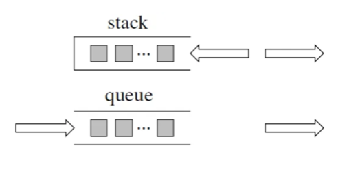
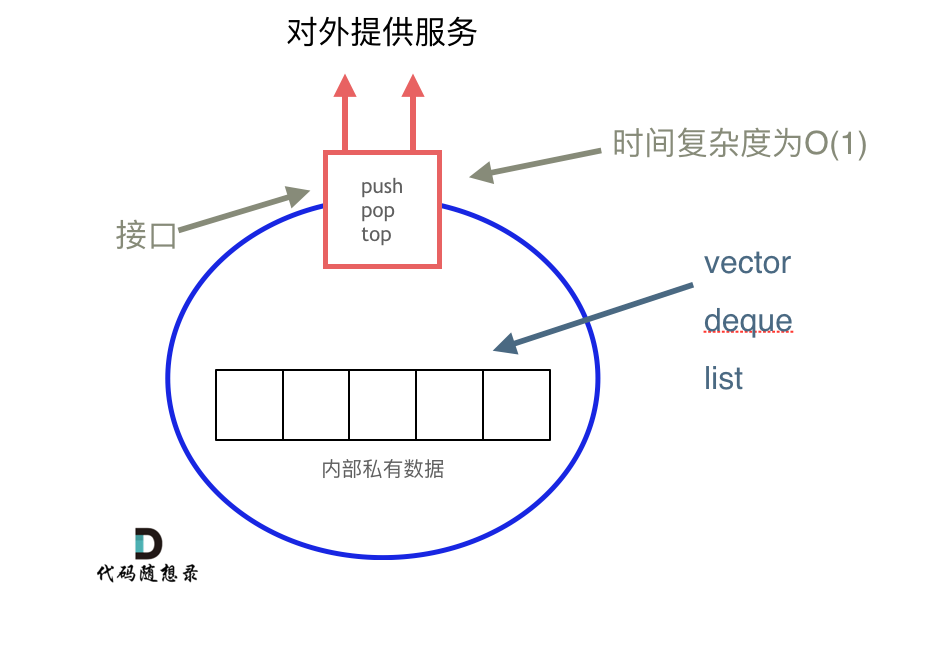

# 6. 栈与队列

## 1 栈与队列理论基础
1. 原理图：`SGI STL` 的数据结构
    

    :::info[C++标准模板库（Standard Template Library，STL）]
    1. `HP STL`：（开源）其他版本STL的蓝本
    2. `P.J.Plauger STL`：（闭源）由P.J.Plauger参照 `HP STL` 实现出来的，被Visual C++编译器所采用
    3. <mark>`SGI STL`</mark>：（开源）由Silicon Graphics Computer Systems公司参照 `HP STL` 实现，被Linux的C++编译器GCC所采用
    :::
2. **<font color="red">栈</font>**：属于容器适配器一类
    1. 接口：`push`、`pop` 等
    2. 元素必须符合 **先进后出** 规则 &rarr; 不支持遍历、不提供迭代器（iterator）
    3. 底层结构：默认是 **<font color="red">双向队列 `deque`</font>**
        - 封住 `deque` 的一端即可实现栈的逻辑
        - 若指定数据结构为栈的底层实现，可作初始化 `std::stack<int, std::vector<int>> third;`

3. **<font color="red">队列</font>**：属于容器适配器一类
    1. 元素必须符合 **先进先出** 规则 &rarr; 不支持遍历、不提供迭代器（iterator）
    2. 底层结构：默认是 **<font color="red">双向队列 `deque`</font>**
        - 若指定数据结构为队列的底层实现，可作初始化 `std::queue<int, std::list<int>> third;`

:::info[`container adapter`（容器适配器）]
栈以 **可插拔的** 底层容器完成其所有的工作，对外提供统一的接口

:::

---

## 2 用栈实现队列

> [【LC232】](https://leetcode.cn/problems/implement-queue-using-stacks/description/)请你仅使用两个栈实现先入先出队列。队列应当支持一般队列支持的所有操作（push、pop、peek、empty）：  
> 实现 MyQueue 类：
> - void push(int x) 将元素 x 推到队列的末尾
> - int pop() 从队列的开头移除并返回元素
> - int peek() 返回队列开头的元素
> - boolean empty() 如果队列为空，返回 true ；否则，返回 false  
> 说明：
> - 你 只能 使用标准的栈操作 —— 也就是只有 push to top, peek/pop from top, size, 和 is empty 操作是合法的。
> - 你所使用的语言也许不支持栈。你可以使用 list 或者 deque（双端队列）来模拟一个栈，只要是标准的栈操作即可。

1. 需要初始化两个栈：输入栈和输出栈
    - `push`：将数据放入输入栈
    - `pop`：从输出栈弹出数据（若输出栈为空时，则导入全局的输入栈数据）
    - `empty`：输入栈和输出栈均为空 &rarr; 模拟的队列为空
    
```cpp showLineNumbers
class MyQueue {
public:
    stack<int> stIn;
    stack<int> stOut;

    MyQueue() {}

    /* 将元素 x 推到队列的末尾 */
    void push(int x) { stIn.push(x); }

    /* 从队列的开头移除并返回元素 */
    int pop() {
        if (stOut.empty()) {
            while (!stIn.empty()) {
                stOut.push(stIn.top());
                stIn.pop();
            }
        }
        int top = stOut.top();
        stOut.pop();
        return top;
    }

    /* 返回队列开头的元素 */
    int peek() {
        // 直接利用写好的pop函数获取队列开头的元素，再重新push回去
        int top = this->pop();
        stOut.push(top);
        return top;
    }

    /* 如果队列为空，返回 true；否则，返回 false */
    bool empty() { return stIn.empty() && stOut.empty(); }
};
```

---

## 3 用队列实现栈

> [【LC225】](https://leetcode.cn/problems/implement-stack-using-queues/description/)请你仅使用两个队列实现一个后入先出（LIFO）的栈，并支持普通栈的全部四种操作（push、top、pop 和 empty）。  
> 实现 MyStack 类：
> - void push(int x) 将元素 x 压入栈顶。
> - int pop() 移除并返回栈顶元素。
> - int top() 返回栈顶元素。
> - boolean empty() 如果栈是空的，返回 true ；否则，返回 false 。  
> 注意：
> - 你只能使用队列的标准操作 —— 也就是 push to back、peek/pop from front、size 和 is empty 这些操作。
> - 你所使用的语言也许不支持队列。 你可以使用 list （列表）或者 deque（双端队列）来模拟一个队列 , 只要是标准的队列操作即可。

1. 初始化两个单向队列：主队列和备份队列
    - `pop`：将主队列中除队尾元素以外的元素都备份到备份队列中，弹出队尾元素，再将其他元素重新移回主队列中
    
```cpp showLineNumbers
class MyStack {
public:
    queue<int> que;
    queue<int> backup;

    MyStack() {}

    /* 将元素 x 压入栈顶 */
    void push(int x) { que.push(x); }

    /* 移除并返回栈顶元素 */
    int pop() {
        // 保留队尾元素，即栈顶元素
        int size = que.size() - 1;
        // 将其他元素移到备份队列中
        while (size--) {
            backup.push(que.front());
            que.pop();
        }

        // 移除栈顶元素
        int top = que.front();
        que.pop();

        // 将元素重新移回主队列中
        que = backup;
        while (!backup.empty()) {
            backup.pop();
        }

        return top;
    }

    /* 返回栈顶元素 */
    int top() {
        int size = que.size() - 1;
        while (size--) {
            backup.push(que.front());
            que.pop();
        }

        int top = que.front();
        backup.push(top);
        que.pop();

        que = backup;
        while (!backup.empty()) {
            backup.pop();
        }

        return top;
    }

    /* 如果栈是空的，返回 true ；否则，返回 false */
    bool empty() { return que.empty(); }
};
```
2. 初始化一个双向队列：
    - `pop`：将队列中除队尾元素以外的元素依次重新添加到队尾后，再弹出队头元素即可
```cpp showLineNumbers
class MyStack {
public:
    queue<int> que;

    MyStack() {}

    /* 将元素 x 压入栈顶 */
    void push(int x) { que.push(x); }

    /* 移除并返回栈顶元素 */
    int pop() {
        // 保留队尾元素，即栈顶元素
        int size = que.size() - 1;
        // 将其他元素移到备份队列中
        while (size--) {
            que.push(que.front());
            que.pop();
        }

        // 移除栈顶元素
        int top = que.front();
        que.pop();
        return top;
    }

    /* 返回栈顶元素 */
    int top() {
        int size = que.size() - 1;
        while (size--) {
            que.push(que.front());
            que.pop();
        }

        int top = que.front();
        que.push(top);
        que.pop();
        return top;
    }

    /* 如果栈是空的，返回 true ；否则，返回 false */
    bool empty() { return que.empty(); }
};
```

---

## 4 有效的括号

> [【LC】]()

1. 

---

## 5 删除字符串中的所有相邻重复项

> [【LC】]()

1. 

---

## 6 逆波兰表达式求值

> [【LC】]()

1. 

---

## 7 滑动窗口最大值

> [【LC】]()

1. 

---

## 8 前K个高频元素

> [【LC】]()

1. 

---

## 9 栈与队列总结
1. 