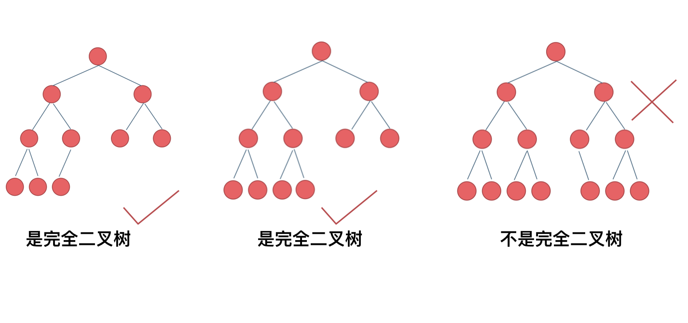

# 7. 二叉树

## 1 二叉树理论基础
1. 题目分类：
2. 种类：
    1. **<font color="red">满二叉树</font>**：只有度为0和度为2的节点，且度为0的节点在最底层
        - 深度为 $k$ &rarr; 有 $2^k-1$ 个节点
        
    2. **<font color="red">完全二叉树</font>**：除最底层外的每层节点的度都为2，且最底层的节点都集中在左侧
        - 深度为 $k$ &rarr; 最底层有 $[1, 2^{k-1}]$ 个节点
        
    3. **<font color="red">二叉搜索树</font>**：本身及其子树均为有序树
        - 若左子树不为空，则左子树上所有结点的值均 **小于** 根结点的值
        - 若右子树不为空，则右子树上所有结点的值均 **大于** 根结点的值
        
    4. **<font color="red">平衡二叉搜索树/AVL（Adelson-Velsky and Landis）树</font>**：本身及其子树均为空树或左右子树的高度差的绝对值不超过1
        
3. 存储方式：
    1. 链式存储：通过 **指针** 把分布在各处的节点串联一起
        
    2. 顺序存储：用 **数组** 连续分布在内存中
        - 父节点下标为 `i`：
            - 左子节点下标为 `i * 2 + 1`
            - 右子节点下标为 `i * 2 + 2`
        
4. 遍历方式：
    1. 深度优先遍历：通过 **栈** 完成 **递归遍历**
        1. 前序遍历：递归法、迭代法
        2. 中序遍历：递归法、迭代法
        3. 后序遍历：递归法、迭代法

        :::tip
        前、中、后序：中间节点的遍历顺序/位置
        
        :::
    2. 广度优先遍历：通过 **队列** 完成 **迭代遍历**
        1. 层次遍历：迭代法
5. 定义：（链式存储的数据结构定义）
    ```cpp showLineNumbers
    struct TreeNode {
        int val;
        TreeNode *left;
        TreeNode *right;
        TreeNode(int x) : val(x), left(NULL), right(NULL) {}
    };
    ```

---

## 2 二叉树的递归遍历
1. 递归算法的三要素：
    1. **<mark>确定递归函数的参数和返回值</mark>**：
        - 确定哪些参数是在递归过程中需要处理的
        - 确定每次递归的返回值与返回类型
    2. **<mark>确定终止条件</mark>**
    3. **<mark>确定单层递归的逻辑</mark>**：
        - 确定每一层递归需要处理的信息
2. 相关题目：[LC144](https://leetcode.cn/problems/binary-tree-preorder-traversal/description/)、[LC145](https://leetcode.cn/problems/binary-tree-postorder-traversal/description/)、[LC94](https://leetcode.cn/problems/binary-tree-inorder-traversal/description/)
```cpp showLineNumbers
class Solution {
public:
    vector<int> traversal(TreeNode* root) {
        vector<int> result;
        preorderTraversal(root, result);
        postorderTraversal(root, result);
        inorderTraversal(root, result);
        return result;
    }

    void preorderTraversal(TreeNode* cur, vector<int>& result) {
        if (cur == nullptr) {
            return;
        }

        result.push_back(cur->val); // 中间节点
        traversal(cur->left, result);
        traversal(cur->right, result);
    }

    void postorderTraversal(TreeNode* cur, vector<int>& result) {
        if (cur == nullptr) {
            return;
        }

        traversal(cur->left, result);
        traversal(cur->right, result);
        result.push_back(cur->val); // 中间节点
    }

    void inorderTraversal(TreeNode* cur, vector<int>& result) {
        if (cur == nullptr) {
            return;
        }

        traversal(cur->left, result);
        result.push_back(cur->val); // 中间节点
        traversal(cur->right, result);
    }
};
```

---

## 3 二叉树的迭代遍历
1. 前序遍历：&rarr; 访问顺序和处理顺序一致，都是中间节点
    1. 访问：遍历节点
    2. 处理：将元素放进result数组中
        1. 将父节点的值放入result数组中
        2. 将右子节点加入栈，再加入左子节点
    

    <details>
    <summary>代码</summary>
    <div>
    ```cpp showLineNumbers
    class Solution {
    public:
        vector<int> preorderTraversal(TreeNode* root) {
            vector<int> result;
            if (root == nullptr) return result;

            stack<TreeNode*> st;
            st.push(root);
            while (!st.empty()) {
                TreeNode* cur = st.top();
                result.push_back(cur->val);
                st.pop();
                if (cur->right != nullptr) st.push(cur->right);
                if (cur->left != nullptr) st.push(cur->left);
            }

            return result;
        }
    };
    ```
    </div>
    </details>
2. 中序遍历：&rarr; 访问顺序和处理顺序不一致，访问的是中间节点，处理的是左节点
    1. 访问：遍历节点 &larr; 指针
    2. 处理：将元素放进result数组中
    
    
    <details>
    <summary>代码</summary>
    <div>
    ```cpp showLineNumbers
    class Solution {
    public:
        vector<int> inorderTraversal(TreeNode* root) {
            vector<int> result;
            if (root == nullptr) return result;

            stack<TreeNode*> st;
            // 用来遍历的指针
            TreeNode* cur = root;
            while (cur != nullptr || !st.empty()) {
                if (cur != nullptr) {
                    // 一直遍历左节点
                    st.push(cur);
                    cur = cur->left;
                } else {
                    // 遍历到最左侧的叶子节点，处理节点值，并将指针指向右节点
                    // cur此时是NULL，需要回退一级
                    cur = st.top();
                    st.pop();
                    result.push_back(cur->val);
                    cur = cur->right;
                }
            }

            return result;
        }
    };
    ```
    </div>
    </details>
3. 后序遍历：

---

## 4 二叉树的统一迭代法
1. 统一写法：将访问的节点放入栈中，同时把要处理的节点也放入栈中，但要加个 <mark>标记</mark>
    1. **空指针标记法**：要处理的节点放入栈后，紧接着放入一个空指针作为标记
        <details>
        <summary>代码（以中序遍历为例）</summary>
        <div>
        ```cpp showLineNumbers
        class Solution {
        public:
            vector<int> inorderTraversal(TreeNode* root) {
                vector<int> result;
                stack<TreeNode*> st;
                if (root != nullptr) st.push(root);

                while (!st.empty()) {
                    TreeNode* node = st.top();
                    st.pop();

                    // 遍历到空指针节点，才进行处理，否则继续遍历
                    if (node == nullptr) {
                        node = st.top();
                        st.pop();
                        result.push_back(node->val);
                    } else {
                        if (node->right) st.push(node->right);
                        st.push(node); // 中间节点
                        st.push(nullptr); // 允许处理的标记
                        if (node->left) st.push(node->left);
                    }
                }

                return result;
            }
        };
        ```
        </div>
        </details>
    2. **boolean标记法**：加一个boolean值跟随每个节点
        - `false`：（默认值）需要为该节点及其左右子节点安排在栈中的位次
        - `true`：已经安排过该节点的位次，可以处理节点

        <details>
        <summary>代码（以中序遍历为例）</summary>
        <div>
        ```cpp showLineNumbers
        class Solution {
        public:
            vector<int> inorderTraversal(TreeNode* root) {
                vector<int> result;
                stack<pair<TreeNode*, bool>> st;
                if (root != nullptr) st.push(make_pair(root, false));

                while (!st.empty()) {
                    TreeNode* node = st.top().first;
                    bool visited = st.top().second;
                    st.pop();

                    // 遍历到visited为true的节点，才进行处理，否则继续遍历
                    if (visited) {
                        result.push_back(node->val);
                    } else {
                        if (node->right) st.push(make_pair(node->right, false));
                        st.push(make_pair(node, true)); // 允许处理的标记
                        if (node->left) st.push(make_pair(node->left, false));
                    }
                }

                return result;
            }
        };
        ```
        </div>
        </details>

---

## 5 二叉树的层序遍历
### 5.1 二叉树的层序遍历

>[【LC102】](https://leetcode.cn/problems/binary-tree-level-order-traversal/description/)给你二叉树的根节点 root ，返回其节点值的 层序遍历 。 （即逐层地，从左到右访问所有节点）。

1. 通过 **队列** 来实现广度优先遍历
    
```cpp showLineNumbers
class Solution {
public:
    /* 迭代法 */
    void iterate(vector<vector<int>>& result, TreeNode* root) {
        queue<TreeNode*> que;
        if (root != nullptr) que.push(root);
        while (!que.empty()) {
            vector<int> levelResult;

            int size = que.size();
            for (int i = 0; i < size; i++) {
                TreeNode* node = que.front();
                que.pop();

                levelResult.push_back(node->val);
                if (node->left) que.push(node->left);
                if (node->right) que.push(node->right);
            }

            result.push_back(levelResult);
        }
    }

    /* 递归法 */
    void recursion(vector<vector<int>>& result, TreeNode* cur, int depth) {
        if (cur == nullptr) return;
        if (result.size() == depth) result.push_back(vector<int>());
        result[depth].push_back(cur->val);
        recursion(result, cur->left, depth + 1);
        recursion(result, cur->right, depth + 1);
    }

    vector<vector<int>> levelOrder(TreeNode* root) {
        vector<vector<int>> result;

        iterate(result, root);
        recursion(result, root, 0);

        return result;
    }
};
```

### 5.2 二叉树的层次遍历 II

>[【LC107】](https://leetcode.cn/problems/binary-tree-level-order-traversal-ii/description/)给你二叉树的根节点 root ，返回其节点值 自底向上的层序遍历 。 （即按从叶子节点所在层到根节点所在的层，逐层从左向右遍历）

### 5.3 二叉树的右视图

>[【LC199】](https://leetcode.cn/problems/binary-tree-right-side-view/description/)给定一个二叉树的 根节点 root，想象自己站在它的右侧，按照从顶部到底部的顺序，返回从右侧所能看到的节点值。

### 5.4 二叉树的层平均值

>[【LC637】](https://leetcode.cn/problems/average-of-levels-in-binary-tree/description/)给定一个非空二叉树的根节点 root , 以数组的形式返回每一层节点的平均值。与实际答案相差 10-5 以内的答案可以被接受。

### 5.5 N叉树的层序遍历

>[【LC429】](https://leetcode.cn/problems/n-ary-tree-level-order-traversal/description/)给定一个 N 叉树，返回其节点值的层序遍历。（即从左到右，逐层遍历）。树的序列化输入是用层序遍历，每组子节点都由 null 值分隔（参见示例）。

1. 

### 5.1 在每个树行中找最大值

>[]()

1. 

### 5.1 填充每个节点的下一个右侧节点指针

>[]()

1. 

### 5.1 填充每个节点的下一个右侧节点指针II

>[]()

1. 

### 5.1 二叉树的最大深度

>[]()

1. 

### 5.1 二叉树的最小深度

>[]()

1. 


---

## 6 翻转二叉树

> []

1. 

---

## 7 二叉树周末总结

> []

1. 

---

8. 对称二叉树
9. 二叉树的最大深度
10. 二叉树的最小深度
11. 完全二叉树的节点个数
12. 平衡二叉树
13. 二叉树的所有路径
14. 二叉树周末总结
15. 左叶子之和
16. 找树左下角的值
17. 路径总和
18. 从中序与后序遍历序列构造二叉树
19. 最大二叉树
20. 二叉树周末总结
21. 合并二叉树
22. 二叉搜索树中的搜索
23. 验证二叉搜索树
24. 二叉搜索树的最小绝对差
25. 二叉搜索树中的众数
26. 二叉树的最近公共祖先
27. 二叉树周末总结
28. 二叉搜索树的最近公共祖先
29. 二叉搜索树中的插入操作
30. 删除二叉搜索树中的节点
31. 修剪二叉搜索树
32. 将有序数组转换为二叉搜索树
33. 把二叉搜索树转换为累加树
34. 二叉树总结篇