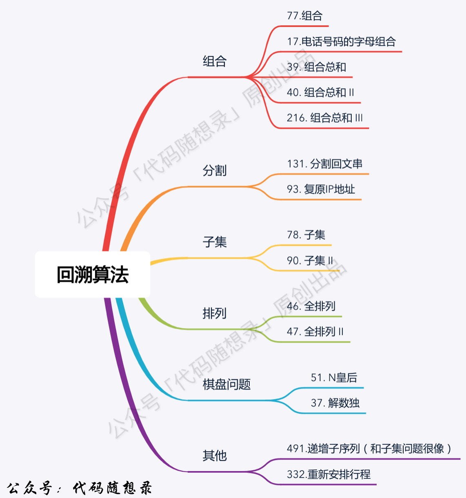
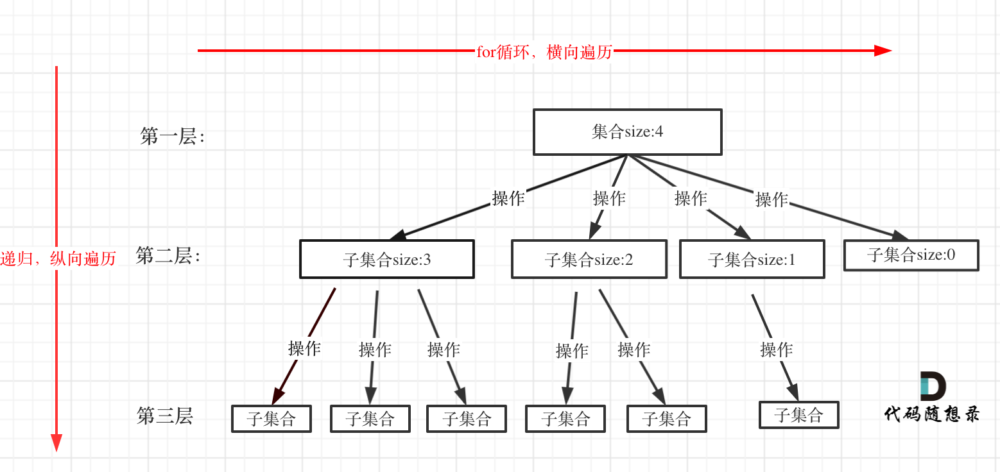

# 8. 回溯算法

## 1. 回溯算法理论基础
1. 题目分类：
2. **<font color="red">回溯法/回溯搜索法</font>**：一种搜索方式；回溯是递归的副产品，只要有递归就会有回溯 &rarr; 回溯函数即递归函数
    1. 效率：不高效 &larr; 本质是穷举，可以加剪枝提效
    2. 解决问题类型：
        1. 组合问题：N个数里面按一定规则找出k个数的集合（不强调元素顺序）
        2. 切割问题：一个字符串按一定规则有几种切割方式
        3. 子集问题：一个N个数的集合里有多少符合条件的子集
        4. 排列问题：N个数按一定规则全排列，有几种排列方式（强调元素顺序）
        5. 棋盘问题：N皇后、解数独等等
    3. 回溯法的问题都可以抽象为 **树形结构**，因为解决的都是在集合中递归查找子集，集合的大小构成了树的宽度，递归的深度构成了树的深度
3. 回溯函数模板：
    ```cpp showLineNumbers
    void backtracking(参数) {
        if (终止条件) {
            存放结果;
            return;
        }

        for (选择：本层集合中元素（树中节点孩子的数量就是集合的大小）) {
            处理节点;
            // 递归
            backtracking(路径，选择列表);
            回溯，撤销处理结果
        }
    }
    ```
    1. **<mark>确定参数和返回值</mark>**：
        - 函数返回值一般为 `void`
        - 先写逻辑，再看需要什么参数，就填什么参数
    2. **<mark>确定终止条件</mark>**
    3. **<mark>确定单层递归的逻辑</mark>**：即遍历过程
        - for循环是横向遍历，递归是纵向遍历
            

---

## 2. 组合问题
> 【[LC77](https://leetcode.cn/problems/combinations/description/)】给定两个整数 n 和 k，返回范围 [1, n] 中所有可能的 k 个数的组合。你可以按 任何顺序 返回答案。

1. 自想解法：暴力解法 &rarr; k层for循环，循环大小为n且按层递减 &rarr; 把for循环放在递归中，即一层递归为一层for循环
2. 每次从集合中选取元素，可选择的范围随着选择的进行而收缩，调整可选择的范围
    
    1. n相当于树的宽度，k相当于树的深度
    2. 每次搜索到叶子节点，即找到一个结果
```cpp showLineNumbers
class Solution {
public:
    vector<vector<int>> result;
    vector<int> path;
    void backtracking(int n, int k, int startIndex) {
        if (path.size() == k) {
            result.push_back(path);
            return;
        }

        for (int i = startIndex; i <= n; i++) {
            path.push_back(i);
            backtracking(n, k, i + 1);
            path.pop_back();
        }
    }

    vector<vector<int>> combine(int n, int k) {
        backtracking(n, k, 1);
        return result;
    }
};
```

:::warning[复杂度？]
- 时间复杂度：$O(n * 2^n)$
- 空间复杂度：$O(n)$
:::
3. 剪枝优化：for循环选择的起始位置之后的元素个数 **已经不足** 所需的元素个数 &rarr; 结束for循环
    
    1. 已经选择的元素个数：`path.size()`
    2. 还需要的元素个数：`k - path.size()`
    3. 在集合n中至多要从该起始位置开始遍历：`n - (k - path.size()) + 1`

---

## 3. 组合（优化）
> 【[LC]】

1. 

---

## 4. 组合总和III
> 【[LC]】

1. 

---

## 5. 电话号码的字母组合
> 【[LC]】

1. 

---

## 6. 回溯周末总结

---

## 7. 组合总和
> 【[LC]】

1. 

---

## 8. 组合总和II
> 【[LC]】

1. 

---

## 9. 分割回文串
> 【[LC]】

1. 

---

## 10. 复原IP地址
> 【[LC]】

1. 

---

## 11. 子集问题
> 【[LC]】

1. 

---

## 12. 回溯周末总结

---

## 13. 子集II
> 【[LC]】

1. 

---

## 14. 递增子序列
> 【[LC]】

1. 

---

## 15. 全排列
> 【[LC]】

1. 

---

## 16. 全排列II
> 【[LC]】

1. 

---

## 17. 回溯周末总结

---

## 18. 回溯算法去重问题的另一种写法
> 【[LC]】

1. 

---

## 20. N皇后
> 【[LC]】

1. 

---

## 21. 解数独
> 【[LC]】

1. 

---

## 22. 回溯法总结篇

---
