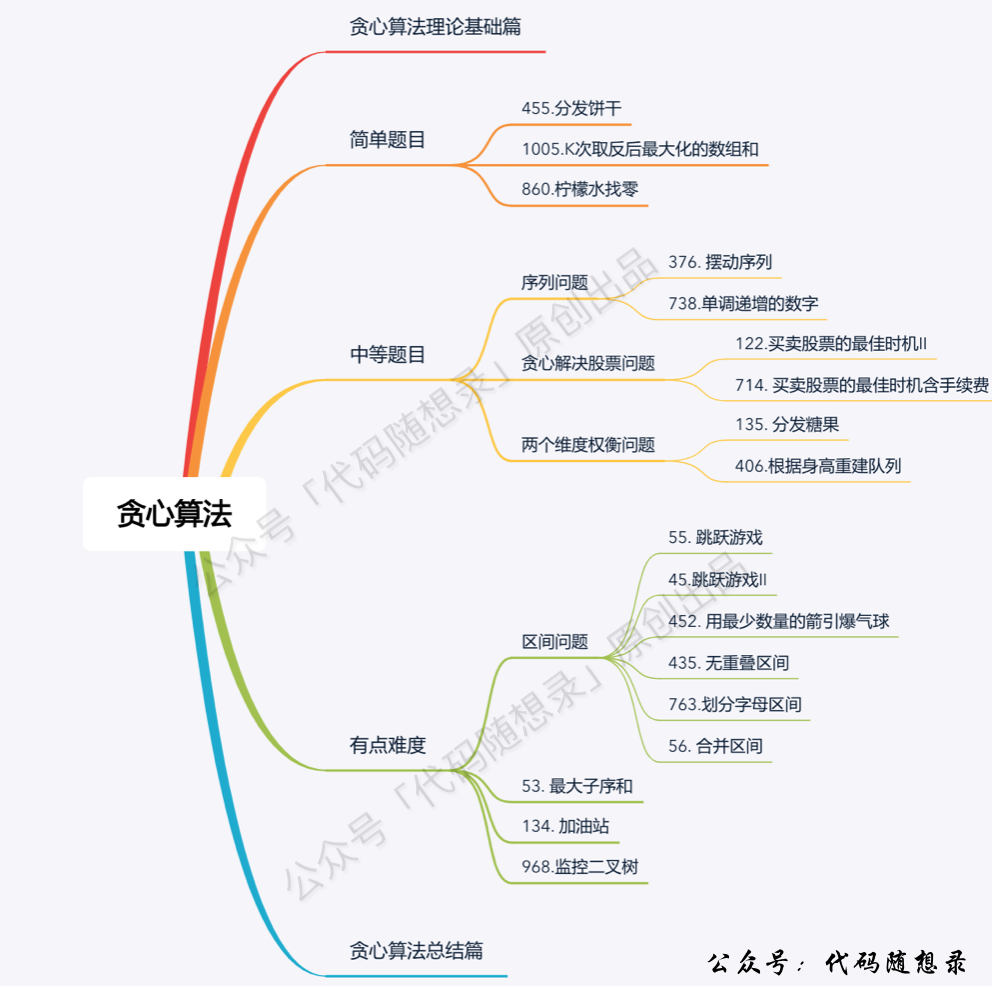

# 9. 贪心算法

## 1. 贪心算法理论基础
1. 题目分类：
2. 贪心：选择每一阶段的 **局部最优**，从而达到 **全局最优**
3. 贪心的套路/什么时候用贪心：贪心算法没有固定的套路；**手动模拟** 感觉可以从局部最优推出整体最优，而且 **想不到反例**，那么就可以试一试贪心 &rarr; 常识性推导 + 举反例
4. 解题步骤：实际做题时，只要想清楚局部最优是什么，且推导出全局最优，就够了
    1. 将问题分解为若干个子问题
    2. 找出适合的贪心策略
    3. 求解每一个子问题的最优解
    4. 将局部最优解堆叠成全局最优解

---

## 2. 分发饼干
> 【[LC455](https://leetcode.cn/problems/assign-cookies/description/)】假设你是一位很棒的家长，想要给你的孩子们一些小饼干。但是，每个孩子最多只能给一块饼干。对每个孩子 i，都有一个胃口值 g[i]，这是能让孩子们满足胃口的饼干的最小尺寸；并且每块饼干 j，都有一个尺寸 s[j] 。如果 s[j] >= g[i]，我们可以将这个饼干 j 分配给孩子 i ，这个孩子会得到满足。你的目标是满足尽可能多的孩子，并输出这个最大数值。

1. 贪心策略：
    - 局部最优：大饼干喂给胃口大的，充分利用饼干尺寸喂饱一个
    - 全局最优：喂饱尽可能多的小孩
2. 解法：
```cpp showLineNumbers
class Solution {
public:
    int findContentChildren(vector<int>& g, vector<int>& s) {
        sort(g.begin(), g.end());
        sort(s.begin(), s.end());

        // 大饼干先喂饱大胃口
        int index = s.size() - 1;
        int result = 0;
        for (int i = g.size() - 1; i >= 0; i--) {
            if (index >= 0 && s[index] >= g[i]) {
                result++;
                // 自减代替两层for循环
                index--;
            }
        }
        return result;
    }
};
```
    1. 大饼干先喂饱大胃口：for循环控制胃口，里面的if条件控制饼干
    2. 小饼干先喂饱小胃口：for循环控制饼干，里面的if条件控制胃口

---

## 3. 摆动序列
> 【[LC]】

1. 

---

## 4. 最大子序和
> 【[LC]】

1. 

---

## 5. 贪心周总结
> 【[LC]】

1. 

---

## 6. 买卖股票的最佳时机II
> 【[LC]】

1. 

---

## 7. 跳跃游戏
> 【[LC]】

1. 

---

## 8. 跳跃游戏II
> 【[LC]】

1. 

---

## 9. K次取反后最大化的数组和
> 【[LC]】

1. 

---

## 10. 贪心周总结
> 【[LC]】

1. 

---

## 11. 加油站
> 【[LC]】

1. 

---

## 12. 分发糖果
> 【[LC]】

1. 

---

## 13. 柠檬水找零
> 【[LC]】

1. 

---

## 14. 根据身高重建队列
> 【[LC]】

1. 

---

## 15. 贪心周总结
> 【[LC]】

1. 

---

## 16. 根据身高重建队列（vector原理讲解）
> 【[LC]】

1. 

---

## 17. 用最少数量的箭引爆气球
> 【[LC]】

1. 

---

## 18. 无重叠区间
> 【[LC]】

1. 

---

## 19. 划分字母区间
> 【[LC]】

1. 

---

## 20. 合并区间
> 【[LC]】

1. 

---

## 21. 贪心周总结
> 【[LC]】

1. 

---

## 22. 单调递增的数字
> 【[LC]】

1. 

---

## 23. 监控二叉树
> 【[LC]】

1. 

---

## 24. 贪心算法总结篇
> 【[LC]】

1. 

---
