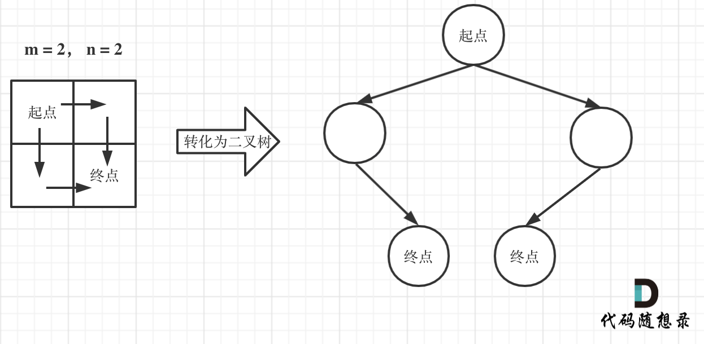
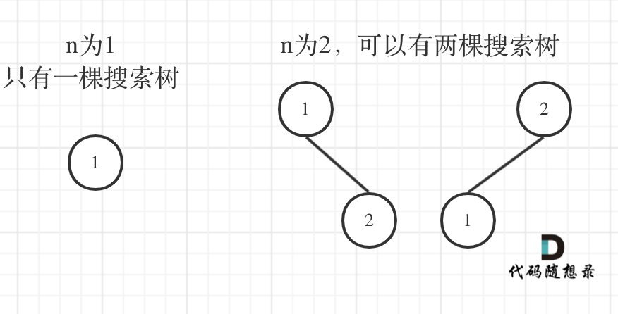
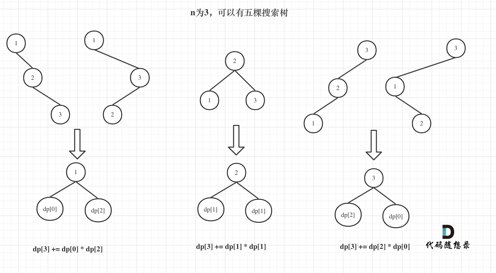
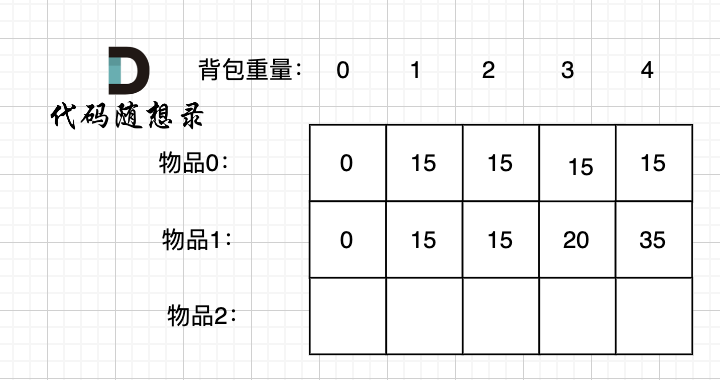
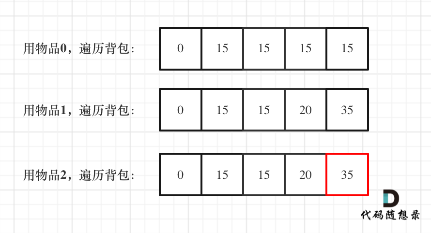

# 10. 动态规划

## 1. 动态规划理论基础
1. 题目分类：
2. **<font color="red">动态规划DP（Dynamic Programming）</font>**：每一个状态一定是由上一个状态推导出来的，适用于有很多重叠子问题的问题
    - 与贪心算法的区别：动态规划是状态推导，而贪心算法是直接从局部选最优
3. 解题步骤：
    1. 确定dp数组以及下标的含义
    2. 确定递推公式
    3. 确定dp数组如何初始化
    4. 确定遍历顺序
    5. 举例推导dp数组

---

## 2. 斐波那契数
> 【[LC509](https://leetcode.cn/problems/fibonacci-number/description/)】斐波那契数 （通常用 F(n) 表示）形成的序列称为 斐波那契数列 。该数列由 0 和 1 开始，后面的每一项数字都是前面两项数字的和。也就是：
> - F(0) = 0，F(1) = 1
> - F(n) = F(n - 1) + F(n - 2)，其中 n > 1  
> 给定 n ，请计算 F(n) 。

1. 按照题目所给信息可轻松AC
2. 动规五部曲：
```cpp showLineNumbers
class Solution {
public:
    // 1. 确定dp数组以及下标的含义：第i个斐波那契数是dp[i]
    // 5. 举例推导dp数组
    int fib(int n) {
        if (n < 2) return n;

        vector<int> dp(n + 1);
        // 3. 确定dp数组如何初始化：（题目已提供）
        dp[0] = 0;
        dp[1] = 1;
        // 4. 确定遍历顺序：从前往后
        for (int i = 2; i <= n; i++) {
            // 2. 确定递推公式：（题目已提供）
            dp[i] = dp[i - 1] + dp[i - 2];
        }
        return dp[n];
    }
};
```

---

## 3. 爬楼梯
> 【[LC70](https://leetcode.cn/problems/climbing-stairs/description/)】假设你正在爬楼梯。需要 n 阶你才能到达楼顶。每次你可以爬 1 或 2 个台阶。你有多少种不同的方法可以爬到楼顶呢？

1. 动规五部曲：
```cpp showLineNumbers
class Solution {
public:
    int climbStairs(int n) {
        // 1. 确定dp数组以及下标的含义：第i层楼有dp[i]种方法
        // 2. 确定递推公式：i-1层（再爬1个台阶）的dp[i-1]种方法 + i-2层（再爬2个台阶）的dp[i-2]种方法
        // 3. 确定dp数组如何初始化：dp[1]=1；dp[2]=2
        // 4. 确定遍历顺序：从前往后
        // 5. 举例推导dp数组

        if (n <= 2) return n;

        vector<int> dp(n + 1);
        dp[1] = 1;
        dp[2] = 2;
        for (int i = 3; i <= n; i++) dp[i] = dp[i - 1] + dp[i - 2];
        return dp[n];
    }
};
```
2. 相关题目：[KC57](https://kamacoder.com/problempage.php?pid=1067)（背包问题的角度，详见 [22. 爬楼梯（进阶版）](#22-爬楼梯进阶版)）

---

## 4. 使用最小花费爬楼梯
> 【[LC746](https://leetcode.cn/problems/min-cost-climbing-stairs/description/)】给你一个整数数组 cost ，其中 cost[i] 是从楼梯第 i 个台阶向上爬需要支付的费用。一旦你支付此费用，即可选择向上爬一个或者两个台阶。你可以选择从下标为 0 或下标为 1 的台阶开始爬楼梯。请你计算并返回达到楼梯顶部的最低花费。

1. 自想解法：适用于旧描述，即到达台阶需要费用，从台阶往上跳不需要费用
```cpp showLineNumbers
class Solution {
public:
    int minCostClimbingStairs(vector<int>& cost) {
        // 1. 确定dp数组以及下标的含义：爬上第i层楼最低花费dp[i]
        // 2. 确定递推公式：i-1层（再爬1个台阶）最低花费dp[i-1] + i-2层（再爬2个台阶）最低花费dp[i-2]
        // 3. 确定dp数组如何初始化：dp[0]=cost[0]；dp[1]=cost[1]
        // 4. 确定遍历顺序：从前往后
        // 5. 举例推导dp数组
        vector<int> dp(cost.size() + 1, 0);
        dp[0] = cost[0];
        dp[1] = cost[1];

        for (int i = 2; i < cost.size(); i++) {
            dp[i] = min(dp[i - 1], dp[i - 2]) + cost[i];
        }
        return min(dp[cost.size() - 1], dp[cost.size() - 2]);
    }
};
```
2. 新描述含义相反（到达台阶不需要费用，但从台阶往上跳需要费用）：
```cpp showLineNumbers
class Solution {
public:
    int minCostClimbingStairs(vector<int>& cost) {
        vector<int> dp(cost.size() + 1, 0);
        dp[0] = 0;
        dp[1] = 0;

        for (int i = 2; i <= cost.size(); i++) {
            dp[i] = min(dp[i - 1] + cost[i - 1], dp[i - 2] + cost[i - 2]);
        }
        return dp[cost.size()];
    }
};
```

---

## 5. 动规周总结
1. [周一](#1-动态规划理论基础)
2. [周二](#2-斐波那契数)
3. [周三](#3-爬楼梯)
4. [周四](#4-使用最小花费爬楼梯)

---

## 6. 不同路径
> 【[LC62](https://leetcode.cn/problems/unique-paths/description/)】一个机器人位于一个 m x n 网格的左上角 （起始点在下图中标记为 “Start” ）。机器人每次只能向下或者向右移动一步。机器人试图达到网格的右下角（在下图中标记为 “Finish” ）。问总共有多少条不同的路径？

1. 自想解法：动态规划
```cpp showLineNumbers
class Solution {
public:
    int uniquePaths(int m, int n) {
        // 1. 确定dp数组以及下标的含义：(0, 0)到(i, j) 有dp[i][j]条路径
        // 2. 确定递推公式：左边网格有dp[i][j-1]条路径 + 上边网格有dp[i-1][j]条路径
        // 3. 确定dp数组如何初始化：dp[0][j]=1；dp[i][0]=1
        // 4. 确定遍历顺序：从前往后
        // 5. 举例推导dp数组
        vector<vector<int>> dp(m, vector<int>(n, 0));
        for (int i = 0; i < m; i++) dp[i][0] = 1;
        for (int j = 0; j < n; j++) dp[0][j] = 1;

        for (int i = 1; i < m; i++) {
            for (int j = 1; j < n; j++) {
                dp[i][j] = dp[i][j - 1] + dp[i - 1][j];
            }
        }
        return dp[m - 1][n - 1];
    }
};
```
2. 深搜：将机器人走过的路径抽象为一棵二叉树 &rarr; 叶子节点即终点
    
3. 数论：
    1. 无论怎么走，走到终点都需要 `m + n - 2` 步
    2. 无论怎么走，一定有 `m - 1` 步是向下走的
    3. 求走法数，可转换为在 `m + n - 2` 个不同的数中随便取 `m - 1` 个数的取法，即 $C_{m+n-2}^{m-1}$

---

## 7. 不同路径II
> 【[LC63](https://leetcode.cn/problems/unique-paths-ii/description/)】给定一个 m x n 的整数数组 grid。一个机器人初始位于 左上角（即 grid[0][0]）。机器人尝试移动到 右下角（即 grid[m - 1][n - 1]）。机器人每次只能向下或者向右移动一步。网格中的障碍物和空位置分别用 1 和 0 来表示。机器人的移动路径中不能包含 任何 有障碍物的方格。返回机器人能够到达右下角的不同路径数量。测试用例保证答案小于等于 2 * 109。

1. 自想解法：
    1. 初始化dp数组时，遇到障碍后，停止初始化赋值为1
    2. 如果在起点或终点出现了障碍，直接返回0
```cpp showLineNumbers
class Solution {
public:
    int uniquePathsWithObstacles(vector<vector<int>>& obstacleGrid) {
        int m = obstacleGrid.size();
        int n = obstacleGrid[0].size();

        // 如果在起点或终点出现了障碍，直接返回0
        if (obstacleGrid[0][0] == 1 || obstacleGrid[m - 1][n - 1] == 1) return 0;

        vector<vector<int>> dp(m, vector<int>(n, 0));
        dp[0][0] = 1;
        for (int i = 1; i < m && obstacleGrid[i][0] == 0; i++) dp[i][0] = 1;
        for (int j = 1; j < n && obstacleGrid[0][j] == 0; j++) dp[0][j] = 1;

        for (int i = 1; i < m; i++) {
            for (int j = 1; j < n; j++) {
                if (obstacleGrid[i][j] == 0) dp[i][j] = dp[i - 1][j] + dp[i][j - 1];
            }
        }
        return dp[m - 1][n - 1];
    }
};
```

---

## 8. 整数拆分
> 【[LC343](https://leetcode.cn/problems/integer-break/description/)】给定一个正整数 n ，将其拆分为 k 个 正整数 的和（ k >= 2 ），并使这些整数的乘积最大化。返回 你可以获得的最大乘积 。

1. 动规五部曲：
    1. 确定dp数组以及下标的含义：分拆数字i可以得到的最大乘积为dp[i]
        1. dp[n]即为题目答案
        2. dp[i]用作推导dp[n]
    2. 确定递推公式：`dp[i] = max(dp[i], max((i - j) * j, dp[i - j] * j));`
        1. `(i - j) * j`：将 `i` 拆分成两个数相乘
        2. `dp[i - j] * j`：将 `i` 拆分成两个及两个以上的数相乘
        3. `dp[i]`：遍历j时，每次取最大
    3. 确定dp数组如何初始化：dp[2]=1
        1. 题目限定：`2 <= n <= 58`
    4. 确定遍历顺序：从前往后
    5. 举例推导dp数组
```cpp showLineNumbers
class Solution {
public:
    int integerBreak(int n) {
        vector<int> dp(n + 1, 0);
        dp[2] = 1;

        for (int i = 3; i <= n; i++) {
            for (int j = 1; j <= i / 2; j++) {
                dp[i] = max(dp[i], max((i - j) * j, dp[i - j] * j));
            }
        }
        return dp[n];
    }
};
```

---

## 9. 不同的二叉搜索树
> 【[LC96](https://leetcode.cn/problems/unique-binary-search-trees/description/)】给你一个整数 n ，求恰由 n 个节点组成且节点值从 1 到 n 互不相同的 二叉搜索树 有多少种？返回满足题意的二叉搜索树的种数。

1. 根据二叉搜索树的特性，可得到如图所示的节点布局规律：
    - 按照题目示例n为3的情况可知：`dp[3] = dp[0] * dp[2] + dp[1] * dp[1] + dp[2] * dp[0]`
        
        1. 元素1为根节点：剩余2个节点分布在右子树上，且布局与n为2的情况相同
        2. 元素2为根节点：剩余2个节点分别分布在左、右子树上，且布局与n为1的情况相同
        3. 元素3为根节点：剩余2个节点分布在左子树上，且布局与n为2的情况相同
2. 自想解法：没有想清楚j的含义，导致思路混乱，容易出错
```cpp showLineNumbers
class Solution {
public:
    int numTrees(int n) {
        if (n <= 2) return n;

        vector<int> dp(n + 1, 0);
        dp[0] = 1;
        dp[1] = 1;
        dp[2] = 2;

        for (int i = 3; i <= n; i++) {
            for (int j = 0; j < i; j++) {
                dp[i] += dp[j] * dp[i - 1 - j];
            }
        }
        return dp[n];
    }
};
```
3. 动规五部曲：
    1. 确定dp数组以及下标的含义：1到i为根节点组成dp[i]个二叉搜索树（dp[n]即为题目答案）
    2. 确定递推公式：`dp[i] += dp[j - 1] * dp[i - j];`
        1. `dp[i] += dp[以j为根节点的左子树节点的数量] * dp[以j为根节点的右子树节点的数量];`
        2. 由于是二叉搜索树，根据其特性可知：有 `j - 1` 个左子树节点，`i - j` 个右子树节点
    3. 确定dp数组如何初始化：dp[0]=1
    4. 确定遍历顺序：从前往后
    5. 举例推导dp数组
```cpp showLineNumbers
class Solution {
public:
    int numTrees(int n) {
        vector<int> dp(n + 1, 0);
        dp[0] = 1;

        for (int i = 1; i <= n; i++) {
            for (int j = 1; j <= i; j++) {
                dp[i] += dp[j - 1] * dp[i - j];
            }
        }
        return dp[n];
    }
};
```

---

## 10. 动规周总结
1. [周一](#6-不同路径)
2. [周二](#7-不同路径ii)
3. [周三](#8-整数拆分)
4. [周四](#9-不同的二叉搜索树)

---

## 11. 0-1背包理论基础（一）
1. 背包问题分类：
2. **<font color="red">01背包</font>**：有 `n` 件物品和一个最大容量为 `w` 的背包。第 `i` 件物品的容量是 `weight[i]`，得到的价值是 `value[i]`。每件物品只能用一次，求解将哪些物品装入背包里物品价值总和最大。
    - 动规五部曲：（以下按照例子来理解）
        0. 例子：背包的最大容量为4。物品0的容量为1，价值为15；物品1的容量为3，价值为20；物品2的容量为4，价值为30。问背包能背的物品最大价值是多少？
        1. 确定dp数组以及下标的含义：使用二维数组 `dp[i][j]` &larr; `i` 表示物品、`j` 表示背包容量；`dp[i][j]` 表示任取第 `0` 到 `i` 件物品放进容量为 `j` 的背包后的最大价值总和
            
        2. 确定递推公式：`dp[i][j] = max(dp[i - 1][j], dp[i - 1][j - weight[i]] + value[i])`
            1. 求取 `dp[1][4]` 的两种情况：`dp[1][4] = max(dp[0][4], dp[0][1] + 物品1的价值)`
                1. 不放物品1：容量为4的背包中只放物品0的情况 &rarr; 背包价值为 `dp[0][4]`
                2. 放物品1：背包需要预留出物品1的容量 &rarr; 背包容量余1，考虑放物品0的最大价值 &rarr; 背包价值为 `dp[0][1] + 物品1的价值`
        3. 确定dp数组如何初始化：
            ```cpp showLineNumbers
            // 初始化dp
            vector<vector<int>> dp(weight.size(), vector<int>(bagweight + 1, 0));
            for (int j = weight[0]; j <= bagweight; j++) {
                dp[0][j] = value[0];
            }
            ```
            1. 从dp[i][j]定义出发：如果背包容量j为0（即 `dp[i][0]`），无论选取哪些物品，背包价值总和一定为 `0`
            2. 从状态转移方程出发：`i` 是由 `i - 1` 推导出来的 &rarr; 一定要初始化i为0的情况（即 `dp[0][j]`）
                1. `j < weight[0]`：dp[0][j]是 `0`
                2. `j >= weight[0]`：dp[0][j]是 `value[0]`
        4. 确定遍历顺序：先遍历物品，再遍历背包
            ```cpp showLineNumbers
            // 遍历物品（weight数组的大小就是物品个数）
            for (int i = 1; i < weight.size(); i++) {
                // 遍历背包容量
                for (int j = 0; j <= bagweight; j++) {
                    if (j < weight[i]) dp[i][j] = dp[i - 1][j];
                    else dp[i][j] = max(dp[i - 1][j], dp[i - 1][j - weight[i]] + value[i]);
                }
            }
            ```
        5. 举例推导dp数组

:::tip[暴力解法？]
每一件物品其实只有取或者不取两个状态，可以用回溯法搜索出所有的情况 &rarr; 时间复杂度是 $O(2^n)$（其中，物品数量n）
所以暴力解法是指数级别的时间复杂度，进而才需要动态规划的解法来进行优化！
:::

3. 相关题目：[KC46](https://kamacoder.com/problempage.php?pid=1046)

> 补充：【[KC46](https://kamacoder.com/problempage.php?pid=1046)】小明是一位科学家，他需要参加一场重要的国际科学大会，以展示自己的最新研究成果。他需要带一些研究材料，但是他的行李箱空间有限。这些研究材料包括实验设备、文献资料和实验样本等等，它们各自占据不同的空间，并且具有不同的价值。 小明的行李空间为 N，问小明应该如何抉择，才能携带最大价值的研究材料，每种研究材料只能选择一次，并且只有选与不选两种选择，不能进行切割。

```cpp showLineNumbers
#include <algorithm>
#include <iostream>
#include <vector>
using namespace std;

int main() {
    int m, n;
    cin >> m >> n;

    vector<int> weight(m, 0);
    for (int i = 0; i < m; i++) cin >> weight[i];
    
    vector<int> value(m, 0);
    for (int i = 0; i < m; i++) cin >> value[i];

    // 初始化dp数组
    vector<vector<int>> dp(m, vector<int>(n + 1, 0));
    for (int i = weight[0]; i <= n; i++) dp[0][i] = value[0];

    // 计算dp数组
    for (int i = 1; i < m; i++) {
        for (int j = 1; j <= n; j++) {
            if (j < weight[i]) dp[i][j] = dp[i - 1][j];
            else dp[i][j] = max(dp[i - 1][j], dp[i - 1][j - weight[i]] + value[i]);
        }
    }

    cout << dp[m - 1][n] << endl;
}
```

---

## 12. 0-1背包理论基础（二）
1. **滚动数组（一维dp数组）**：如果上一层可以重复利用，那么直接拷贝到当前层，即把二维dp降为一维dp
    - 二维dp：`dp[i][j] = max(dp[i - 1][j], dp[i - 1][j - weight[i]] + value[i]);`
    - 一维dp：`dp[j] = max(dp[j], dp[j - weight[i]] + value[i]);`
2. 动规五部曲：（以下按照例子来理解）
    0. 例子：背包的最大容量为4。物品0的容量为1，价值为15；物品1的容量为3，价值为20；物品2的容量为4，价值为30。问背包能背的物品最大价值是多少？
    1. 确定dp数组以及下标的含义：使用一维数组 `dp[j]` &larr; `j` 表示背包容量；`dp[j]` 表示当前背包的最大价值总和
    2. 确定递推公式：`dp[j] = max(dp[j], dp[j - weight[i]] + value[i]);`
    3. 确定dp数组如何初始化：非0下标的元素都初始化为 `0
    4. 确定遍历顺序：先遍历物品，再遍历背包
        ```cpp showLineNumbers
        // 遍历物品（weight数组的大小就是物品个数）
        for (int i = 0; i < weight.size(); i++) {
            // 遍历背包容量
            for(int j = bagWeight; j >= weight[i]; j--) {
                dp[j] = max(dp[j], dp[j - weight[i]] + value[i]);
            }
        }
        ```
        1. 倒序遍历背包容量：为了保证物品i只被放入一次！ &rarr; 避免前一层数据影响到当前数据
            1. &times; 正序遍历：`dp[1] = 15` &rarr; `dp[2] = 30`（`dp[2]` 的结果错误，放入了2次物品0，正确结果应该为15）
            2. &radic; 倒序遍历：`dp[2] = 15` &rarr; `dp[1] = 15`
        2. 遍历顺序不可以来回切换：如果先遍历背包，会导致每次都只放入一个物品
    5. 举例推导dp数组：
        
3. 相关题目：[KC46](https://kamacoder.com/problempage.php?pid=1046)

> 补充：【[KC46](https://kamacoder.com/problempage.php?pid=1046)】小明是一位科学家，他需要参加一场重要的国际科学大会，以展示自己的最新研究成果。他需要带一些研究材料，但是他的行李箱空间有限。这些研究材料包括实验设备、文献资料和实验样本等等，它们各自占据不同的空间，并且具有不同的价值。 小明的行李空间为 N，问小明应该如何抉择，才能携带最大价值的研究材料，每种研究材料只能选择一次，并且只有选与不选两种选择，不能进行切割。

```cpp showLineNumbers
#include <algorithm>
#include <iostream>
#include <vector>
using namespace std;

int main() {
    int m, n;
    cin >> m >> n;

    vector<int> weight(m, 0);
    for (int i = 0; i < m; i++) cin >> weight[i];

    vector<int> value(m, 0);
    for (int i = 0; i < m; i++) cin >> value[i];

    vector<int> dp(n + 1, 0);
    for (int i = 0; i < m; i++) {
        for (int j = n; j >= weight[i]; j--) {
            dp[j] = max(dp[j], dp[j - weight[i]] + value[i]);
        }
    }
    
    cout << dp[n] << endl;
}
```

---

## 13. 分割等和子集
> 【[LC]】

1. 

---

## 14. 最后一块石头的重量II
> 【[LC]】

1. 

---

## 15. 动规周总结
> 【[LC]】

1. 

---

## 16. 目标和
> 【[LC]】

1. 

---

## 17. 一和零
> 【[LC]】

1. 

---

## 18. 完全背包理论基础
> 【[LC]】

1. 

---

## 19. 零钱兑换II
> 【[LC]】

1. 

---

## 20. 动规周总结
> 【[LC]】

1. 

---

## 21. 组合总和Ⅳ
> 【[LC]】

1. 

---

## 22. 爬楼梯（进阶版）
> 【[LC]】

1. 

---

## 23. 零钱兑换
> 【[LC]】

1. 

---

## 24. 完全平方数
> 【[LC]】

1. 

---

## 25. 动规周总结
> 【[LC]】

1. 

---

## 26. 单词拆分
> 【[LC]】

1. 

---

## 27. 多重背包理论基础
> 【[LC]】

1. 

---

## 28. 背包问题总结篇
> 【[LC]】

1. 

---

## 29. 打家劫舍
> 【[LC]】

1. 

---

## 30. 打家劫舍II
> 【[LC]】

1. 

---

## 31. 打家劫舍III
> 【[LC]】

1. 

---

## 32. 买卖股票的最佳时机
> 【[LC]】

1. 

---

## 33. 动规周总结
> 【[LC]】

1. 

---

## 34. 买卖股票的最佳时机II
> 【[LC]】

1. 

---

## 35. 买卖股票的最佳时机III
> 【[LC]】

1. 

---

## 36. 买卖股票的最佳时机IV
> 【[LC]】

1. 

---

## 37. 最佳买卖股票时机含冷冻期
> 【[LC]】

1. 

---

## 38. 动规周总结
> 【[LC]】

1. 

---

## 39. 买卖股票的最佳时机含手续费
> 【[LC]】

1. 

---

## 40. 股票问题总结篇
> 【[LC]】

1. 

---

## 41. 最长上升子序列
> 【[LC]】

1. 

---

## 42. 最长连续递增序列
> 【[LC]】

1. 

---

## 43. 最长重复子数组
> 【[LC]】

1. 

---

## 44. 最长公共子序列
> 【[LC]】

1. 

---

## 45. 不相交的线
> 【[LC]】

1. 

---

## 46. 最大子序和
> 【[LC]】

1. 

---

## 47. 判断子序列
> 【[LC]】

1. 

---

## 48. 不同的子序列
> 【[LC]】

1. 

---

## 49. 两个字符串的删除操作
> 【[LC]】

1. 

---

## 50. 编辑距离
> 【[LC]】

1. 

---

## 51. 编辑距离总结篇
> 【[LC]】

1. 

---

## 52. 回文子串
> 【[LC]】

1. 

---

## 53. 最长回文子序列
> 【[LC]】

1. 

---

## 54. 动态规划总结篇
> 【[LC]】

1. 

---
