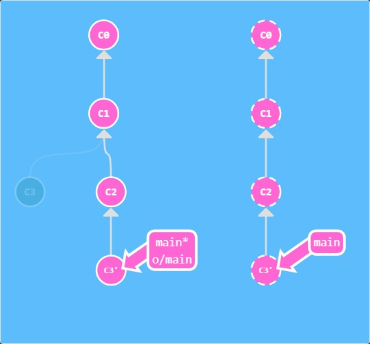
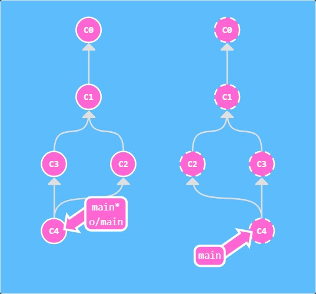

# Learn Git Branching

https://learngitbranching.js.org/?locale=zh_CN

## 1 主要
### 1.1 基础篇
#### 1.1.1 Git Commit
1. 命令：
    - `git commit` &rarr; 产生一条新的提交记录
2. Git仓库中的提交记录保存的是目录下所有文件的 **快照** ；会将 **当前版本** 与仓库中的上一个版本进行对比，并把所有的差异打包到一起作为一个提交记录；同时还保存提交的历史记录

#### 1.1.2 Git Branch
1. 命令：
    - `git branch <new-branch-name>` &rarr; 产生一个新分支
    - `git checkout <branch-name>` &rarr; 切换到某分支上
    - `git checkout -b <branch-name>` &rarr; 创建一个新的分支同时切换到新创建的分支上
        - `-b <branch-name>`：新建一个分支（branch）并检出
2. **基于这个提交以及它所有的parent提交** 进行新的工作
3. 创建新分支后，需要使用 `checkout` 命令切换到新分支上，再进行提交

#### 1.1.3 Git Merge
1. 命令：
    - `git merge <branch-name>` &rarr; 将分支合并到当前分支
2. 合并两个分支后产生一个特殊的提交记录，它有两个parent节点

#### 1.1.4 Git Rebase
1. 命令：
    - `git rebase <to-branch-name> <from-branch-name>` &rarr; 将源分支（默认为当前分支）的副本复制到目标分支上
2. 这个命令实际上就是取出一系列的提交记录，“复制”它们，然后在另外一个地方逐个地放下去
3. 与 `merge` 命令的区别：`rebase` 命令使得提交记录更加线性

### 1.2 高级篇
#### 1.2.1 分离HEAD
1. `HEAD` 是一个对当前所在分支的符号引用，也就是指向你正在其基础上进行工作的提交记录，通常情况下是指向分支的
2. 分离的 `HEAD`：让其指向了 **某个具体的提交记录** 而不是分支名

#### 1.2.2 相对引用 `^`
1. 命令：
    - `git checkout <ref>^` &rarr; 将 `HEAD` 移动到指定分支的上1个提交记录上（n个操作符 `^` 即移动到上n个提交记录上）
2. 相对引用：可以从一个易于记忆的地方（比如某一分支或 `HEAD`）开始计算

#### 1.2.3 相对引用2 `~`
1. 命令：
    - `git checkout <ref>~<num>` &rarr; 将 `HEAD` 移动到指定分支的上num个提交记录上
2. `~` 该操作符后面可以跟一个数字num（可选，不跟数字时与 `^` 相同，向上移动一次），指定向上移动num次
3. 强制修改分支位置：使用相对引用来移动分支
    - 如 `git branch -f main HEAD~3`：强制让 `main` 分支移动到 `HEAD` 上的第3个parent节点上
        - `-f <branch-name> <start-point>`：强制让分支移动到起始点

#### 1.2.4 撤销变更
1. 命令：
    - `git reset <ref>~<num>` &rarr; 将指定分支回退num个提交记录（原改动仍存在，但未加入暂存区）
    - `git revert <ref>` &rarr; 会产生新的提交记录，该记录就是用来撤销提交的
2. 撤销变更：由底层部分（ **暂存区** 的独立文件或者片段）和上层部分（变更到底是通过 **哪种方式** 被撤销的）组成
3. `reset` 和 `revert` 的区别：`reset` 命令的撤销只有本地记录，无法推送到远程；而 `revert` 命令可以使撤销记录推送到远程共享

### 1.3 移动提交记录
#### 1.3.1 Git Cherry-pick
1. 命令：
    - `git cherry-pick <commit>…` &rarr; 将指定的commit节点复制到当前分支下
2. 用于整理提交记录

#### 1.3.2 交互式 rebase
1. 命令：
    - `git rebase -i <commit>` &rarr; 从指定commit节点往后的所有提交记录作为备选，使用可视化界面进行调整
2. 不清楚想要的提交记录的哈希值时，无法使用 `git cherry-pick` 命令，用使用带参数 `--interactive` （缩写为 `-i`）的 `rebase` 命令
3. 使用参数 `--interactive` 时，会打开一个UI界面并列出将要被复制到目标分支的备选提交记录，还会显示每个提交记录的哈希值和提交说明；该UI界面可以调整提交记录的顺序、删除不想要的提交、合并提交

### 1.4 杂项
#### 1.4.1 只取一个提交记录（仅练习命令）

#### 1.4.2 提交的技巧1（仅练习命令）

#### 1.4.3 提交的技巧2（仅练习命令）

#### 1.4.4 Git Tag
1. 命令：
    - `git tag <tag-name> <ref>` &rarr; 在指定的提交记录（默认在 `HEAD` 上）上打标签
2. tag：**永久** 地将某个特定的提交命名为里程碑，可以像分支一样被引用

#### 1.4.5 Git Describe
1. 命令：
    - `git describe <ref>` &rarr; 输出 `<tag>_<numCommits>_g<hash>`
        1. `tag`：离 `ref` 最近的标签
        2. `numCommits`：表示 `ref` 与 `tag` 相差有多少个提交记录
        3. `hash`：`ref` 所表示的提交记录的前几位哈希值
2. 输出结果表示当前指针所在方向

### 1.5 高级话题
#### 1.5.1 多次Rebase（仅练习命令）

#### 1.5.2 两个parent节点
1. `git checkout <ref>^<num>` 命令：指定合并提交记录的第num个parent节点
2. `~` 和 `^` 支持链式操作，如：`git checkout main~^2~2`

#### 1.5.3 纠缠不清的分支（仅练习命令）

---

## 2 远程
### 2.1 Push & Pull —— Git 远程仓库！
#### 2.1.1 Git Clone
1. 命令：
    - `git clone` &rarr; 在本地创建一个远程仓库的拷贝
2. 远程仓库：是一个强大的备份，即使丢失了本地所有数据，你仍可以通过远程仓库拿回你丢失的数据；让代码社交化，允许其他开发者给项目做贡献

#### 2.1.2 远程分支
1. 远程分支：在本地仓库中，多了一个名为 `origin/main` 的分支；它反映了远程仓库（在你上次和它通信时）的 **状态**
2. 当切换到远程分支时，自动进入分离 `HEAD` 的状态 &rarr; 无法在远程分支上直接进行操作
3. 远程分支的命名规范：`<remote-name>/<remote-branch-name>`
    - `<remote-name>`：远程仓库的名字，默认为 `origin`
    - `<branch-name>`：远程分支的名字

#### 2.1.3 Git Fetch
1. 命令：
    - `git fetch` &rarr; 从远程仓库 **下载** 本地仓库中缺失的提交记录，以及更新本地的远程分支指针
2. 远程仓库的操作：向远程仓库传输数据，从远程仓库获取数据

#### 2.1.4 Git Pull
1. 命令：
    - `git pull` &rarr; 先抓取更新，再合并到本地分支
2. `git pull` = `git fetch` + `git merge`

#### 2.1.5 模拟团队合作（仅练习命令）

#### 2.1.6 Git Push
1. 命令：
    - `git push` &rarr; 将变更 **上传** 到指定的远程仓库，并在远程仓库上合并新的提交记录
2. `git push` 命令不带任何参数时的行为，与Git的 `push.default` 的配置有关
    - `simple`：（默认）推送当前分支到上游分支，如果上游分支不存在，则 **报错**
    - `upstream`：推送当前分支到上游分支，如果上游分支不存在，则 **自动创建**
    - `current`：推送当前分支到上游分支，如果上游分支不存在，则 **自动创建**
    - `matching`：推送 **所有本地分支** 到 **同名** 的上游分支，如果上游分支不存在，则 **报错**
    - `nothing`：**不推送** 任何分支

#### 2.1.7 偏离的提交历史
1. 本地仓库与远程仓库相比，存在偏离的提交历史记录，Git不允许直接 `push` &rarr; 使本地分支基于最新的远程分支进行工作
2. 方法：
    1. `rebase`：`git pull --rebase` = `git fetch` + `git rebase`
        
        1. `git fetch`：更新本地仓库中的远程分支
        2. `git rebase origin/main`：将工作移动到最新的提交记录下
        3. `git push`：推送到远程仓库
    2. `merge`：`git pull` = `git fetch` + `git merge`
        
        1. `git fetch`：更新本地仓库中的远程分支
        2. `git merge origin/main`：合并新变更到我们的本地分支
        3. `git push`：推送到远程仓库

#### 2.1.8 锁定的Main（Locked Main）
1. 远程服务器拒绝直接推送 `push` 提交到 `main`，因为策略配置要求 `pull requests` 来提交更新

### 2.2 关于 origin 和它的周边 —— Git 远程仓库高级操作
#### 2.2.1 推送主分支（仅练习命令）

#### 2.2.2 合并远程仓库
1. `rebase` 的优缺点：
    - 优点：`rebase` 使提交树变得很干净, 所有的提交都在一条线上
    - 缺点：`rebase` 修改了提交树的历史

#### 2.2.3 远程追踪
1. 命令：
    - `git checkout -b <local-branch-name> <remote-name>/<remote-branch-name>` &rarr; 通过远程分支切换到一个新的分支
    - `git branch -u <remote-name>/<remote-branch-name> <local-branch-name>` &rarr; 设置远程追踪分支
        - `-u`：设置本地分支的上游（upstream）分支
2. 追踪远程分支：由分支的 `remote tracking` 属性决定，为分支指定了推送的目的地以及拉取后合并的目标
    - `pull`：提交记录会被先下载到 `origin/main` 上，之后再合并到本地的 `main` 分支上 &rarr; **合并目标** 由这个关联确定
    - `push`：将提交记录从 `main` 推到远程仓库中的 `main` 分支（同时会更新远程分支 `o/main`） &rarr; **推送的目的地** 由这个关联确定

#### 2.2.4 Git push 的参数
1. `git push <remote-name> <branch-name>` &rarr; 切到本地仓库中的分支，获取所有的提交记录，再到远程仓库中找到 **同名** 分支，将远程仓库中没有的提交记录都推送上去

#### 2.2.5 Git push 的参数2
1. `git push <remote-name> <source>:<destination>` &rarr; 切到 **本地仓库中的源分支**，获取所有的提交记录，再找到 **远程仓库中的目标分支**，将远程仓库中没有的提交记录都推送上去

#### 2.2.6 Git fetch 的参数
1. `git fetch <remote-name> <branch-name>` &rarr; 下载远程仓库中的提交记录，并更新到本地的远程分支上，但 **不会更新** 你的 **本地的非远程分支**
2. `git fetch <remote-name> <source>:<destination>` &rarr; 从 **远程仓库中的源分支** 中下载所有的提交记录，并更新到 **本地仓库中的目标分支** 上

#### 2.2.7 没有 source 的 source
1. `git push <remote-name> :<destination>` &rarr; 删除远程仓库中的目标分支
2. `git fetch <remote-name> :<destination>` &rarr; 在本地仓库中创建一个新分支

#### 2.2.8 Git pull 的参数
1. 带参数的 `git pull`，相当于用 **同样的参数** 执行 `git fetch`，然后再 `merge` 到目标分支
    1. `git pull <remote-name> <branch-name>` = `git fetch <remote-name> <branch-name>` + `git merge <remote-name>/<branch-name>`
    2. `git pull <remote-name> <source>:<destination>` = `git fetch <remote-name> <source>:<destination>` + `git merge <destination>`