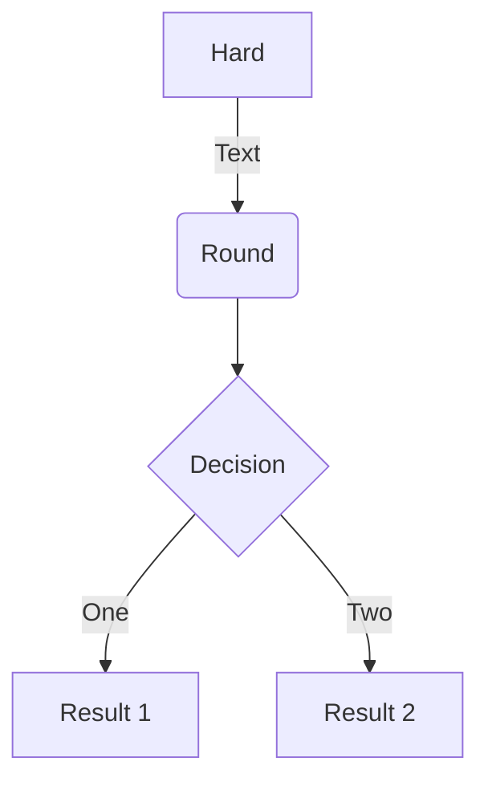
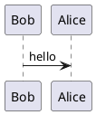

# markdown语法

## 1 基础语法
### 1.1 标题Heading
1. 几个#表示几级标题

### 1.2 换行
1. 行尾加2个空格 + 回车 = 换行
   1. 一个空格：  
      `&nbsp;`：No-Break Space，按下space键产生的空格
   2. 两个空格：  
      `&ensp;`：En Space，em的一半
   3. 四个空格：  
      `&emsp;`：Em Space，一个中文字的宽度

### 1.3 强调
1. _斜体效果Italic_：`*斜体1* 或 _斜体2_`
2. **加粗效果Bold**：`**加粗1** 或 __加粗2__`
3. ~~删除线效果~~：`~~删除线~~`

### 1.4 列表
1. 无序列表Unordered List：`-` 或 `*`
2. 有序列表Ordered List：`1. `
3. 任务列表：`- [ ]` 与 `- [x]`
   - [ ] 第一个todo
   - [ ] 第二个todo
   - [x] 第三个todo

### 1.5 链接Link
- [Github](http://github.com)
- [Go to Baidu](https://www.baidu.com)

### 1.6 引用Blockquote
1. 几个`>`表示几个引用嵌套
2. 要跳出引用，只需打一个空行即可
   > 这是第一行
         >> 这是第二行  
         >> 这是第三行

    这是在外面

### 1.7 分割线Horizontal Rule
1. `---`
2. `***`
3. `___`

### 1.8 代码块
1. 行内代码Code：\`，如`function add(x, y) { return x + y; }`
2. 块代码Fenced Code Block：\`\`\`
   ```js showLineNumbers
   function add(x, y) {
       return x + y;
   }
   ```

### 1.9 表格Table
- 代码：
   ```
   | a | b | c |
   | :--: | :--: | :--: |
   | 1 | 2 | 3 |
   | 4 | 5 | 6 |
   ```
- 效果：
   | a | b | c |
   | :--: | :--: | :--: |
   | 1 | 2 | 3 |
   | 4 | 5 | 6 |

---

## 2 数学
### 2.1 公式
- 类似于Latex
- 行内显示：$f(x)=x+12$
- 块显示：
   $$
   \sum_{n=1}^{100} n
   $$
- [常用符号](https://blog.csdn.net/u013914471/article/details/82973812)

---

## 3 文件导入
### 3.1 支持的格式
- 图片：`.jpg` `.gif` `.png` `.svg` `.bmp`
- 表格：`.csv`
- 网页：`.html`
- 文件：`.pdf`
- 代码：`@import "file_name" {formatter}`

---

## 4 图表
### 4.1 mermaid


### 4.2 plantuml

:::note
未安装渲染plantuml的插件
:::

### 4.3 支持的其他语言
- mermaid
- plantuml
- WaveDrom
- GraphViz
- Vega & Vega-lite
- Ditaa

---

## 5 字体样式（以HTML的方式定义）
### 5.1 颜色
in: `<font color=blue>Blue</font>`  
out: <font color="blue">Blue</font>
:::tip
可以使用颜色的单词或者Hex格式来定义颜色
:::

### 5.2 字体
in: `<font face="Times New Roman">This is Times New Roman</font>`  
out: <font face="Times New Roman">This is Times New Roman</font>

---

## 6 转义字符
|        标识 Symbol         | 字符实体 Entity | 特殊字符 Example |
| :------------------------: | :-------------: | :--------------: |
|            tab             |     `&tab;`     |      &tab;       |
|  空格 non-breaking-space   |    `&nbsp;`     |      &nbsp;      |
|        双引号 quote        |    `&quot;`     |      &quot;      |
|        与 ampersand        |     `&amp;`     |      &amp;       |
|       小于 less-than       |     `&lt;`      |       &lt;       |
|     大于 greater-than      |     `&gt;`      |       &gt;       |
|         分币 cent          |    `&cent;`     |      &cent;      |
|         英镑 pound         |    `&pound;`    |     &pound;      |
|        人民币 yuan         |     `&yen;`     |      &yen;       |
|        章节 section        |    `&sect;`     |      &sect;      |
|       版权 copyright       |    `&copy;`     |      &copy;      |
|       商标 trademark       |     `&reg;`     |      &reg;       |
|         度 degree          |     `&deg;`     |      &deg;       |
|    正负号 plus-or-minus    |   `&plusmn;`    |     &plusmn;     |
|           点 dot           |     `&dot;`     |      &dot;       |
|     乘 multiplication      |    `&times;`    |     &times;      |
|         除 divide          |   `&divide;`    |     &divide;     |
|      不等于 not-equal      |     `&ne;`      |       &ne;       |
|   小于等于 less-or-equal   |     `&le;`      |       &le;       |
| 大于等于 greater-or-equal  |     `&ge;`      |       &ge;       |
|      根号 square-root      |    `&radic;`    |     &radic;      |
|     向上箭头 up-arrow      |    `&uarr;`     |      &uarr;      |
|    向下箭头 down-arrow     |    `&darr;`     |      &darr;      |
|    向左箭头 left-arrow     |    `&larr;`     |      &larr;      |
|    向右箭头 right-arrow    |    `&rarr;`     |      &rarr;      |
| 双向箭头 double-head-arrow |    `&harr;`     |      &harr;      |
|         黑桃 spade         |   `&spades;`    |     &spades;     |
|         梅花 club          |    `&clubs;`    |     &clubs;      |
|         红心 heart         |   `&hearts;`    |     &hearts;     |
|        方块 diamond        |    `&diams;`    |     &diams;      |